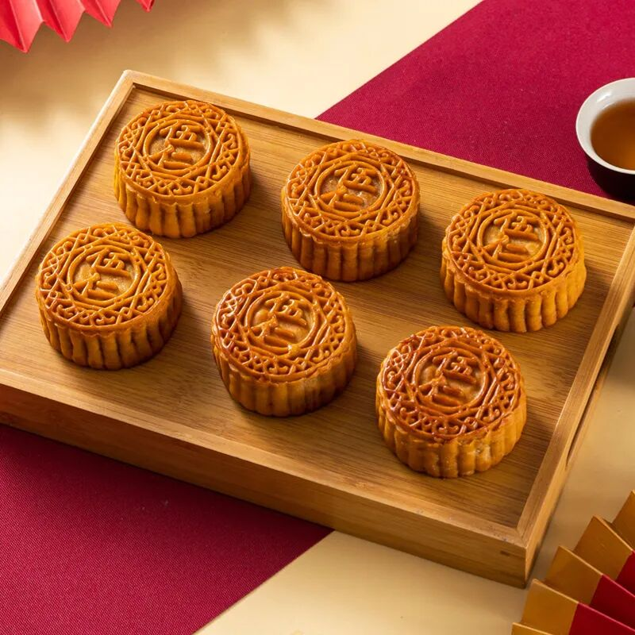
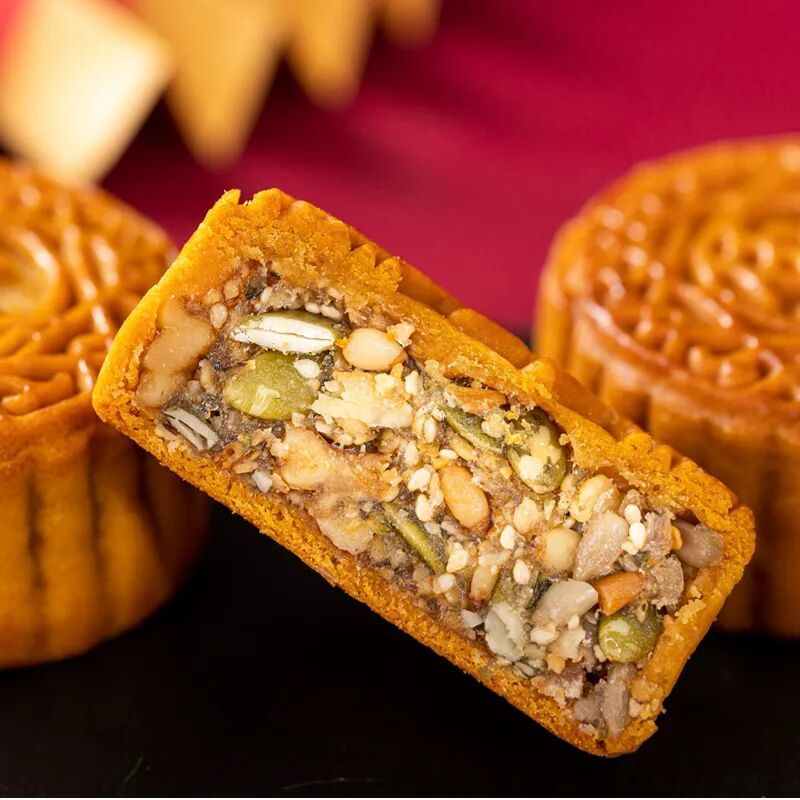
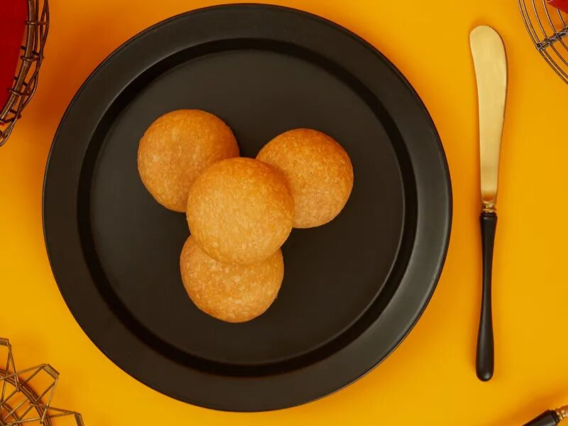
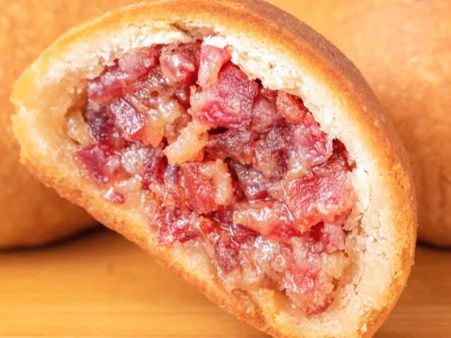
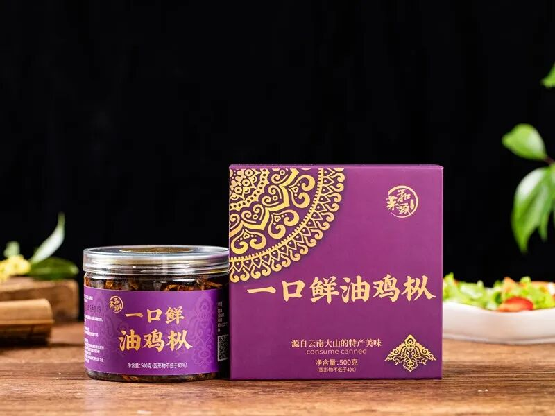

# 2025 年中秋季月饼指引

今年的中秋季已经正式开始，之所以到今天才吆喝一嗓子，是因为前期月饼的产能还没有放到最大，但凡单子稍微多一点就会断货，而「耍猴」这种事情我并不想做。现在生产线已经满负荷工作，我终于可以清清嗓子喊一声：月-饼-来-啦！其实也没有什么太多要介绍的，月饼我已经卖了那么多年，大家年年都相见。尤其是老顾客，之前早就已经下单购买，到现在估计应该已经吃完了第一轮。今年和往年一样，依然提供我们最为核心的两款特色产品：云南五仁月饼和云南火腿月饼。回想几年前，我第一次试着在网上推荐我们的五仁月饼时，心里还有些惴惴不安。忍不住暗自思量：网上那么多人整天在说五仁月饼的不是，我这么做是不是最后只会落个吃力不讨好？然而站在我个人的角度，我又觉得我们这一款滇式五仁月饼的确很美味，我自己非常喜欢，希望在这个世界上还有其他同好存在。结果几年过去，关于这款五仁月饼，总结下来就是四个字：的确能打。所以我现在感觉轻松很多---好产品自己会说话，好产品自己会长腿。我想，经过这些年的时光冲刷和淬炼，它早就已经跑出了我文章所能覆盖的范围。凭借它的味道，凭借它的用料，凭借它累积下来的口碑，我有信心说：即便有些读者已经不再看我的每日更新，但是到了中秋季还是不由自主地跑回来，只是为了买月饼。谁让自己好这一口呢，谁让这一口只能在这里找见呢？第二款产品是我们的云南火腿月饼。和鸡枞、宣威火腿、鲜花饼、过桥米线一样，它很早就是云南美食在全国的名片，而且是很能拿得出手的一张。对于我来说，介绍和推荐云南火腿月饼反而要稍微困难一些。因为云南到了中秋季，各地各大厂都会做这一款。甚至不止是云南，贵州也有他们自己的火腿月饼。那么我们这一款又有什么不同？又能吃出什么不同的滋味来？这么多年来我也一直在想这个问题。同样都是面粉，都是火腿丁，都是需要微波炉「叮」一下再吃，味道能做到多大程度的不同？今年我找到了一个让我自己心安的答案：不忘本。既然是传统美食，那么就按照传统的方式制作。既然说了是云腿月饼，那么就去用真正的宣威火腿。不止于此，云南人的特点是憨厚本分，做出来的东西在味道上可以见仁见智，在造型上各花入各眼，但是在分量和质量上一定要扎实。因此，与其去找寻不一样的味道，与其去搞一些所谓的创新，不如老老实实把这一枚金色的饼子做好。选好料，做好饼，把馅料塞足，我想，即便客人不欣赏它的滋味，但是也能感受到其中的心意。滋味可以调，价格可以改，而心意一旦失去，信任和信心就再也找不回来了。什么叫做「心意」？今年我的感悟是两个字：纯粹。比如说做五仁月饼，如果替换一点果仁，添加一点无关痛痒的抛头，看起来分量就上去了，成本也就下来了。时节不好，生意难做，这种想法的诱惑力非常强。但真要那么做了，怕是没有几年市场上就再没有立足之地。我想出来的解决办法就是纯粹，五仁月饼就用纯粹的果仁，不要加什么蜜饯一类的东西去充数。云腿月饼就是纯粹的面粉和火腿，尽量把皮往薄里做。油浸鸡枞就是纯粹的鸡枞和菜籽油，甚至连传统上经常用到的辣椒段、草果全部都去掉，不要去占瓶子里的空间。别让客人边吃边捡，别让客人边吃边扔。客人在商品名称里看到什么，他们就吃到什么。我就赌一件事情，而且是明牌亮在桌面上：顾客能够感受到这种纯粹，感受到这种纯粹后面的心意。  
现在距离中秋节的正日子还有一段时间，我现在正式向你推荐我们今年的五仁月饼和云腿月饼。并不是幻想每个人都要买月饼去送礼，于是我提前卖就可以多卖一点。不是这样的，在我看来，现在是品尝月饼时间。月饼买来不是为了送来送去，而是为了自己品尝，单纯是因为好吃而不是别的。所以没有什么复杂包装，没有什么精美礼盒，买去就是为了自己家里吃，最多分一点给亲近的亲属和好友，大家通过分享美食而分享快乐。如果需要礼盒的话，今年我们也做了很多款。其中我个人最看重的一款叫做「双峰礼盒」，意思就是纯粹加纯粹。用我们的五仁月饼、云腿月饼，加上一份油浸鸡枞组成一份礼包。这是我们今年最能拿得出手的云南月饼，和我们最能拿得出手的云南野生菌，都按照我们的想法，追求纯粹的形式。当然，你也可以理解为在中秋季，月饼和油浸鸡枞算是云南美食领域的两座高峰。依然存在别的选项，但是送人送这两样就够了。月饼我们做了专门设计，一样两枚。没有像往年一样做成六枚或者八枚，这是因为我们仔细想过一件事：如今人们的选择实在是太多了，尤其是中秋季的礼盒，尤其是礼盒里的月饼。我们的客人买了去，赠送给亲友，用心还是希望对方能品尝一下。但如果是一大盒，对方一看很容易觉得太多，然后就随手转手送出去。只有四枚，那么对方就有更大可能暂停一下转送，觉得反正不多，可以尝一尝看。而只要尝试一次，剩下的事情就好办了。能记住月饼，也就记住了送月饼的人，这点信心我还是有的。以上，就是2025 年中秋季月饼指引。 当然，我们的产品不止于这些，商城里还有更多选择，满足不同人的不同口味需求，大家可以去自行选择。但以上这三样最为稳妥，也经历过时间的检验，可以放心购买。
