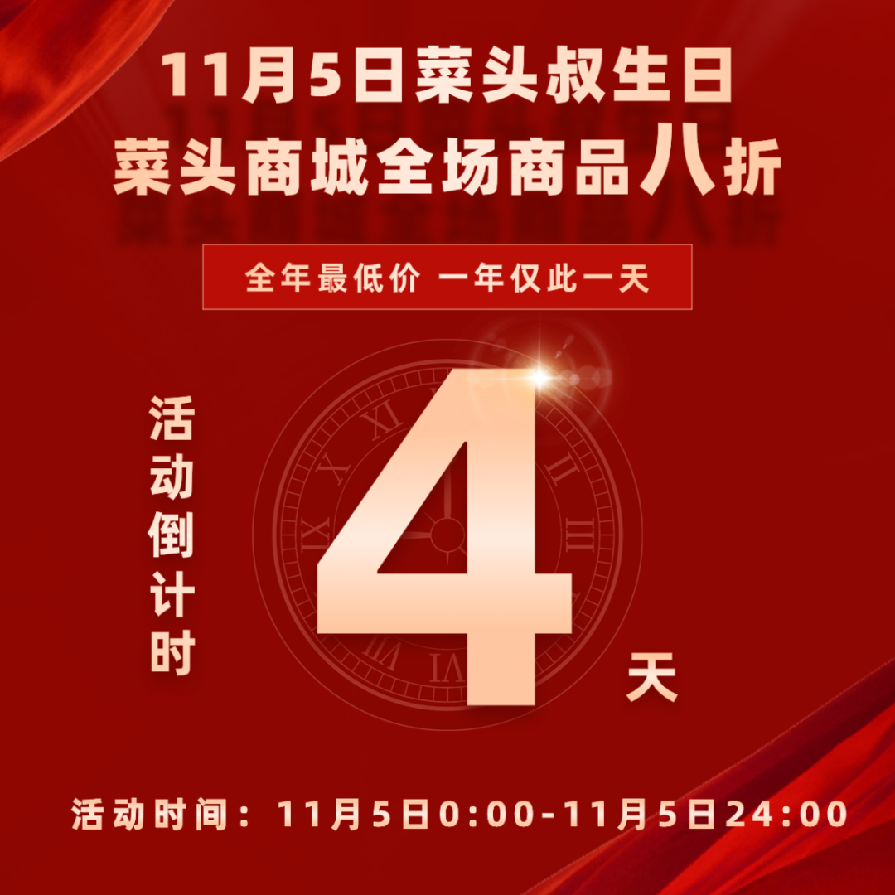

# 2025年10月文章一览

这个十月，我在《槽边往事》一共更新32篇文章：

  1. [2025年9月文章一览](https://mp.weixin.qq.com/s?__biz=MjM5MjAzODU2MA==&mid=2652805618&idx=1&sn=9038b3e2433b1571b9e51166bb9d0d7c&scene=21#wechat_redirect)
  2. [天然的滋味](https://mp.weixin.qq.com/s?__biz=MjM5MjAzODU2MA==&mid=2652805627&idx=1&sn=6c8df294b15daee1c085636729a2ea60&scene=21#wechat_redirect)
  3. [复古音乐潮个人阶段总结](https://mp.weixin.qq.com/s?__biz=MjM5MjAzODU2MA==&mid=2652805635&idx=1&sn=5ce0a539acb2bdc2faa5701f2fc1c4d8&scene=21#wechat_redirect)
  4. [闲鱼爱心卖家](https://mp.weixin.qq.com/s?__biz=MjM5MjAzODU2MA==&mid=2652805644&idx=1&sn=5e7676ac8534a0296eb7bb7b981bdbd4&scene=21#wechat_redirect)
  5. [拒绝自我感动](https://mp.weixin.qq.com/s?__biz=MjM5MjAzODU2MA==&mid=2652805651&idx=1&sn=dbe630c4792380fd6679074c289b4e2b&scene=21#wechat_redirect)
  6. [祝你中秋快乐](https://mp.weixin.qq.com/s?__biz=MjM5MjAzODU2MA==&mid=2652805667&idx=1&sn=17fb841adc75837a2d6d9c4dcad85ad0&scene=21#wechat_redirect)
  7. [从空茫茫一片开始](https://mp.weixin.qq.com/s?__biz=MjM5MjAzODU2MA==&mid=2652805675&idx=1&sn=f476faf9ff8d3c9ff1f95aea5fd1b56b&scene=21#wechat_redirect)
  8. [给少数人的一本书](https://mp.weixin.qq.com/s?__biz=MjM5MjAzODU2MA==&mid=2652805683&idx=1&sn=9ace88e191289830f20827798d29137f&scene=21#wechat_redirect)
  9. [硬融圈](https://mp.weixin.qq.com/s?__biz=MjM5MjAzODU2MA==&mid=2652805694&idx=1&sn=6b39e86a4bf669635f86d49e99ee068a&scene=21#wechat_redirect)
  10. [《撒旦探戈》你读了吗](https://mp.weixin.qq.com/s?__biz=MjM5MjAzODU2MA==&mid=2652805706&idx=1&sn=5f1d54d018fbee3a00f76b8849625e95&scene=21#wechat_redirect)
  11. [谁都要拍一部电影](https://mp.weixin.qq.com/s?__biz=MjM5MjAzODU2MA==&mid=2652805716&idx=1&sn=d9eb8dde36ede62fcc7d141f54c87955&scene=21#wechat_redirect)
  12. [看烂片的收获](https://mp.weixin.qq.com/s?__biz=MjM5MjAzODU2MA==&mid=2652805725&idx=1&sn=d82e74bea199bd5b993514cf188226c7&scene=21#wechat_redirect)
  13. [两条健康小贴士](https://mp.weixin.qq.com/s?__biz=MjM5MjAzODU2MA==&mid=2652805734&idx=1&sn=457f214142cdf939fef6b2bce47e3d4d&scene=21#wechat_redirect)
  14. [量身定制的困境](https://mp.weixin.qq.com/s?__biz=MjM5MjAzODU2MA==&mid=2652805745&idx=1&sn=33b5070aba9e2d8b72bd40646c6e764f&scene=21#wechat_redirect)
  15. [缘分之奇妙](https://mp.weixin.qq.com/s?__biz=MjM5MjAzODU2MA==&mid=2652805752&idx=1&sn=96128c804557ee795950332d7943a8d8&scene=21#wechat_redirect)
  16. [作为小众](https://mp.weixin.qq.com/s?__biz=MjM5MjAzODU2MA==&mid=2652805765&idx=1&sn=cf2ec93e8630dcecb182e18d3dc12f92&scene=21#wechat_redirect)
  17. [智能无能一线隔](https://mp.weixin.qq.com/s?__biz=MjM5MjAzODU2MA==&mid=2652805778&idx=1&sn=5be57aff922cb7330545dcc5ca25bb0a&scene=21#wechat_redirect)
  18. [因为我的病就是没有感觉](https://mp.weixin.qq.com/s?__biz=MjM5MjAzODU2MA==&mid=2652805787&idx=1&sn=d65d1ded58e94af4efc06342dccb3af1&scene=21#wechat_redirect)
  19. [猫图全集](https://mp.weixin.qq.com/s?__biz=MjM5MjAzODU2MA==&mid=2652805809&idx=1&sn=066a53a0144f1784d6a93bca0ec99394&scene=21#wechat_redirect)
  20. [一夜入冬](https://mp.weixin.qq.com/s?__biz=MjM5MjAzODU2MA==&mid=2652805819&idx=1&sn=399bba61b65fda765a87f1ee351ff2db&scene=21#wechat_redirect)
  21. [一些极为粗暴的结论](https://mp.weixin.qq.com/s?__biz=MjM5MjAzODU2MA==&mid=2652805826&idx=1&sn=6b87885e8e3d3e18e4d1d53779734b76&scene=21#wechat_redirect)
  22. [如何欣赏一段文字](https://mp.weixin.qq.com/s?__biz=MjM5MjAzODU2MA==&mid=2652805834&idx=1&sn=cb5e1aa6ff1095046ebe5278739c7ced&scene=21#wechat_redirect)
  23. [在大卫像前大喊大叫的大妈](https://mp.weixin.qq.com/s?__biz=MjM5MjAzODU2MA==&mid=2652805842&idx=1&sn=1a9f702a02ffd44af5df02184fcbc930&scene=21#wechat_redirect)
  24. [脑腐](https://mp.weixin.qq.com/s?__biz=MjM5MjAzODU2MA==&mid=2652805857&idx=1&sn=dc42e1f3c78f368f40f6e94a10f719e1&scene=21#wechat_redirect)
  25. [跟上时代的脚步](https://mp.weixin.qq.com/s?__biz=MjM5MjAzODU2MA==&mid=2652805865&idx=1&sn=16c58930b2ec0177f7598c1a190f4ffe&scene=21#wechat_redirect)
  26. [网约车能加一个「非电车」选项吗](https://mp.weixin.qq.com/s?__biz=MjM5MjAzODU2MA==&mid=2652805872&idx=1&sn=d51c7cb7637b3945eff278cccf58d6ac&scene=21#wechat_redirect)
  27. [刚刚兜了一圈风](https://mp.weixin.qq.com/s?__biz=MjM5MjAzODU2MA==&mid=2652805880&idx=1&sn=83c47df31815645602cee9c4e1089ea9&scene=21#wechat_redirect)
  28. [一张测试定力的图片](https://mp.weixin.qq.com/s?__biz=MjM5MjAzODU2MA==&mid=2652805894&idx=1&sn=bd423bfd1cf7cd8186e91470def1d19d&scene=21#wechat_redirect)
  29. [人有柔弱处](https://mp.weixin.qq.com/s?__biz=MjM5MjAzODU2MA==&mid=2652805901&idx=1&sn=f38d1972c0891214c49a9e78872487e4&scene=21#wechat_redirect)
  30. [迫不及待的旅行](https://mp.weixin.qq.com/s?__biz=MjM5MjAzODU2MA==&mid=2652805908&idx=1&sn=55be73a45240a75c2e16f8392214a1d7&scene=21#wechat_redirect)
  31. [崴脚之后](https://mp.weixin.qq.com/s?__biz=MjM5MjAzODU2MA==&mid=2652805917&idx=1&sn=e9ac3199b38f1205ec7806726ddcf185&scene=21#wechat_redirect)
  32. [譬如鸣蝉](https://mp.weixin.qq.com/s?__biz=MjM5MjAzODU2MA==&mid=2652805928&idx=1&sn=9a5b45fc523f61d69040e6ebd273aae8&scene=21#wechat_redirect)

  
上个月的《[背刺者艾玛](https://mp.weixin.qq.com/s?__biz=MjM5MjAzODU2MA==&mid=2652805601&idx=1&sn=a2c386149577dc739f3c862db88661ab&scene=21#wechat_redirect)》陆陆续续还有人继续转发阅读，导致阅读量接近 40 万。相比之下，这个月的所有文章就要冷静得多，只有一篇《[网约车能加一个「非电车」选项吗](https://mp.weixin.qq.com/s?__biz=MjM5MjAzODU2MA==&mid=2652805872&idx=1&sn=d51c7cb7637b3945eff278cccf58d6ac&scene=21#wechat_redirect)》很热闹，跟贴达到了1100 多条，并且直接导致当天有 300 多人取消关注，前后两天成为《槽边往事》净关注人数增长唯二呈负数的日子。但读者的行为是很难预测的，11、12、13 日，在接连发布两篇关于电影的文章《[谁都要拍一部电影](https://mp.weixin.qq.com/s?__biz=MjM5MjAzODU2MA==&mid=2652805716&idx=1&sn=d9eb8dde36ede62fcc7d141f54c87955&scene=21#wechat_redirect)》《[看烂片的收获](https://mp.weixin.qq.com/s?__biz=MjM5MjAzODU2MA==&mid=2652805725&idx=1&sn=d82e74bea199bd5b993514cf188226c7&scene=21#wechat_redirect)》之后，3 天净关注人数超过 5000 人。很久不写关于电影的话题，没想到偶尔写一次还是有那么多人在看在转。其中技巧是有的，其他人可能不会像我那样写得神出鬼没，把电影和诺贝尔文学奖新任得主的访谈联系在一起，而且刚好够用。也不会最后转到 AI 视频上去，彻底换一个视角来看行业。我觉得，读得越多，看得越多，想得越多，在写作上就会拥有更多自由发挥的空间，而且能给人们带来不一样的思考角度。正常来说，十月金秋是个收获的季节，《槽边往事》也不例外。比如说在昨天罗振宇的新书发布会上，脱不花就从头到脚换上了她的亲生朋友为她设计的视觉形像：这是我作为和与和创意主理人的第一单作品，效果很好，就是有点费朋友，没有足够强大的内心和游戏心态，大概很难驾驭这种触及灵魂的个人形象设计风格。除了专坑朋友之外，我的文章在读者群中也结出了丰硕的果实。一位看了我文章去尝试 AI 视频制作的瑜伽师，她制作的儿童动画视频被某省台少儿频道选中，理由是试播的成绩很好，很受小朋友欢迎，即将签约正式合作，为电视台提供动画内容。然后还有很多读者朋友在不断反馈，他们在看了我的介绍和分析之后，决定尝试动态血糖仪。几乎每天都会有人在那篇文章下留言，说是经过一段时间的观察，通过数据反馈帮助他们认识到饮食习惯上存在的问题，他们中的许多人不单自己开始调整，也开始动员家人一起改变生活方式。一家正在研发血糖和血酮监测 App 的创业公司专门找到我，用一下午时间做用户访谈，问我为什么要写那些文章，我的想法是什么，为什么我觉得健康人群监控血糖这件事会如此重要。听取完我的反馈之后，他们表示会继续研发推进自家的产品，让更多人从中获益。当然，还有《[网约车能加一个「非电车」选项吗](https://mp.weixin.qq.com/s?__biz=MjM5MjAzODU2MA==&mid=2652805872&idx=1&sn=d51c7cb7637b3945eff278cccf58d6ac&scene=21#wechat_redirect)》一文发布之后，网约车平台的相关人士找到我，表示建议收到，向我解释新增功能的困难在哪里，以及未来可能的解决方案。在那篇文章的 1100 多条留言里，许多读者表达了相同的感受，和类似的诉求，我很高兴因为这篇文章为大家提供了未来可能出现的新选择，也许可以最终解决晕车这个恼人的问题。还有一件小事我觉得也值得记录一下：在某篇文章的留言区里，我分享了仰拍秋天的一树灿烂所需要的摄影技巧，这个技巧很快就在读者中传播开来，我看到许多张新照片，在视觉上非常壮观，能够透过图片感受到树木的生命力。在人生无穷无尽的绵延痛苦之中，依然会有这样的小小快乐。在日复一日的不断更新中，依然会有这样让我精神一振的种种反馈。千字文在互联网上存在已经超过 20年，写作者主要通过千字文对外输出观点，分享见闻，作用在读者的认知上。如今，看到自己能够透过文字产生读者的真实行动，我的确因此而感觉到内心充盈，有源源不断的快乐自然涌现，减少了许多我每天骗赞赏金的负疚感。今年，北京在一夜之间入冬，但在网络上，我的丰盛秋天依然在继续。十一月到了，问候你：祝你十一月好，大家一起准备新入新的一年。  
题图标题：《看得见风景的房间》创作者：**和菜头的小肉手** AI算法提供：**Midjourney V 7.0 **Prompt: **a desktop with a macbook in front of a window, autumn view outside --sref 2189130552 --ar 16:9 --exp 30 --s 800 --v7.0****  
****槽边往事****和菜头 出品**********【微信号】****Bitsea******个人转载内容至朋友圈和群聊天，无需特别申请版权许可。****请你相信我，****我所说的每一句话，****都是错的**

> ******禅定时刻**

  
 上图注释：来自背影的原作者分享了一张黑框照片，内容是一个穿红色短裙的小女孩，手里抱着粉色的玩偶，双眼望天。图片配文写道：「小时候生了一场病爹妈把我遗照都弄好了（捂嘴哭脸表情符）。在图文下方， 有一个来自山东的网友，头像为「正人橙子」，ID 为表里如一，他留言问：「那你后来活下来了吗？」**  
**

> **南派三叔专区**

  
南派，这张《暖暖过冬》送给你。**  
**

> **《槽边往事》专营店营业中**

  
  
  

