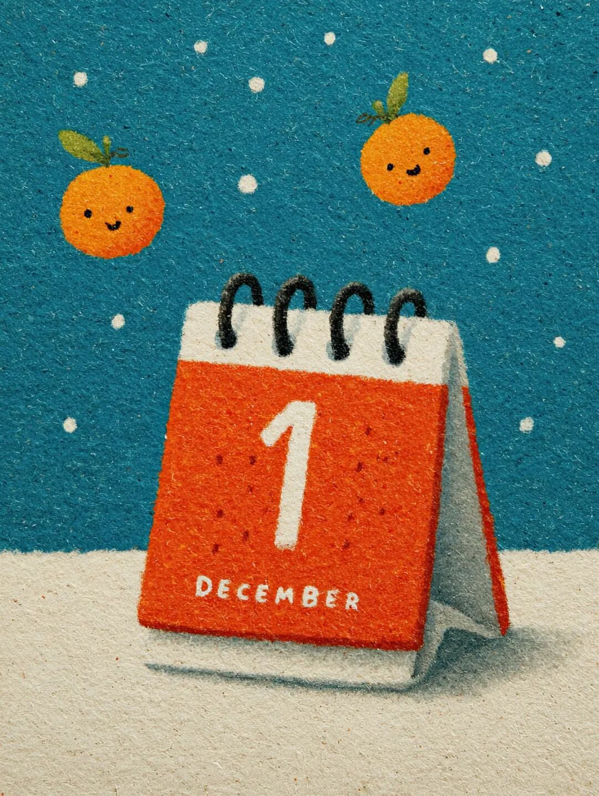
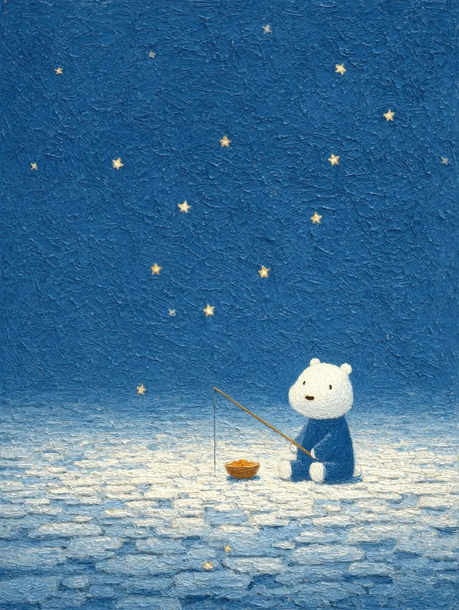
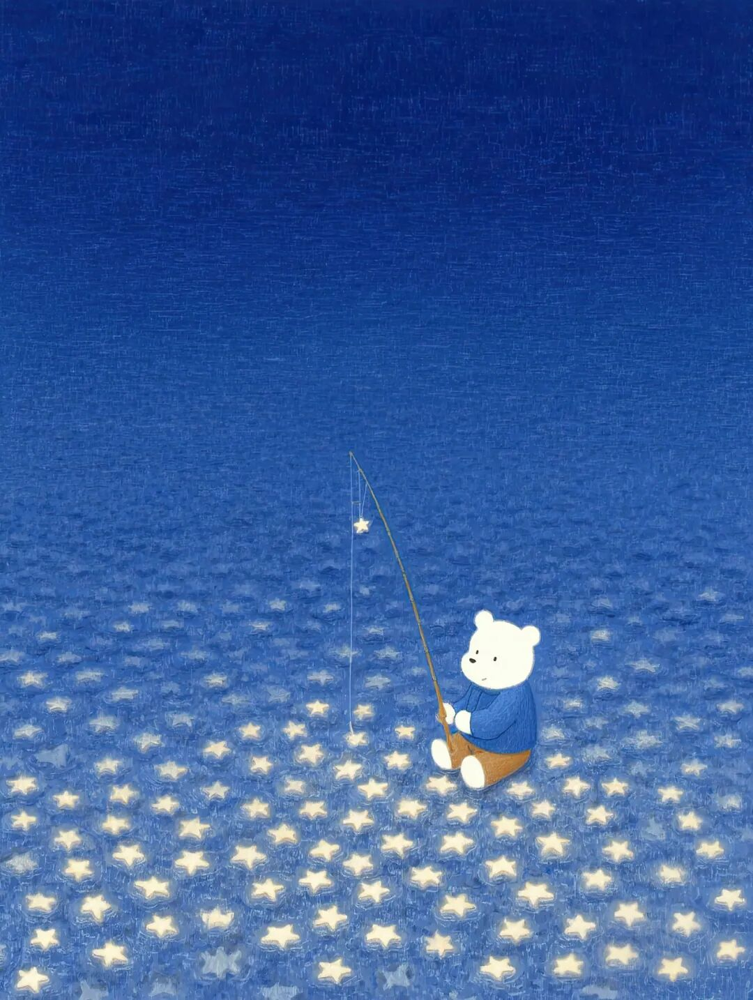

# 2025年11月文章一览

十一月，我在《槽边往事》更新三十篇文章，如下：

  1. [2025年10月文章一览](https://mp.weixin.qq.com/s?__biz=MjM5MjAzODU2MA==&mid=2652805947&idx=1&sn=25353c023e1f66edd0f800b145c7604a&scene=21#wechat_redirect)
  2. [AI又吹泡沫风](https://mp.weixin.qq.com/s?__biz=MjM5MjAzODU2MA==&mid=2652805957&idx=1&sn=3bef167c293f45c82d2c47a9df3a935c&scene=21#wechat_redirect)
  3. [痛苦的教育](https://mp.weixin.qq.com/s?__biz=MjM5MjAzODU2MA==&mid=2652805976&idx=1&sn=842ccfad2fd4e92444e29cee29d5587f&scene=21#wechat_redirect)
  4. [赶稿](https://mp.weixin.qq.com/s?__biz=MjM5MjAzODU2MA==&mid=2652805986&idx=1&sn=a3f7485609d0a1cc68c1cb821160d20f&scene=21#wechat_redirect)
  5. [生日快乐，和菜头先生（2025）](https://mp.weixin.qq.com/s?__biz=MjM5MjAzODU2MA==&mid=2652805997&idx=1&sn=5581163ab39a0c10109c11e7efa542af&scene=21#wechat_redirect)
  6. [昨夜谁人望明月](https://mp.weixin.qq.com/s?__biz=MjM5MjAzODU2MA==&mid=2652806019&idx=1&sn=e87a4ffd71ecea2fef5a653d63857934&scene=21#wechat_redirect)
  7. [精致的，太精致的](https://mp.weixin.qq.com/s?__biz=MjM5MjAzODU2MA==&mid=2652806028&idx=1&sn=735b6afcdfc5a3a0afeb022a6d54ca5f&scene=21#wechat_redirect)
  8. [沉浸式失恋](https://mp.weixin.qq.com/s?__biz=MjM5MjAzODU2MA==&mid=2652806035&idx=1&sn=b88fe6ffa0ebb86174726ce31ea1e0da&scene=21#wechat_redirect)
  9. [绝不内耗的榜样](https://mp.weixin.qq.com/s?__biz=MjM5MjAzODU2MA==&mid=2652806044&idx=1&sn=bb2feee0291afd459867ece6940091bf&scene=21#wechat_redirect)
  10. [上一次进电影院](https://mp.weixin.qq.com/s?__biz=MjM5MjAzODU2MA==&mid=2652806058&idx=1&sn=d8c9f92c6cf774844a99971a8dfe202c&scene=21#wechat_redirect)
  11. [戒除直播购物](https://mp.weixin.qq.com/s?__biz=MjM5MjAzODU2MA==&mid=2652806066&idx=1&sn=76b4dec9dee33305906f72e358dc920d&scene=21#wechat_redirect)
  12. [说点家长不爱听的](https://mp.weixin.qq.com/s?__biz=MjM5MjAzODU2MA==&mid=2652806073&idx=1&sn=76eb08cda0e07c2e9410352c83a737b2&scene=21#wechat_redirect)
  13. [早睡早起身体好](https://mp.weixin.qq.com/s?__biz=MjM5MjAzODU2MA==&mid=2652806082&idx=1&sn=0dddb2278a8e639393ecb19259986b1e&scene=21#wechat_redirect)
  14. [无条件相信](https://mp.weixin.qq.com/s?__biz=MjM5MjAzODU2MA==&mid=2652806107&idx=1&sn=d409beeeb82c47c6891c1c51927ab210&scene=21#wechat_redirect)
  15. [心似奔马，念如瀑流](https://mp.weixin.qq.com/s?__biz=MjM5MjAzODU2MA==&mid=2652806115&idx=1&sn=4bad1ec0da77f70d9234e4d5ade67f2f&scene=21#wechat_redirect)
  16. [恰似彼时彼处](https://mp.weixin.qq.com/s?__biz=MjM5MjAzODU2MA==&mid=2652806123&idx=1&sn=1a3223a3578e8c19802300ff4421dcf2&scene=21#wechat_redirect)
  17. [齐刷刷](https://mp.weixin.qq.com/s?__biz=MjM5MjAzODU2MA==&mid=2652806130&idx=1&sn=3e543526632d790d36d31952c9991715&scene=21#wechat_redirect)
  18. [南非醉茄在印度](https://mp.weixin.qq.com/s?__biz=MjM5MjAzODU2MA==&mid=2652806137&idx=1&sn=2fcfc32a2ccc1ffcc883b2595580953c&scene=21#wechat_redirect)
  19. [重新讲一遍故事](https://mp.weixin.qq.com/s?__biz=MjM5MjAzODU2MA==&mid=2652806152&idx=1&sn=ce63d1861a1570fdebf35cc5cf5b9bed&scene=21#wechat_redirect)
  20. [最后一封情书](https://mp.weixin.qq.com/s?__biz=MjM5MjAzODU2MA==&mid=2652806164&idx=1&sn=a3f058c917da1792c15ccef1381640a4&scene=21#wechat_redirect)
  21. [读书的平等心](https://mp.weixin.qq.com/s?__biz=MjM5MjAzODU2MA==&mid=2652806179&idx=1&sn=ede7af9bfa84a631f31b1eac2b24d3fd&scene=21#wechat_redirect)
  22. [复归本位](https://mp.weixin.qq.com/s?__biz=MjM5MjAzODU2MA==&mid=2652806193&idx=1&sn=677d9089b5c8e7ea2208a8a370536313&scene=21#wechat_redirect)
  23. [他人的生活](https://mp.weixin.qq.com/s?__biz=MjM5MjAzODU2MA==&mid=2652806201&idx=1&sn=7ae635fca27199935e39a2d0a51dd1ef&scene=21#wechat_redirect)
  24. [生理性喜欢](https://mp.weixin.qq.com/s?__biz=MjM5MjAzODU2MA==&mid=2652806209&idx=1&sn=9fb0fed63ab42bd15ca37594b72f50bc&scene=21#wechat_redirect)
  25. [别直接写作，先从描述开始](https://mp.weixin.qq.com/s?__biz=MjM5MjAzODU2MA==&mid=2652806219&idx=1&sn=e82873e6b388015c2e4c6474f27a2b1e&scene=21#wechat_redirect)
  26. [牛马抬头](https://mp.weixin.qq.com/s?__biz=MjM5MjAzODU2MA==&mid=2652806242&idx=1&sn=5eac732fea94410264a9e159152a1ce2&scene=21#wechat_redirect)
  27. [在人群中](https://mp.weixin.qq.com/s?__biz=MjM5MjAzODU2MA==&mid=2652806248&idx=1&sn=c6018be13d4cc06195b12959f7a415a7&scene=21#wechat_redirect)
  28. [不养猫才是问题](https://mp.weixin.qq.com/s?__biz=MjM5MjAzODU2MA==&mid=2652806255&idx=1&sn=1e84ea3c0332cc59cec003ebe9bb540b&scene=21#wechat_redirect)
  29. [老去](https://mp.weixin.qq.com/s?__biz=MjM5MjAzODU2MA==&mid=2652806262&idx=1&sn=ff74a01a4aca49ee54a652b7276e46fa&scene=21#wechat_redirect)
  30. [万里送企鹅](https://mp.weixin.qq.com/s?__biz=MjM5MjAzODU2MA==&mid=2652806275&idx=1&sn=3f9523fd09be6d486a6e3e953311525f&scene=21#wechat_redirect)

  
十一月我满 50 岁，但是阅读量最高的文章不是我那篇一年一更新的《[生日快乐，和菜头先生（2025）](https://mp.weixin.qq.com/s?__biz=MjM5MjAzODU2MA==&mid=2652805997&idx=1&sn=5581163ab39a0c10109c11e7efa542af&scene=21#wechat_redirect)》，而是一张图片，这张图片的阅读量差不多是前者的两倍 ：《[登味](https://mp.weixin.qq.com/s?__biz=MjM5MjAzODU2MA==&mid=2652805968&idx=1&sn=a58691a6f04c4ae033370a46aa069e63&scene=21#wechat_redirect)》。这个月的三十篇文章里，第一名是《[生理性喜欢](https://mp.weixin.qq.com/s?__biz=MjM5MjAzODU2MA==&mid=2652806209&idx=1&sn=9fb0fed63ab42bd15ca37594b72f50bc&scene=21#wechat_redirect)》，第三名是家长们喜欢听的《[说点家长不爱听的](https://mp.weixin.qq.com/s?__biz=MjM5MjAzODU2MA==&mid=2652806073&idx=1&sn=76eb08cda0e07c2e9410352c83a737b2&scene=21#wechat_redirect)》，人性就有那么逆反，就有那么拧巴。以往到了生日前后，我总有伤春悲秋的许多感怀。今年人到五十反而没有了这些情绪起伏，不是说生活美满了，内心幸福了，于是人就失去了感伤的理由。而是我有了另外一种觉悟：虽然人生是这样，但是也可以，可能人生就是如此。既然如此，就可以把感怀暂且放在一边，然后继续去做我应该做的事情。于是这个月劳动了好几次读者，一会儿请读者去看[超级月亮](https://mp.weixin.qq.com/s?__biz=MjM5MjAzODU2MA==&mid=2652806010&idx=1&sn=a24e4caddeb1af2c7ba3dab13036cf08&scene=21#wechat_redirect)，一会儿又要读者和我[交换黄昏](https://mp.weixin.qq.com/s?__biz=MjM5MjAzODU2MA==&mid=2652806231&idx=1&sn=c5ad4421c3f052e310ad429ac607435b&scene=21#wechat_redirect)，有些时候甚至还要提供[夜读推荐](https://mp.weixin.qq.com/s?__biz=MjM5MjAzODU2MA==&mid=2652806092&idx=1&sn=652f35e3ea91de2ba007519a6406805c&scene=21#wechat_redirect)，让读者去看某篇我觉得很好的文章---这些就是所谓「我应该做的事情」，起码我是那么认为的。到今天我也不认为自己是什么「自媒体」，原因就在这里，我大概还是一个活人，用活人的方式和读者打交道，而不是一个机构，或者是一个团队，更无所谓宗旨、理念、主题、赛道又或者是什么运营。看起来，读者似乎也喜欢在这里有事做，而且这样让人感觉很像是古早的互联网。我现在对于「独特存在」有了一点理解。没有人因为去独特存在而获得了这种东西，只是从一开始就打算做自己，然后随着时日流逝，这种念头变得越来越单纯，行为变得越来越纯粹，于是就会自动获得它。每个人都有这东西，只是大多数人会分心，觉得存在「更好」、「更快」、「更强」的方法，觉得同样存在一个这样的自我，于是总是会走上岔道。总是有人问我技巧，写作的技巧，运营的技巧，选题的技巧，觉得一切都是个技能问题。不是的，一切是个信心问题，相信自己有，相信自己是，这是一切的前提。它决定了一个人是向外找寻，还是向内挖掘，然后道路就会分岔。即便是决意走上那条少有人前往的道路，人们又误以为自己需要的仅只是坚持和重复。这还是一种偷闲躲懒，只要坚持就会有成果---这里狡诈地去掉了自己反复观察反复思维的义务；只要重复次数多就会成功---这里也是在装傻，故意不去考虑等同水平上的重复毫无任何意义这一事实。真正需要的是刚猛和诚实，刚猛才能在一无所知的情况下先冲出一条路来，诚实才能保持自查和自省，能够对自己说「我错了」三个字。开了路才能坚持下去，知道错了错在哪里才有所谓重复的必要，也才有所谓通过重复提升的可能。而在这一切之上，是一颗悲心。刚猛之所以没有变成为伤害，诚实之所以没有变成为冷酷，是因为那颗心的深处还有一滴眼泪，如同度母本体一般的一滴眼泪。否则无论走哪一条道路结局并没有多少不同，又何必去走那条更为艰辛的道路呢？又何必去重复那种「理想主义者的堕落」呢？即便是「成为自我」的内在，即便是「独特存在」的外相，也只是路途的中点。这个时代有个很奇怪的特点：大多数人太早抛弃自我，觉得以此作为交换或者献祭，就能成为强者。而极少数坚持自我的人，最后却又发展出极强的我执。于是，在每一块坚硬的磐石周围，都缠绕着许多随波逐流的水草，生命就这样白白流逝。所以我看起来是个非常矛盾的人。一方面在反复向读者强调，做你自己，对自己负责，最好不要外求。另一方面又经常说自我不是那么可靠，要时常想自己可能是错的。简单说，因为这对应着两个不同的阶段。第一个阶段是针对大多数人，他们太早太轻易地放弃了自我，以至于无法形成一套坚定可靠的思维方式，于是自我学习自我提升自我改变就变得不可能。而如果能够成功保有了自我，成全了自我，路也只走了一半。到了这个阶段还需要更大的勇气，去摧毁这个好容易建立起来的坚固自我，无敌的存在，这样才能继续深入自己的内心，内心同时也才能保持开放和弹性，所谓的内心平静满足才有可能出现。否则的话，能力越大，危害越大，于人于己都是如此。第一阶段不要变成避役，第二阶段不要变成饕餮，刚猛和诚实各有各的用处。为什么内心始终需要一颗眼泪，也是同理。2025 年只剩下最后一个月了，在没有多少人阅读的月度总结里我还是说了那么多。看来的确是上了年纪，正在逐步变成一个唠叨的老人。就写到这里吧，祝你十二月快乐，平安顺遂，心情愉悦地走入 2026 年。  
  
题图标题：《十二月一日》创作者：**和菜头的小肉手** AI算法提供：**Midjourney V 7.0 **Prompt: **A desk calendar shows December 1st. --ar 3:4 --sref 3465975336 --sw 100 --stylize 300 --p --v7.0**  
**  
****槽边往事****和菜头 出品**********【微信号】****Bitsea******个人转载内容至朋友圈和群聊天，无需特别申请版权许可。****请你相信我，****我所说的每一句话，****都是错的**

> ******禅定时刻**

 《北极熊宝宝》

> **南派三叔专区**

  
南派，这张《钓星星》送给你。**  
**

> **《槽边往事》专营店营业中**

  
  
  

