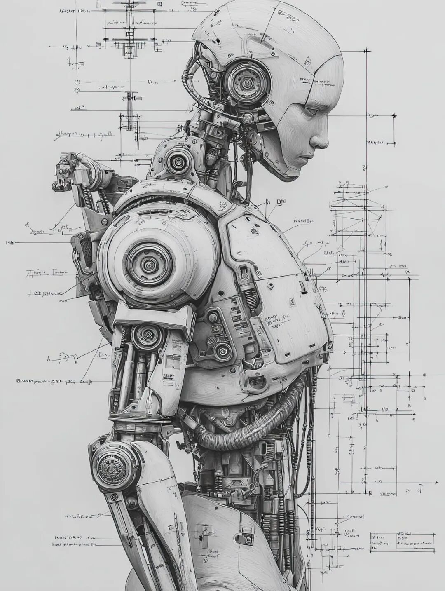

# 2025年7月文章一览

2025年7月，我在《槽边往事》共更新34篇文章，24条视频，详情如下：

  1. [2025年6月文章一览](https://mp.weixin.qq.com/s?__biz=MjM5MjAzODU2MA==&mid=2652804533&idx=1&sn=5198e60177a2470ac910d8f832d52e03&scene=21#wechat_redirect)
  2. [转赠不隔夜](https://mp.weixin.qq.com/s?__biz=MjM5MjAzODU2MA==&mid=2652804540&idx=1&sn=730e4bd18acc1dbc93113d3410985704&scene=21#wechat_redirect)
  3. [男友摄影技术提升教程](https://mp.weixin.qq.com/s?__biz=MjM5MjAzODU2MA==&mid=2652804549&idx=1&sn=8d9cd6aba6d0554300c85080e4130bfe&scene=21#wechat_redirect)
  4. [单纯为了美](https://mp.weixin.qq.com/s?__biz=MjM5MjAzODU2MA==&mid=2652804558&idx=1&sn=5a3091dc787455bd29025675b6c16a03&scene=21#wechat_redirect)
  5. [Deepseek道歉与AI幻觉](https://mp.weixin.qq.com/s?__biz=MjM5MjAzODU2MA==&mid=2652804567&idx=1&sn=d56ed375f4befee1c2e3e7be0eb05123&scene=21#wechat_redirect)
  6. [恐怖的大王从天而降](https://mp.weixin.qq.com/s?__biz=MjM5MjAzODU2MA==&mid=2652804591&idx=1&sn=8fe37e66901c7822f3e30654f7772962&scene=21#wechat_redirect)
  7. [我相信光](https://mp.weixin.qq.com/s?__biz=MjM5MjAzODU2MA==&mid=2652804600&idx=1&sn=b1f4fc9adf0a69be8490f8501e8dfc1f&scene=21#wechat_redirect)
  8. [脱不花X李笑来长谈观后](https://mp.weixin.qq.com/s?__biz=MjM5MjAzODU2MA==&mid=2652804608&idx=1&sn=9331a6901635588cb0cdf8d72b06bd0b&scene=21#wechat_redirect)
  9. [上个网真不容易](https://mp.weixin.qq.com/s?__biz=MjM5MjAzODU2MA==&mid=2652804617&idx=1&sn=f328c117e394e904bc33295a1e104d47&scene=21#wechat_redirect)
  10. [后悔的心每天要来去多少回](https://mp.weixin.qq.com/s?__biz=MjM5MjAzODU2MA==&mid=2652804624&idx=1&sn=d27422d03530757a938f1e585cdeafe9&scene=21#wechat_redirect)
  11. [电工张师傅](https://mp.weixin.qq.com/s?__biz=MjM5MjAzODU2MA==&mid=2652804631&idx=1&sn=f1d1c1fe2687d507dbe46a4b5517c32c&scene=21#wechat_redirect)
  12. [去滇池的路上](https://mp.weixin.qq.com/s?__biz=MjM5MjAzODU2MA==&mid=2652804638&idx=1&sn=02154343ca5757269a54750917e6a3bf&scene=21#wechat_redirect)
  13. [注意力剥削](https://mp.weixin.qq.com/s?__biz=MjM5MjAzODU2MA==&mid=2652804646&idx=1&sn=68526233b800d188c5b8a2bf1a5c4220&scene=21#wechat_redirect)
  14. [被尊重的感觉](https://mp.weixin.qq.com/s?__biz=MjM5MjAzODU2MA==&mid=2652804658&idx=1&sn=52c7c5c56b4b99c9d8f5a9cbd592ce13&scene=21#wechat_redirect)
  15. [手腕上的猴皮筋](https://mp.weixin.qq.com/s?__biz=MjM5MjAzODU2MA==&mid=2652804665&idx=1&sn=faaeb1fd799af3aa0016e32bddc7876a&scene=21#wechat_redirect)
  16. [许愿的方式](https://mp.weixin.qq.com/s?__biz=MjM5MjAzODU2MA==&mid=2652804679&idx=1&sn=a4cb8e8a9b13b96abbea49f5bd51d91a&scene=21#wechat_redirect)
  17. [还是买了个除湿机](https://mp.weixin.qq.com/s?__biz=MjM5MjAzODU2MA==&mid=2652804690&idx=1&sn=a09476b1baa15cf067486f6260071e5f&scene=21#wechat_redirect)
  18. [作茧自缚](https://mp.weixin.qq.com/s?__biz=MjM5MjAzODU2MA==&mid=2652804698&idx=1&sn=0199e1661ac590ee7a665c2649d6e122&scene=21#wechat_redirect)
  19. [用眼镜听歌](https://mp.weixin.qq.com/s?__biz=MjM5MjAzODU2MA==&mid=2652804705&idx=1&sn=240667d5b64fac9ce33f44884215520c&scene=21#wechat_redirect)
  20. [在爱好和工作之间](https://mp.weixin.qq.com/s?__biz=MjM5MjAzODU2MA==&mid=2652804712&idx=1&sn=a5b80d0c75f3414bdeb92ab2e14c92b9&scene=21#wechat_redirect)
  21. [导演的信用值](https://mp.weixin.qq.com/s?__biz=MjM5MjAzODU2MA==&mid=2652804718&idx=1&sn=f8d470d3295e295e42f6f108dc084704&scene=21#wechat_redirect)
  22. [下班之后玩什么](https://mp.weixin.qq.com/s?__biz=MjM5MjAzODU2MA==&mid=2652804725&idx=1&sn=30506a6bf7a38dea545fb2fb04c27d26&scene=21#wechat_redirect)
  23. [正确、错误和无关](https://mp.weixin.qq.com/s?__biz=MjM5MjAzODU2MA==&mid=2652804737&idx=1&sn=89f281ff08823139d03a3aec4f2ecb0d&scene=21#wechat_redirect)
  24. [在永恒的流动中](https://mp.weixin.qq.com/s?__biz=MjM5MjAzODU2MA==&mid=2652804745&idx=1&sn=5a9c4fbce9d91885e07de51d36efe7e6&scene=21#wechat_redirect)
  25. [基本上是个格式](https://mp.weixin.qq.com/s?__biz=MjM5MjAzODU2MA==&mid=2652804752&idx=1&sn=985baef908f51448bdf0c37e482e9fed&scene=21#wechat_redirect)
  26. [消耗不完的精力](https://mp.weixin.qq.com/s?__biz=MjM5MjAzODU2MA==&mid=2652804759&idx=1&sn=1c8b88c7c9c01fd8ae8a550e10ee12ee&scene=21#wechat_redirect)
  27. [原生家庭之苦](https://mp.weixin.qq.com/s?__biz=MjM5MjAzODU2MA==&mid=2652804777&idx=1&sn=7da1ea27263da3abd07d80565b2bd040&scene=21#wechat_redirect)
  28. [宅人的状态](https://mp.weixin.qq.com/s?__biz=MjM5MjAzODU2MA==&mid=2652804784&idx=1&sn=54317dd9f549241107b14a59773d3890&scene=21#wechat_redirect)
  29. [2025年云南雨季的味道来了](https://mp.weixin.qq.com/s?__biz=MjM5MjAzODU2MA==&mid=2652804801&idx=1&sn=d192b2eec2b91012836ec5f19dd0f853&scene=21#wechat_redirect)
  30. [油浸鸡枞的油](https://mp.weixin.qq.com/s?__biz=MjM5MjAzODU2MA==&mid=2652804809&idx=1&sn=d8c3df5ce92025d9e3588f1f0753edd6&scene=21#wechat_redirect)
  31. [无奖励人生](https://mp.weixin.qq.com/s?__biz=MjM5MjAzODU2MA==&mid=2652804818&idx=1&sn=b36b8e80f2a8ec5364706088139d10bf&scene=21#wechat_redirect)
  32. [粉丝的劫持](https://mp.weixin.qq.com/s?__biz=MjM5MjAzODU2MA==&mid=2652804830&idx=1&sn=d9efb31e605b0eb5c4973c1e6f29ea20&scene=21#wechat_redirect)
  33. [你最近在听什么音乐](https://mp.weixin.qq.com/s?__biz=MjM5MjAzODU2MA==&mid=2652804839&idx=1&sn=89e873551f615bef8d25b21b8feaf414&scene=21#wechat_redirect)
  34. [偶发火爆](https://mp.weixin.qq.com/s?__biz=MjM5MjAzODU2MA==&mid=2652804860&idx=1&sn=775df710af392c9b353648995103bf22&scene=21#wechat_redirect)

  
从数据上来说，这是非常惨淡的一个月，我全靠蹭脱不花和李笑来的流量熬着。首先是阅读量最高的文章：《[脱不花X李笑来长谈观后](https://mp.weixin.qq.com/s?__biz=MjM5MjAzODU2MA==&mid=2652804608&idx=1&sn=9331a6901635588cb0cdf8d72b06bd0b&scene=21#wechat_redirect)》，这已经都不是蹭了，而是直接扒上去，标题里的关键词密度浓到爆。然后次高的文章是《[注意力剥削](https://mp.weixin.qq.com/s?__biz=MjM5MjAzODU2MA==&mid=2652804646&idx=1&sn=68526233b800d188c5b8a2bf1a5c4220&scene=21#wechat_redirect)》，原因是在这场长谈里脱不花说到我曾经分享过这篇文章给她，很多人都想看看具体内容是什么，于是又成功蹭了一波流量。面对此情此景此数据，我就想说一句话：「脱不花，你的《长谈》必须搞下去，把我所有的朋友都拉去访谈一遍，恩婆，这边下半年的流量就全靠你了！」这个月在写作之外，我在 AI 视频上投入了不少时间金钱，创作了 24 条视频，全部都是用 MJ 生成。其中最受欢迎的一条播放量超过 20 万次，次高的那条骑自行车的妹子居然引发了很多人抄袭。我个人最满意的是《[去滇池的路上](https://mp.weixin.qq.com/s?__biz=MjM5MjAzODU2MA==&mid=2652804638&idx=1&sn=02154343ca5757269a54750917e6a3bf&scene=21#wechat_redirect)》，这是我第一次把文章和视频结合起来，效果相当不错。以下，就是那条最受欢迎的视频---很遗憾地告诉部分男性读者，这个妹子并不真实存在：  
我个人最满意的几篇文章是《[后悔的心每天要来去多少回](https://mp.weixin.qq.com/s?__biz=MjM5MjAzODU2MA==&mid=2652804624&idx=1&sn=d27422d03530757a938f1e585cdeafe9&scene=21#wechat_redirect)》《[电工张师傅](https://mp.weixin.qq.com/s?__biz=MjM5MjAzODU2MA==&mid=2652804631&idx=1&sn=f1d1c1fe2687d507dbe46a4b5517c32c&scene=21#wechat_redirect)》《[许愿的方式](https://mp.weixin.qq.com/s?__biz=MjM5MjAzODU2MA==&mid=2652804679&idx=1&sn=a4cb8e8a9b13b96abbea49f5bd51d91a&scene=21#wechat_redirect)》《[原生家庭之苦](https://mp.weixin.qq.com/s?__biz=MjM5MjAzODU2MA==&mid=2652804777&idx=1&sn=7da1ea27263da3abd07d80565b2bd040&scene=21#wechat_redirect)》《[无奖励人生](https://mp.weixin.qq.com/s?__biz=MjM5MjAzODU2MA==&mid=2652804818&idx=1&sn=b36b8e80f2a8ec5364706088139d10bf&scene=21#wechat_redirect)》以及《[在永恒的流动中](https://mp.weixin.qq.com/s?__biz=MjM5MjAzODU2MA==&mid=2652804745&idx=1&sn=5a9c4fbce9d91885e07de51d36efe7e6&scene=21#wechat_redirect)》。阅读量都勉勉强强，但这都是我自己想写的文字，也是我个人认为有价值的文字。都说人是社会这台大机器上的螺丝钉，是螺丝钉就会被随时拧紧，那我没事就来松一松，免得拧太紧了发生断裂。这个月我最得意的事情，是在反复权衡思考之后《[还是买了个除湿机](https://mp.weixin.qq.com/s?__biz=MjM5MjAzODU2MA==&mid=2652804690&idx=1&sn=a09476b1baa15cf067486f6260071e5f&scene=21#wechat_redirect)》。非常成功的一次购物，因为自从机器到家之后，北京就没几天放晴，除湿机的利用率极高。我每天一早一晚倒出去两缸水，家里始终保持干爽。所以说专业还是没有丢，即便不做天气预报很多年，但是职业本能还在，不知道为什么我就是觉得这个雨季会很长，不用除湿机怕是不行。雨季到来，今年的云南松茸和鸡枞也随之上市。在 7 月里我做了几轮推广，效果现在看还不错。不是因为我的文章好，我认为产品本身会说话。油浸鸡枞的确是 9 年来品质最好的一年，真正吃到的人可能会觉得滋味比我文字里的描述还要强。类似这样的广而告之我就很喜欢，内心毫无压力，因为不是网上惯常的过度营销，反而是有点营销不足，靠产品自己说话去补全，这就很科学，很友善。最后，我终于买对了猫罐头，我家猫妹终于肯下嘴吃掉一整罐。回顾这个月，除了阅读量惨淡一点之外（但我能蹭啊），我做了许多事，每件事都达成了预期，有些甚至还带来了惊喜，那我还有什么不满意的呢？我整天都觉得开开心心，身心松快，我觉得这可能和这个月我口服印度产南非醉茄有关。  
  
题图标题：《孙大圣》创作者：**和菜头的小肉手** AI算法提供：**Midjourney V 7.0 **Prompt: a small chinese temple --sref 2012398312 --ar 16:9 --s 1000 --v7.0**  
****槽边往事****和菜头 出品**********【微信号】****Bitsea******个人转载内容至朋友圈和群聊天，无需特别申请版权许可。****请你相信我，****我所说的每一句话，****都是错的**

> ******禅定时刻**

  

**《仿生人 》******

**和菜头的小肉手****Midjourney****V 7.0 **

> **南派三叔专区**

  
南派，这张《差点违背 MJ社区规范不让生成视频的一张图**》送给你。**

> **《槽边往事》专营店营业中**

  
2025 年油浸鸡枞上线，可能是九年以来最好的一年，详情见：《[2025年云南雨季的味道来了](https://mp.weixin.qq.com/s?__biz=MjM5MjAzODU2MA==&mid=2652804801&idx=1&sn=d192b2eec2b91012836ec5f19dd0f853&scene=21#wechat_redirect)》《[油浸鸡枞的油](https://mp.weixin.qq.com/s?__biz=MjM5MjAzODU2MA==&mid=2652804809&idx=1&sn=d8c3df5ce92025d9e3588f1f0753edd6&scene=21#wechat_redirect)》  

