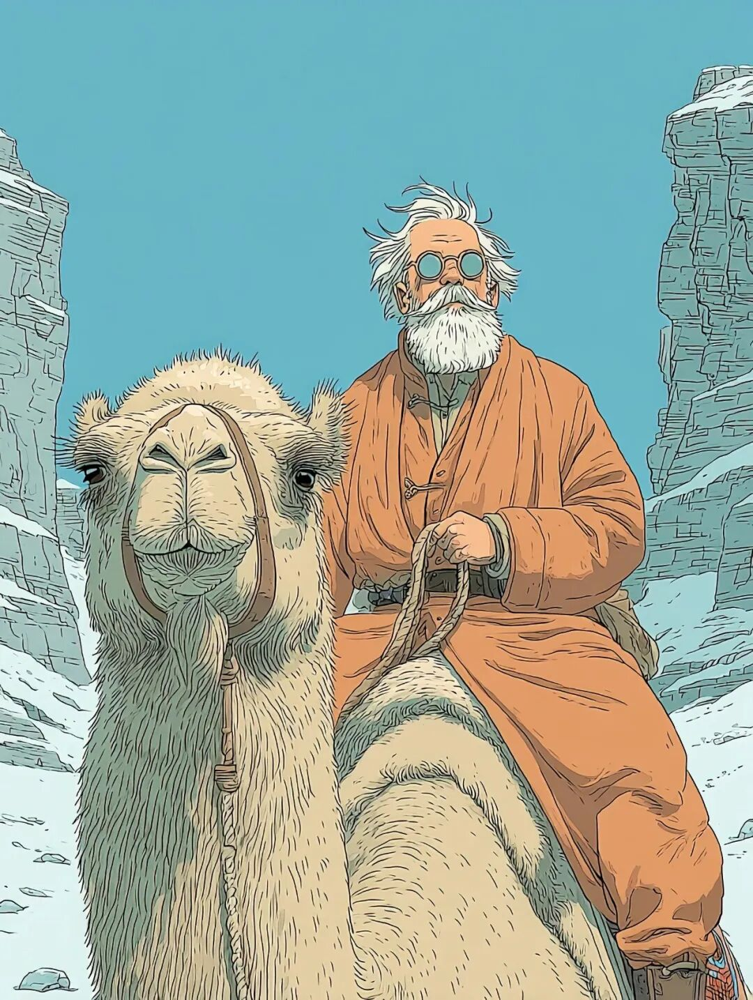
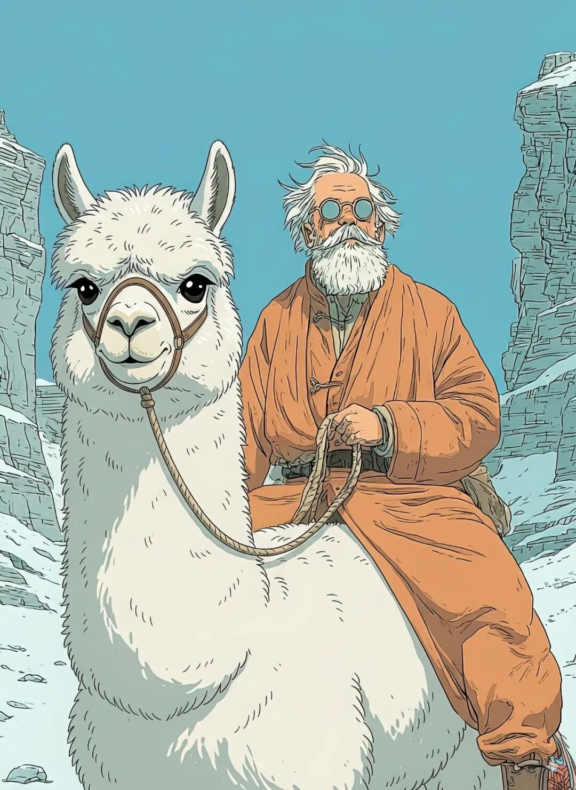
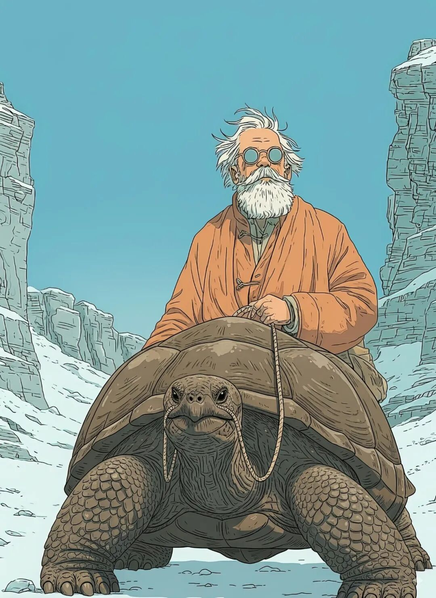

# 2025年8月文章一览

本月我在《槽边往事》共更新31篇文章，如下：

  1. [2025年7月文章一览](https://mp.weixin.qq.com/s?__biz=MjM5MjAzODU2MA==&mid=2652804867&idx=1&sn=4ec4ccd615f074b6d58fd72648ecd378&scene=21#wechat_redirect)
  2. [今天不出门](https://mp.weixin.qq.com/s?__biz=MjM5MjAzODU2MA==&mid=2652804877&idx=1&sn=a73eaf89a241b70b583e7232bddc1352&scene=21#wechat_redirect)
  3. [租房的尊严](https://mp.weixin.qq.com/s?__biz=MjM5MjAzODU2MA==&mid=2652804885&idx=1&sn=df969bbf01890f4b76dbc1cd5c0f3ea7&scene=21#wechat_redirect)
  4. [当下的反应](https://mp.weixin.qq.com/s?__biz=MjM5MjAzODU2MA==&mid=2652804894&idx=1&sn=eb3a1c329f1274d3b114825df847f9fc&scene=21#wechat_redirect)
  5. [磁带机往事](https://mp.weixin.qq.com/s?__biz=MjM5MjAzODU2MA==&mid=2652804901&idx=1&sn=bc83bef7bd35ae68cfcbffc19463cd59&scene=21#wechat_redirect)
  6. [创造改变的可能](https://mp.weixin.qq.com/s?__biz=MjM5MjAzODU2MA==&mid=2652804909&idx=1&sn=7161bd33ddca6242c624fc311275a34e&scene=21#wechat_redirect)
  7. [再见，马叔叔](https://mp.weixin.qq.com/s?__biz=MjM5MjAzODU2MA==&mid=2652804919&idx=1&sn=dc9b3ebf395f8f3bea7a9b9dc863fd87&scene=21#wechat_redirect)
  8. [秋天的感觉](https://mp.weixin.qq.com/s?__biz=MjM5MjAzODU2MA==&mid=2652804928&idx=1&sn=93919e6e36b25e2ad92cb87ee62299e4&scene=21#wechat_redirect)
  9. [人间最少领航员](https://mp.weixin.qq.com/s?__biz=MjM5MjAzODU2MA==&mid=2652804937&idx=1&sn=667733d21d8ed17f30a754fb603a42fe&scene=21#wechat_redirect)
  10. [AI最大的用处：辅助人类理解人类](https://mp.weixin.qq.com/s?__biz=MjM5MjAzODU2MA==&mid=2652804947&idx=1&sn=f503f0289b586018fd2245fb7dc802ac&scene=21#wechat_redirect)
  11. [再谈一次动态血糖仪](https://mp.weixin.qq.com/s?__biz=MjM5MjAzODU2MA==&mid=2652804958&idx=1&sn=5b301887fb18dfbb19bd536e27b9179d&scene=21#wechat_redirect)
  12. [神魔小说和童话故事](https://mp.weixin.qq.com/s?__biz=MjM5MjAzODU2MA==&mid=2652804966&idx=1&sn=208f817e7c7d1dc5dbd1fe1f27ef2957&scene=21#wechat_redirect)
  13. [抱着头讲都听不进去](https://mp.weixin.qq.com/s?__biz=MjM5MjAzODU2MA==&mid=2652804973&idx=1&sn=dc0b735edccefbfbb2949061e13f3c2d&scene=21#wechat_redirect)
  14. [B站印象](https://mp.weixin.qq.com/s?__biz=MjM5MjAzODU2MA==&mid=2652804984&idx=1&sn=6ab7c94d59fd908b8bc1e54a213ffd20&scene=21#wechat_redirect)
  15. [骑上一匹马](https://mp.weixin.qq.com/s?__biz=MjM5MjAzODU2MA==&mid=2652804991&idx=1&sn=c372306c788f99cf53ec3a46a19e100a&scene=21#wechat_redirect)
  16. [童年报复性补偿](https://mp.weixin.qq.com/s?__biz=MjM5MjAzODU2MA==&mid=2652804998&idx=1&sn=ff31d3f0d00a49306a73afbfbc16b2d2&scene=21#wechat_redirect)
  17. [转职黑暗期](https://mp.weixin.qq.com/s?__biz=MjM5MjAzODU2MA==&mid=2652805007&idx=1&sn=53cd5f673aba4b869a7e45bf15da612d&scene=21#wechat_redirect)
  18. [品位只是流行的溢出而已](https://mp.weixin.qq.com/s?__biz=MjM5MjAzODU2MA==&mid=2652805019&idx=1&sn=f7d4dc82f2c7086614a05850b831bb3a&scene=21#wechat_redirect)
  19. [收到一份道歉](https://mp.weixin.qq.com/s?__biz=MjM5MjAzODU2MA==&mid=2652805028&idx=1&sn=7adaf671b9ed7ab560ba99be34b66bb6&scene=21#wechat_redirect)
  20. [CD生日快乐](https://mp.weixin.qq.com/s?__biz=MjM5MjAzODU2MA==&mid=2652805036&idx=1&sn=2e1086c1e3fb852cc043a6f1973b4160&scene=21#wechat_redirect)
  21. [个人最佳：小旋风收音机](https://mp.weixin.qq.com/s?__biz=MjM5MjAzODU2MA==&mid=2652805042&idx=1&sn=c40f1a6e66954ddb07b5ec8b4fb06eaf&scene=21#wechat_redirect)
  22. [胜利空降](https://mp.weixin.qq.com/s?__biz=MjM5MjAzODU2MA==&mid=2652805052&idx=1&sn=d4410299820b891beda5c62f2a4b7541&scene=21#wechat_redirect)
  23. [当做剃须刀的去搞设计](https://mp.weixin.qq.com/s?__biz=MjM5MjAzODU2MA==&mid=2652805068&idx=1&sn=cf5d18d8c9e3e37f65419f7b16e2f4ec&scene=21#wechat_redirect)
  24. [沉重的数字资产](https://mp.weixin.qq.com/s?__biz=MjM5MjAzODU2MA==&mid=2652805100&idx=1&sn=8c04cf39a0dc912df88e59bf453c8fde&scene=21#wechat_redirect)
  25. [继续争论](https://mp.weixin.qq.com/s?__biz=MjM5MjAzODU2MA==&mid=2652805107&idx=1&sn=40a625f3e311feb0d87e4523dca7cb58&scene=21#wechat_redirect)
  26. [看图说话](https://mp.weixin.qq.com/s?__biz=MjM5MjAzODU2MA==&mid=2652805128&idx=1&sn=2280436b7ea644a104e87b37b4d9a5c3&scene=21#wechat_redirect)
  27. [要不要去编程呢](https://mp.weixin.qq.com/s?__biz=MjM5MjAzODU2MA==&mid=2652805142&idx=1&sn=20fc3fda6988c6da6314e99f0d825a73&scene=21#wechat_redirect)
  28. [最了不起的个人能力](https://mp.weixin.qq.com/s?__biz=MjM5MjAzODU2MA==&mid=2652805171&idx=1&sn=06460aca5fc3659312ca73f6538ea4ff&scene=21#wechat_redirect)
  29. [训练课笔记](https://mp.weixin.qq.com/s?__biz=MjM5MjAzODU2MA==&mid=2652805180&idx=1&sn=4596f30886988873709b4bfd039f98ef&scene=21#wechat_redirect)
  30. [为什么女生才应该学一点AI](https://mp.weixin.qq.com/s?__biz=MjM5MjAzODU2MA==&mid=2652805194&idx=1&sn=3f7783e0ce0c2f254dd6bcc6f0aa9b50&scene=21#wechat_redirect)
  31. [难得出趟门](https://mp.weixin.qq.com/s?__biz=MjM5MjAzODU2MA==&mid=2652805201&idx=1&sn=0868911bbd4f03b77d39eb8b17bcd612&scene=21#wechat_redirect)

  
很有意思，我在 8 月份的第一篇文章是《[今天不出门](https://mp.weixin.qq.com/s?__biz=MjM5MjAzODU2MA==&mid=2652804877&idx=1&sn=a73eaf89a241b70b583e7232bddc1352&scene=21#wechat_redirect)》，最后一篇文章是《[难得出趟门](https://mp.weixin.qq.com/s?__biz=MjM5MjAzODU2MA==&mid=2652805201&idx=1&sn=0868911bbd4f03b77d39eb8b17bcd612&scene=21#wechat_redirect)》。写的时候我都没有意识到，等今天写月度总结才发觉这个月居然形成了首尾呼应。差不多整个 8 月份我的心情都有些沉郁。突然有那么一天早上，接到电话，然后就要说一声《[再见，马叔叔](https://mp.weixin.qq.com/s?__biz=MjM5MjAzODU2MA==&mid=2652804919&idx=1&sn=dc9b3ebf395f8f3bea7a9b9dc863fd87&scene=21#wechat_redirect)》，这不在我的预期之中，也不是我所愿之事。之后的事情，又让我心中五味杂陈。先是我在香格里拉机场的前同事们，大家在留言区里重聚。这本来是应该很高兴的事情，毕竟在香格里拉机场五周年纪念日我们再见过一次之后，二十年间再无联系，重逢总是一件好事。然而我转念一想，怎么我这就到了只有在葬礼上才能和旧人重逢的年岁了？然后是马叔叔的儿子联系到我，希望把文章的最后一段授权给他，他想在葬礼上用这一段话作为自己的悼词结尾。我很满意那一段，多年来难得的神来一笔。那个早上我千种情绪在心头汹涌泛滥，最后落在那一段地空通话上，在落笔那一瞬间，我很清楚地知道「妥了，就是它，再没有第二种可能」，那就是我所有的情绪。得到小马的认可，成为悼词的一部分，我觉得这是一种对莫大的认可。但是这一次我却感到无限的虚无：我要这种认可干什么？最后是几天之后我终于有勇气打开微信，查看马叔叔和我的最后一次对话。当时我祝贺他履新，说起 2000 年时候他和我谈过的那些想法，那些抱负，如今终于有机会得以实现，在 24 年之后，终于可以去掉那些「如果」了。他回覆我说：「年轻的时候都有梦，兜兜转转中本已放弃梦想，在最没有追求的年纪得到平台，让实现梦想愈加困难，命中注定吧？」认识马叔叔那么多年，那是他第一次，也是最后一次和我谈到「命」。当时我看完他的回覆，只觉得心中苍凉，长河落日，四顾茫然，让我无限唏嘘，不知道如何回答才好。如今重新再看一遍，依然不知道如何回答才好。都说一个人在人生结束之时会画上一个句号，而在马叔叔那里我看到的是一串省略号。这种沉郁的心情一直维持到月末，一想到省略号，我终于下手买了之前一直在观望的随身听，我终于开始慢慢升起学习 AI 编程的决心。然后不知道为什么，我的朋友毫无征兆地出现，拉拽着我去吃传说中的饭，去专门听黑胶唱片，强烈建议我开始用 AI 做产品，以及从大洋那一头给我带数字播放器回来。我很感激他们所做的一切，一点一滴，逐渐把我的心情拉升起来。事实上，我个人觉得这个 8 月非常圆满。一头一尾，首尾呼应。所有发生的事情，背后都有深意，也都安排妥当。如同是一场淬炼一般，让我感受、经历最后走出死亡带来的灰色气息，然后重新焕发对生活的热情，点燃对于未知和冒险的好奇。这些年我写过很多文章，告诉读者应该用这样的心，应该用那样的想法，的确是好意，但应该效果微弱。因为那些都是道理，不是经历。唯有个人真实经历，唯有经历之后的蜕变，才会有真实的心显现，也才会有可以真正促成行动的想法产生。要想播撒一颗种子，首先需要击破土层，种子才有安身之处。在这个意义上来说，生活中无论遭遇什么，无需去分辨好坏，它们都是播撒种子的机会，哪怕当时会非常苦涩难挨。这就是所谓的圆满，不是说结果，而是说从头到尾都有这种萌发的可能，这种可能从未离开过自己。九月到了，祝你九月一切圆满无碍。  
  
题图标题：《骑骆驼的人》创作者：**和菜头的小肉手** AI算法提供：**Midjourney V 7.0 **Prompt: Captain Haddock with arbic robe riding a camel --sref 803757204 --sw 949 --stylize 400 --quality 4 --exp 12 --ar 3:4 --v7.0**  
****槽边往事****和菜头 出品**********【微信号】****Bitsea******个人转载内容至朋友圈和群聊天，无需特别申请版权许可。****请你相信我，****我所说的每一句话，****都是错的**

> ******禅定时刻**

  

**《骑羊驼的人 》******

**和菜头的小肉手****Nano Banana**

> **南派三叔专区**

 南派，这张《骑象龟的人》送给你。**  
**

> **《槽边往事》专营店营业中**

2025 年油浸鸡枞上线，可能是九年以来最好的一年，详情见：《[2025年云南雨季的味道来了](https://mp.weixin.qq.com/s?__biz=MjM5MjAzODU2MA==&mid=2652804801&idx=1&sn=d192b2eec2b91012836ec5f19dd0f853&scene=21#wechat_redirect)》《[油浸鸡枞的油](https://mp.weixin.qq.com/s?__biz=MjM5MjAzODU2MA==&mid=2652804809&idx=1&sn=d8c3df5ce92025d9e3588f1f0753edd6&scene=21#wechat_redirect)》八月份最后一台随身听。都说闲鱼上鱼龙混杂，但是我遇见的卖家都还不错。之前我买了两台随身听，签收之后发现其中一台声音抖动得厉害。我和卖家说了一声，没想到他立即让我邮寄回去，同时他给我换一台。新换的这一台比之前那一台音质好了不少，价格也更高，但是卖家坚持不要我补差价，也不要我补邮费。每个人看到的世界，看到的人，大概都是不相同的。
