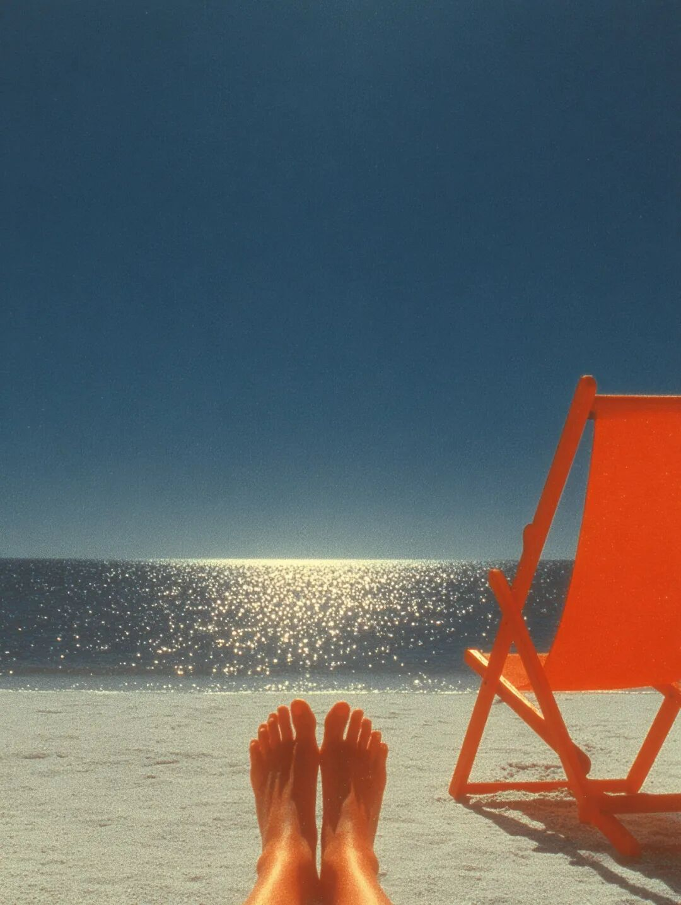
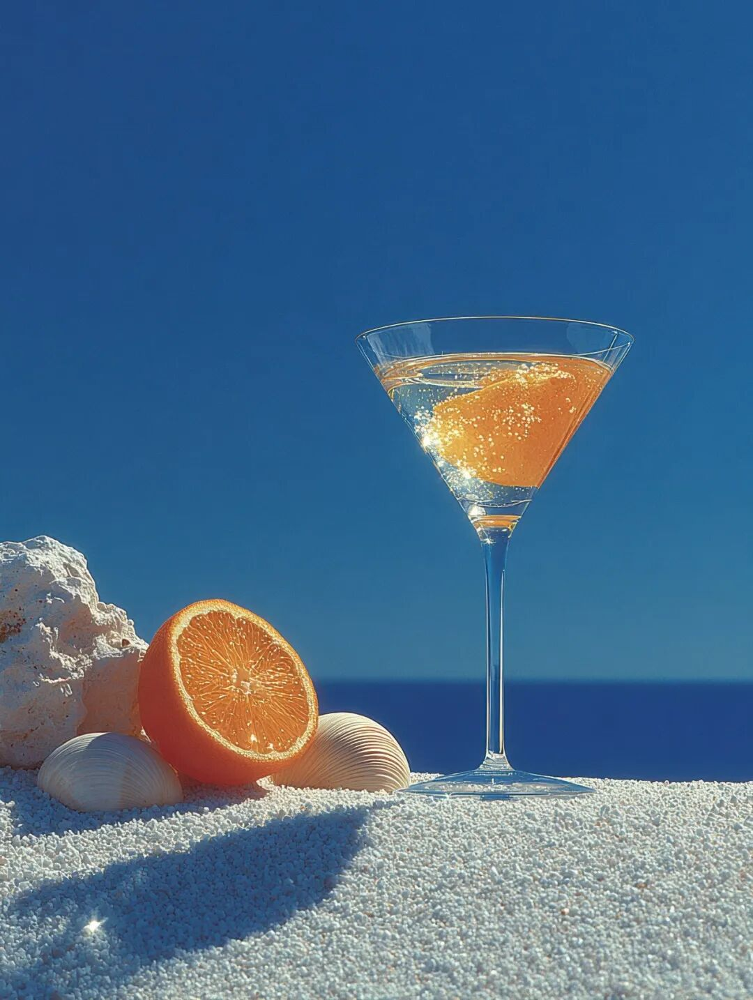

# 2025年9月文章一览

2025年9月，我在《槽边往事》共更新33篇文章：

  1. [2025年8月文章一览](https://mp.weixin.qq.com/s?__biz=MjM5MjAzODU2MA==&mid=2652805208&idx=1&sn=d6aa9cd870a5e7af985acae151ee8bb3&scene=21#wechat_redirect)
  2. [和菜头曾经说过](https://mp.weixin.qq.com/s?__biz=MjM5MjAzODU2MA==&mid=2652805223&idx=1&sn=c8255d628e8b23ea5fb130c21043122e&scene=21#wechat_redirect)
  3. [准备做一次全菌宴](https://mp.weixin.qq.com/s?__biz=MjM5MjAzODU2MA==&mid=2652805235&idx=1&sn=750c7c4f68627dc242737643bf84dfdf&scene=21#wechat_redirect)
  4. [特立独行](https://mp.weixin.qq.com/s?__biz=MjM5MjAzODU2MA==&mid=2652805240&idx=1&sn=54c50a1436ec5250b8e547097a8418dc&scene=21#wechat_redirect)
  5. [不要主动对号入座](https://mp.weixin.qq.com/s?__biz=MjM5MjAzODU2MA==&mid=2652805249&idx=1&sn=437010b90e1f26a6a3f876455f600768&scene=21#wechat_redirect)
  6. [2025 年中秋季月饼指引](https://mp.weixin.qq.com/s?__biz=MjM5MjAzODU2MA==&mid=2652805262&idx=1&sn=4c7f78c61751bdf8172ef7a1f67eae87&scene=21#wechat_redirect)  

  7. [佳句天成](https://mp.weixin.qq.com/s?__biz=MjM5MjAzODU2MA==&mid=2652805270&idx=1&sn=3599579867859e8ef4b9f253afb94e49&scene=21#wechat_redirect)  

  8. [红伞伞白杆杆](https://mp.weixin.qq.com/s?__biz=MjM5MjAzODU2MA==&mid=2652805322&idx=1&sn=511684a7aa9195f7b6eed8538f92211d&scene=21#wechat_redirect)
  9. [月食之夜](https://mp.weixin.qq.com/s?__biz=MjM5MjAzODU2MA==&mid=2652805330&idx=1&sn=727940efaed224e6c5f66a2f0d43f501&scene=21#wechat_redirect)
  10. [请帮脱不花选一下灵魂头像](https://mp.weixin.qq.com/s?__biz=MjM5MjAzODU2MA==&mid=2652805335&idx=1&sn=d17d04a25c00a292caa5d254d483f1e5&scene=21#wechat_redirect)
  11. [个人推荐](https://mp.weixin.qq.com/s?__biz=MjM5MjAzODU2MA==&mid=2652805343&idx=1&sn=b0d596e60a4752d8f67aef6577670fdd&scene=21#wechat_redirect)
  12. [以年计算](https://mp.weixin.qq.com/s?__biz=MjM5MjAzODU2MA==&mid=2652805353&idx=1&sn=8718584ba3cfc59fc21313223b8e9796&scene=21#wechat_redirect)
  13. [苹果的牙膏挤到了头](https://mp.weixin.qq.com/s?__biz=MjM5MjAzODU2MA==&mid=2652805367&idx=1&sn=b9026cfcd8de2db446daadbd063d2ab5&scene=21#wechat_redirect)
  14. [众人分柴往家背](https://mp.weixin.qq.com/s?__biz=MjM5MjAzODU2MA==&mid=2652805376&idx=1&sn=373edfb70e8363eb9f726302f15f6560&scene=21#wechat_redirect)
  15. [教坏小猫咪](https://mp.weixin.qq.com/s?__biz=MjM5MjAzODU2MA==&mid=2652805386&idx=1&sn=c6e96937cbb522b6634b6d2275ed4615&scene=21#wechat_redirect)
  16. [人格高于其它](https://mp.weixin.qq.com/s?__biz=MjM5MjAzODU2MA==&mid=2652805422&idx=1&sn=6187443527bd4cf61544c6702f4e5eb1&scene=21#wechat_redirect)
  17. [这是几月份的羊](https://mp.weixin.qq.com/s?__biz=MjM5MjAzODU2MA==&mid=2652805431&idx=1&sn=832768ddca960a6a32df3e2c5021937c&scene=21#wechat_redirect)
  18. [还是得排队](https://mp.weixin.qq.com/s?__biz=MjM5MjAzODU2MA==&mid=2652805442&idx=1&sn=3ee68a438721832b85cc5d4462263037&scene=21#wechat_redirect)
  19. [小难过](https://mp.weixin.qq.com/s?__biz=MjM5MjAzODU2MA==&mid=2652805460&idx=1&sn=068db3cc83477ce96f301fadb5739fdf&scene=21#wechat_redirect)
  20. [向前走](https://mp.weixin.qq.com/s?__biz=MjM5MjAzODU2MA==&mid=2652805466&idx=1&sn=94495f0a49e6ea85ca6aa3eaf4463643&scene=21#wechat_redirect)
  21. [听歌时你看歌词吗](https://mp.weixin.qq.com/s?__biz=MjM5MjAzODU2MA==&mid=2652805475&idx=1&sn=f3baa0c89feccfa3e0a9b03d1d6a9d3e&scene=21#wechat_redirect)
  22. [给有赞的一封感谢信](https://mp.weixin.qq.com/s?__biz=MjM5MjAzODU2MA==&mid=2652805483&idx=1&sn=2e1194a585043334974c2c60c735f01b&scene=21#wechat_redirect)
  23. [在理性和感性之间](https://mp.weixin.qq.com/s?__biz=MjM5MjAzODU2MA==&mid=2652805491&idx=1&sn=3fd37677c04593c1e1c4c63d1454550f&scene=21#wechat_redirect)
  24. [一些老登感悟](https://mp.weixin.qq.com/s?__biz=MjM5MjAzODU2MA==&mid=2652805498&idx=1&sn=1cafe122811e019c0b69103a7efd36b1&scene=21#wechat_redirect)
  25. [个人不解之谜](https://mp.weixin.qq.com/s?__biz=MjM5MjAzODU2MA==&mid=2652805526&idx=1&sn=96be77872c150e9f6a8bc403d2671450&scene=21#wechat_redirect)
  26. [流媒体上找不到的音乐人](https://mp.weixin.qq.com/s?__biz=MjM5MjAzODU2MA==&mid=2652805542&idx=1&sn=3c6ebad22a8d23a262a03b14fd9762ce&scene=21#wechat_redirect)
  27. [烧掉一本书](https://mp.weixin.qq.com/s?__biz=MjM5MjAzODU2MA==&mid=2652805554&idx=1&sn=e7052877761f2482609e2ff14706f5ee&scene=21#wechat_redirect)
  28. [原教旨主义云南人](https://mp.weixin.qq.com/s?__biz=MjM5MjAzODU2MA==&mid=2652805569&idx=1&sn=2503e5403d3e84d07ab6a7e2cfecf15a&scene=21#wechat_redirect)
  29. [打开心眼看世界](https://mp.weixin.qq.com/s?__biz=MjM5MjAzODU2MA==&mid=2652805579&idx=1&sn=a374af4afb51556a87aa77759ae0388b&scene=21#wechat_redirect)
  30. [网上跨代际对话](https://mp.weixin.qq.com/s?__biz=MjM5MjAzODU2MA==&mid=2652805587&idx=1&sn=42dcc76ee8a17ce3124617400e76a301&scene=21#wechat_redirect)
  31. [千里投递菜场空降包](https://mp.weixin.qq.com/s?__biz=MjM5MjAzODU2MA==&mid=2652805594&idx=1&sn=c5dd1bdffa61ba7e2fd3e77177c92d68&scene=21#wechat_redirect)
  32. [背刺者艾玛](https://mp.weixin.qq.com/s?__biz=MjM5MjAzODU2MA==&mid=2652805601&idx=1&sn=a2c386149577dc739f3c862db88661ab&scene=21#wechat_redirect)

  
好像这个月我在不经意之间就写了两个系列，有单集向连续剧发展的趋势：1、《[特立独行](https://mp.weixin.qq.com/s?__biz=MjM5MjAzODU2MA==&mid=2652805240&idx=1&sn=54c50a1436ec5250b8e547097a8418dc&scene=21#wechat_redirect)》---《[人格高于其它](https://mp.weixin.qq.com/s?__biz=MjM5MjAzODU2MA==&mid=2652805422&idx=1&sn=6187443527bd4cf61544c6702f4e5eb1&scene=21#wechat_redirect)》---《[背刺者艾玛](https://mp.weixin.qq.com/s?__biz=MjM5MjAzODU2MA==&mid=2652805601&idx=1&sn=a2c386149577dc739f3c862db88661ab&scene=21#wechat_redirect)》；2、《[准备做一次全菌宴](https://mp.weixin.qq.com/s?__biz=MjM5MjAzODU2MA==&mid=2652805235&idx=1&sn=750c7c4f68627dc242737643bf84dfdf&scene=21#wechat_redirect)》---《[红伞伞白杆杆](https://mp.weixin.qq.com/s?__biz=MjM5MjAzODU2MA==&mid=2652805322&idx=1&sn=511684a7aa9195f7b6eed8538f92211d&scene=21#wechat_redirect)》---《[原教旨主义云南人](https://mp.weixin.qq.com/s?__biz=MjM5MjAzODU2MA==&mid=2652805569&idx=1&sn=2503e5403d3e84d07ab6a7e2cfecf15a&scene=21#wechat_redirect)》。在九月，我个人感触最深的一件事并没有写成文章，只是在网上做了一点记录，现在抄录如下：「去朋友家帮忙安装黑胶机，本打算大家挑张碟，倒杯酒，一起在沙发上听一会儿音乐。机器刚装好，黑胶还没听几首歌，电话响起，朋友父亲突然病危，进入弥留状态，叫他去医院见最后一面。我们立即起身，来不及告别就各奔西东。上了出租车我才想起来，酒还没喝完，黑胶唱片应该还在转着。中年给我的感觉就是这样的。也不应该说是感觉，事情就是那么发生的，无非是这一次落在谁头上的问题。2025年9月22日22点」。后来，朋友赶到医院没多久，老爷子就去世了。虽然是朋友的私事，但是我还是决定在这里记一笔。将来单纯看每月文章一览，可能无法回忆起当时的写作背景和真实心态。从那一晚起，其实我就一直想写无常给我带来的冲击，但是考虑到朋友还在服丧，用别人生命里的创痛作为自己的创作素材，这样做法太过于艺术家。我不是艺术家，也不想那么做。因为有话想说而不能说，后续几天我一直处于走神状态，一直写到询问网恋是怎么一回事那篇文章才逐渐好转。另外还有件事值得在这里专门说一句：写《[给有赞的一封感谢信](https://mp.weixin.qq.com/s?__biz=MjM5MjAzODU2MA==&mid=2652805483&idx=1&sn=2e1194a585043334974c2c60c735f01b&scene=21#wechat_redirect)》的时候，其实微信团队就已经开始做优化。当时，有赞是一条线，我去找的白鸦。微信是另外一条线，我去找了负责微信小店的同学们。有赞那一条线相对来说动得不多，所以速度很快。微信小店这边情况要更复杂，需要更多时间。因为没有确切的消息，我只能写有赞这边的进展。前几天微信那边告诉我，针对微信小店的无障碍使用功能已经优化完成。所以，各位视障读者朋友，现在你们也可以用屏读打开和操作微信小店了。具体的技术细节我不是很清楚，但我个人分析这一次修改和升级应该是系统层面上的更新，更多基于微信的小程序或者二次开发的软件，应该都因此而获得了无障碍使用的能力，希望大家能用到更多更好的服务，用得更加顺利方便，可以现在就去试试看。在整个 9 月份，阅读量最高的一篇文章出现在月末最后一天：《[背刺者艾玛](https://mp.weixin.qq.com/s?__biz=MjM5MjAzODU2MA==&mid=2652805601&idx=1&sn=a2c386149577dc739f3c862db88661ab&scene=21#wechat_redirect)》，目前这篇文章的阅读量是 22 万。这篇文章只能写成这个样子，事情本身有很多个面，作为针对大众阅读的一般性文字，它落在了「背叛」这个主题上，让整篇文章变成了一种道德讨论。现实当然要比一个道德问题复杂得多，罗琳和艾玛在意识形态上的对立要分析起来还挺复杂，涉及到女权运动的两个不同分支之间的理论差异，我看下来和我当年看神学家吵架的观感差不多，所以就只能简化再简化，我想，能满足大众的朴素道德观念其实也就够了。说到底，包括地球村在内的一整套概念在今天已经崩解。人们又开始回到本地，本国这些概念中去，进步派所谓的全球议题，所谓的共同话题已经失去了存在空间。试图在理论或者意识形态上统合出某个共识的尝试，如今已经让位于现实的可操作性方案。在英国，最高法院已经根据英国民众的吁请，用裁决做出了回应：女性的定义基于生理。换句话说，大法官认同性高于性别的理念，认为根据这一理念民众能够顺利生活。理念之争可以继续，但是在罗琳所在的英国，最高法院已经给出了法律上的裁决，民众可以根据这一裁决继续生活。性别身份认同是个人的事情，但是它会被挡在女更衣室，女洗澡间，以及女子体育项目之外，民众的忧虑因此可以得到缓解。有了法律的介入，全球性别身份议题的讨论就变成个别的国家法律问题，一个外国人再来讨论英国民众应该如何想，应该如何做才对，这已经失去了意义。古罗马的法院只针对罗马公民的呼声做出回应，黑森林里的日耳曼蛮族武士，埃及尼罗河畔的农夫如何想，不在罗马法院法官的考量范围之内，他们不对这些外邦人的理念负有任何责任和义务。一条地球村如今又在恢复为一个个独立城邦，城邦内部判决并不参考村内流行共识，这是个现实趋势，哲人王又一次失败了。但应不应该背刺一位朋友，类似的问题在全世界范围之内还是可以继续，法院不管这种事情。在经历了那么多事情之后，十月假期到来了，中秋未至，月饼还在售卖，祝你假期愉快！  
⚠️生产商已停产，存货售完停止⚠️  
题图标题：《在海边》创作者：**和菜头的小肉手** AI算法提供：**Midjourney V 7.0 **Prompt: **Close up of a pair of bare feet spread out on a beach chair with a blurred sandy beach and sea in the background --sref 289702923 4274748397 3033238820 4210775150 --ar 3:4 --s 1000 --v7.0****  
****槽边往事****和菜头 出品**********【微信号】****Bitsea******个人转载内容至朋友圈和群聊天，无需特别申请版权许可。****请你相信我，****我所说的每一句话，****都是错的**

> ******禅定时刻**

  

**《贝壳 》******

**和菜头的小肉手****Midjourney V 7.0**

> **南派三叔专区**

  
派派，这张《马蒂尼》送给你。**  
**

> **《槽边往事》专营店营业中**

  
  
⚠️生产商已停产，存货售完停止⚠️  
2025 年油浸鸡枞上线，可能是九年以来最好的一年，详情见：《[2025年云南雨季的味道来了](https://mp.weixin.qq.com/s?__biz=MjM5MjAzODU2MA==&mid=2652804801&idx=1&sn=d192b2eec2b91012836ec5f19dd0f853&scene=21#wechat_redirect)》《[油浸鸡枞的油](https://mp.weixin.qq.com/s?__biz=MjM5MjAzODU2MA==&mid=2652804809&idx=1&sn=d8c3df5ce92025d9e3588f1f0753edd6&scene=21#wechat_redirect)》《[2025 年中秋季月饼指引](https://mp.weixin.qq.com/s?__biz=MjM5MjAzODU2MA==&mid=2652805262&idx=1&sn=4c7f78c61751bdf8172ef7a1f67eae87&scene=21#wechat_redirect)》  
  

