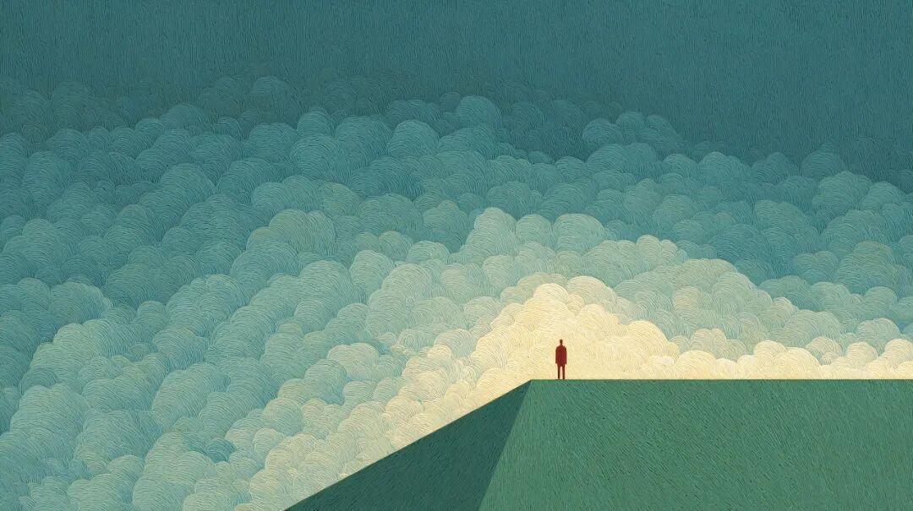
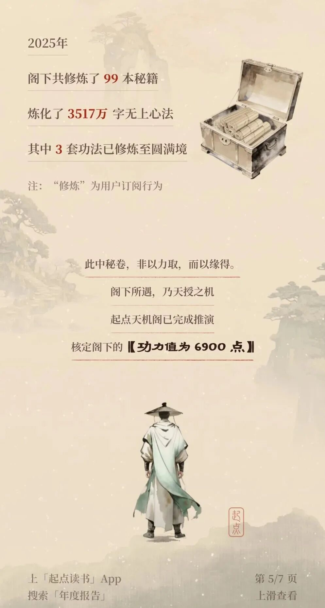
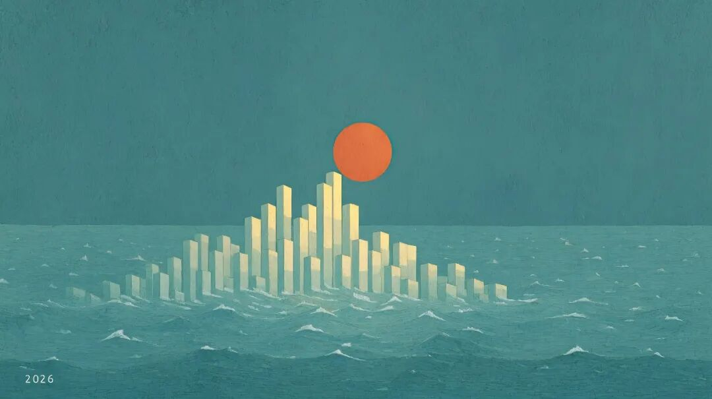
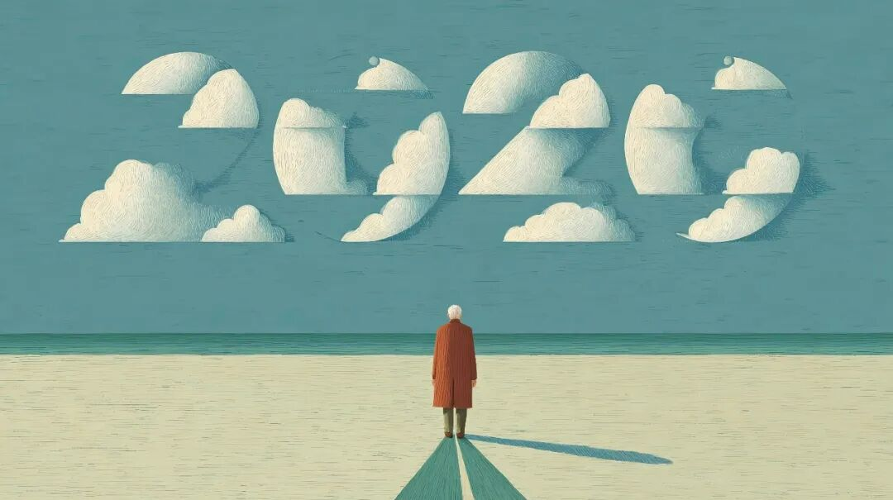

# 2025年文章一览

2025 年，我在《槽边往事》更新 365 天，共计 384 篇文章：  
[2025年元月文章一览](https://mp.weixin.qq.com/s?__biz=MjM5MjAzODU2MA==&mid=2652802594&idx=2&sn=c65b8a48e5a5bf018aa08db46affd06b&scene=21#wechat_redirect) 36[2025年2月文章一览](https://mp.weixin.qq.com/s?__biz=MjM5MjAzODU2MA==&mid=2652802965&idx=2&sn=50b8c739485c10fced68c3ce0b7bd773&scene=21#wechat_redirect)30[2025年3月文章一览](https://mp.weixin.qq.com/s?__biz=MjM5MjAzODU2MA==&mid=2652803422&idx=1&sn=fb5eaab5993d3a2b6bfff945bd7fae29&scene=21#wechat_redirect) 33[2025年4月文章一览](https://mp.weixin.qq.com/s?__biz=MjM5MjAzODU2MA==&mid=2652803861&idx=1&sn=e086723a0c6dbc4610c3f651b79edb0d&scene=21#wechat_redirect) 30[2025年5月文章一览](https://mp.weixin.qq.com/s?__biz=MjM5MjAzODU2MA==&mid=2652804228&idx=1&sn=a69468a2149147c89d605f6cf7a14f7c&scene=21#wechat_redirect) 32[2025年6月文章一览](https://mp.weixin.qq.com/s?__biz=MjM5MjAzODU2MA==&mid=2652804533&idx=1&sn=5198e60177a2470ac910d8f832d52e03&scene=21#wechat_redirect) 32[2025年7月文章一览](https://mp.weixin.qq.com/s?__biz=MjM5MjAzODU2MA==&mid=2652804867&idx=1&sn=4ec4ccd615f074b6d58fd72648ecd378&scene=21#wechat_redirect) 34[2025年8月文章一览](https://mp.weixin.qq.com/s?__biz=MjM5MjAzODU2MA==&mid=2652805208&idx=1&sn=d6aa9cd870a5e7af985acae151ee8bb3&scene=21#wechat_redirect) 31[2025年9月文章一览](https://mp.weixin.qq.com/s?__biz=MjM5MjAzODU2MA==&mid=2652805618&idx=1&sn=9038b3e2433b1571b9e51166bb9d0d7c&scene=21#wechat_redirect) 33[2025年10月文章一览](https://mp.weixin.qq.com/s?__biz=MjM5MjAzODU2MA==&mid=2652805947&idx=1&sn=25353c023e1f66edd0f800b145c7604a&scene=21#wechat_redirect) 32[2025年11月文章一览](https://mp.weixin.qq.com/s?__biz=MjM5MjAzODU2MA==&mid=2652806282&idx=1&sn=2687cf3ddc45c1297dda12b32fdc8f52&scene=21#wechat_redirect) 30  
2025 年 12 月  

  1. [2025年11月文章一览](https://mp.weixin.qq.com/s?__biz=MjM5MjAzODU2MA==&mid=2652806282&idx=1&sn=2687cf3ddc45c1297dda12b32fdc8f52&scene=21#wechat_redirect)
  2. [在他人的凝视下](https://mp.weixin.qq.com/s?__biz=MjM5MjAzODU2MA==&mid=2652806292&idx=1&sn=dde138c8e659e19c9d9e03db804eb7fa&scene=21#wechat_redirect)
  3. [提纯式浏览器](https://mp.weixin.qq.com/s?__biz=MjM5MjAzODU2MA==&mid=2652806299&idx=1&sn=c3354425a52d343e982e24e5027a4f87&scene=21#wechat_redirect)
  4. [为之狂热的理由](https://mp.weixin.qq.com/s?__biz=MjM5MjAzODU2MA==&mid=2652806329&idx=1&sn=7d62e0a30f4b3f1dc3bfa34ee7f2b9ed&scene=21#wechat_redirect)
  5. [社交媒体脱敏](https://mp.weixin.qq.com/s?__biz=MjM5MjAzODU2MA==&mid=2652806337&idx=1&sn=d750868bb82fe7150334ac8bcc64c005&scene=21#wechat_redirect)
  6. [咔嚓时刻](https://mp.weixin.qq.com/s?__biz=MjM5MjAzODU2MA==&mid=2652806345&idx=1&sn=65592ad3663870de7e2fe75f02e69bd1&scene=21#wechat_redirect)
  7. [12月7日补记](https://mp.weixin.qq.com/s?__biz=MjM5MjAzODU2MA==&mid=2652806364&idx=1&sn=c3a8362b6c259c4780583ca9cf21e203&scene=21#wechat_redirect)
  8. [与他人相处的三个假设前提](https://mp.weixin.qq.com/s?__biz=MjM5MjAzODU2MA==&mid=2652806373&idx=1&sn=d93eee2502ef18b49a99ee2856ceeb0d&scene=21#wechat_redirect)
  9. [去海边](https://mp.weixin.qq.com/s?__biz=MjM5MjAzODU2MA==&mid=2652806382&idx=1&sn=3cc223ccd9a394b19465b8364e1b6d98&scene=21#wechat_redirect)
  10. [他们的互联网](https://mp.weixin.qq.com/s?__biz=MjM5MjAzODU2MA==&mid=2652806388&idx=1&sn=997397b52afdefbf31d5489c98875d53&scene=21#wechat_redirect)
  11. [但朋友在乎](https://mp.weixin.qq.com/s?__biz=MjM5MjAzODU2MA==&mid=2652806398&idx=1&sn=4c560bb52957f91f4e880e81c6284694&scene=21#wechat_redirect)
  12. [盲盒、黑盒以及错误](https://mp.weixin.qq.com/s?__biz=MjM5MjAzODU2MA==&mid=2652806406&idx=1&sn=c88f6282013b19f51e547ef2f33080e1&scene=21#wechat_redirect)
  13. [初雪落下](https://mp.weixin.qq.com/s?__biz=MjM5MjAzODU2MA==&mid=2652806431&idx=1&sn=e39bd9fe5a564003736edc0b42d7dde6&scene=21#wechat_redirect)
  14. [我的第一次直播](https://mp.weixin.qq.com/s?__biz=MjM5MjAzODU2MA==&mid=2652806438&idx=1&sn=637200a6705c4d4d5f9838ee2f92aa87&scene=21#wechat_redirect)
  15. [突然断联的几种可能](https://mp.weixin.qq.com/s?__biz=MjM5MjAzODU2MA==&mid=2652806449&idx=1&sn=3683b13237ae72d611c21b8578f76488&scene=21#wechat_redirect)
  16. [年度读书总结（2025）](https://mp.weixin.qq.com/s?__biz=MjM5MjAzODU2MA==&mid=2652806458&idx=1&sn=09dbde30cecbb4089555e8e2559da1b0&scene=21#wechat_redirect)
  17. [那时，家长和老师没有微信群](https://mp.weixin.qq.com/s?__biz=MjM5MjAzODU2MA==&mid=2652806471&idx=1&sn=34c7d94bd6c4e43dfd92cebb45dd112b&scene=21#wechat_redirect)
  18. [我来自古代](https://mp.weixin.qq.com/s?__biz=MjM5MjAzODU2MA==&mid=2652806478&idx=1&sn=4108646282bff71ec0f3a6ed99ce8b27&scene=21#wechat_redirect)
  19. [自我定位](https://mp.weixin.qq.com/s?__biz=MjM5MjAzODU2MA==&mid=2652806497&idx=1&sn=a01e2d367b8c011e3f337442e9c15659&scene=21#wechat_redirect)
  20. [有锅没米怎么煮饭](https://mp.weixin.qq.com/s?__biz=MjM5MjAzODU2MA==&mid=2652806504&idx=1&sn=aec59c0b8dd66ddc3a7a10246bfb29e5&scene=21#wechat_redirect)
  21. [选择不看什么更重要](https://mp.weixin.qq.com/s?__biz=MjM5MjAzODU2MA==&mid=2652806512&idx=1&sn=ddb03ff55626f813bd94d42f7064a6b2&scene=21#wechat_redirect)
  22. [我的三种生活非必需品](https://mp.weixin.qq.com/s?__biz=MjM5MjAzODU2MA==&mid=2652806520&idx=1&sn=8053fe4f4a69d5b2d56e9bc3b95d8b40&scene=21#wechat_redirect)
  23. [年终总结的写法](https://mp.weixin.qq.com/s?__biz=MjM5MjAzODU2MA==&mid=2652806536&idx=1&sn=9d1ff72a8a7a52aa58612bd84f6667ee&scene=21#wechat_redirect)
  24. [跟着年轻人玩](https://mp.weixin.qq.com/s?__biz=MjM5MjAzODU2MA==&mid=2652806544&idx=1&sn=e58bae17cde1cbae4452ee09aa4be2d1&scene=21#wechat_redirect)
  25. [沉下心去十分钟](https://mp.weixin.qq.com/s?__biz=MjM5MjAzODU2MA==&mid=2652806554&idx=1&sn=fb088bd2465e57eb7c541ebad7773799&scene=21#wechat_redirect)
  26. [一年之得](https://mp.weixin.qq.com/s?__biz=MjM5MjAzODU2MA==&mid=2652806564&idx=1&sn=d3cabd52c736b20fe8d96670dbabaec2&scene=21#wechat_redirect)
  27. [悬而未决不丢人](https://mp.weixin.qq.com/s?__biz=MjM5MjAzODU2MA==&mid=2652806572&idx=1&sn=44df7a3516acdc75b8e2f78e03e9fd68&scene=21#wechat_redirect)
  28. [机器犯冲周](https://mp.weixin.qq.com/s?__biz=MjM5MjAzODU2MA==&mid=2652806582&idx=1&sn=830288213934a3b49dbc8cc332ef4004&scene=21#wechat_redirect)
  29. [记一次社会活动](https://mp.weixin.qq.com/s?__biz=MjM5MjAzODU2MA==&mid=2652806591&idx=1&sn=90b8481f8970e96e1f9040e3c761a0b3&scene=21#wechat_redirect)
  30. [那些文艺时光我无悔](https://mp.weixin.qq.com/s?__biz=MjM5MjAzODU2MA==&mid=2652806602&idx=1&sn=cc94874c093c9e110377f8cf813b0969&scene=21#wechat_redirect)
  31. [告别2025](https://mp.weixin.qq.com/s?__biz=MjM5MjAzODU2MA==&mid=2652806616&idx=1&sn=b29a8ca96b4c727114facff6c7acc8e8&scene=21#wechat_redirect)

  
我不知道放在这里合适不合适，不过我想让你看一眼冰山的另外一角：  
2025 年，我觉得自己很幸运，得以一天不间断地更新了 365 天。与此同时，也没有耽误我去外地三趟，算是走出去领略了一点世界。现在是 2026 年元月 1 日，在整理完过去一年的所有文章列表之后，我感觉去年这一页已经彻底翻过去，新年真的到来。  
说实话，去年我感觉到疲惫的时刻要远比前几年出现得更为频繁。平均下来，大概每周都有一天感觉什么都不想写。你知道，当一个人写了上千篇文章之后，怕是很难避开一个问题：这个话题我是不是之前就写过了？以前我看老头们翻过来覆过去讲同样的话，感觉不能理解，一个人怎么能记不住几分钟前自己讲过的话？那时候我还很天真，不知道老头讲过的话统计下来是个天文数字，世界上就没有几颗大脑能够完全记住。  
但我还是在写法上占了一个大便宜。不确定自己写过没有不算是太糟糕的事情，最糟糕的事情是自己的说法前后不一，然后又有一帮记性很好的读者。我没有这个问题，因为那么多年里我尽量做到怎么想就怎么说，不会为了读者接受或者欢迎，扭曲我的真实想法，迎合大众的口味，也不会为了所谓的正确，写一些言不由衷的话，表一些表里不一的态。不想说，不能说，那就保持沉默。这一点我还是能做到的，反正每天只写一篇而已。  
所以，虽然我的人还在变化，我的心还在变化，但是因为每一篇文章出自我的真实想法，真实感受，那么我就不用担心文章的前后一致性，只需要稍微回忆一下，别写重复了就行。即便不得不重复，我想，我也有把握把之前的观点和想法再往前推进一步。这么做其实也很好，我和读者一路共同成长，共同变化，不至于变成一块僵硬的互联网化石。  
虽然年龄增长带来了这些问题，但也有好的一方面。去年微信公众号不断调整算法和运营策略，让我经历了很多次阅读量暴跌。没办法的事情，算法一旦判定我的文章不够好，打开率、读完率以及互动数据不好，系统就不予推荐。不推荐的话，哪怕订阅了《槽边往事》的读者也看不到更新提示，有的时候阅读量简直惨不忍睹。  
而这样的起起伏伏在过去的十多年里我经历过太多次，如果要焦虑，要痛苦，要内心慌张不安的话，这些情绪在过去早就已经释放殆尽。我觉得这就是年龄增长带来的好处，一篇文章写好发出去，一看阅读增长速率知道今天可能就一万阅读，我也有本事直接把这件事扔在一边，接着去忙别的。  
是，数据是不理想，但事情已经发生，那就由得它去，今天的更新已经结束，我还有别的事情要做，不能让数字卡在我和事情之间。自己觉得不理想，那就明天再试一次好了，起起伏伏是很正常的事情。哪里有那么多不理想，我之前的那些很理想在其他作者那里不一样是一种极为不理想么？如果我的理想是每一个订阅读者必须都读一遍我的新文章，那对于他们而言这和理想难道不是比上学上班坐牢还要糟糕？  
我觉得，正是因为有这种今日事今日毕，今日毕撂爪就忘的心态，让我在每一个疲惫不堪，半个字不想敲的时候，内心减少了很多痛苦和纠结，然后每一次也都能很快恢复过来，字符奇迹一般在屏幕上一个个自己蹦出来。人生并不因为经验丰富，年岁增长，技巧圆熟而降低难度，消灭痛苦，每一天起来坐在电脑前，我面对的依然是一项全新的挑战，需要和昨天一样再经历一遍。  
好在人会习惯。习惯和挑战相处，习惯和疲惫相处，习惯和艰难相处，习惯和不自信相处，然后它们对自己的影响就会降到最低，不至于真正妨碍到你。我知道，许多读者把我的连续更新当做是一种象征，某种精神锚点或者是支柱。然后会产生很多不切实际的幻想，比如说终有一天自己可以无痛写作，写到飘飘欲仙。那我刚才的这些话就值得好好看看，我可没有承诺或者暗示过会有一种纯粹甜美幸福的境界会出现，只有对艰辛的适应与适应。坏消息是它们并不会消失，好消息是你可以带着它们继续，并且困扰会渐渐减少。  
去年其实应该是 386 篇文章，有一篇关于桌面音响的文章我没发，觉得因为一个小众个人爱好而去骚扰一遍所有读者未免太过自大。另一篇是约稿，发布需要等到授权，并不是我想发就能立即发。好在今天是 2026 年的第一天，新年到来，我正好把它们在今天一并发布出来。  
谢谢你读到这里，也谢谢你过去一年来的支持、鼓励和陪伴。现在，我想对你说一句：  
「新年快乐！」  
  
  
  
题图标题：《地平线》创作者：**和菜头的小肉手** AI算法提供：**Midjourney V 7.0 **Prompt: The 3D number '2026' is rising up above the horizon. --sref 130141172 --sw 100 --stylize 300 --ar 16:9 --p --exp 30 --v7.0  
**  
****槽边往事****和菜头 出品**********【微信号】****Bitsea******个人转载内容至朋友圈和群聊天，无需特别申请版权许可。****请你相信我，****我所说的每一句话，****都是错的**

> ******禅定时刻**

  
《2026 年的第一个早晨》  

> **南派三叔专区**

  
派派，这张《2026》厉害了，你仔细看看。**  
**

> **《槽边往事》专营店营业中**

  
  

