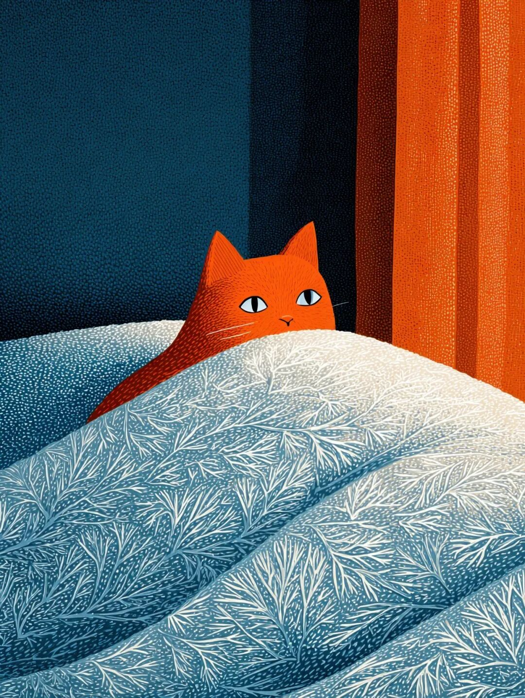

# 一夜入冬

周一早上，阳光明媚，窗外绿树如昨，但是气温只有5摄氏度。喝完咖啡我觉得整个人已经清醒过来，但是那些花草树木可能不是这样，我猜想它们还处于发懵的状态---在十成叶子里，变黄的部分半成都不到，它们还在过初秋，然而冬天已经到了：究竟发生了什么？北京今年的天气证明了它的确是一座拥有运河的城市，那么多年里我就没见过那么绵延的雨水，也没有经历过那么多湿润的天气，以至于不得不买除湿机，免得蘑菇从脚丫子缝里长出来。但谁也没有想到，温暖湿润的季节突兀地一夜之间结束。仿佛是个顽童拿着花洒站在天上不停地浇水，然而突然有那么一刻，他随手就把花洒扔掉奔向下一件事，没有丝毫犹豫。从温暖湿润到北风凛冽，只在他的一转念。我自己有另外一种入冬标准。每个午夜时分，我下楼扔垃圾。在整个夏季和秋季，即便到了这样深的夜，小区院子里依然有人在遛狗。幽暗的院子里，太阳能路灯半死不活地亮着，但在这片黑暗里会悬浮着几张明亮的脸，那是遛狗的人在看手机。狗就在他们脚边跑来跑去，翘起脚给绿化带浇水，浇一阵小跑几步，再浇一阵，前列腺很健康活泼的样子。等到有那么一晚，院子里只有北风呼啸，黑暗里没有一张面孔漂浮，花丛草丛边也没有浇花匠，我就知道冬天到了。无论是狗还是人，都不愿意在那么冷的天气里下楼。我在下过雪的傍晚六点见过这种不情愿，狗从单元门冲出来，踩到雪当场就愣住，然后火速冲到枯败的绿化带快速防水，抖都不抖一下，一个转身就回到主人身边拉裤腿，意思是：赶紧回家，你杵在这里玩手机是要冻死我啊？昨晚就是这样的夜，虽然气温还是有 6 摄氏度，但是北风强劲，撕扯着身上的热量夺路而逃。院子里郁郁葱葱，但是除了我没有任何人，也没有任何狗，甚至连流浪猫都见不到一只。那些在夏天里深夜不灭的灯光都已经消失，从楼底到楼顶，不止是我所在的小区，似乎马路和远处的建筑都调整暗了灯火---北京的冬天，似乎有一种吞噬光线的能力。在扔完垃圾返程的路上，我居然看到了晴朗的夜空里有十几颗星星在闪烁。于是我确信，冬天这回是真的到了，起码到了这个小区。回家我又捡起了我的气象学专业，发现强大的冷空气集群正在耐心且稳定地大举南下。它要比爆发性的寒潮来得慢，但是在这缓慢中带着一种从容不迫的碾压之势。之前北京的初冬之所以不会让人觉得太冷，是因为寒潮推进速度太快，一夜就越过长城，掠过华北平原，朝着长江流域扑去。然而，日光依然强烈，钢筋混凝土的建筑依然保存着许多热量。不需要开暖气，只要走进大楼里还是会觉得暖和，那是混凝土在保暖。这一次不同，冷空气步步为营，缓步推进。每前进一步，就把建筑物保存的热量全部吃尽，一定要冻硬冻透冻彻底，然后才会前往下一站。于是，即便开着空调我还是会在凌晨五点被准时冻醒---在一天里最冷的时候，空调的暖风吹到靠窗的墙壁上，带着那些附着其上冰凉的空气回流，吹在我身上就是冰冷的寒意。昨晚就是这样，我梦见自己穿着衬衫，赤脚在雪地里找厕所，怎么找都找找不到，然后醒来发现是 5 点 20，房间里飞舞的都是冷风的小刀片。这些小刀片会继续南下，从华北平原推到长江流域，一路推到珠三角。那些饱受高温多雨折磨的朋友，终于可以得到几分清凉，也许是过度清凉，因为气温可能陡降10 摄氏度，短袖直接换滑雪衫，同样感受一下一夜入冬是怎样一种感觉。之后还会支分线剧情，即将冻透的东北、华北、西北会一天冷过一天，彻底步入冬季。而那些短暂入冬的南方城市可能又会迎来气温反弹，秋老虎还留了一根尾巴在，怎么都要挥舞几下。所以不忙收起短袖，一周后还得穿上。以我在北方生活那么多年的经验，今年这种提前入冬的情形也算少见。不单是花草树木发懵，我也在这种快速的气候变化中发晕。上周我还在开着抽湿机，努力把家里的湿度从 60% 降低到 50%。今天早起，我看到湿度已经跌倒 41%，需要把抽湿机收起来，直接换加湿器出来干活，不然我很快就要被电击。冬天到了，唯一的好处是我那放浪不羁，狂傲独立的猫咪昨晚终于肯回到枕边，靠着我取暖睡觉，我手里又有了久违的一小团毛球。  
  
题图标题：《雪地摩托》创作者：**和菜头的小肉手** AI算法提供：**Midjourney V 7.0 **Prompt: **Chinese woman riding a red snowmobile in blizzard --sref 14094475 --ar 3:4 --exp 60 --s 1000 --p --v7.0****  
****槽边往事****和菜头 出品**********【微信号】****Bitsea******个人转载内容至朋友圈和群聊天，无需特别申请版权许可。****请你相信我，****我所说的每一句话，****都是错的**

> ******禅定时刻**

朋友家的猫咪在露营营地是个山大王，经常神气活现地四处巡视。结果，上一次误中当地农民部署的捕兽夹，送医救治，好容易才养好。  
前天，猫咪又在野山徒步时大战毒蛇，然后被咬了一口。农大动物医院也没有兽用蛇毒血清，眼看要挂了，这时候有陌生人闻讯送来药物，再一次挽救了猫命。  
现实和网络是两回事。网络上说，猫咪是顶级捕食者，而我在现实里看到的是一只瘸猫，他轻而易举地落入了人类的捕兽夹。网络上说，猫咪的神经反射速度是蛇的好几倍，所以猫咪总是可以安然无恙地戏耍毒蛇，而我在现实里看到的是一只差点嗝屁着凉的猫。  
最聪明的猫都在网上，人类则恰恰相反。   

**《取暖 》******

**和菜头的小肉手****Midjourney V 7.0**

> **南派三叔专区**

  
南派，这张《被窝猫》送给你。**  
**

> **《槽边往事》专营店营业中**

  
  

