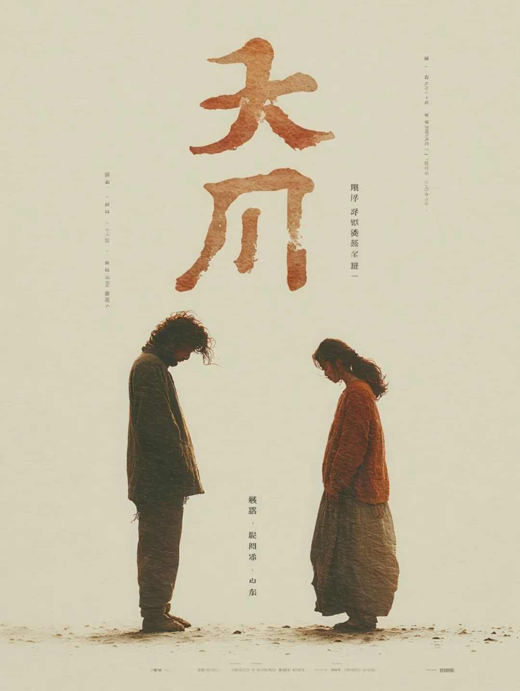
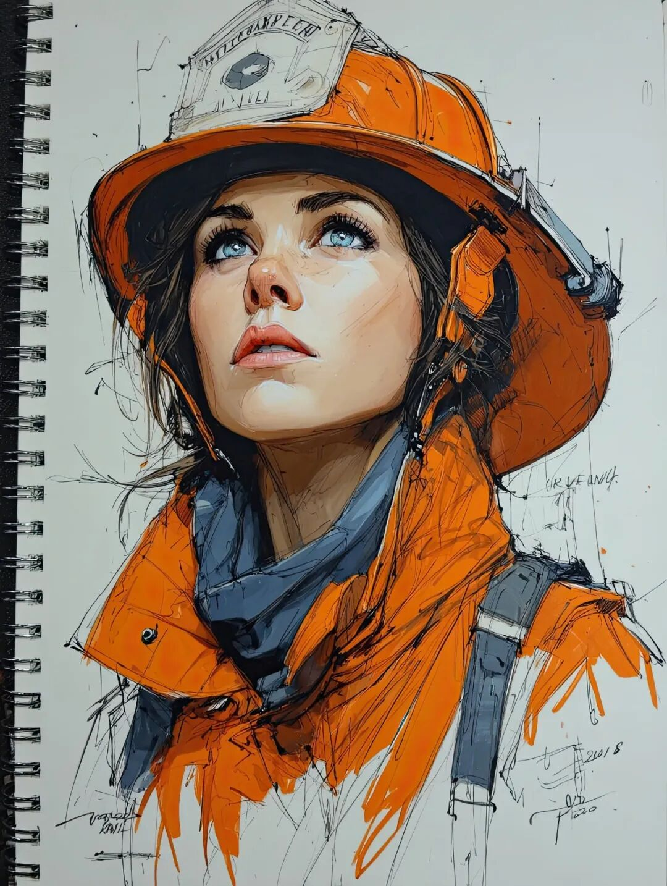

# 收到一份道歉

一年到头，我会收到很多份道歉。有些人宣称是为了之前对我的误解，有些人宣称是为了之前的取关，昨天收到的这一份最常见：曾经觉得我攻击性太强而排斥远离，直到自己在网上历经了一番网友的口水洗礼，于是瞬间就理解了曾经的我。看完我就笑得不行，不是因为「云淡风轻的你也有今天」，而是这样的道歉完全搞错了重点，还不如根本不道歉。穿上别人的鞋子，才终于理解别人的步姿，重点根本不在于理解，重点也不在于我的感受。我会在意什么网友曾经的误解吗？我在意的人很少，需要做解释人更少。其他人愿意误解就误解，怎么误解都可以，毕竟对于他们而言这就不是什么误解，而是他们认定的正解。那么，他们如何知道今天的道歉不是一种新的误解呢？我会在意什么网友的取关吗？爱取消不取消，我只是由衷希望取关的时候不要专门通知我一声，我不想看，也不想了解这后面的情绪。觉得自己取关的动作很重要，是一种对我的惩罚。如今回来道歉，意思是为当初惩罚所造成的伤害致歉。那么，似乎前后也没有什么变化，还是全然的自我为中心，自说自话。从不理解到理解了我，途径是和我有了类似的经历，这里的重点难道不是在此刻、在未来，你自己在无法理解，无法接受他人行为的时候，心中能想起当初这一段往事，稍微怀疑一下也许是自己的视角问题，是自己的处境问题吗？我觉得这才是重点，用那种庸俗的话来说就是：自己在人生经历中获得了成长，变得更为成熟和宽容，实现了内核稳定。我个人不需要谁来道歉，事实上，我根本不记得谁是谁，也不知道当初某个人的内心戏。但是，如果道歉能带来反思，然后推衍到自己的日常想法，日常行为上，稍微把自己从世界中心往世界的边疆方向移动一点点，对他人不再那么严苛，对自己不再那么笃信，那么这种觉悟和这种改变会让我非常高兴。否则，我会认为这些道歉都是空话。当初和我没关系，我就是个发泄个人怒火的稻草人。如今同样和我没关系，我就是见证所谓「个人成长」的道具人。那我可以把前后列两个等式，因为我本人在两个等式中都是相同项，所以通过相减就可以直接去掉，等到恒等式：我是对的=我是好人=我。在这里，「和菜头」就是个无关选项，存在与否没有任何区别。说实话，我个人并不愿意成为谁的自我的装点，愿意怎么打扮是每个人自己的事，不需要拉我进来。最后，我想和所有未来可能会想要向我道歉的人做一个约定：与其那么麻烦，不如我们简化一下流程，那就是我继续像过去一样，怀着平等的心继续无差别攻击，你看到了愿意怎么想就继续怎么想。如果有天想法改变了，也不需要回来道歉。实在是忍不住要道歉，向自己道歉，向自己的心道歉就好。因为人真正想要的原谅，只可能在自己心里。  
  
题图标题：《在山上》创作者：**和菜头的小肉手** AI算法提供：**Midjourney V 7.0 **Prompt: On the top of hills --sref 200230861 --ar 3:4 --v7.0**  
****槽边往事****和菜头 出品**********【微信号】****Bitsea******个人转载内容至朋友圈和群聊天，无需特别申请版权许可。****请你相信我，****我所说的每一句话，****都是错的**

> ******禅定时刻**

  

**电影《大川不出头 》海报******

**和菜头的小肉手****Midjourney****V 7.0****  
**

> **南派三叔专区**

 南派，这张《消防员》送给你，过年好！**  
**

> **《槽边往事》专营店营业中**

2025 年油浸鸡枞上线，可能是九年以来最好的一年，详情见：《[2025年云南雨季的味道来了](https://mp.weixin.qq.com/s?__biz=MjM5MjAzODU2MA==&mid=2652804801&idx=1&sn=d192b2eec2b91012836ec5f19dd0f853&scene=21#wechat_redirect)》《[油浸鸡枞的油](https://mp.weixin.qq.com/s?__biz=MjM5MjAzODU2MA==&mid=2652804809&idx=1&sn=d8c3df5ce92025d9e3588f1f0753edd6&scene=21#wechat_redirect)》  
  

