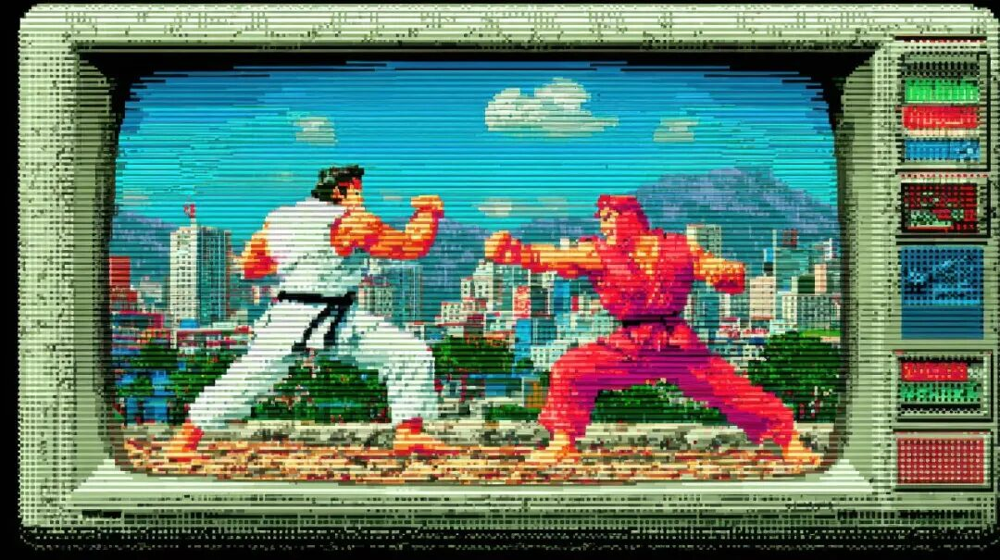
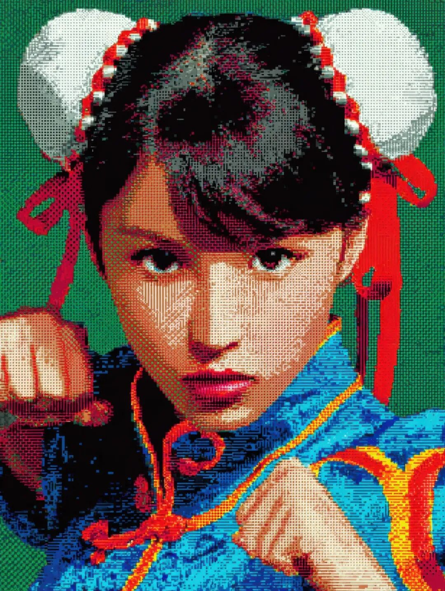

# 烧掉一本书

应该是博客时代的事情了，有一位读者为了表示对我的鄙夷，同时也是为了表达他强烈的情绪，在家里烧掉了我的一本书，然后把残骸扔进马桶，拍照发在网上。看到那些照片的一瞬间，我感觉到一阵强烈的燥热从我的脚底一路烧上面庞。那种恶意不加掩饰，我能立即意识到照片后面羞辱我的意图。但也就我即将点燃的那一刻，我产生了另外一种奇异的感受：书是书，我是我，我并不是一本书。他买的书，他的私人物品，他怎么处置是他的事，和我无关。这些年里，偶然会想起这件往事，尤其是想起自己心念转变的那一瞬，对我的帮助很大。很多时候，只要我错误地放置了自我，就会因此而感到伤害。自我这种东西如同流水一般，很容易在不经意之间就流淌蔓延开去。正常来说，自我通常被限定在表皮以内的人形空间里，这具皮囊里的所有想法、感受、认知构成了那个「自我」。但是，世间还有一个概念，叫做「我的」。因为有它的存在，自我就可以脱离皮囊，依附在物品，依附在人身，依附在话语，甚至是依附在概念上---只要把什么视为「我的」，它就大约等同于自我。就像是我的猫咪，她不知道从什么时候起养成了个习惯，没事就跑到我的坐垫上撒尿。说起来也很奇怪，除了猫砂盆和坐垫之外，她也并不会选择其他地点。最开始的时候，早上我起身走到客厅，发现坐垫上出现了新的一滩地图，就会怒不可遏，揪着猫咪后脖子把她拖到现场，让她面对地图，大声质问她：这是你干的好事？！怒不可遏是因为那是我的坐垫，我买的物品，它属于我。那么，猫咪在上面撒尿，就是在我头上撒尿，这种事情怎么能忍？即便不谈概念去谈事实，让我在一泡猫尿上坐两个小时，这种事情怎么能忍？结果我还是忍了下来。等情绪平复下来，我就意识到这件事本身是多么荒谬---我如何能让猫咪听懂我在说什么，我又可以用什么去和一只猫咪计较？即便我拽着她去指认犯罪现场，在她的逻辑里也完全没有这个概念，也许会感觉到困惑：这人拉我到我圈定的势力范围边上是什么意思？他不服的话，为什么却不肯自己也尿一滩？结局就是猫尿猫的，我洗我的。好在家里通风良好，洗好晾晒一天就能干。好在猫咪不是天天如此，有些时候坐垫上也可能没有地图。在这个重复的过程里，我和坐垫之间逐渐解绑。那就是个垫子，不要把自己轻易放上去，放上去就可能被猫尿淋一头。这样的话，它有时候是个干燥干净的垫子，可以打坐；而有些时候它是猫咪的厕所，那就需要清洗。事情就是这样，两种状态不断切换，仅此而已，并不涉及到我和猫之间的任何私人恩怨。之前我有目睹烧书的经验，所以在面对猫咪尿坐垫这件事的时候，人就要从容很多，愤怒消失得更快。同样的，别人批驳我的观点，别人轻视我的审美，别人鄙夷我的文字，诸如此类的事情每天都在发生，但是每次对于我的刺激和伤害却在日渐减弱。在我看来，附着在我观点里的自我，远不如和朋友碰杯时，隐藏在清脆声响中的自我更真实，更值得在意。回想往事，那本燃烧的书扔进了马桶，也不知道后来有没有引发堵塞？我一直有一个问题：如果我的自我并没有附着在那些残骸上，那么按下冲水键的瞬间，究竟又是什么附着其上，随着水流冲入了下水道呢？  
  
  
⚠️距离生产商停产仅剩 3 天⚠️  
题图标题：《来自矩阵的视频电话》创作者：**和菜头的小肉手** AI算法提供：**Midjourney V 7.0 **Prompt: **Keanu Reeves on TV, --sref 2908066821 92055839 2450167357 2637207712 1952877584 254411823 2144229368 3163668129 525814859 3976253715 1515440357 2837359086 --stylize 1000 --ar 16:9 --v7.0****  
****槽边往事****和菜头 出品**********【微信号】****Bitsea******个人转载内容至朋友圈和群聊天，无需特别申请版权许可。****请你相信我，****我所说的每一句话，****都是错的**

> ******禅定时刻**

  

**《街霸 》******

**和菜头的小肉手****Midjourney V 7.0**

> **南派三叔专区**

  
派派，这张《春丽》送给你。**  
**

> **《槽边往事》专营店营业中**

  
  
⚠️距离生产商停产仅剩 3 天⚠️  
2025 年油浸鸡枞上线，可能是九年以来最好的一年，详情见：《[2025年云南雨季的味道来了](https://mp.weixin.qq.com/s?__biz=MjM5MjAzODU2MA==&mid=2652804801&idx=1&sn=d192b2eec2b91012836ec5f19dd0f853&scene=21#wechat_redirect)》《[油浸鸡枞的油](https://mp.weixin.qq.com/s?__biz=MjM5MjAzODU2MA==&mid=2652804809&idx=1&sn=d8c3df5ce92025d9e3588f1f0753edd6&scene=21#wechat_redirect)》《[2025 年中秋季月饼指引](https://mp.weixin.qq.com/s?__biz=MjM5MjAzODU2MA==&mid=2652805262&idx=1&sn=4c7f78c61751bdf8172ef7a1f67eae87&scene=21#wechat_redirect)》  

