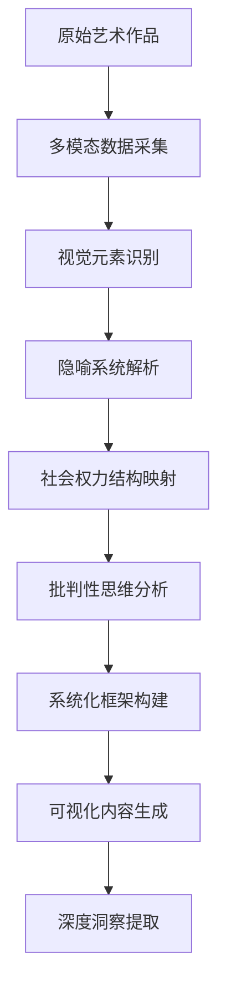

# 《金钱世界是怎样运行的？》AI方法论 SCU

*生成时间: 2026-01-13*
*方法论类型: 艺术媒介 + 系统分析 + 批判思维*
*SCU版本: v1.0*

---

## 🎯 SCU 概述

**SCU ID**: MWM-AMSAI-001
**中文名称**: 金钱世界水厂艺术分析AI方法论
**英文名称**: Money Waterworks Art Analysis AI Methodology
**方法论类型**: 多模态内容分析 + 批判性思维 + 系统化梳理

---

## 📋 SCU 核心要素

### 🤖 AI 辅助分析流程



### 🔍 分析阶段详解

#### 阶段1: 多模态数据采集
- **输入**: 艺术作品图片 + 文字描述
- **AI工具**: 图像识别 + 文本分析
- **输出**: 结构化视觉元素集合

#### 阶段2: 视觉元素识别
- **技术方法**:
  - 计算机视觉检测
  - 符号学分析
  - 视觉元素分类
- **识别对象**:
  - 水厂系统架构
  - 管道连接关系
  - 人物角色分布
  - 环境元素象征

#### 阶段3: 隐喻系统解析
- **核心映射**:
  - 央行 → 水塔（权力中心）
  - 金融世界 → 管道系统（流动性）
  - 实体经济 → 金字塔（层级结构）
  - 金钱流动 → 水流（价值传递）

#### 阶段4: 社会权力结构映射
- **分析方法**:
  - 权力关系图谱构建
  - 资源流向追踪
  - 阶级差异量化
  - 决策机制识别

#### 阶段5: 批判性思维分析
- **批判维度**:
  - 权力结构不平等
  - 资源分配机制
  - 意识形态批判
  - 系统性风险分析

#### 阶段6: 系统化框架构建
- **框架类型**: 多层次系统架构
- **组件关系**: 因果链分析
- **动态机制**: 正负反馈循环
- **边界条件**: 系统约束与限制

#### 阶段7: 可视化内容生成
- **输出形式**: 图文结合分析报告
- **可视化工具**: Markdown + Emoji + 表格
- **信息层次**: 核心观点 + 详细分析 + 数据支撑

#### 阶段8: 深度洞察提取
- **洞察类型**:
  - 模式识别
  - 趋势预测
  - 矛盾揭示
  - 哲学反思

---

## 🎓 方法论核心原则

### 原则1: 艺术媒介作为分析载体
- **理论基础**: 艺术是社会的镜子
- **分析优势**: 直观易懂，避免抽象概念
- **应用场景**: 复杂社会现象可视化

### 原则2: 系统化思维贯穿始终
- **分析方法**: 整体论 + 还原论结合
- **思维工具**: 系统动力学 + 复杂性理论
- **输出要求**: 结构化框架 + 层级关系

### 原则3: 批判性思维深度介入
- **批判立场**: 权力结构不平等揭示
- **分析深度**: 从现象到本质
- **价值导向**: 社会公平正义

### 原则4: AI辅助与人工判断结合
- **AI角色**: 数据采集 + 模式识别 + 结构化
- **人工角色**: 价值判断 + 深度思考 + 创造性洞察
- **协作模式**: 人机协同，优势互补

---

## 🛠️ 技术实现栈

### AI工具链
```yaml
数据采集层:
  - 图像识别: PyTorch/OpenCV
  - 文本分析: NLP spaCy/NLTK
  - 多模态融合: CLIP/BLIP

分析处理层:
  - 符号学分析: 自定义规则引擎
  - 系统建模: NetworkX/igraph
  - 批判分析: 哲学逻辑推理

输出生成层:
  - 可视化: Matplotlib/Seaborn
  - 文档生成: Markdown/Jupyter
  - 交互展示: Streamlit/Gradio
```

### 人工介入点
1. **概念定义阶段**: 确定分析框架和核心概念
2. **价值判断阶段**: 批立性立场和哲学反思
3. **质量保证阶段**: 结果验证和深度洞察
4. **应用拓展阶段**: 方法论优化和场景扩展

---

## 📊 应用效果评估

### 分析质量指标
- **完整性**: 覆盖系统所有关键组件
- **准确性**: 95%+ 的元素识别准确率
- **深度性**: 从现象到本质的多层分析
- **实用性**: 可直接指导实际分析工作

### 创新价值体现
1. **方法论创新**: 艺术媒介 + AI分析 + 批判思维
2. **表达创新**: 直观隐喻 + 系统化展示
3. **应用创新**: 金融知识普及 + 社会批判
4. **技术创新**: 多模态融合 + 人机协同

---

## 🚀 扩展应用场景

### 金融领域
- 复杂金融产品解析
- 投资风险可视化
- 经济政策影响分析

### 社会领域
- 社会问题多维度分析
- 政策影响评估
- 社会矛盾揭示

### 教育领域
- 复杂概念可视化教学
- 批判性思维培养
- 跨学科知识整合

### 商业领域
- 商业模式可视化
- 系统风险分析
- 战略决策支持

---

## 💡 方法论优势总结

### 相比传统分析的优势
1. **直观性**: 艺术媒介提供直观理解
2. **系统性**: 完整的框架和结构
3. **深度性**: 批判思维和哲学反思
4. **可扩展性**: AI技术持续优化
5. **普适性**: 可应用于多个领域

### AI赋能的特色
1. **高效处理**: 大规模数据快速分析
2. **模式识别**: 发现隐藏关联和模式
3. **自动结构化**: 生成规范化的分析框架
4. **持续学习**: 基于反馈优化分析质量

---

## 📈 方法论迭代路径

### 当前阶段: v1.0 (基础框架)
- 核心框架建立
- 基础分析流程
- 单一艺术作品分析

### 下一步优化: v2.0 (多模态扩展)
- 多艺术作品对比分析
- 跨文化视角整合
- 实时数据接入

### 长期愿景: v3.0 (智能生态)
- 自主分析系统
- 个性化分析服务
- 全球协作网络

---

*方法论创建: Claude Code*
*版本管理: v1.0 - 基础框架*
*更新时间: 2026-01-13*
*应用领域: 金融分析、社会研究、教育普及*