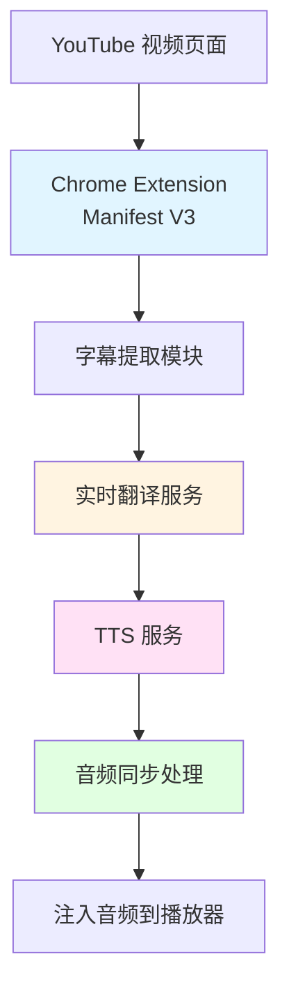
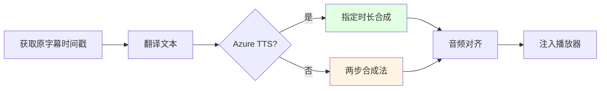

# YouTube 视频实时配音技术方案

## 📋 项目概述

实现一个类似 BUBNG 的 Chrome 浏览器插件，能够实时将 YouTube 视频的语言翻译成目标语言，并通过 TTS（文本转语音）进行配音播放。

> [!tip] 核心流程
> 1. 实时获取 YouTube 视频字幕流
> 2. 将字幕翻译成目标语言
> 3. 使用 TTS 将翻译文本转换为语音
> 4. 保持与原视频的音频同步

---

## 🏗️ 技术架构



---

## 1️⃣ 字幕获取技术

### 方案对比

| 方案 | 优势 | 劣势 | 适用场景 |
|------|------|------|----------|
| **浏览器扩展直接解析** | 无需 API Key，实时性高 | YouTube 可能更新接口 | 推荐 |
| **YouTube Data API v3** | 官方支持，稳定 | 需要配额，只能获取自己视频 | 不推荐 |
| **第三方库** | 封装简单，易于集成 | 依赖维护 | 快速原型 |

### 方案 A：浏览器扩展直接解析（推荐）

```javascript
// 从 YouTube 页面获取字幕轨道
var raw_string = ytplayer.config.args.player_response;
var json = JSON.parse(raw_string);
var captionTracks = json.captions.playerCaptionsTracklistRenderer.captionTracks;

// 返回格式示例
{
  "baseUrl": "https://www.youtube.com/api/timedtext?v=VIDEO_ID&lang=en&...",
  "name": {
    "simpleText": "English"
  },
  "vssId": ".en",
  "languageCode": "en",
  "isTranslatable": true,
  "trackName": ""
}
```

### 方案 B：YouTube Data API v3

```javascript
// 需要 API Key
const response = await fetch(
  `https://www.googleapis.com/youtube/v3/captions?part=snippet&videoId=${VIDEO_ID}&key=${API_KEY}`
);
const data = await response.json();
```

> [!warning] API 限制
> YouTube Data API 只能获取自己上传视频的完整字幕，不适合此场景

### 开源库推荐

| 库 | 语言 | 特点 |
|----|------|------|
| `youtube-subtitle-transcript` | JavaScript | 直接解析，轻量级 |
| `youtube-caption-extractor` | Node.js | 功能完整 |
| `youtube-transcript-api` | Python | 成熟稳定 |
| `YTCaptionGrabber` | Chrome Extension | 可直接参考 |

---

## 2️⃣ 实时翻译技术

### 商业翻译 API（高质量）

#### DeepL API

```bash
npm install deepl-node
```

```javascript
import { Deepl } from 'deepl-node';

const translator = new Deepl('YOUR_AUTH_KEY');

const result = await translator.translateText(
  'Hello, world!',
  'en',  // 源语言
  'zh-CN'  // 目标语言
);
```

**优势：** 翻译质量最佳，支持浏览器 SDK

**价格：** $10-30/月（根据字符量）

#### Google Cloud Translation API

```javascript
// 支持流式翻译 API
const { TranslationServiceClient } = require('@google-cloud/translate').v3;

const client = new TranslationServiceClient();
const [response] = await client.translateText({
  parent: `projects/${projectId}/locations/global`,
  contents: ['Hello, world!'],
  mimeType: 'text/plain',
  sourceLanguageCode: 'en',
  targetLanguageCode: 'zh-CN',
});
```

**价格：** $20/百万字符

#### Azure Translator

```javascript
const { Translate } = require('@azure/cognitiveservices-translatortext');
const { AzureKeyCredential } = require('@azure/core-auth');

const client = new Translate(
  new AzureKeyCredential('YOUR_KEY'),
  'YOUR_REGION'
);

const result = await client.translate(['zh-CN'], ['Hello, world!']);
```

**价格：** $10/百万字符

### 免费方案

#### Chrome 内置 AI Translation API (Manifest V3)

```javascript
const translator = await ai.translator.create();
const result = await translator.translate("Hello", {
  from: "en",
  to: "zh"
});
```

**优势：** 完全免费，浏览器内置

**限制：** 仅支持 Chrome 138+

#### DeepL Chrome 扩展

提供免费额度，质量较高

### 开源翻译方案

| 库 | 特点 |
|----|------|
| `libretranslate` | 自托管，支持 100+ 语言 |
| `argos-translate` | 离线翻译模型，无需联网 |
| `Mozilla Bergamot` | 完全离线，浏览器端 |

---

## 3️⃣ 文本转语音 (TTS)

### 方案对比

| 方案 | 声音质量 | 成本 | 实时性 |
|------|---------|------|--------|
| **Web Speech API** | 一般 | 免费 | 一般 |
| **ElevenLabs** | 优秀 | 付费 | 优秀 |
| **Azure TTS** | 优秀 | 付费 | 优秀 |
| **Google TTS** | 优秀 | 付费 | 一般 |
| **微软 TTS** | 良好 | 免费（有限） | 一般 |

### 方案 A：Web Speech API（免费，浏览器内置）

```javascript
const synth = window.speechSynthesis;

function speak(text, lang = 'zh-CN') {
  const utterance = new SpeechSynthesisUtterance(text);
  utterance.lang = lang;
  utterance.rate = 1.0;  // 语速 (0.1-10)
  utterance.pitch = 1.0; // 音调 (0-2)
  utterance.volume = 1.0; // 音量 (0-1)

  // 选择声音
  const voices = synth.getVoices();
  const zhVoice = voices.find(v => v.lang === 'zh-CN');
  if (zhVoice) {
    utterance.voice = zhVoice;
  }

  synth.speak(utterance);
}
```

**限制：**
- 声音质量一般，机器人感强
- 不支持流式音频
- 不同浏览器支持程度不同

### 方案 B：云服务 TTS（高质量，付费）

#### ElevenLabs（最自然的 AI 声音）

```bash
npm install elevenlabs
```

```javascript
import { ElevenLabsClient } from 'elevenlabs';

const client = new ElevenLabsClient({
  apiKey: 'YOUR_API_KEY'
});

const audio = await client.textToSpeech.convert('voice-id', {
  text: '翻译后的文本',
  model_id: 'eleven_multilingual_v2',
  voice_settings: {
    stability: 0.5,
    similarity_boost: 0.75
  }
});
```

**优势：** 声音最自然，支持语音克隆

**价格：** $22/月起

#### Azure TTS（支持时长控制）

```javascript
const sdk = require('microsoft-cognitiveservices-speech-sdk');

const speechConfig = sdk.SpeechConfig.fromSubscription(
  'YOUR_KEY',
  'YOUR_REGION'
);
speechConfig.speechSynthesisVoiceName = 'zh-CN-XiaoxiaoNeural';

const synthesizer = new sdk.SpeechSynthesizer(speechConfig);

const ssml = `
<speak version="1.0" xmlns="http://www.w3.org/2001/10/synthesis" xml:lang="zh-CN">
  <voice name="zh-CN-XiaoxiaoNeural">
    <prosody rate="0.8">翻译后的文本</prosody>
  </voice>
</speak>
`;

const result = await synthesizer.speakTextAsync(ssml);
```

**优势：**
- 支持指定时长（音频同步关键）
- 神经语音质量高

**价格：** $15/百万字符

#### Google TTS

```bash
npm install @google-cloud/text-to-speech
```

```javascript
const textToSpeech = require('@google-cloud/text-to-speech');
const client = new textToSpeech.TextToSpeechClient();

const [response] = await client.synthesizeSpeech({
  input: { text: '翻译后的文本' },
  voice: {
    languageCode: 'zh-CN',
    name: 'zh-CN-Wavenet-A',
    ssmlGender: 'FEMALE'
  },
  audioConfig: { audioEncoding: 'MP3' }
});
```

**价格：** $16/百万字符

### 方案 C：开源 TTS（可自托管）

#### @lobehub/tts（推荐）

```bash
npm install @lobehub/tts
```

```javascript
import { EdgeSpeechTTS } from '@lobehub/tts';

const tts = new EdgeSpeechTTS({ locale: 'zh-CN' });

const response = await tts.create({
  input: '这是一段语音演示',
  options: {
    voice: 'zh-CN-XiaoxiaoNeural',
  },
});

const audioBuffer = await response.arrayBuffer();
```

**优势：**
- 免费，基于 Edge TTS
- 质量接近云服务

#### espeak-ng（轻量级）

```javascript
var tts = new eSpeakNG('js/espeakng.worker.js', function(){
  tts.speak('翻译后的文本');
});
```

**劣势：** 声音质量较差

---

## 4️⃣ 音频同步技术（核心难点）

### 问题分析

> [!warning] 核心挑战
> 翻译后文本长度与原语音时长不一致，导致音频不同步

**示例：**
- 英文："Hello, how are you today?" (2.5 秒)
- 中文："你好，你今天怎么样？" (1.8 秒)

### 解决方案

#### 方案 A：时间戳对齐（ThioJoe 方案）

```python
# 1. 获取原字幕时间戳
original_duration = subtitle.end_time - subtitle.start_time

# 2. 计算目标语音时长（Azure TTS 支持直接指定）
def synthesize_with_duration(text, duration, voice='zh-CN-XiaoxiaoNeural'):
    ssml = f"""
    <speak version="1.0" xmlns="http://www.w3.org/2001/10/synthesis">
      <voice name="{voice}">
        <prosody duration="{duration}">{text}</prosody>
      </voice>
    </speak>
    """
    return synthesize(ssml)

# 3. 合成音频
target_audio = synthesize_with_duration(
    text=translated_text,
    duration=original_duration
)
```

#### 方案 B：两步合成法

```python
# 第一步：合成原始音频，获取实际时长
first_pass = synthesize(translated_text)
actual_duration = get_duration(first_pass)

# 第二步：根据原时长调整语速重新合成
target_duration = original_duration
rate = actual_duration / target_duration
final_audio = synthesize_with_rate(translated_text, rate)
```

**优势：** 避免音频失真，保持自然感

#### 方案 C：音频伸缩调整（Web Audio API）

```javascript
// 使用 AudioContext 伸缩音频
const audioContext = new AudioContext();
const source = audioContext.createBufferSource();
const buffer = await decodeAudioData(audioData);

source.buffer = buffer;

// 调整播放速率（保持音调）
const playbackRate = originalDuration / audioDuration;
source.playbackRate.value = playbackRate;

// 连接到输出
source.connect(audioContext.destination);
source.start();
```

**劣势：** 可能导致语音不自然

### 同步策略



---

## 5️⃣ 可用的开源项目参考

### 直接参考的项目

#### [YouTube-AI-Translator---Dubbing](https://github.com/OussamaToumirt/YouTube-AI-Translator---Dubbing) ⭐

- Chrome 扩展
- 使用 Google Gemini AI 实时翻译
- 完整的翻译 + 配音流程

#### [DubFlow](https://github.com/Badri467/DubFlow) ⭐

- YouTube 视频配音工具
- 高质量翻译 + 音频同步
- Python 后端 + 前端

#### [Auto-Synced-Translated-Dubs](https://github.com/ThioJoe/Auto-Synced-Translated-Dubs) ⭐

- ThioJoe 的项目
- 完整的时间戳同步方案
- 支持多种 TTS 服务

```python
# 核心流程
for subtitle in subtitles:
    # 1. 翻译
    translated = translate(subtitle.text, target_lang)

    # 2. 计算时长
    duration = subtitle.end_time - subtitle.start_time

    # 3. 合成音频（指定时长）
    audio = synthesize_with_duration(
        text=translated,
        duration=duration,
        voice=target_voice
    )

    # 4. 插入音频轨道
    audio_track.insert(audio, subtitle.start_time)
```

#### [subtitle-anything](https://github.com/ae9is/subtitle-anything)

- 浏览器扩展
- 给任何视频加 AI 字幕
- 可参考其架构

### 字幕提取工具

| 项目 | 类型 | 特点 |
|------|------|------|
| `youtube-subtitle-transcript` | JS 库 | 直接解析，轻量级 |
| `YTCaptionGrabber` | Chrome Extension | 可直接使用 |
| `youtube-caption-extractor` | Node.js | 功能完整 |

---

## 💰 成本估算（按月）

### 免费方案

| 模块 | 技术 | 成本 |
|------|------|------|
| 字幕获取 | 浏览器扩展直接解析 | $0 |
| 翻译 | Chrome AI API | $0 |
| TTS | Web Speech API | $0 |
| **总计** | | **$0** |

**限制：**
- 声音质量一般
- 可能受到浏览器限制

### 低成本方案

| 模块 | 技术 | 成本 |
|------|------|------|
| 字幕获取 | 浏览器扩展直接解析 | $0 |
| 翻译 | DeepL API | ~$10 |
| TTS | Azure TTS（免费额度） | ~$5 |
| **总计** | | **~$15/月** |

### 高质量方案

| 模块 | 技术 | 成本 |
|------|------|------|
| 字幕获取 | 浏览器扩展直接解析 | $0 |
| 翻译 | DeepL Pro | ~$30 |
| TTS | ElevenLabs Starter | ~$22 |
| **总计** | | **~$52/月** |

---

## 🛠️ 推荐技术栈

### 最小可行产品 (MVP)

```json
{
  "前端": "Chrome Extension (Manifest V3)",
  "字幕": "youtube-subtitle-transcript (JS)",
  "翻译": "Chrome AI Translation API",
  "TTS": "Web Speech API",
  "音频处理": "Web Audio API"
}
```

**成本：** 免费
**质量：** 一般
**开发时间：** 1-2 周

### 生产级方案

```json
{
  "前端": "Chrome Extension (Manifest V3) + React",
  "字幕": "youtube-subtitle-transcript (JS)",
  "翻译": "DeepL API",
  "TTS": "Azure TTS（支持时长控制）",
  "音频处理": "Web Audio API",
  "后端": "Node.js + Express（处理耗时操作）"
}
```

**成本：** ~$15/月
**质量：** 优秀
**开发时间：** 2-4 周

### 高端方案

```json
{
  "前端": "Chrome Extension (Manifest V3) + React",
  "字幕": "youtube-subtitle-transcript (JS)",
  "翻译": "DeepL Pro",
  "TTS": "ElevenLabs（最自然声音）",
  "音频处理": "Web Audio API",
  "后端": "Python + FastAPI（高性能）"
}
```

**成本：** ~$52/月
**质量：** 最佳
**开发时间：** 4-6 周

---

## ⚠️ 技术难点与挑战

### 1. 延迟问题

> [!danger] 核心挑战
> 从字幕→翻译→TTS 全流程需控制在 2-3 秒内

**解决方案：**
- 预加载：提前获取下一条字幕
- 缓存翻译结果
- 使用流式 TTS API
- 并行处理：翻译和 TTS 同时进行

```javascript
// 预加载策略
const prefetchQueue = async (currentSubtitle) => {
  // 预加载下一条字幕的翻译
  const nextSubtitle = await getNextSubtitle();
  const translation = await translate(nextSubtitle.text);

  // 当前播放时，下一条已经准备好了
  playTTS(currentSubtitle.translation);
};
```

### 2. 音频同步精度

**挑战：**
- 翻译后文本长度差异大
- TTS 合成时长不可控

**解决方案：**
- 优先使用 Azure TTS（支持时长指定）
- 或使用两步合成法
- 增加缓冲区平滑过渡

### 3. 浏览器限制

**Manifest V3 限制：**
- 禁用某些 API
- CSP（内容安全策略）限制

**解决方案：**
- 使用 Service Worker
- 合理配置 permissions
- 后端处理复杂逻辑

### 4. YouTube 反爬机制

**风险：**
- 字幕接口可能需要签名验证
- YouTube 可能更新接口

**解决方案：**
- 实现备用方案（YouTube Data API）
- 监控接口变化
- 建立更新机制

### 5. 多语言支持

**挑战：**
- 不同语言语速差异
- 字符编码问题

**解决方案：**
- 建立语言配置表
- 测试每种语言的语速调整参数

---

## 📦 开发步骤

### 阶段 1：原型验证（1-2 周）

- [ ] 搭建 Chrome Extension 基础框架
- [ ] 实现字幕提取功能
- [ ] 集成 Chrome AI Translation API
- [ ] 使用 Web Speech API 实现 TTS
- [ ] 验证音频同步可行性

### 阶段 2：MVP 开发（2-3 周）

- [ ] 优化字幕提取（支持多语言）
- [ ] 集成 DeepL API
- [ ] 替换 TTS 为 Azure TTS
- [ ] 实现精确音频同步
- [ ] 添加用户配置界面

### 阶段 3：优化上线（1-2 周）

- [ ] 性能优化（延迟控制）
- [ ] 错误处理和重试机制
- [ ] 用户测试和反馈
- [ ] 打包发布到 Chrome Web Store

---

## 🔧 核心代码示例

### Chrome Extension Manifest V3

```json
// manifest.json
{
  "manifest_version": 3,
  "name": "YouTube 视频翻译配音",
  "version": "1.0.0",
  "permissions": [
    "activeTab",
    "scripting",
    "storage"
  ],
  "host_permissions": [
    "https://www.youtube.com/*"
  ],
  "content_scripts": [
    {
      "matches": ["https://www.youtube.com/*"],
      "js": ["content.js"],
      "run_at": "document_end"
    }
  ],
  "background": {
    "service_worker": "background.js"
  }
}
```

### 字幕提取

```javascript
// content.js
class YouTubeSubtitleExtractor {
  extract() {
    const playerConfig = ytplayer?.config?.args?.player_response;
    if (!playerConfig) return null;

    const response = JSON.parse(playerConfig);
    const tracks = response.captions?.playerCaptionsTracklistRenderer?.captionTracks;

    if (!tracks || tracks.length === 0) return null;

    // 选择首选语言
    const preferredLang = 'en';
    const track = tracks.find(t => t.languageCode === preferredLang)
                 || tracks[0];

    return {
      baseUrl: track.baseUrl,
      language: track.languageCode,
      name: track.name.simpleText
    };
  }

  async fetchSubtitles(trackInfo) {
    const response = await fetch(trackInfo.baseUrl);
    const xml = await response.text();

    // 解析 XML 字幕
    return this.parseSubtitleXML(xml);
  }

  parseSubtitleXML(xml) {
    const parser = new DOMParser();
    const doc = parser.parseFromString(xml, 'text/xml');
    const texts = doc.querySelectorAll('text');

    return Array.from(texts).map(text => ({
      start: parseFloat(text.getAttribute('start')),
      duration: parseFloat(text.getAttribute('dur')),
      text: text.textContent.trim()
    }));
  }
}
```

### 翻译服务

```javascript
// translation.js
class TranslationService {
  constructor(apiKey) {
    this.apiKey = apiKey;
    this.cache = new Map();
  }

  async translate(text, sourceLang, targetLang) {
    // 检查缓存
    const cacheKey = `${sourceLang}-${targetLang}-${text}`;
    if (this.cache.has(cacheKey)) {
      return this.cache.get(cacheKey);
    }

    // 调用 DeepL API
    const response = await fetch('https://api-free.deepl.com/v2/translate', {
      method: 'POST',
      headers: {
        'Authorization': `DeepL-Auth-Key ${this.apiKey}`,
        'Content-Type': 'application/json'
      },
      body: JSON.stringify({
        text: [text],
        source_lang: sourceLang.toUpperCase(),
        target_lang: targetLang.toUpperCase()
      })
    });

    const data = await response.json();
    const translation = data.translations[0].text;

    // 缓存结果
    this.cache.set(cacheKey, translation);

    return translation;
  }

  clearCache() {
    this.cache.clear();
  }
}
```

### TTS 服务（Azure）

```javascript
// tts.js
class TTSService {
  constructor(subscriptionKey, region) {
    this.subscriptionKey = subscriptionKey;
    this.region = region;
  }

  async synthesize(text, duration, voice = 'zh-CN-XiaoxiaoNeural') {
    const ssml = `
      <speak version="1.0" xmlns="http://www.w3.org/2001/10/synthesis"
             xmlns:mstts="https://www.w3.org/2001/mstts" xml:lang="zh-CN">
        <voice name="${voice}">
          <mstts:express-as style="cheerful" styledegree="2">
            <prosody duration="${duration}">${text}</prosody>
          </mstts:express-as>
        </voice>
      </speak>
    `;

    const response = await fetch(
      `https://${this.region}.tts.speech.microsoft.com/cognitiveservices/v1`,
      {
        method: 'POST',
        headers: {
          'Ocp-Apim-Subscription-Key': this.subscriptionKey,
          'Content-Type': 'application/ssml+xml',
          'X-Microsoft-OutputFormat': 'audio-24khz-48kbitrate-mono-mp3'
        },
        body: ssml
      }
    );

    if (!response.ok) {
      throw new Error(`TTS synthesis failed: ${response.statusText}`);
    }

    return await response.arrayBuffer();
  }
}
```

### 音频同步管理器

```javascript
// audio-sync.js
class AudioSyncManager {
  constructor(audioContext) {
    this.audioContext = audioContext;
    this.queue = [];
    this.isPlaying = false;
  }

  // 调度音频片段
  async schedule(subtitles, translations, ttsService) {
    for (let i = 0; i < subtitles.length; i++) {
      const subtitle = subtitles[i];
      const translation = translations[i];

      // 计算时长
      const duration = subtitle.end_time - subtitle.start_time;

      // 合成音频（指定时长）
      const audioBuffer = await ttsService.synthesize(
        translation,
        duration,
        'zh-CN-XiaoxiaoNeural'
      );

      // 添加到队列
      this.queue.push({
        audioBuffer,
        startTime: subtitle.start_time
      });
    }

    this.play();
  }

  // 播放队列
  play() {
    if (this.isPlaying) return;

    this.isPlaying = true;

    this.queue.forEach(item => {
      const source = this.audioContext.createBufferSource();
      const decoded = this.audioContext.decodeAudioData(item.audioBuffer);

      source.buffer = decoded;
      source.connect(this.audioContext.destination);

      // 在指定时间播放
      source.start(item.startTime);
    });
  }
}
```

---

## 📚 参考资料

### 官方文档

- [Chrome Extension Manifest V3](https://developer.chrome.com/docs/extensions/mv3/)
- [YouTube Data API v3](https://developers.google.com/youtube/v3)
- [Web Speech API](https://developer.mozilla.org/en-US/docs/Web/API/Web_Speech_API)
- [DeepL API](https://www.deepl.com/docs-api/)
- [Azure TTS](https://docs.microsoft.com/azure/cognitive-services/speech-service/)

### 相关项目

- [ThioJoe/Auto-Synced-Translated-Dubs](https://github.com/ThioJoe/Auto-Synced-Translated-Dubs)
- [Badri467/DubFlow](https://github.com/Badri467/DubFlow)
- [OussamaToumirt/YouTube-AI-Translator---Dubbing](https://github.com/OussamaToumirt/YouTube-AI-Translator---Dubbing)

### 技术文章

- [Real-Time Language Translation Service with AssemblyAI and DeepL](https://assemblyai.com/blog/how-to-create-a-real-time-language-translation-service-with-assemblyai-and-deepl-in-javascript)
- [Chrome Built-in AI Translation API](https://developer.chrome.com/docs/ai/translator-api)

---

## 🎯 下一步行动

### 立即可做

- [ ] 创建 Chrome Extension 基础框架
- [ ] 测试字幕提取功能
- [ ] 评估不同 TTS 服务的质量

### 短期目标（1-2 周）

- [ ] 实现 MVP 版本
- [ ] 进行内部测试
- [ ] 收集反馈并优化

### 中期目标（1-2 月）

- [ ] 集成高质量翻译和 TTS 服务
- [ ] 优化音频同步精度
- [ ] 发布到 Chrome Web Store

---

%% 此文档生成于 2026-01-09，技术栈可能随时间更新 %%
