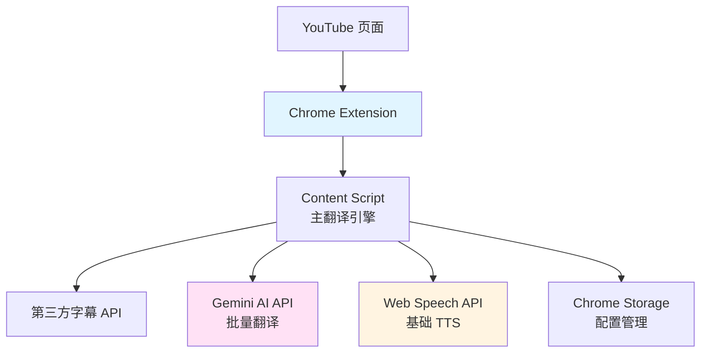
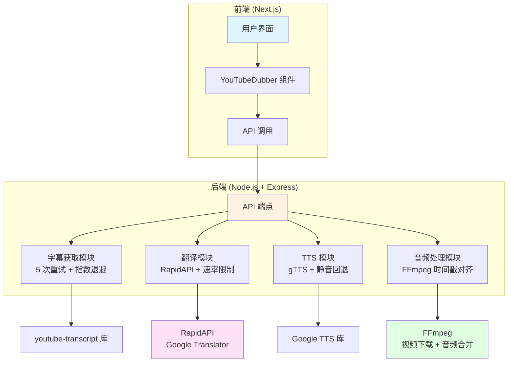
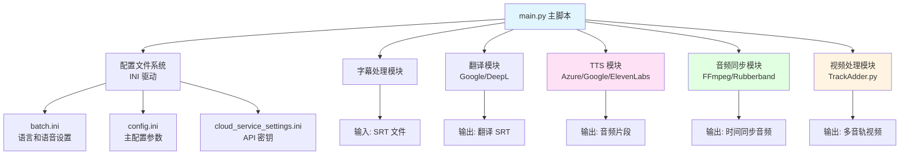

# YouTube 视频翻译配音开源项目对比分析

## 📊 项目概览对比

| 项目 | 作者 | 类型 | Stars | 主要语言 | 核心定位 | 适合场景 |
|------|------|------|---------|----------|----------|
| **YouTube-AI-Translator** | OussamaToumirt | Chrome 扩展 | ~3 | JavaScript | 浏览器扩展 | 学习、快速原型 |
| **DubFlow** | Badri467 | 全栈应用 | - | Node.js + Python | 个人项目、演示 |
| **Auto-Synced-Translated-Dubs** | ThioJoe | Python 脚本 | 高星项目 | Python | 专业生产、批量处理 |

> [!info] 重要说明
> 三个项目采用了不同的技术路线和架构模式，各有优劣。**Auto-Synced-Translated-Dubs** 最成熟，**DubFlow** 最现代，**YouTube-AI-Translator** 最简单。

---

## 1️⃣ YouTube-AI-Translator---Dubbing

### 项目定位
纯浏览器扩展，专注于 YouTube 视频的实时翻译和配音，无需后端服务器。

### 🏗️ 技术栈

| 组件 | 技术 | 说明 |
|--------|------|------|
| **平台** | Chrome Extension (Manifest V3) | 最新扩展标准 |
| **语言** | Vanilla JavaScript | 无构建工具，纯原生 JS |
| **AI 模型** | Google Gemini 1.5 Flash | 翻译引擎 |
| **字幕来源** | 第三方 API | `transcription.hottestdigital.com` |
| **TTS** | Web Speech API | 浏览器原生语音合成 |
| **存储** | Chrome Storage API | `chrome.storage.sync` |

### 📐 架构设计



### 💡 核心实现亮点

#### 1. 智能批处理翻译
```javascript
// 支持 40 条/批次，避免 token 限制
const MAX_SEGMENTS_PER_CHUNK = 40;

if (segments.length <= MAX_SEGMENTS_PER_CHUNK) {
  return await translateChunk(segments, targetLang, url, 0, 1);
} else {
  // 分块处理大视频
  const chunks = [];
  for (let i = 0; i < segments.length; i += MAX_SEGMENTS_PER_CHUNK) {
    chunks.push(segments.slice(i, i + MAX_SEGMENTS_PER_CHUNK));
  }

  // 批次间延迟，避免配额限制
  for (let chunkIndex = 0; chunkIndex < chunks.length; chunkIndex++) {
    const chunk = chunks[chunkIndex];
    await translateChunk(chunk, targetLang, url, chunkIndex + 1, chunks.length);
    if (chunkIndex < chunks.length - 1) {
      await sleep(1000); // 速率限制
    }
  }
}
```

#### 2. 健壮的 JSON 解析
```javascript
// 处理多种 Gemini 响应格式
let jsonText = responseText;

// 移除 markdown 代码块
if (jsonText.includes('```json')) {
  jsonText = jsonText.split('```json')[1].split('```')[0].trim();
} else if (jsonText.includes('```')) {
  jsonText = jsonText.split('```')[1].split('```')[0].trim();
}

// 找到 JSON 数组边界
const firstBracket = jsonText.indexOf('[');
const lastBracket = jsonText.lastIndexOf(']');

if (firstBracket !== -1 && lastBracket !== -1 && lastBracket > firstBracket) {
  jsonText = jsonText.substring(firstBracket, lastBracket + 1);
}

try {
  const translatedSegments = JSON.parse(jsonText);
  // 合并原始数据
} catch (parseError) {
  // 回退到原始文本
}
```

#### 3. CORS 双重获取策略
```javascript
// 直接获取失败时，通过后台脚本重试
if (error.name === 'TypeError' || error.message.includes('CORS')) {
  try {
    const response = await chrome.runtime.sendMessage({
      action: 'fetchTranscription',
      videoId: videoId
    });
    return processSegments(response.segments);
  } catch (bgError) {
    throw new Error('无法获取字幕');
  }
}
```

### ✅ 优势

| 优势 | 说明 |
|--------|------|
| **零依赖** | 纯 JavaScript，无 npm 包，无构建步骤 |
| **易于部署** | 加载未打包扩展即可使用 |
| **智能批处理** | 自动分块避免 token 限制，速率限制保护 |
| **健壮错误处理** | 多重回退机制，JSON 格式容错 |
| **现代 UI** | 渐变设计，实时进度更新 |
| **低延迟** | 完全在浏览器中运行，无需服务器往返 |

### ❌ 劣势

| 劣势 | 影响 |
|--------|------|
| **TTS 功能不完整** | 仅基础 Web Speech API，配音是占位符功能 |
| **依赖第三方字幕 API** | API 可能失效或变更 |
| **无音频轨道混合** | 不能真正替换视频音频 |
| **无离线支持** | 完全依赖网络连接 |
| **无字幕导出** | 不能下载 SRT/VTT 文件 |
| **无播放列表支持** | 只能处理单个视频 |
| **无语音克隆** | 使用通用 TTS 声音 |

### 📊 技术评分

| 维度 | 评分 | 说明 |
|--------|------|------|
| **易用性** | ⭐⭐⭐⭐⭐⭐ | 最简单，零配置 |
| **翻译质量** | ⭐⭐⭐⭐ | Gemini AI 质量不错 |
| **音频质量** | ⭐⭐ | Web Speech API 声音一般 |
| **音频同步** | ⭐⭐ | 仅字幕同步，配音未实现 |
| **扩展性** | ⭐⭐ | 受限于浏览器扩展 |
| **代码质量** | ⭐⭐⭐⭐ | 结构清晰，注释详细 |

---

## 2️⃣ DubFlow

### 项目定位
全栈 Web 应用，前后端分离，提供完整的 YouTube 视频配音服务。

### 🏗️ 技术栈

#### 后端技术栈

| 组件 | 技术 | 版本 | 用途 |
|--------|--------|------|
| **运行时** | Node.js | v18+ |
| **框架** | Express.js | ^5.1.0 |
| **字幕获取** | youtube-transcript | ^1.2.1 |
| **字幕获取（备选）** | youtube-captions-scraper | ^2.0.3 |
| **视频下载** | yt-dlp | 外部依赖 |
| **TTS** | gTTS | ^0.2.1（Google TTS，非云服务） |
| **视频处理** | fluent-ffmpeg | ^2.1.3 |
| **HTTP 客户端** | axios | ^1.9.0 |
| **翻译** | RapidAPI | Google Translator |

#### 前端技术栈

| 组件 | 技术 | 版本 | 用途 |
|--------|--------|------|
| **框架** | Next.js | ^14.0.0（App Router） |
| **UI 库** | React | ^18.3.1 |
| **类型安全** | TypeScript | ^5 |
| **样式** | Tailwind CSS | ^3.4.17 |
| **图标** | Lucide React | ^0.292.0 |

### 📐 架构设计



### 💡 核心实现亮点

#### 1. 多策略字幕获取（指数退避重试）
```javascript
// 重试配置
const RETRY_CONFIG = {
  maxRetries: 5,
  baseDelay: 1000,    // 1 秒
  maxDelay: 10000,    // 10 秒
  backoffFactor: 2
};

// 策略 1：尝试不同语言代码
const languageCodes = ['en', 'en-US', 'en-GB', null]; // null 表示自动检测

for (let attempt = 0; attempt < maxRetries; attempt++) {
  for (const langCode of languageCodes) {
    try {
      const config = langCode ? { lang: langCode } : {};
      const transcript = await YoutubeTranscript.fetchTranscript(videoId, config);

      if (transcript && transcript.length > 0) {
        return transcript.map(item => ({
          text: item.text,
          start: parseFloat(item.offset) / 1000,  // 转换为秒
          duration: parseFloat(item.duration) / 1000
        }));
      }
    } catch (error) {
      // 继续尝试...
    }
  }
  // 指数退避：1s, 2s, 4s, 8s, 10s（封顶）
  const delay = RETRY_CONFIG.baseDelay * Math.pow(RETRY_CONFIG.backoffFactor, attempt);
  await sleep(Math.min(delay, RETRY_CONFIG.maxDelay));
}
```

#### 2. 精细的速率限制保护
```javascript
const batchTranslateText = async (textArray, targetLanguage, batchSize = 10) => {
  const results = [];

  for (let i = 0; i < textArray.length; i += batchSize) {
    const batch = textArray.slice(i, i + batchSize);

    // 处理每个项目以进行速率限制
    for (const item of batch) {
      const options = {
        method: 'POST',
        url: 'https://google-translator9.p.rapidapi.com/v2',
        headers: {
          'x-rapidapi-key': RAPIDAPI_KEY,
          'x-rapidapi-host': 'google-translator9.p.rapidapi.com',
          'Content-Type': 'application/json'
        },
        data: {
          q: item.text.trim(),
          source: 'auto',  // 自动检测源语言
          target: targetLangCode,
          format: 'text'
        }
      };

      const response = await axios.request(options);
      batchResults.push({ ...item, translatedText });

      // 200ms 请求间延迟
      await new Promise(resolve => setTimeout(resolve, 200));
    }

    // 批次间随机延迟（3-5 秒）
    if (i + batchSize < textArray.length) {
      const delayTime = Math.random() * 2000 + 3000;
      await new Promise(resolve => setTimeout(resolve, delayTime));
    }
  }

  return results;
};
```

#### 3. 优雅降级（静音回退）
```javascript
// TTS 失败时创建静音音频
try {
  await generateAudio(item.translatedText, targetLanguage, audioPath);
  audioClips.push({ path: audioPath, start: item.start, duration: item.duration });
} catch (audioError) {
  // 如果 TTS 失败，创建匹配原始时长的静音
  const silenceDuration = Math.max(item.duration, 0.5);
  const silencePath = path.join(tempDir, `silence_${i}.wav`);
  await createSilence(silenceDuration, silencePath);
  audioClips.push({ path: silencePath, start: item.start, duration: silenceDuration });
}
```

#### 4. 基于 FFmpeg 的静音生成
```javascript
const createSilence = async (duration, outputPath) => {
  return new Promise((resolve, reject) => {
    const safeDuration = Math.max(0.1, Math.min(duration, 3600));

    ffmpeg()
      .input('anullsrc=channel_layout=stereo:sample_rate=22050')
      .inputFormat('lavfi')
      .duration(safeDuration)
      .audioCodec('pcm_s16le')
      .output(outputPath)
      .on('end', () => resolve(outputPath))
      .on('error', reject)
      .run();
  });
};
```

#### 5. 时间戳音频对齐
```javascript
// 创建对齐的音频轨道
console.log('⏰ 使用时间戳对齐音频...');
const alignedAudioFiles = [];

// 按开始时间排序片段
audioClips.sort((a, b) => a.start - b.start);

let currentTime = 0;

for (let i = 0; i < audioClips.length; i++) {
  const clip = audioClips[i];

  // 如果原始时间戳之间有空隙，添加静音
  if (clip.start > currentTime) {
    const silenceDuration = clip.start - currentTime;
    if (silenceDuration > 0.1) {  // 只在空隙有意义时添加
      const silencePath = path.join(tempDir, `gap_${i}_${Date.now()}.wav`);
      await createSilence(silenceDuration, silencePath);
      alignedAudioFiles.push(silencePath);
    }
  }

  alignedAudioFiles.push(clip.path);
  currentTime = clip.start + clip.duration;
}
```

### ✅ 优势

| 优势 | 说明 |
|--------|------|
| **全栈架构** | 前后端分离，易于扩展和维护 |
| **现代技术栈** | Next.js + React + TypeScript |
| **健壮的字幕获取** | 多重试机制，指数退避，多种备用策略 |
| **精细的速率限制** | 200ms 请求延迟 + 3-5秒批延迟，避免 API 封禁 |
| **优雅降级** | TTS 失败自动静音回退，翻译失败用原文回退 |
| **现代 UI** | 渐变设计，玻璃态效果，响应式布局 |
| **完整的错误处理** | 详细错误消息，有用的用户建议 |
| **FFmpeg 集成** | 真正的视频音频处理和合并 |

### ❌ 劣势

| 劣势 | 影响 |
|--------|------|
| **性能问题** | 顺序处理（无并行化），长视频很慢（150+ 片段） |
| **外部依赖繁重** | 需要 FFmpeg、yt-dlp、RapidAPI 订阅 |
| **TTS 质量限制** | 使用 gTTS 库（非 Google Cloud TTS），声音质量一般 |
| **同步精度不足** | 无时间伸缩（time-stretching），音频长度可能不匹配 |
| **缺少关键功能** | 无缓存、无队列、无实时进度、无视频预览 |
| **代码质量问题** | 单体大文件（server.js 743 行）、无测试、后端无 TypeScript |
| **部署复杂** | 无 Docker、无 CI/CD、需要手动安装系统依赖 |

### 📊 技术评分

| 维度 | 评分 | 说明 |
|--------|------|------|
| **易用性** | ⭐⭐⭐ | 需要配置后端和系统依赖 |
| **翻译质量** | ⭐⭐⭐ | RapidAPI 依赖第三方质量 |
| **音频质量** | ⭐⭐ | gTTS 质量一般 |
| **音频同步** | ⭐⭐⭐ | 时间戳对齐，但无伸缩 |
| **扩展性** | ⭐⭐⭐⭐ | 全栈架构，可扩展 |
| **代码质量** | ⭐⭐⭐ | 现代技术，但缺少测试 |

---

## 3️⃣ Auto-Synced-Translated-Dubs

### 项目定位
成熟的 Python 脚本工具，专为批量视频配音设计，由知名 YouTuber ThioJoe 开发。

### 🏗️ 技术栈

| 组件 | 技术 | 版本 | 说明 |
|--------|--------|------|
| **语言** | Python | 3.9+ |
| **框架** | 纯 Python | 无框架，模块化架构 |
| **字幕格式** | SRT | 标准字幕格式 |
| **翻译服务** | Google Cloud / DeepL | 可配置 |
| **TTS 服务** | Azure / Google Cloud / Eleven Labs | 神经语音 |
| **音频处理** | FFmpeg / Rubberband | 可选 |
| **配置** | INI 文件 | `config.ini`, `batch.ini`, `cloud_service_settings.ini` |

### 📐 架构设计



### 💡 核心实现亮点

#### 1. 两段式语音合成（关键特性）
```python
# 第一步：合成原始音频，获取实际时长
first_pass = synthesize(translated_text)
actual_duration = get_duration(first_pass)

# 第二步：根据原时长调整语速重新合成
target_duration = original_duration
rate = actual_duration / target_duration
final_audio = synthesize_with_rate(translated_text, rate)

# 或者：使用 Azure TTS 直接指定时长
def synthesize_with_duration(text, duration, voice='zh-CN-XiaoxiaoNeural'):
    ssml = f"""
    <speak version="1.0" xmlns="http://www.w3.org/2001/10/synthesis">
      <voice name="{voice}">
        <prosody duration="{duration}">{text}</prosody>
      </voice>
    </speak>
    """
    return synthesize(ssml)
```

#### 2. 音频伸缩调整（FFmpeg/Rubberband）
```python
# 使用 FFmpeg 伸缩音频以匹配时长
def stretch_audio_to_duration(input_path, output_path, target_duration):
    ffmpeg_cmd = [
        'ffmpeg',
        '-i', input_path,
        '-af', f'atempo={calculate_tempo_ratio(input_path, target_duration)}',
        '-t', str(target_duration),
        '-y',
        output_path
    ]

    subprocess.run(ffmpeg_cmd, check=True)

# 或使用 Rubberband（推荐）
def stretch_with_rubberband(input_path, output_path, target_duration):
    rubberband_cmd = [
        'rubberband-r3',
        '--time', str(target_duration),
        '--pitch', '1.0',  # 保持音调
        input_path,
        output_path
    ]

    subprocess.run(rubberband_cmd, check=True)
```

#### 3. 批量多语言处理
```ini
# batch.ini 配置文件
[SETTINGS]
original_video_path = "input.mp4"
original_subtitle_path = "input.srt"
enabled_languages = 1,2,3

[LANGUAGE-1]
name = "Chinese (Simplified)"
language_code = "zh-CN"
voice = "zh-CN-XiaoxiaoNeural"
translation_service = "google"
tts_service = "azure"

[LANGUAGE-2]
name = "Japanese"
language_code = "ja-JP"
voice = "ja-JP-NanamiNeural"
translation_service = "deepl"
tts_service = "elevenlabs"

[LANGUAGE-3]
name = "Spanish"
language_code = "es-ES"
voice = "es-ES-ElviraNeural"
translation_service = "google"
tts_service = "google"
```

#### 4. 自定义翻译列表和发音
```ini
# config.ini 中的高级设置
[DONT_TRANSLATE]
; 这些短语不会被翻译
Hello World
Lorem Ipsum
Technical Term

[MANUAL_TRANSLATIONS]
; 手动翻译特定短语
"How are you?" = "¿Cómo estás?"
"Thank you" = "Gracias"

[PRONUNCIATION]
; 自定义发音
cache = "kash"
repo = "ree-poh"
```

#### 5. 完整的音频轨道管理
```python
# TrackAdder.py - 添加多语言音轨
def add_audio_tracks(video_path, audio_tracks):
    """
    为视频添加多个音轨

    Args:
        video_path: 原始视频路径
        audio_tracks: 音轨字典 {language_code: audio_path}
    """
    cmd = [
        'ffmpeg',
        '-i', video_path
    ]

    # 添加所有音轨
    for lang_code, audio_path in audio_tracks.items():
        cmd.extend(['-i', audio_path])

    # 映射视频和所有音轨
    cmd.extend(['-map', '0:v'])  # 视频
    for i in range(len(audio_tracks)):
        cmd.extend(['-map', f'{i+1}:a'])

    # 设置音轨语言标签
    metadata_cmd = []
    for i, (lang_code, _) in enumerate(audio_tracks.items()):
        metadata_cmd.extend([
            '-metadata:s:a:{i}', f'language={lang_code}',
            '-metadata:s:a:{i}', f'title={lang_code.upper()}'
        ])

    cmd.extend(metadata_cmd)
    cmd.extend(['-c:v', 'copy', '-c:a', 'aac', 'output.mp4'])

    subprocess.run(cmd, check=True)
```

### ✅ 优势

| 优势 | 说明 |
|--------|------|
| **最成熟的实现** | 由 ThioJoe 维护，经过实际项目验证 |
| **精确的音频同步** | 两段式合成或直接时长指定，完美口型同步 |
| **支持多种 TTS** | Azure（推荐）、Google Cloud、ElevenLabs |
| **灵活的配置** | INI 文件系统，支持批量处理、自定义翻译 |
| **批量处理** | 一次运行处理多个语言 |
| **字幕文件生成** | 自动生成翻译的 SRT 文件 |
| **多音轨支持** | 可为单个视频添加多个语言音轨 |
| **音轨管理工具** | 包含 TrackAdder.py 等实用脚本 |
| **YouTube API 集成** | 标题/描述翻译、字幕上传/删除 |
| **详细的文档** | Wiki 页面、示例、设置指南 |

### ❌ 劣势

| 劣势 | 影响 |
|--------|------|
| **需要 SRT 输入** | 不直接支持 YouTube URL，需预先准备字幕 |
| **学习曲线陡峭** | INI 配置复杂，需要理解多个文件 |
| **Python 依赖** | 需要安装 Python 和相关库 |
| **无 Web 界面** | 纯命令行工具，不友好 |
| **API 成本** | Azure/Google Cloud/ElevenLabs 需要付费 |
| **无实时预览** | 必须完成整个流程才能查看结果 |
| **安装复杂** | FFmpeg/Rubberband 需要单独安装 |

### 📊 技术评分

| 维度 | 评分 | 说明 |
|--------|------|------|
| **易用性** | ⭐⭐ | 需要配置多个 INI 文件 |
| **翻译质量** | ⭐⭐⭐⭐⭐ | Google Cloud / DeepL 质量优秀 |
| **音频质量** | ⭐⭐⭐⭐⭐⭐ | Azure/ElevenLabs 神经语音 |
| **音频同步** | ⭐⭐⭐⭐⭐⭐ | 两段式合成，完美同步 |
| **扩展性** | ⭐⭐⭐ | INI 配置，批量处理 |
| **代码质量** | ⭐⭐⭐⭐⭐ | 成熟稳定，文档完善 |

---

## 🔄 综合对比分析

### 功能对比表

| 功能 | YouTube-AI-Translator | DubFlow | Auto-Synced-Translated-Dubs |
|------|---------------------|----------|---------------------------|
| **实时翻译** | ✅ 浏览器端 | ❌ 需要后端 | ❌ 需要预先准备 |
| **YouTube URL 支持** | ✅ 直接输入 URL | ✅ 自动提取 | ❌ 需要 SRT 文件 |
| **TTS 集成** | ⚠️ 基础 Web Speech | ⚠️ gTTS 库 | ✅ Azure/Google/ElevenLabs |
| **音频同步** | ⚠️ 仅字幕同步 | ⚠️ 时间戳对齐 | ✅ 两段式/时长指定 |
| **多语言批处理** | ❌ 单语言 | ❌ 单语言 | ✅ 批量处理 |
| **字幕导出** | ❌ | ❌ | ✅ 生成 SRT |
| **多音轨视频** | ❌ | ❌ | ✅ 支持 |
| **自定义翻译** | ❌ | ❌ | ✅ 支持手动翻译表 |
| **视频预览** | ⚠️ 仅字幕 | ✅ 有播放器 | ❌ 命令行 |
| **UI 界面** | ✅ 现代扩展 UI | ✅ Next.js Web UI | ❌ 命令行 |
| **API 密钥管理** | ✅ Chrome Storage | ⚠️ 环境变量 | ✅ INI 文件 |
| **离线使用** | ❌ | ❌ | ❌ |

### 技术栈对比表

| 维度 | YouTube-AI-Translator | DubFlow | Auto-Synced-Translated-Dubs |
|--------|---------------------|----------|---------------------------|
| **前端** | Vanilla JS | Next.js + React | 无（CLI） |
| **后端** | 无 | Node.js + Express | Python |
| **数据库** | Chrome Storage | 无 | 无（文件系统） |
| **字幕源** | 第三方 API | youtube-transcript | SRT 文件 |
| **翻译引擎** | Gemini 1.5 Flash | RapidAPI Google | Google Cloud / DeepL |
| **TTS 服务** | Web Speech API | gTTS 库 | Azure / Google / ElevenLabs |
| **音频处理** | 无 | FFmpeg | FFmpeg / Rubberband |
| **部署方式** | Chrome 扩展 | 全栈 Web 应用 | Python 脚本 |
| **系统依赖** | 无 | FFmpeg, yt-dlp | FFmpeg, Rubberband |

### 性能对比

| 性能指标 | YouTube-AI-Translator | DubFlow | Auto-Synced-Translated-Dubs |
|----------|---------------------|----------|---------------------------|
| **处理速度** | ⚡⚡⚡ 最快（浏览器端） | ⚡⚡ 中等（顺序处理） | ⚡ 慢（两段式合成） |
| **内存占用** | 低（浏览器内存） | 中（Node.js） | 高（Python + FFmpeg） |
| **网络请求** | 少（Gemini API） | 多（字幕 + 翻译 + TTS） | 多（翻译 + TTS） |
| **实时性** | ✅ 实时同步 | ❌ 后台处理 | ❌ 批量处理 |
| **可扩展性** | ⭐⭐ 受浏览器限制 | ⭐⭐⭐⭐ 全栈可扩展 | ⭐⭐⭐⭐ 脚本可扩展 |

---

## 🎯 适用场景推荐

### YouTube-AI-Translator

> [!success] 最适合：
> - **学习项目**：理解 Chrome 扩展开发、AI 集成
> - **快速原型**：验证想法，无需后端
> - **个人使用**：临时翻译视频，快速查看
> - **浏览器开发**：研究 Manifest V3 实现

> [!failure] 不适合：
> - **生产环境**：TTS 功能不完整
> - **批量处理**：无批量支持
> - **高质量输出**：Web Speech API 声音一般

### DubFlow

> [!success] 最适合：
> - **Web 应用开发**：学习 Next.js + Express 全栈
> - **个人项目**：搭建完整的配音服务
> - **演示展示**：现代 UI + 后端处理
> - **中间层集成**：作为更大系统的组件

> [!failure] 不适合：
> - **生产环境**：缺少关键功能（缓存、队列）
> - **高性能需求**：顺序处理太慢
> - **企业部署**：无 Docker、无 CI/CD

### Auto-Synced-Translated-Dubs

> [!success] 最适合：
> - **专业内容创作者**：批量翻译配音视频
> - **高质量要求**：Azure/ElevenLabs 神经语音
> - **生产环境**：成熟稳定，经过验证
> - **多语言发布**：批量处理多语言版本
> - **YouTube 内容创作**：与 YouTube API 深度集成

> [!failure] 不适合：
> - **快速预览**：无实时预览
> - **非技术用户**：配置复杂
> - **在线服务**：无 Web 界面

---

## 🚀 推荐实施路线图

### 场景 1：快速原型（1-2 周）

**基础方案**：YouTube-AI-Translator + 改进
- [ ] 添加高质量 TTS（Azure/ElevenLabs）
- [ ] 实现音频轨道混合（FFmpeg）
- [ ] 添加字幕导出（SRT/VTT）
- [ ] 支持播放列表

**优势**：快速部署，零服务器成本
**成本**：$0（免费）→ $22/月（TTS）

### 场景 2：个人项目（2-4 周）

**全栈方案**：DubFlow + 优化
- [ ] 添加并行处理（Promise.all）
- [ ] 集成高质量 TTS（Azure）
- [ ] 实现时间伸缩（Rubberband）
- [ ] 添加缓存层（Redis/文件）
- [ ] 添加 Docker 部署

**优势**：现代技术栈，可扩展
**成本**：$15-52/月（API）

### 场景 3：专业生产（1-2 月）

**成熟方案**：Auto-Synced-Translated-Dubs + 封装
- [ ] 创建 Web UI（React/Vue）
- [ ] 添加实时进度（WebSocket）
- [ ] 集成 YouTube 字幕提取
- [ ] 添加视频预览器
- [ ] 部署到云服务（AWS/GCP）

**优势**：最成熟，最高质量
**成本**：$52-100/月（API + 服务器）

---

## 📚 参考资源

### 项目链接
- [YouTube-AI-Translator---Dubbing](https://github.com/OussamaToumirt/YouTube-AI-Translator---Dubbing)
- [DubFlow](https://github.com/Badri467/DubFlow)
- [Auto-Synced-Translated-Dubs](https://github.com/ThioJoe/Auto-Synced-Translated-Dubs)

### 相关文档
- [YouTube 视频实时配音技术方案](./YouTube视频实时配音技术方案.md)
- [Gemini API 文档](https://ai.google.dev/gemini-api/docs)
- [Azure TTS 文档](https://docs.microsoft.com/azure/cognitive-services/speech-service/)
- [DeepL API 文档](https://www.deepl.com/docs-api)

---

## 💡 最佳实践建议

### 1. 字幕获取
- **优先使用官方 API**：YouTube Data API v3（有配额限制）
- **备用方案**：第三方库（youtube-transcript）
- **注意**：避免过度请求，实现速率限制

### 2. 翻译选择
- **高质量**：DeepL（质量最佳）或 Google Cloud
- **成本敏感**：Google Cloud（免费额度更大）
- **批量处理**：避免单条请求，合并翻译

### 3. TTS 选择
- **最佳质量**：Azure TTS（支持时长指定）或 ElevenLabs
- **平衡选择**：Google Cloud TTS（支持多语言）
- **免费方案**：Web Speech API（浏览器内置）

### 4. 音频同步
- **首选**：Azure TTS 直接指定时长（无失真）
- **备选**：两段式合成（先测速再调整）
- **不得已**：FFmpeg/Rubberband 伸缩（可能有失真）

### 5. 部署考虑
- **Chrome 扩展**：Manifest V3，Service Worker
- **全栈应用**：Docker + CI/CD
- **脚本工具**：PyPI 打包，pip 安装

---

%% 本文档基于三个项目的代码分析创建于 2026-01-09 %%
