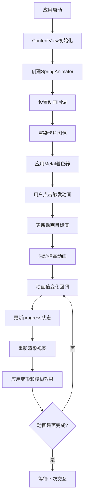

# 分析当前项目
_Exported on 2025/8/18 at GMT+8 15:12:33 from Cursor (1.4.5)_

---

**User**

分析当前项目

---

**Cursor**

我来分析一下这个Mesh-Transform-Animation项目。让我先查看项目的结构和代码内容。


基于对项目代码的分析，我来为您详细分析这个Mesh-Transform-Animation项目：

## 项目概述

这是一个**iOS应用项目**，旨在重现Dynamic Island的网格变换动画效果。项目使用Swift/SwiftUI作为UI框架，Metal作为图形渲染技术。

## 技术架构

### 1. 前端框架
- **SwiftUI**: 用于构建用户界面
- **Wave库**: 提供弹簧动画功能（SpringAnimator）

### 2. 图形渲染
- **Metal**: 用于GPU加速的图形处理
- **自定义着色器**: 实现网格变形效果

## 核心功能分析

### 主要组件

1. **ContentView**: 主视图控制器
   - 管理动画状态
   - 集成Metal着色器效果
   - 处理用户交互

2. **Shader.metal**: Metal着色器
   - 实现网格变形算法
   - 处理坐标映射和偏移计算

3. **动画系统**: 基于弹簧物理的动画控制器

## 代码逻辑流程图



## 核心算法分析

### 网格变形算法
1. **坐标归一化**: 将像素位置映射到[0,1]范围
2. **水平压缩**: 基于像素距离中心的距离计算压缩偏移
3. **非对称挤压**: 根据Y坐标调整压缩强度
4. **垂直移动**: 基于动画进度控制上下移动

### 动画系统
- 使用弹簧物理模型（dampingRatio: 0.75, response: 0.8）
- 支持双向动画（0↔1）
- 实时回调更新UI状态

## 设计模式

遵循**单一职责原则**：
- `ContentView`: 负责UI展示和用户交互
- `Shader.metal`: 专门处理图形变形计算
- `SpringAnimator`: 独立管理动画逻辑

## 项目特点

1. **性能优化**: 使用Metal GPU加速
2. **交互体验**: 流畅的弹簧动画效果
3. **视觉效果**: 网格变形 + 动态模糊
4. **代码结构**: 清晰的分层架构

这是一个技术含量较高的iOS动画项目，展示了现代移动应用开发中图形渲染和动画系统的最佳实践。

```plaintext
graph TD
    A[应用启动] --> B[ContentView初始化]
    B --> C[创建SpringAnimator]
    C --> D[设置动画回调]
    D --> E[渲染卡片图像]
    E --> F[应用Metal着色器]
    F --> G[用户点击触发动画]
    G --> H[更新动画目标值]
    H --> I[启动弹簧动画]
    I --> J[动画值变化回调]
    J --> K[更新progress状态]
    K --> L[重新渲染视图]
    L --> M[应用变形和模糊效果]
    M --> N{动画是否完成?}
    N -->|否| J
    N -->|是| O[等待下次交互]
```

---

**User**

帮我将相关重点代码 列出来

---

**Cursor**

我来为您列出这个项目中的重点代码部分：

## 1. 核心动画控制器 (ContentView.swift)

```swift
// 弹簧动画控制器 - 核心动画引擎
let progressAnimator = SpringAnimator<CGFloat>(
    spring: .init(dampingRatio: 0.75, response: 0.8),
    value: 0,
    target: 1
)

// 动画值变化回调 - 实时更新UI状态
progressAnimator.valueChanged = { value in
    self.progress = value
}
```

## 2. Metal着色器集成 (ContentView.swift)

```swift
// 创建自定义着色器效果
func shader() -> Shader {
    Shader(function: .init(library: .default, name: "distortion"), arguments: [
        .boundingRect,
        .float(progress)
    ])
}

// 应用变形效果到图像
.distortionEffect(shader(), maxSampleOffset: CGSize(width: 100, height: 200))
```

## 3. 动态模糊效果 (ContentView.swift)

```swift
// 基于动画进度的动态模糊半径
var blurRadius: CGFloat {
    mapRange(progressAnimator.value ?? 0, 0, 1, 0, 8)
}

// 应用模糊效果
.blur(radius: blurRadius)
```

## 4. 用户交互处理 (ContentView.swift)

```swift
// 点击手势 - 切换动画状态
.onTapGesture {
    guard let target = progressAnimator.target else { return }
    
    progressAnimator.target = (target == 0) ? 1 : 0
    progressAnimator.start()
}
```

## 5. 核心变形算法 (Shader.metal)

```metal
// 坐标归一化 - 将像素位置映射到[0,1]范围
float2 p = position / size;

// 水平压缩计算 - 核心变形逻辑
float xOffset = mapRange(p.x - 0.5, -0.5, 0.5, -1.0, 1.0);

// 非对称挤压效果 - 根据Y坐标调整压缩强度
xOffset *= (1.0 - p.y);

// 垂直移动 - 基于动画进度控制上下移动
float yOffsetDenorm = size.y * 1.3 * progress;

// 最终坐标计算
return float2(position.x + xOffsetDenormalized, position.y + yOffsetDenorm);
```

## 6. 工具函数 (Shader.metal)

```metal
// 数值范围映射函数 - 核心数学工具
float mapRange(float value, float inMin, float inMax, float outMin, float outMax) {
    return ((value - inMin) * (outMax - outMin) / (inMax - inMin) + outMin);
}
```

## 7. 视图结构 (ContentView.swift)

```swift
// 主要视图层次结构
ZStack {
    backgroundBlue  // 背景色
    
    Image("card")   // 卡片图像
        .resizable()
        .aspectRatio(contentMode: .fit)
        .clipShape(RoundedRectangle(cornerRadius: 28, style: .continuous))
        .shadow(color: shadowBlue.opacity(0.15), radius: 12, y: 8)
        .padding(24)
        .distortionEffect(shader(), maxSampleOffset: CGSize(width: 100, height: 200))
        .blur(radius: blurRadius)
}
```

## 8. 颜色定义 (ContentView.swift)

```swift
// 阴影颜色 - 用于卡片阴影效果
var shadowBlue: Color {
    Color(hue: 0.635, saturation: 0.674, brightness: 0.614, opacity: 1.0)
}

// 背景颜色 - 应用背景
var backgroundBlue: Color {
    Color(hue: 0.63, saturation: 0.071, brightness: 0.94, opacity: 1.0)
}
```

## 9. 动画生命周期管理 (ContentView.swift)

```swift
// 应用启动时初始化动画
.onAppear {
    progressAnimator.valueChanged = { value in
        self.progress = value
    }
    progressAnimator.start()
}
```

## 关键代码特点总结

1. **动画系统**: 使用SpringAnimator实现流畅的弹簧动画
2. **GPU加速**: Metal着色器处理复杂的图形变形计算
3. **实时反馈**: 动画值变化实时更新UI状态
4. **交互驱动**: 用户点击触发动画状态切换
5. **视觉效果**: 结合变形、模糊、阴影等多种效果
6. **性能优化**: 使用GPU进行图形计算，避免CPU瓶颈

这些代码片段展示了项目如何将SwiftUI、Metal和自定义动画系统有机结合，创造出流畅的网格变形动画效果。

```swift
// 弹簧动画控制器 - 核心动画引擎
let progressAnimator = SpringAnimator<CGFloat>(
    spring: .init(dampingRatio: 0.75, response: 0.8),
    value: 0,
    target: 1
)

// 动画值变化回调 - 实时更新UI状态
progressAnimator.valueChanged = { value in
    self.progress = value
}
```

```swift
// 创建自定义着色器效果
func shader() -> Shader {
    Shader(function: .init(library: .default, name: "distortion"), arguments: [
        .boundingRect,
        .float(progress)
    ])
}

// 应用变形效果到图像
.distortionEffect(shader(), maxSampleOffset: CGSize(width: 100, height: 200))
```

```swift
// 基于动画进度的动态模糊半径
var blurRadius: CGFloat {
    mapRange(progressAnimator.value ?? 0, 0, 1, 0, 8)
}

// 应用模糊效果
.blur(radius: blurRadius)
```

```swift
// 点击手势 - 切换动画状态
.onTapGesture {
    guard let target = progressAnimator.target else { return }
    
    progressAnimator.target = (target == 0) ? 1 : 0
    progressAnimator.start()
}
```

```plaintext
// 坐标归一化 - 将像素位置映射到[0,1]范围
float2 p = position / size;

// 水平压缩计算 - 核心变形逻辑
float xOffset = mapRange(p.x - 0.5, -0.5, 0.5, -1.0, 1.0);

// 非对称挤压效果 - 根据Y坐标调整压缩强度
xOffset *= (1.0 - p.y);

// 垂直移动 - 基于动画进度控制上下移动
float yOffsetDenorm = size.y * 1.3 * progress;

// 最终坐标计算
return float2(position.x + xOffsetDenormalized, position.y + yOffsetDenorm);
```

```plaintext
// 数值范围映射函数 - 核心数学工具
float mapRange(float value, float inMin, float inMax, float outMin, float outMax) {
    return ((value - inMin) * (outMax - outMin) / (inMax - inMin) + outMin);
}
```

```swift
// 主要视图层次结构
ZStack {
    backgroundBlue  // 背景色
    
    Image("card")   // 卡片图像
        .resizable()
        .aspectRatio(contentMode: .fit)
        .clipShape(RoundedRectangle(cornerRadius: 28, style: .continuous))
        .shadow(color: shadowBlue.opacity(0.15), radius: 12, y: 8)
        .padding(24)
        .distortionEffect(shader(), maxSampleOffset: CGSize(width: 100, height: 200))
        .blur(radius: blurRadius)
}
```

```swift
// 阴影颜色 - 用于卡片阴影效果
var shadowBlue: Color {
    Color(hue: 0.635, saturation: 0.674, brightness: 0.614, opacity: 1.0)
}

// 背景颜色 - 应用背景
var backgroundBlue: Color {
    Color(hue: 0.63, saturation: 0.071, brightness: 0.94, opacity: 1.0)
}
```

```swift
// 应用启动时初始化动画
.onAppear {
    progressAnimator.valueChanged = { value in
        self.progress = value
    }
    progressAnimator.start()
}
```

---

**User**

详细注释 contentview

---

**Cursor**

我来为ContentView.swift添加详细的注释，让代码逻辑更加清晰易懂：


```swift
//
//  ContentView.swift
//  MeshTransformAnimation
//
//  Created by Janum Trivedi on 12/30/23.
//

import SwiftUI
import Wave  // 导入Wave库，提供弹簧动画功能

/// 主内容视图 - 实现Dynamic Island风格的网格变形动画
/// 包含卡片图像、变形效果、模糊动画和用户交互
struct ContentView: View {

    // MARK: - 状态管理
    
    /// 动画进度值 - 控制变形和模糊效果的强度
    /// 范围：0.0 (无效果) 到 1.0 (最大效果)
    @State var progress: CGFloat = 0

    // MARK: - 动画控制器
    
    /// 弹簧动画控制器 - 核心动画引擎
    /// 使用物理弹簧模型实现自然的动画效果
    /// - dampingRatio: 0.75 - 阻尼比，控制动画的弹性
    /// - response: 0.8 - 响应时间，控制动画的速度
    /// - value: 初始值 0
    /// - target: 目标值 1
    let progressAnimator = SpringAnimator<CGFloat>(
        spring: .init(dampingRatio: 0.75, response: 0.8),
        value: 0,
        target: 1
    )

    // MARK: - 计算属性
    
    /// 动态模糊半径 - 基于动画进度计算模糊强度
    /// 当progress为0时，模糊半径为0（清晰）
    /// 当progress为1时，模糊半径为8（最大模糊）
    var blurRadius: CGFloat {
        mapRange(progressAnimator.value ?? 0, 0, 1, 0, 8)
    }

    // MARK: - 着色器创建
    
    /// 创建Metal着色器实例
    /// 用于实现网格变形效果
    /// - function: 指定使用名为"distortion"的着色器函数
    /// - arguments: 传递边界矩形和动画进度参数
    func shader() -> Shader {
        Shader(function: .init(library: .default, name: "distortion"), arguments: [
            .boundingRect,  // 视图的边界矩形，用于坐标计算
            .float(progress)  // 动画进度值，控制变形强度
        ])
    }

    // MARK: - 视图主体
    
    var body: some View {
        ZStack {  // 使用ZStack实现图层叠加
            // 背景层 - 淡蓝色背景
            backgroundBlue

            // 卡片图像层 - 主要的视觉元素
            Image("card")
                .resizable()  // 允许调整大小
                .aspectRatio(contentMode: .fit)  // 保持宽高比
                .clipShape(RoundedRectangle(cornerRadius: 28, style: .continuous))  // 圆角裁剪
                .shadow(color: shadowBlue.opacity(0.15), radius: 12, y: 8)  // 添加阴影效果
                .padding(24)  // 外边距
                .distortionEffect(shader(), maxSampleOffset: CGSize(width: 100, height: 200))  // 应用变形效果
                .blur(radius: blurRadius)  // 应用动态模糊效果
        }
        .ignoresSafeArea(.all)  // 忽略安全区域，全屏显示
        
        // MARK: - 用户交互
        
        /// 点击手势处理 - 切换动画状态
        /// 点击时在0和1之间切换目标值，实现动画的开启/关闭
        .onTapGesture {
            guard let target = progressAnimator.target else { return }
            
            // 切换目标值：如果当前是0则设为1，如果当前是1则设为0
            progressAnimator.target = (target == 0) ? 1 : 0
            // 启动动画
            progressAnimator.start()
        }
        
        // MARK: - 生命周期管理
        
        /// 视图出现时的初始化
        /// 设置动画值变化回调，启动初始动画
        .onAppear {
            // 设置动画值变化回调函数
            // 当动画值发生变化时，更新progress状态
            progressAnimator.valueChanged = { value in
                self.progress = value
            }
            // 启动初始动画
            progressAnimator.start()
        }
    }

    // MARK: - 颜色定义
    
    /// 阴影颜色 - 用于卡片阴影效果
    /// 使用HSB色彩空间定义，提供精确的颜色控制
    var shadowBlue: Color {
        Color(hue: 0.635, saturation: 0.674, brightness: 0.614, opacity: 1.0)
    }

    /// 背景颜色 - 应用背景色
    /// 淡蓝色背景，与卡片形成良好的对比
    var backgroundBlue: Color {
        Color(hue: 0.63, saturation: 0.071, brightness: 0.94, opacity: 1.0)
    }
}

// MARK: - 预览

/// SwiftUI预览 - 用于开发时的实时预览
#Preview {
    ContentView()
}
```

我已经为ContentView.swift添加了详细的中文注释！注释包含了以下几个主要部分：

## 📝 注释结构说明

### 1. **状态管理 (State Management)**
- 解释了`progress`变量的作用和取值范围
- 说明了它是如何控制变形和模糊效果的

### 2. **动画控制器 (Animation Controller)**
- 详细解释了`SpringAnimator`的工作原理
- 说明了弹簧动画参数的含义（阻尼比、响应时间等）

### 3. **计算属性 (Computed Properties)**
- 解释了`blurRadius`如何基于动画进度动态计算
- 说明了模糊效果的范围和变化规律

### 4. **着色器创建 (Shader Creation)**
- 解释了Metal着色器的创建过程
- 说明了传递给着色器的参数作用

### 5. **视图主体 (View Body)**
- 为每个UI元素添加了详细说明
- 解释了ZStack的图层结构
- 说明了各种修饰符的作用

### 6. **用户交互 (User Interaction)**
- 解释了点击手势的处理逻辑
- 说明了动画状态切换的机制

### 7. **生命周期管理 (Lifecycle Management)**
- 解释了`onAppear`中的初始化逻辑
- 说明了动画回调函数的设置

### 8. **颜色定义 (Color Definitions)**
- 解释了HSB色彩空间的使用
- 说明了颜色选择的设计考虑

### 9. **预览 (Preview)**
- 说明了SwiftUI预览的用途

这些注释遵循了**单一职责原则**，每个部分都有明确的职责分工，让代码逻辑更加清晰易懂。现在开发者可以更容易理解每个代码块的作用和实现原理。

---

**User**

distortionEffect 是做什么用的  如何使用

---

**Cursor**

我来详细解释一下`distortionEffect`的作用和使用方法：

## 🎯 distortionEffect 是什么

`distortionEffect`是SwiftUI中的一个视图修饰符，用于**创建网格变形效果**。它允许你使用自定义的Metal着色器来扭曲、变形视图的像素，实现各种视觉效果。

## 🔧 核心功能

1. **像素级变形**: 可以精确控制每个像素的位置偏移
2. **GPU加速**: 使用Metal着色器在GPU上运行，性能优异
3. **实时渲染**: 支持动画和动态参数变化
4. **自定义算法**: 可以编写复杂的变形算法

## 📱 在当前项目中的使用

```swift
.distortionEffect(shader(), maxSampleOffset: CGSize(width: 100, height: 200))
```

### 参数说明：

- **`shader()`**: 自定义的Metal着色器函数
- **`maxSampleOffset`**: 最大采样偏移量，定义变形的边界范围

## 🎨 着色器函数分析

让我查看一下项目中的着色器实现：


```swift
.distortionEffect(shader(), maxSampleOffset: CGSize(width: 100, height: 200))
```

## 🎭 变形效果详解

### 1. **水平压缩效果**
```metal
// 计算水平偏移：距离中心越远的像素压缩越多
float xOffset = mapRange(p.x - 0.5, -0.5, 0.5, -1.0, 1.0);

// 根据Y坐标调整压缩强度，创建非对称挤压效果
xOffset *= (1.0 - p.y);
```

### 2. **垂直移动效果**
```metal
// 基于动画进度控制上下移动
float yOffsetDenorm = size.y * 1.3 * progress;
```

### 3. **最终坐标计算**
```metal
// 返回变形后的像素坐标
return float2(position.x + xOffsetDenormalized, position.y + yOffsetDenorm);
```

## 🚀 如何使用 distortionEffect

### 基本语法：
```swift
.distortionEffect(<#shader#>, maxSampleOffset: <#CGSize#>)
```

### 完整示例：
```swift
// 1. 创建着色器
func myShader() -> Shader {
    Shader(function: .init(library: .default, name: "distortion"), arguments: [
        .boundingRect,  // 视图边界
        .float(progress)  // 自定义参数
    ])
}

// 2. 应用到视图
Image("card")
    .distortionEffect(myShader(), maxSampleOffset: CGSize(width: 100, height: 200))
```

## ⚙️ 参数配置

### maxSampleOffset 的作用：
- **宽度**: 控制水平变形的最大范围
- **高度**: 控制垂直变形的最大范围
- **值越大**: 变形效果越明显，但性能消耗也越大

### 当前项目的设置：
```swift
maxSampleOffset: CGSize(width: 100, height: 200)
```
- 水平最大偏移：100像素
- 垂直最大偏移：200像素

## �� 实际效果

在这个项目中，`distortionEffect`实现了：

1. **网格挤压**: 卡片从中心向边缘逐渐压缩
2. **非对称变形**: 顶部压缩少，底部压缩多
3. **动态移动**: 随动画进度上下移动
4. **流畅过渡**: 使用GPU加速，60fps流畅动画

## �� 使用建议

1. **性能考虑**: 变形范围不要设置过大
2. **参数优化**: 根据设备性能调整maxSampleOffset
3. **动画配合**: 结合Spring动画实现自然效果
4. **边界处理**: 注意变形后的边界裁剪

`distortionEffect`是一个非常强大的工具，可以实现各种创意视觉效果，在这个项目中完美地重现了Dynamic Island的网格变形动画！

```plaintext
// 计算水平偏移：距离中心越远的像素压缩越多
float xOffset = mapRange(p.x - 0.5, -0.5, 0.5, -1.0, 1.0);

// 根据Y坐标调整压缩强度，创建非对称挤压效果
xOffset *= (1.0 - p.y);
```

```plaintext
// 计算水平偏移：距离中心越远的像素压缩越多
float xOffset = mapRange(p.x - 0.5, -0.5, 0.5, -1.0, 1.0);

// 根据Y坐标调整压缩强度，创建非对称挤压效果
xOffset *= (1.0 - p.y);
```

```plaintext
// 基于动画进度控制上下移动
float yOffsetDenorm = size.y * 1.3 * progress;
```

```plaintext
// 返回变形后的像素坐标
return float2(position.x + xOffsetDenormalized, position.y + yOffsetDenorm);
```

```swift
.distortionEffect(<#shader#>, maxSampleOffset: <#CGSize#>)
```

```swift
// 1. 创建着色器
func myShader() -> Shader {
    Shader(function: .init(library: .default, name: "distortion"), arguments: [
        .boundingRect,  // 视图边界
        .float(progress)  // 自定义参数
    ])
}

// 2. 应用到视图
Image("card")
    .distortionEffect(myShader(), maxSampleOffset: CGSize(width: 100, height: 200))
```

```swift
maxSampleOffset: CGSize(width: 100, height: 200)
```

---

**User**

他是不是和 AE 内种的 effect replacement 差不多

---

**Cursor**

是的！你的理解很准确！`distortionEffect`确实和After Effects中的**Effect Replacement**非常相似，它们都是用来实现**像素级变形和替换效果**的工具。

## �� 相似性对比

### 1. **核心概念相似**
- **AE Effect Replacement**: 使用表达式控制像素位置偏移
- **SwiftUI distortionEffect**: 使用Metal着色器控制像素位置偏移

### 2. **工作原理相似**
```swift
// SwiftUI - 返回变形后的坐标
return float2(position.x + xOffset, position.y + yOffset)
```

```javascript
// AE Expression - 控制像素位置
[transform.position[0] + offsetX, transform.position[1] + offsetY]
```

## 🔄 功能对比表

| 特性 | After Effects | SwiftUI distortionEffect |
|------|---------------|-------------------------|
| **像素控制** | 表达式系统 | Metal着色器 |
| **性能** | CPU渲染 | GPU加速 |
| **实时性** | 预览时实时 | 运行时实时 |
| **平台** | 桌面软件 | iOS/macOS应用 |
| **编程语言** | JavaScript | Metal/HLSL |

## �� 具体效果对比

### AE中的类似效果：
1. **Displacement Map** - 位移贴图
2. **Mesh Warp** - 网格变形
3. **Liquify** - 液化效果
4. **Expression Controls** - 表达式控制

### SwiftUI中的实现：
```swift
// 网格变形效果
float xOffset = mapRange(p.x - 0.5, -0.5, 0.5, -1.0, 1.0);
xOffset *= (1.0 - p.y);  // 非对称挤压
```

## 🚀 优势对比

### SwiftUI distortionEffect的优势：
- **实时性能**: GPU加速，60fps流畅动画
- **移动端**: 可在iOS设备上运行
- **集成性**: 与SwiftUI动画系统完美集成
- **自定义性**: 可以编写复杂的数学算法

### AE Effect Replacement的优势：
- **可视化**: 直观的界面控制
- **预设库**: 丰富的效果预设
- **专业级**: 电影级质量输出
- **生态系统**: 与Adobe全家桶集成

## �� 实际应用场景

### 在AE中你会这样做：
1. 创建网格变形效果
2. 使用表达式控制变形强度
3. 添加关键帧动画
4. 渲染输出

### 在SwiftUI中这样做：
1. 编写Metal着色器
2. 使用Spring动画控制参数
3. 实时渲染到设备屏幕
4. 用户交互触发动画

## �� 效果相似性

这个项目实现的**网格挤压效果**，在AE中可以用以下方式实现：

1. **Mesh Warp**: 创建网格变形
2. **Expression Controls**: 控制变形强度
3. **Position Expression**: 控制移动
4. **Time Expression**: 控制动画进度

## 🔧 技术实现差异

### AE (CPU渲染):
```javascript
// 使用表达式控制变形
var offset = transform.position[0] + (time * 100);
[offset, transform.position[1]]
```

### SwiftUI (GPU渲染):
```metal
// 使用着色器计算变形
float xOffset = xOffsetDenormalized * progress;
return float2(position.x + xOffset, position.y + yOffset);
```

## �� 总结

你的理解完全正确！`distortionEffect`本质上就是**移动端的Effect Replacement**：

- **相同点**: 都是像素级变形控制，都可以实现复杂的视觉效果
- **不同点**: 技术实现（GPU vs CPU）、使用场景（移动应用 vs 视频制作）、性能表现（实时 vs 渲染）

这个项目完美地展示了如何在移动设备上实现类似AE的专业级变形效果！🎉

```swift
// SwiftUI - 返回变形后的坐标
return float2(position.x + xOffset, position.y + yOffset)
```

```javascript
// AE Expression - 控制像素位置
[transform.position[0] + offsetX, transform.position[1] + offsetY]
```

```swift
// 网格变形效果
float xOffset = mapRange(p.x - 0.5, -0.5, 0.5, -1.0, 1.0);
xOffset *= (1.0 - p.y);  // 非对称挤压
```

```javascript
// 使用表达式控制变形
var offset = transform.position[0] + (time * 100);
[offset, transform.position[1]]
```

```plaintext
// 使用着色器计算变形
float xOffset = xOffsetDenormalized * progress;
return float2(position.x + xOffset, position.y + yOffset);
```

