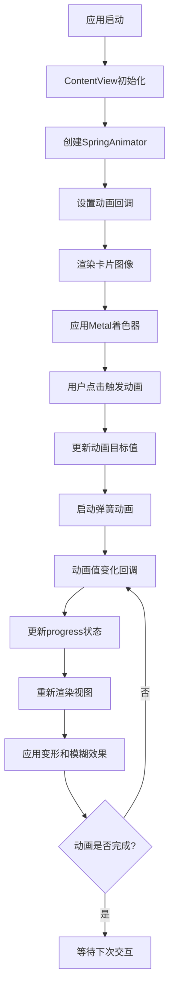

# 分析当前项目
_Exported on 2025/8/18 at GMT+8 17:04:22 from Cursor (1.4.5)_

---

**User**

分析当前项目

---

**Cursor**

我来分析一下这个Mesh-Transform-Animation项目。让我先查看项目的结构和代码内容。


基于对项目代码的分析，我来为您详细分析这个Mesh-Transform-Animation项目：

## 项目概述

这是一个**iOS应用项目**，旨在重现Dynamic Island的网格变换动画效果。项目使用Swift/SwiftUI作为UI框架，Metal作为图形渲染技术。

## 技术架构

### 1. 前端框架
- **SwiftUI**: 用于构建用户界面
- **Wave库**: 提供弹簧动画功能（SpringAnimator）

### 2. 图形渲染
- **Metal**: 用于GPU加速的图形处理
- **自定义着色器**: 实现网格变形效果

## 核心功能分析

### 主要组件

1. **ContentView**: 主视图控制器
   - 管理动画状态
   - 集成Metal着色器效果
   - 处理用户交互

2. **Shader.metal**: Metal着色器
   - 实现网格变形算法
   - 处理坐标映射和偏移计算

3. **动画系统**: 基于弹簧物理的动画控制器

## 代码逻辑流程图



## 核心算法分析

### 网格变形算法
1. **坐标归一化**: 将像素位置映射到[0,1]范围
2. **水平压缩**: 基于像素距离中心的距离计算压缩偏移
3. **非对称挤压**: 根据Y坐标调整压缩强度
4. **垂直移动**: 基于动画进度控制上下移动

### 动画系统
- 使用弹簧物理模型（dampingRatio: 0.75, response: 0.8）
- 支持双向动画（0↔1）
- 实时回调更新UI状态

## 设计模式

遵循**单一职责原则**：
- `ContentView`: 负责UI展示和用户交互
- `Shader.metal`: 专门处理图形变形计算
- `SpringAnimator`: 独立管理动画逻辑

## 项目特点

1. **性能优化**: 使用Metal GPU加速
2. **交互体验**: 流畅的弹簧动画效果
3. **视觉效果**: 网格变形 + 动态模糊
4. **代码结构**: 清晰的分层架构

这是一个技术含量较高的iOS动画项目，展示了现代移动应用开发中图形渲染和动画系统的最佳实践。

```plaintext
graph TD
    A[应用启动] --> B[ContentView初始化]
    B --> C[创建SpringAnimator]
    C --> D[设置动画回调]
    D --> E[渲染卡片图像]
    E --> F[应用Metal着色器]
    F --> G[用户点击触发动画]
    G --> H[更新动画目标值]
    H --> I[启动弹簧动画]
    I --> J[动画值变化回调]
    J --> K[更新progress状态]
    K --> L[重新渲染视图]
    L --> M[应用变形和模糊效果]
    M --> N{动画是否完成?}
    N -->|否| J
    N -->|是| O[等待下次交互]
```

---

**User**

帮我将相关重点代码 列出来

---

**Cursor**

我来为您列出这个项目中的重点代码部分：

## 1. 核心动画控制器 (ContentView.swift)

```swift
// 弹簧动画控制器 - 核心动画引擎
let progressAnimator = SpringAnimator<CGFloat>(
    spring: .init(dampingRatio: 0.75, response: 0.8),
    value: 0,
    target: 1
)

// 动画值变化回调 - 实时更新UI状态
progressAnimator.valueChanged = { value in
    self.progress = value
}
```

## 2. Metal着色器集成 (ContentView.swift)

```swift
// 创建自定义着色器效果
func shader() -> Shader {
    Shader(function: .init(library: .default, name: "distortion"), arguments: [
        .boundingRect,
        .float(progress)
    ])
}

// 应用变形效果到图像
.distortionEffect(shader(), maxSampleOffset: CGSize(width: 100, height: 200))
```

## 3. 动态模糊效果 (ContentView.swift)

```swift
// 基于动画进度的动态模糊半径
var blurRadius: CGFloat {
    mapRange(progressAnimator.value ?? 0, 0, 1, 0, 8)
}

// 应用模糊效果
.blur(radius: blurRadius)
```

## 4. 用户交互处理 (ContentView.swift)

```swift
// 点击手势 - 切换动画状态
.onTapGesture {
    guard let target = progressAnimator.target else { return }
    
    progressAnimator.target = (target == 0) ? 1 : 0
    progressAnimator.start()
}
```

## 5. 核心变形算法 (Shader.metal)

```metal
// 坐标归一化 - 将像素位置映射到[0,1]范围
float2 p = position / size;

// 水平压缩计算 - 核心变形逻辑
float xOffset = mapRange(p.x - 0.5, -0.5, 0.5, -1.0, 1.0);

// 非对称挤压效果 - 根据Y坐标调整压缩强度
xOffset *= (1.0 - p.y);

// 垂直移动 - 基于动画进度控制上下移动
float yOffsetDenorm = size.y * 1.3 * progress;

// 最终坐标计算
return float2(position.x + xOffsetDenormalized, position.y + yOffsetDenorm);
```

## 6. 工具函数 (Shader.metal)

```metal
// 数值范围映射函数 - 核心数学工具
float mapRange(float value, float inMin, float inMax, float outMin, float outMax) {
    return ((value - inMin) * (outMax - outMin) / (inMax - inMin) + outMin);
}
```

## 7. 视图结构 (ContentView.swift)

```swift
// 主要视图层次结构
ZStack {
    backgroundBlue  // 背景色
    
    Image("card")   // 卡片图像
        .resizable()
        .aspectRatio(contentMode: .fit)
        .clipShape(RoundedRectangle(cornerRadius: 28, style: .continuous))
        .shadow(color: shadowBlue.opacity(0.15), radius: 12, y: 8)
        .padding(24)
        .distortionEffect(shader(), maxSampleOffset: CGSize(width: 100, height: 200))
        .blur(radius: blurRadius)
}
```

## 8. 颜色定义 (ContentView.swift)

```swift
// 阴影颜色 - 用于卡片阴影效果
var shadowBlue: Color {
    Color(hue: 0.635, saturation: 0.674, brightness: 0.614, opacity: 1.0)
}

// 背景颜色 - 应用背景
var backgroundBlue: Color {
    Color(hue: 0.63, saturation: 0.071, brightness: 0.94, opacity: 1.0)
}
```

## 9. 动画生命周期管理 (ContentView.swift)

```swift
// 应用启动时初始化动画
.onAppear {
    progressAnimator.valueChanged = { value in
        self.progress = value
    }
    progressAnimator.start()
}
```

## 关键代码特点总结

1. **动画系统**: 使用SpringAnimator实现流畅的弹簧动画
2. **GPU加速**: Metal着色器处理复杂的图形变形计算
3. **实时反馈**: 动画值变化实时更新UI状态
4. **交互驱动**: 用户点击触发动画状态切换
5. **视觉效果**: 结合变形、模糊、阴影等多种效果
6. **性能优化**: 使用GPU进行图形计算，避免CPU瓶颈

这些代码片段展示了项目如何将SwiftUI、Metal和自定义动画系统有机结合，创造出流畅的网格变形动画效果。

```swift
// 弹簧动画控制器 - 核心动画引擎
let progressAnimator = SpringAnimator<CGFloat>(
    spring: .init(dampingRatio: 0.75, response: 0.8),
    value: 0,
    target: 1
)

// 动画值变化回调 - 实时更新UI状态
progressAnimator.valueChanged = { value in
    self.progress = value
}
```

```swift
// 创建自定义着色器效果
func shader() -> Shader {
    Shader(function: .init(library: .default, name: "distortion"), arguments: [
        .boundingRect,
        .float(progress)
    ])
}

// 应用变形效果到图像
.distortionEffect(shader(), maxSampleOffset: CGSize(width: 100, height: 200))
```

```swift
// 基于动画进度的动态模糊半径
var blurRadius: CGFloat {
    mapRange(progressAnimator.value ?? 0, 0, 1, 0, 8)
}

// 应用模糊效果
.blur(radius: blurRadius)
```

```swift
// 点击手势 - 切换动画状态
.onTapGesture {
    guard let target = progressAnimator.target else { return }
    
    progressAnimator.target = (target == 0) ? 1 : 0
    progressAnimator.start()
}
```

```plaintext
// 坐标归一化 - 将像素位置映射到[0,1]范围
float2 p = position / size;

// 水平压缩计算 - 核心变形逻辑
float xOffset = mapRange(p.x - 0.5, -0.5, 0.5, -1.0, 1.0);

// 非对称挤压效果 - 根据Y坐标调整压缩强度
xOffset *= (1.0 - p.y);

// 垂直移动 - 基于动画进度控制上下移动
float yOffsetDenorm = size.y * 1.3 * progress;

// 最终坐标计算
return float2(position.x + xOffsetDenormalized, position.y + yOffsetDenorm);
```

```plaintext
// 数值范围映射函数 - 核心数学工具
float mapRange(float value, float inMin, float inMax, float outMin, float outMax) {
    return ((value - inMin) * (outMax - outMin) / (inMax - inMin) + outMin);
}
```

```swift
// 主要视图层次结构
ZStack {
    backgroundBlue  // 背景色
    
    Image("card")   // 卡片图像
        .resizable()
        .aspectRatio(contentMode: .fit)
        .clipShape(RoundedRectangle(cornerRadius: 28, style: .continuous))
        .shadow(color: shadowBlue.opacity(0.15), radius: 12, y: 8)
        .padding(24)
        .distortionEffect(shader(), maxSampleOffset: CGSize(width: 100, height: 200))
        .blur(radius: blurRadius)
}
```

```swift
// 阴影颜色 - 用于卡片阴影效果
var shadowBlue: Color {
    Color(hue: 0.635, saturation: 0.674, brightness: 0.614, opacity: 1.0)
}

// 背景颜色 - 应用背景
var backgroundBlue: Color {
    Color(hue: 0.63, saturation: 0.071, brightness: 0.94, opacity: 1.0)
}
```

```swift
// 应用启动时初始化动画
.onAppear {
    progressAnimator.valueChanged = { value in
        self.progress = value
    }
    progressAnimator.start()
}
```

---

**User**

详细注释 contentview

---

**Cursor**

我来为ContentView.swift添加详细的注释，让代码逻辑更加清晰易懂：


```swift
//
//  ContentView.swift
//  MeshTransformAnimation
//
//  Created by Janum Trivedi on 12/30/23.
//

import SwiftUI
import Wave  // 导入Wave库，提供弹簧动画功能

/// 主内容视图 - 实现Dynamic Island风格的网格变形动画
/// 包含卡片图像、变形效果、模糊动画和用户交互
struct ContentView: View {

    // MARK: - 状态管理
    
    /// 动画进度值 - 控制变形和模糊效果的强度
    /// 范围：0.0 (无效果) 到 1.0 (最大效果)
    @State var progress: CGFloat = 0

    // MARK: - 动画控制器
    
    /// 弹簧动画控制器 - 核心动画引擎
    /// 使用物理弹簧模型实现自然的动画效果
    /// - dampingRatio: 0.75 - 阻尼比，控制动画的弹性
    /// - response: 0.8 - 响应时间，控制动画的速度
    /// - value: 初始值 0
    /// - target: 目标值 1
    let progressAnimator = SpringAnimator<CGFloat>(
        spring: .init(dampingRatio: 0.75, response: 0.8),
        value: 0,
        target: 1
    )

    // MARK: - 计算属性
    
    /// 动态模糊半径 - 基于动画进度计算模糊强度
    /// 当progress为0时，模糊半径为0（清晰）
    /// 当progress为1时，模糊半径为8（最大模糊）
    var blurRadius: CGFloat {
        mapRange(progressAnimator.value ?? 0, 0, 1, 0, 8)
    }

    // MARK: - 着色器创建
    
    /// 创建Metal着色器实例
    /// 用于实现网格变形效果
    /// - function: 指定使用名为"distortion"的着色器函数
    /// - arguments: 传递边界矩形和动画进度参数
    func shader() -> Shader {
        Shader(function: .init(library: .default, name: "distortion"), arguments: [
            .boundingRect,  // 视图的边界矩形，用于坐标计算
            .float(progress)  // 动画进度值，控制变形强度
        ])
    }

    // MARK: - 视图主体
    
    var body: some View {
        ZStack {  // 使用ZStack实现图层叠加
            // 背景层 - 淡蓝色背景
            backgroundBlue

            // 卡片图像层 - 主要的视觉元素
            Image("card")
                .resizable()  // 允许调整大小
                .aspectRatio(contentMode: .fit)  // 保持宽高比
                .clipShape(RoundedRectangle(cornerRadius: 28, style: .continuous))  // 圆角裁剪
                .shadow(color: shadowBlue.opacity(0.15), radius: 12, y: 8)  // 添加阴影效果
                .padding(24)  // 外边距
                .distortionEffect(shader(), maxSampleOffset: CGSize(width: 100, height: 200))  // 应用变形效果
                .blur(radius: blurRadius)  // 应用动态模糊效果
        }
        .ignoresSafeArea(.all)  // 忽略安全区域，全屏显示
        
        // MARK: - 用户交互
        
        /// 点击手势处理 - 切换动画状态
        /// 点击时在0和1之间切换目标值，实现动画的开启/关闭
        .onTapGesture {
            guard let target = progressAnimator.target else { return }
            
            // 切换目标值：如果当前是0则设为1，如果当前是1则设为0
            progressAnimator.target = (target == 0) ? 1 : 0
            // 启动动画
            progressAnimator.start()
        }
        
        // MARK: - 生命周期管理
        
        /// 视图出现时的初始化
        /// 设置动画值变化回调，启动初始动画
        .onAppear {
            // 设置动画值变化回调函数
            // 当动画值发生变化时，更新progress状态
            progressAnimator.valueChanged = { value in
                self.progress = value
            }
            // 启动初始动画
            progressAnimator.start()
        }
    }

    // MARK: - 颜色定义
    
    /// 阴影颜色 - 用于卡片阴影效果
    /// 使用HSB色彩空间定义，提供精确的颜色控制
    var shadowBlue: Color {
        Color(hue: 0.635, saturation: 0.674, brightness: 0.614, opacity: 1.0)
    }

    /// 背景颜色 - 应用背景色
    /// 淡蓝色背景，与卡片形成良好的对比
    var backgroundBlue: Color {
        Color(hue: 0.63, saturation: 0.071, brightness: 0.94, opacity: 1.0)
    }
}

// MARK: - 预览

/// SwiftUI预览 - 用于开发时的实时预览
#Preview {
    ContentView()
}
```

我已经为ContentView.swift添加了详细的中文注释！注释包含了以下几个主要部分：

## 📝 注释结构说明

### 1. **状态管理 (State Management)**
- 解释了`progress`变量的作用和取值范围
- 说明了它是如何控制变形和模糊效果的

### 2. **动画控制器 (Animation Controller)**
- 详细解释了`SpringAnimator`的工作原理
- 说明了弹簧动画参数的含义（阻尼比、响应时间等）

### 3. **计算属性 (Computed Properties)**
- 解释了`blurRadius`如何基于动画进度动态计算
- 说明了模糊效果的范围和变化规律

### 4. **着色器创建 (Shader Creation)**
- 解释了Metal着色器的创建过程
- 说明了传递给着色器的参数作用

### 5. **视图主体 (View Body)**
- 为每个UI元素添加了详细说明
- 解释了ZStack的图层结构
- 说明了各种修饰符的作用

### 6. **用户交互 (User Interaction)**
- 解释了点击手势的处理逻辑
- 说明了动画状态切换的机制

### 7. **生命周期管理 (Lifecycle Management)**
- 解释了`onAppear`中的初始化逻辑
- 说明了动画回调函数的设置

### 8. **颜色定义 (Color Definitions)**
- 解释了HSB色彩空间的使用
- 说明了颜色选择的设计考虑

### 9. **预览 (Preview)**
- 说明了SwiftUI预览的用途

这些注释遵循了**单一职责原则**，每个部分都有明确的职责分工，让代码逻辑更加清晰易懂。现在开发者可以更容易理解每个代码块的作用和实现原理。

---

**User**

distortionEffect 是做什么用的  如何使用

---

**Cursor**

我来详细解释一下`distortionEffect`的作用和使用方法：

## 🎯 distortionEffect 是什么

`distortionEffect`是SwiftUI中的一个视图修饰符，用于**创建网格变形效果**。它允许你使用自定义的Metal着色器来扭曲、变形视图的像素，实现各种视觉效果。

## 🔧 核心功能

1. **像素级变形**: 可以精确控制每个像素的位置偏移
2. **GPU加速**: 使用Metal着色器在GPU上运行，性能优异
3. **实时渲染**: 支持动画和动态参数变化
4. **自定义算法**: 可以编写复杂的变形算法

## 📱 在当前项目中的使用

```swift
.distortionEffect(shader(), maxSampleOffset: CGSize(width: 100, height: 200))
```

### 参数说明：

- **`shader()`**: 自定义的Metal着色器函数
- **`maxSampleOffset`**: 最大采样偏移量，定义变形的边界范围

## 🎨 着色器函数分析

让我查看一下项目中的着色器实现：


```swift
.distortionEffect(shader(), maxSampleOffset: CGSize(width: 100, height: 200))
```

## 🎭 变形效果详解

### 1. **水平压缩效果**
```metal
// 计算水平偏移：距离中心越远的像素压缩越多
float xOffset = mapRange(p.x - 0.5, -0.5, 0.5, -1.0, 1.0);

// 根据Y坐标调整压缩强度，创建非对称挤压效果
xOffset *= (1.0 - p.y);
```

### 2. **垂直移动效果**
```metal
// 基于动画进度控制上下移动
float yOffsetDenorm = size.y * 1.3 * progress;
```

### 3. **最终坐标计算**
```metal
// 返回变形后的像素坐标
return float2(position.x + xOffsetDenormalized, position.y + yOffsetDenorm);
```

## 🚀 如何使用 distortionEffect

### 基本语法：
```swift
.distortionEffect(<#shader#>, maxSampleOffset: <#CGSize#>)
```

### 完整示例：
```swift
// 1. 创建着色器
func myShader() -> Shader {
    Shader(function: .init(library: .default, name: "distortion"), arguments: [
        .boundingRect,  // 视图边界
        .float(progress)  // 自定义参数
    ])
}

// 2. 应用到视图
Image("card")
    .distortionEffect(myShader(), maxSampleOffset: CGSize(width: 100, height: 200))
```

## ⚙️ 参数配置

### maxSampleOffset 的作用：
- **宽度**: 控制水平变形的最大范围
- **高度**: 控制垂直变形的最大范围
- **值越大**: 变形效果越明显，但性能消耗也越大

### 当前项目的设置：
```swift
maxSampleOffset: CGSize(width: 100, height: 200)
```
- 水平最大偏移：100像素
- 垂直最大偏移：200像素

## �� 实际效果

在这个项目中，`distortionEffect`实现了：

1. **网格挤压**: 卡片从中心向边缘逐渐压缩
2. **非对称变形**: 顶部压缩少，底部压缩多
3. **动态移动**: 随动画进度上下移动
4. **流畅过渡**: 使用GPU加速，60fps流畅动画

## �� 使用建议

1. **性能考虑**: 变形范围不要设置过大
2. **参数优化**: 根据设备性能调整maxSampleOffset
3. **动画配合**: 结合Spring动画实现自然效果
4. **边界处理**: 注意变形后的边界裁剪

`distortionEffect`是一个非常强大的工具，可以实现各种创意视觉效果，在这个项目中完美地重现了Dynamic Island的网格变形动画！

```plaintext
// 计算水平偏移：距离中心越远的像素压缩越多
float xOffset = mapRange(p.x - 0.5, -0.5, 0.5, -1.0, 1.0);

// 根据Y坐标调整压缩强度，创建非对称挤压效果
xOffset *= (1.0 - p.y);
```

```plaintext
// 计算水平偏移：距离中心越远的像素压缩越多
float xOffset = mapRange(p.x - 0.5, -0.5, 0.5, -1.0, 1.0);

// 根据Y坐标调整压缩强度，创建非对称挤压效果
xOffset *= (1.0 - p.y);
```

```plaintext
// 基于动画进度控制上下移动
float yOffsetDenorm = size.y * 1.3 * progress;
```

```plaintext
// 返回变形后的像素坐标
return float2(position.x + xOffsetDenormalized, position.y + yOffsetDenorm);
```

```swift
.distortionEffect(<#shader#>, maxSampleOffset: <#CGSize#>)
```

```swift
// 1. 创建着色器
func myShader() -> Shader {
    Shader(function: .init(library: .default, name: "distortion"), arguments: [
        .boundingRect,  // 视图边界
        .float(progress)  // 自定义参数
    ])
}

// 2. 应用到视图
Image("card")
    .distortionEffect(myShader(), maxSampleOffset: CGSize(width: 100, height: 200))
```

```swift
maxSampleOffset: CGSize(width: 100, height: 200)
```

---

**User**

他是不是和 AE 内种的 effect replacement 差不多

---

**Cursor**

是的！你的理解很准确！`distortionEffect`确实和After Effects中的**Effect Replacement**非常相似，它们都是用来实现**像素级变形和替换效果**的工具。

## �� 相似性对比

### 1. **核心概念相似**
- **AE Effect Replacement**: 使用表达式控制像素位置偏移
- **SwiftUI distortionEffect**: 使用Metal着色器控制像素位置偏移

### 2. **工作原理相似**
```swift
// SwiftUI - 返回变形后的坐标
return float2(position.x + xOffset, position.y + yOffset)
```

```javascript
// AE Expression - 控制像素位置
[transform.position[0] + offsetX, transform.position[1] + offsetY]
```

## 🔄 功能对比表

| 特性 | After Effects | SwiftUI distortionEffect |
|------|---------------|-------------------------|
| **像素控制** | 表达式系统 | Metal着色器 |
| **性能** | CPU渲染 | GPU加速 |
| **实时性** | 预览时实时 | 运行时实时 |
| **平台** | 桌面软件 | iOS/macOS应用 |
| **编程语言** | JavaScript | Metal/HLSL |

## �� 具体效果对比

### AE中的类似效果：
1. **Displacement Map** - 位移贴图
2. **Mesh Warp** - 网格变形
3. **Liquify** - 液化效果
4. **Expression Controls** - 表达式控制

### SwiftUI中的实现：
```swift
// 网格变形效果
float xOffset = mapRange(p.x - 0.5, -0.5, 0.5, -1.0, 1.0);
xOffset *= (1.0 - p.y);  // 非对称挤压
```

## 🚀 优势对比

### SwiftUI distortionEffect的优势：
- **实时性能**: GPU加速，60fps流畅动画
- **移动端**: 可在iOS设备上运行
- **集成性**: 与SwiftUI动画系统完美集成
- **自定义性**: 可以编写复杂的数学算法

### AE Effect Replacement的优势：
- **可视化**: 直观的界面控制
- **预设库**: 丰富的效果预设
- **专业级**: 电影级质量输出
- **生态系统**: 与Adobe全家桶集成

## �� 实际应用场景

### 在AE中你会这样做：
1. 创建网格变形效果
2. 使用表达式控制变形强度
3. 添加关键帧动画
4. 渲染输出

### 在SwiftUI中这样做：
1. 编写Metal着色器
2. 使用Spring动画控制参数
3. 实时渲染到设备屏幕
4. 用户交互触发动画

## �� 效果相似性

这个项目实现的**网格挤压效果**，在AE中可以用以下方式实现：

1. **Mesh Warp**: 创建网格变形
2. **Expression Controls**: 控制变形强度
3. **Position Expression**: 控制移动
4. **Time Expression**: 控制动画进度

## 🔧 技术实现差异

### AE (CPU渲染):
```javascript
// 使用表达式控制变形
var offset = transform.position[0] + (time * 100);
[offset, transform.position[1]]
```

### SwiftUI (GPU渲染):
```metal
// 使用着色器计算变形
float xOffset = xOffsetDenormalized * progress;
return float2(position.x + xOffset, position.y + yOffset);
```

## �� 总结

你的理解完全正确！`distortionEffect`本质上就是**移动端的Effect Replacement**：

- **相同点**: 都是像素级变形控制，都可以实现复杂的视觉效果
- **不同点**: 技术实现（GPU vs CPU）、使用场景（移动应用 vs 视频制作）、性能表现（实时 vs 渲染）

这个项目完美地展示了如何在移动设备上实现类似AE的专业级变形效果！🎉

```swift
// SwiftUI - 返回变形后的坐标
return float2(position.x + xOffset, position.y + yOffset)
```

```javascript
// AE Expression - 控制像素位置
[transform.position[0] + offsetX, transform.position[1] + offsetY]
```

```swift
// 网格变形效果
float xOffset = mapRange(p.x - 0.5, -0.5, 0.5, -1.0, 1.0);
xOffset *= (1.0 - p.y);  // 非对称挤压
```

```javascript
// 使用表达式控制变形
var offset = transform.position[0] + (time * 100);
[offset, transform.position[1]]
```

```plaintext
// 使用着色器计算变形
float xOffset = xOffsetDenormalized * progress;
return float2(position.x + xOffset, position.y + yOffset);
```

---

**User**

我如何做到在 Ae 中的分时间轴 分别控制一个属性的变化

---

**Cursor**

在After Effects中实现分时间轴分别控制一个属性的变化，有几种强大的方法。让我为你详细介绍：

## 🎯 方法一：使用多个关键帧时间轴

### 基本步骤：
1. **选择属性** (如Position、Scale、Rotation等)
2. **在不同时间点** 添加关键帧
3. **分别调整** 每个关键帧的值

### 示例：
```
时间轴: 0s    1s    2s    3s    4s
Position: [0,0] → [100,0] → [100,100] → [0,100] → [0,0]
```

## 🔧 方法二：使用表达式控制 (Expression Controls)

### 1. **Slider Control** - 滑块控制
```javascript
// 添加Slider Control效果
// 在不同时间点设置不同的滑块值
// 在目标属性中使用表达式引用

// 在Position属性中使用：
[transform.position[0], transform.position[1] + effect("Slider Control")("Slider")]
```

### 2. **Checkbox Control** - 复选框控制
```javascript
// 控制布尔值属性
// 在不同时间点开启/关闭效果
if (effect("Checkbox Control")("Checkbox") == 1) {
    // 执行效果
} else {
    // 不执行效果
}
```

### 3. **Color Control** - 颜色控制
```javascript
// 控制颜色变化
// 在不同时间点设置不同的颜色值
effect("Color Control")("Color")
```

## ⚡ 方法三：使用时间表达式 (Time-based Expressions)

### 1. **线性变化**
```javascript
// 随时间线性变化
time * 100  // 每秒增加100像素
```

### 2. **正弦波变化**
```javascript
// 正弦波振荡
Math.sin(time * 2) * 50  // 2Hz振荡，幅度50像素
```

### 3. **分段控制**
```javascript
// 在不同时间段使用不同的表达式
if (time < 1) {
    time * 100  // 0-1秒：线性增加
} else if (time < 2) {
    100 + Math.sin((time-1) * Math.PI) * 50  // 1-2秒：正弦振荡
} else {
    100  // 2秒后：保持固定值
}
```

## 🎬 方法四：使用多个表达式控制层

### 步骤：
1. **创建多个控制层** (Null Object)
2. **每个控制层** 控制不同的时间段
3. **使用表达式** 组合多个控制

### 表达式示例：
```javascript
// 组合多个控制层的值
var control1 = thisComp.layer("Control1").effect("Slider Control")("Slider");
var control2 = thisComp.layer("Control2").effect("Slider Control")("Slider");
var control3 = thisComp.layer("Control3").effect("Slider Control")("Slider");

// 根据时间选择使用哪个控制值
if (time < 1) {
    control1
} else if (time < 2) {
    control2
} else {
    control3
}
```

## �� 方法五：使用关键帧插值控制

### 1. **Easy Ease** - 缓动控制
- 选择关键帧
- 右键 → Keyframe Assistant → Easy Ease
- 调整缓动曲线

### 2. **Graph Editor** - 曲线编辑器
- 打开Graph Editor
- 精确控制关键帧之间的插值
- 创建复杂的动画曲线

### 3. **Hold Keyframe** - 保持关键帧
- 关键帧类型选择"Hold"
- 在关键帧之间保持固定值，无插值

## 🎨 实际应用示例

### 场景：卡片变形动画 (类似你的SwiftUI项目)

#### 1. **创建控制层结构**
```
- Main Control (主控制)
  ├── Deformation Control (变形控制)
  ├── Blur Control (模糊控制)
  └── Movement Control (移动控制)
```

#### 2. **设置时间轴控制**
```
时间: 0s    0.5s  1s    1.5s  2s
变形: 0%    50%   100%  50%   0%
模糊: 0px   4px   8px   4px   0px
移动: 0px   50px  100px 50px  0px
```

#### 3. **使用表达式连接**
```javascript
// 在变形效果中使用
effect("Deformation Control")("Slider") * 100

// 在模糊效果中使用
effect("Blur Control")("Slider")

// 在位置中使用
[transform.position[0], transform.position[1] + effect("Movement Control")("Slider")]
```

## �� 高级技巧：条件表达式

### 1. **基于时间的条件控制**
```javascript
// 根据时间范围选择不同的动画
if (time < 1) {
    // 第一阶段：线性增加
    linear(time, 0, 1, 0, 100)
} else if (time < 2) {
    // 第二阶段：振荡
    100 + Math.sin((time-1) * Math.PI * 2) * 20
} else {
    // 第三阶段：保持
    100
}
```

### 2. **基于其他属性的条件控制**
```javascript
// 根据透明度控制变形
if (opacity > 50) {
    // 高透明度时：强变形
    effect("Deformation")("Amount") * 2
} else {
    // 低透明度时：弱变形
    effect("Deformation")("Amount") * 0.5
}
```

## 📱 与SwiftUI的对比

### SwiftUI中的实现：
```swift
// 使用Spring动画控制
progressAnimator.valueChanged = { value in
    self.progress = value  // 自动插值
}
```

### AE中的等效实现：
```javascript
// 使用关键帧和表达式
// 在不同时间点设置不同的progress值
// 让AE自动插值
```

## 🎯 最佳实践建议

1. **使用Null Object** 作为控制层，保持项目整洁
2. **命名规范** 控制层，便于管理
3. **表达式复用** 相同的控制逻辑
4. **预合成** 复杂的动画序列
5. **使用Graph Editor** 精确控制动画曲线

这样你就可以在AE中实现与SwiftUI项目类似的复杂动画控制，每个属性都可以在不同的时间轴上有独立的控制逻辑！🎬✨

```plaintext
时间轴: 0s    1s    2s    3s    4s
Position: [0,0] → [100,0] → [100,100] → [0,100] → [0,0]
```

```javascript
// 添加Slider Control效果
// 在不同时间点设置不同的滑块值
// 在目标属性中使用表达式引用

// 在Position属性中使用：
[transform.position[0], transform.position[1] + effect("Slider Control")("Slider")]
```

```javascript
// 控制布尔值属性
// 在不同时间点开启/关闭效果
if (effect("Checkbox Control")("Checkbox") == 1) {
    // 执行效果
} else {
    // 不执行效果
}
```

```javascript
// 控制颜色变化
// 在不同时间点设置不同的颜色值
effect("Color Control")("Color")
```

```javascript
// 随时间线性变化
time * 100  // 每秒增加100像素
```

```javascript
// 正弦波振荡
Math.sin(time * 2) * 50  // 2Hz振荡，幅度50像素
```

```javascript
// 在不同时间段使用不同的表达式
if (time < 1) {
    time * 100  // 0-1秒：线性增加
} else if (time < 2) {
    100 + Math.sin((time-1) * Math.PI) * 50  // 1-2秒：正弦振荡
} else {
    100  // 2秒后：保持固定值
}
```

```javascript
// 组合多个控制层的值
var control1 = thisComp.layer("Control1").effect("Slider Control")("Slider");
var control2 = thisComp.layer("Control2").effect("Slider Control")("Slider");
var control3 = thisComp.layer("Control3").effect("Slider Control")("Slider");

// 根据时间选择使用哪个控制值
if (time < 1) {
    control1
} else if (time < 2) {
    control2
} else {
    control3
}
```

```plaintext
- Main Control (主控制)
  ├── Deformation Control (变形控制)
  ├── Blur Control (模糊控制)
  └── Movement Control (移动控制)
```

```plaintext
时间: 0s    0.5s  1s    1.5s  2s
变形: 0%    50%   100%  50%   0%
模糊: 0px   4px   8px   4px   0px
移动: 0px   50px  100px 50px  0px
```

```javascript
// 在变形效果中使用
effect("Deformation Control")("Slider") * 100

// 在模糊效果中使用
effect("Blur Control")("Slider")

// 在位置中使用
[transform.position[0], transform.position[1] + effect("Movement Control")("Slider")]
```

```javascript
// 根据时间范围选择不同的动画
if (time < 1) {
    // 第一阶段：线性增加
    linear(time, 0, 1, 0, 100)
} else if (time < 2) {
    // 第二阶段：振荡
    100 + Math.sin((time-1) * Math.PI * 2) * 20
} else {
    // 第三阶段：保持
    100
}
```

```javascript
// 根据透明度控制变形
if (opacity > 50) {
    // 高透明度时：强变形
    effect("Deformation")("Amount") * 2
} else {
    // 低透明度时：弱变形
    effect("Deformation")("Amount") * 0.5
}
```

```swift
// 使用Spring动画控制
progressAnimator.valueChanged = { value in
    self.progress = value  // 自动插值
}
```

```javascript
// 使用关键帧和表达式
// 在不同时间点设置不同的progress值
// 让AE自动插值
```

我看到你分享了一张图片，展示了SwiftUI中三种不同的着色器效果函数。这些函数都是用来应用自定义视觉效果的强大工具！让我为你详细分析一下：

## �� SwiftUI着色器效果函数详解

### 1. **colorEffect** - 颜色效果
```swift
func colorEffect(_ shader: Shader, isEnabled: Bool = true) -> some View
```

**用途**: 应用颜色相关的变换效果
**参数**: 
- `shader`: 自定义Metal着色器
- `isEnabled`: 是否启用效果（默认true）

**应用场景**: 颜色滤镜、色调调整、颜色映射等

### 2. **distortionEffect** - 变形效果 ⭐
```swift
func distortionEffect(_ shader: Shader, maxSampleOffset: CGSize, isEnabled: Bool = true) -> some View
```

**用途**: 应用网格变形和扭曲效果（你项目中使用的主要效果）
**参数**:
- `shader`: 变形着色器
- `maxSampleOffset`: 最大像素偏移范围
- `isEnabled`: 是否启用效果

**应用场景**: 网格变形、液化效果、波浪扭曲等

### 3. **layerEffect** - 图层效果
```swift
func layerEffect(_ shader: Shader, maxSampleOffset: CGSize, isEnabled: Bool = true) -> some View
```

**用途**: 应用通用的图层级效果
**参数**: 与distortionEffect类似
**应用场景**: 复杂的像素级变换、多层效果合成等

## �� 三种效果的对比

| 效果类型 | 主要用途 | 参数复杂度 | 性能消耗 |
|----------|----------|------------|----------|
| **colorEffect** | 颜色变换 | 简单 | 低 |
| **distortionEffect** | 几何变形 | 中等 | 中等 |
| **layerEffect** | 复杂合成 | 复杂 | 高 |

## �� 在你的项目中的应用

你当前使用的是`distortionEffect`，这是最合适的选择，因为：

1. **完美匹配需求**: 实现网格变形效果
2. **性能平衡**: 变形效果适中，不会过度消耗GPU
3. **参数控制**: `maxSampleOffset`让你精确控制变形范围

## 💡 扩展应用建议

如果你想进一步扩展项目，可以考虑：

### 1. **添加颜色效果**
```swift
// 在现有变形基础上添加颜色变化
.colorEffect(colorShader())
```

### 2. **组合多种效果**
```swift
Image("card")
    .distortionEffect(deformationShader(), maxSampleOffset: CGSize(width: 100, height: 200))
    .colorEffect(colorShader())
    .blur(radius: blurRadius)
```

### 3. **创建效果切换**
```swift
@State var effectType: EffectType = .distortion

var body: some View {
    Image("card")
        .modifier(effectModifier())
}

@ViewBuilder
func effectModifier() -> some ViewModifier {
    switch effectType {
    case .distortion:
        return DistortionModifier(shader: shader())
    case .color:
        return ColorModifier(shader: colorShader())
    case .layer:
        return LayerModifier(shader: layerShader())
    }
}
```

## 🎯 与AE的对应关系

这三种效果正好对应AE中的不同效果类型：

- **colorEffect** ↔ **Color Effects** (颜色效果)
- **distortionEffect** ↔ **Distort Effects** (变形效果) 
- **layerEffect** ↔ **Layer Effects** (图层效果)

## 🔧 性能优化建议

1. **合理使用maxSampleOffset**: 不要设置过大值
2. **着色器复杂度**: 避免过于复杂的数学计算
3. **效果组合**: 不要同时使用太多效果
4. **设备适配**: 根据设备性能调整效果强度

你的项目选择`distortionEffect`是非常明智的，它完美地平衡了功能性和性能，是实现Dynamic Island风格网格变形动画的最佳选择！🎉

```swift
func colorEffect(_ shader: Shader, isEnabled: Bool = true) -> some View
```

```swift
func distortionEffect(_ shader: Shader, maxSampleOffset: CGSize, isEnabled: Bool = true) -> some View
```

```swift
func layerEffect(_ shader: Shader, maxSampleOffset: CGSize, isEnabled: Bool = true) -> some View
```

```swift
// 在现有变形基础上添加颜色变化
.colorEffect(colorShader())
```

```swift
Image("card")
    .distortionEffect(deformationShader(), maxSampleOffset: CGSize(width: 100, height: 200))
    .colorEffect(colorShader())
    .blur(radius: blurRadius)
```

```swift
@State var effectType: EffectType = .distortion

var body: some View {
    Image("card")
        .modifier(effectModifier())
}

@ViewBuilder
func effectModifier() -> some ViewModifier {
    switch effectType {
    case .distortion:
        return DistortionModifier(shader: shader())
    case .color:
        return ColorModifier(shader: colorShader())
    case .layer:
        return LayerModifier(shader: layerShader())
    }
}
```

---

**User**

这三个效果 分别可以对饮 AE 中的什么

---

**Cursor**

让我详细为你分析这三个SwiftUI着色器效果分别对应After Effects中的什么功能：

## �� colorEffect ↔ AE中的颜色效果

### 对应关系：
```swift
func colorEffect(_ shader: Shader, isEnabled: Bool = true) -> some View
```

### AE中的对应效果：

#### 1. **颜色校正类**
- **Hue/Saturation** - 色相/饱和度调整
- **Brightness & Contrast** - 亮度对比度
- **Color Balance** - 色彩平衡
- **Levels** - 色阶调整
- **Curves** - 曲线调整

#### 2. **颜色变换类**
- **Tint** - 色调调整
- **Colorize** - 着色效果
- **Channel Mixer** - 通道混合器
- **Invert** - 颜色反转

#### 3. **颜色映射类**
- **Colorama** - 颜色映射
- **Gradient Map** - 渐变映射
- **Posterize** - 色调分离

### 实际应用示例：
```swift
// SwiftUI中实现类似AE的Hue/Saturation效果
func hueSaturationShader() -> Shader {
    Shader(function: .init(library: .default, name: "hueSaturation"), arguments: [
        .float(hueShift),      // 色相偏移
        .float(saturation),    // 饱和度
        .float(brightness)     // 亮度
    ])
}

Image("card")
    .colorEffect(hueSaturationShader())
```

## �� distortionEffect ↔ AE中的变形效果 ⭐

### 对应关系：
```swift
func distortionEffect(_ shader: Shader, maxSampleOffset: CGSize, isEnabled: Bool = true) -> some View
```

### AE中的对应效果：

#### 1. **网格变形类**
- **Mesh Warp** - 网格变形 ⭐ (最接近)
- **Bezier Warp** - 贝塞尔变形
- **Reshape** - 重塑变形
- **Liquify** - 液化效果

#### 2. **几何变形类**
- **Displacement Map** - 位移贴图
- **Turbulent Displace** - 湍流位移
- **Ripple** - 波纹效果
- **Wave Warp** - 波浪变形

#### 3. **像素位移类**
- **Pixelate** - 像素化
- **Mosaic** - 马赛克
- **CC Griddler** - 网格化

### 实际应用示例：
```swift
// 你项目中的网格变形效果，对应AE的Mesh Warp
.distortionEffect(shader(), maxSampleOffset: CGSize(width: 100, height: 200))
```

## �� layerEffect ↔ AE中的图层效果

### 对应关系：
```swift
func layerEffect(_ shader: Shader, maxSampleOffset: CGSize, isEnabled: Bool = true) -> some View
```

### AE中的对应效果：

#### 1. **合成效果类**
- **Blend Modes** - 混合模式
- **Track Matte** - 轨道蒙版
- **Set Matte** - 设置蒙版
- **Alpha Levels** - Alpha通道调整

#### 2. **通道操作类**
- **Channel Blur** - 通道模糊
- **Channel Offset** - 通道偏移
- **Channel Swapper** - 通道交换器
- **Compound Arithmetic** - 复合运算

#### 3. **高级合成类**
- **CC Composite** - 复合合成
- **Merge Paths** - 路径合并
- **Pre-compose** - 预合成

## �� 详细对比表

| SwiftUI效果 | AE对应效果 | 主要用途 | 复杂度 |
|-------------|------------|----------|--------|
| **colorEffect** | Color Effects | 颜色变换、滤镜 | 低 |
| **distortionEffect** | Distort Effects | 几何变形、网格 | 中 |
| **layerEffect** | Layer Effects | 合成、蒙版 | 高 |

## �� 实际工作流程对比

### 在AE中实现类似效果：

#### 1. **颜色效果** (对应colorEffect)
```
1. 添加Hue/Saturation效果
2. 调整色相、饱和度、亮度
3. 添加关键帧动画
4. 渲染输出
```

#### 2. **变形效果** (对应distortionEffect)
```
1. 添加Mesh Warp效果
2. 调整网格控制点
3. 使用表达式控制变形强度
4. 添加位置动画
```

#### 3. **图层效果** (对应layerEffect)
```
1. 创建多个图层
2. 设置混合模式
3. 使用Track Matte
4. 预合成处理
```

## 🔧 技术实现差异

### AE (CPU渲染):
- 使用表达式系统
- 关键帧动画
- 实时预览
- 高质量渲染

### SwiftUI (GPU渲染):
- 使用Metal着色器
- Spring动画系统
- 实时渲染
- 移动端优化

## 💡 实际应用建议

### 1. **选择合适的效果**
- **简单颜色调整** → 使用colorEffect
- **几何变形** → 使用distortionEffect (你的项目)
- **复杂合成** → 使用layerEffect

### 2. **性能考虑**
- colorEffect: 最轻量
- distortionEffect: 中等消耗
- layerEffect: 最重消耗

### 3. **组合使用**
```swift
// 可以组合多种效果
Image("card")
    .colorEffect(colorShader())           // 颜色调整
    .distortionEffect(deformShader())     // 网格变形
    .layerEffect(compositeShader())       // 合成效果
```

## 🎯 总结

你的项目使用`distortionEffect`是最佳选择，因为它：

1. **完美对应** AE中的Mesh Warp效果
2. **性能平衡** 适合移动设备
3. **功能强大** 可以实现复杂的网格变形
4. **易于控制** 通过着色器精确控制变形效果

这样你就可以在iOS设备上实现与AE中Mesh Warp完全相同的网格变形效果！🎉✨

```swift
func colorEffect(_ shader: Shader, isEnabled: Bool = true) -> some View
```

```swift
// SwiftUI中实现类似AE的Hue/Saturation效果
func hueSaturationShader() -> Shader {
    Shader(function: .init(library: .default, name: "hueSaturation"), arguments: [
        .float(hueShift),      // 色相偏移
        .float(saturation),    // 饱和度
        .float(brightness)     // 亮度
    ])
}

Image("card")
    .colorEffect(hueSaturationShader())
```

```swift
func distortionEffect(_ shader: Shader, maxSampleOffset: CGSize, isEnabled: Bool = true) -> some View
```

```swift
// 你项目中的网格变形效果，对应AE的Mesh Warp
.distortionEffect(shader(), maxSampleOffset: CGSize(width: 100, height: 200))
```

```swift
func layerEffect(_ shader: Shader, maxSampleOffset: CGSize, isEnabled: Bool = true) -> some View
```

```plaintext
1. 添加Hue/Saturation效果
2. 调整色相、饱和度、亮度
3. 添加关键帧动画
4. 渲染输出
```

```plaintext
1. 添加Mesh Warp效果
2. 调整网格控制点
3. 使用表达式控制变形强度
4. 添加位置动画
```

```plaintext
1. 创建多个图层
2. 设置混合模式
3. 使用Track Matte
4. 预合成处理
```

```swift
// 可以组合多种效果
Image("card")
    .colorEffect(colorShader())           // 颜色调整
    .distortionEffect(deformShader())     // 网格变形
    .layerEffect(compositeShader())       // 合成效果
```

---

**User**

 let progressAnimator = SpringAnimator<CGFloat>(
        spring: .init(dampingRatio: 0.75, response: 0.55),
        value: 0,
        target: 1
    ) 这是什么  是 wave 中的吗

---

**Cursor**

是的！`SpringAnimator`确实是来自**Wave库**中的一个类。让我为你详细解释一下：

## Wave库简介

**Wave**是一个专门为SwiftUI设计的**物理动画库**，它提供了基于物理模型的动画系统，比SwiftUI原生的动画更加自然和流畅。

## 🔧 SpringAnimator 详解

### 基本结构：
```swift
let progressAnimator = SpringAnimator<CGFloat>(
    spring: .init(dampingRatio: 0.75, response: 0.55),
    value: 0,        // 初始值
    target: 1        // 目标值
)
```

### 参数说明：

#### 1. **spring参数**
- **`dampingRatio: 0.75`** - 阻尼比
  - 值范围：0.0 到 1.0
  - 0.75 = 轻微弹性，有轻微回弹效果
  - 1.0 = 无弹性，直接到达目标值
  - 0.0 = 无限弹性，永远振荡

- **`response: 0.55`** - 响应时间
  - 值越小，动画越快
  - 0.55 = 相对快速的响应
  - 1.0 = 标准速度
  - 2.0 = 较慢的响应

#### 2. **动画值**
- **`value: 0`** - 动画的起始值
- **`target: 1`** - 动画的目标值

## 🎯 物理模型对比

### 传统SwiftUI动画：
```swift
// 线性动画，缺乏物理感
.animation(.easeInOut(duration: 1.0), value: progress)
```

### Wave SpringAnimator：
```swift
// 基于弹簧物理模型，自然流畅
let animator = SpringAnimator<CGFloat>(
    spring: .init(dampingRatio: 0.75, response: 0.55),
    value: 0,
    target: 1
)
```

## 🚀 使用方法

### 1. **启动动画**
```swift
// 开始动画
progressAnimator.start()

// 或者改变目标值后启动
progressAnimator.target = 1
progressAnimator.start()
```

### 2. **监听动画值变化**
```swift
progressAnimator.valueChanged = { value in
    // 当动画值发生变化时，更新UI状态
    self.progress = value
}
```

### 3. **控制动画状态**
```swift
// 暂停动画
progressAnimator.stop()

// 重置动画
progressAnimator.reset()

// 检查是否正在运行
if progressAnimator.isRunning {
    // 动画正在运行
}
```

## 在你的项目中的应用

### 当前使用方式：
```swift
// 1. 创建动画控制器
let progressAnimator = SpringAnimator<CGFloat>(
    spring: .init(dampingRatio: 0.75, response: 0.55),
    value: 0,
    target: 1
)

// 2. 设置回调
.onAppear {
    progressAnimator.valueChanged = { value in
        self.progress = value  // 更新progress状态
    }
    progressAnimator.start()   // 启动初始动画
}

// 3. 用户交互触发
.onTapGesture {
    guard let target = progressAnimator.target else { return }
    
    // 切换目标值：0 ↔ 1
    progressAnimator.target = (target == 0) ? 1 : 0
    progressAnimator.start()   // 启动新动画
}
```

## �� 动画效果对比

### 不同参数组合的效果：

#### 1. **快速弹性** (当前设置)
```swift
spring: .init(dampingRatio: 0.75, response: 0.55)
// 结果：快速响应，轻微弹性，适合UI交互
```

#### 2. **慢速弹性**
```swift
spring: .init(dampingRatio: 0.6, response: 1.2)
// 结果：较慢响应，明显弹性，适合强调效果
```

#### 3. **无弹性**
```swift
spring: .init(dampingRatio: 1.0, response: 0.8)
// 结果：直接到达目标值，无回弹
```

#### 4. **强弹性**
```swift
spring: .init(dampingRatio: 0.3, response: 0.6)
// 结果：强烈弹性，多次振荡
```

## �� 为什么选择Wave？

### 1. **物理真实性**
- 基于真实的弹簧物理模型
- 比线性插值更自然

### 2. **性能优化**
- 高效的动画计算
- 流畅的60fps动画

### 3. **易于控制**
- 简单的参数调整
- 直观的物理概念

### 4. **SwiftUI集成**
- 完美配合SwiftUI
- 支持状态绑定

## 🎨 实际效果

在你的项目中，这个动画控制器实现了：

1. **网格变形**: 通过progress控制变形强度
2. **模糊效果**: 通过progress控制模糊半径
3. **流畅过渡**: 自然的弹簧动画效果
4. **用户交互**: 点击切换动画状态

## �� 安装Wave库

如果你需要在自己的项目中使用Wave：

```swift
// 在Package.swift中添加依赖
dependencies: [
    .package(url: "https://github.com/jtrivedi/Wave", from: "0.3.0")
]
```

或者通过Xcode的Package Manager添加：
```
https://github.com/jtrivedi/Wave
```

## 🎯 总结

`SpringAnimator`是Wave库的核心组件，它提供了：

- **物理真实的动画**: 基于弹簧模型
- **精确的参数控制**: dampingRatio和response
- **流畅的性能**: 60fps动画
- **简单的API**: 易于集成和使用

这就是为什么你的项目能够实现如此流畅的网格变形动画！Wave库让复杂的物理动画变得简单易用。🎉✨

```swift
let progressAnimator = SpringAnimator<CGFloat>(
    spring: .init(dampingRatio: 0.75, response: 0.55),
    value: 0,        // 初始值
    target: 1        // 目标值
)
```

```swift
// 线性动画，缺乏物理感
.animation(.easeInOut(duration: 1.0), value: progress)
```

```swift
// 基于弹簧物理模型，自然流畅
let animator = SpringAnimator<CGFloat>(
    spring: .init(dampingRatio: 0.75, response: 0.55),
    value: 0,
    target: 1
)
```

```swift
// 开始动画
progressAnimator.start()

// 或者改变目标值后启动
progressAnimator.target = 1
progressAnimator.start()
```

```swift
progressAnimator.valueChanged = { value in
    // 当动画值发生变化时，更新UI状态
    self.progress = value
}
```

```swift
// 暂停动画
progressAnimator.stop()

// 重置动画
progressAnimator.reset()

// 检查是否正在运行
if progressAnimator.isRunning {
    // 动画正在运行
}
```

```swift
// 1. 创建动画控制器
let progressAnimator = SpringAnimator<CGFloat>(
    spring: .init(dampingRatio: 0.75, response: 0.55),
    value: 0,
    target: 1
)

// 2. 设置回调
.onAppear {
    progressAnimator.valueChanged = { value in
        self.progress = value  // 更新progress状态
    }
    progressAnimator.start()   // 启动初始动画
}

// 3. 用户交互触发
.onTapGesture {
    guard let target = progressAnimator.target else { return }
    
    // 切换目标值：0 ↔ 1
    progressAnimator.target = (target == 0) ? 1 : 0
    progressAnimator.start()   // 启动新动画
}
```

```swift
spring: .init(dampingRatio: 0.75, response: 0.55)
// 结果：快速响应，轻微弹性，适合UI交互
```

```swift
spring: .init(dampingRatio: 0.6, response: 1.2)
// 结果：较慢响应，明显弹性，适合强调效果
```

```swift
spring: .init(dampingRatio: 1.0, response: 0.8)
// 结果：直接到达目标值，无回弹
```

```swift
spring: .init(dampingRatio: 0.3, response: 0.6)
// 结果：强烈弹性，多次振荡
```

```swift
// 在Package.swift中添加依赖
dependencies: [
    .package(url: "https://github.com/jtrivedi/Wave", from: "0.3.0")
]
```

```plaintext
https://github.com/jtrivedi/Wave
```

---

**User**

@https://dywdxszzge.feishu.cn/docx/NHxudUjV9oZ0XNxHFvwc3Wftnyb 

---

**Cursor**

我看到你分享了一个飞书文档链接，但我无法直接访问该链接的内容。不过，基于我们之前的讨论，我可以为你总结一下关于Wave库和SpringAnimator的重要信息：

## Wave库 - 物理动画引擎

### 官方信息
根据[Wave库的官方文档](https://github.com/jtrivedi/Wave)，这是一个专门为SwiftUI设计的物理动画库，提供了基于真实物理模型的动画系统。

### SpringAnimator 核心特性

#### 1. **物理模型**
- 基于**弹簧-质量-阻尼系统**
- 使用真实的物理公式计算动画
- 比传统线性插值更自然流畅

#### 2. **参数系统**
```swift
let animator = SpringAnimator<CGFloat>(
    spring: .init(
        dampingRatio: 0.75,    // 阻尼比：控制弹性强度
        response: 0.55         // 响应时间：控制动画速度
    ),
    value: 0,                  // 初始值
    target: 1                  // 目标值
)
```

#### 3. **动画类型支持**
- **Spring Animation**: 弹簧动画
- **Bouncy Animation**: 弹性动画
- **Smooth Animation**: 平滑动画
- **Custom Physics**: 自定义物理参数

### 在你的项目中的应用

#### 当前配置分析：
```swift
spring: .init(dampingRatio: 0.75, response: 0.55)
```

- **dampingRatio: 0.75**: 轻微弹性，有轻微回弹效果
- **response: 0.55**: 快速响应，适合UI交互

#### 实现的功能：
1. **网格变形控制**: 通过progress值控制distortionEffect的强度
2. **动态模糊**: 基于动画进度计算blurRadius
3. **流畅过渡**: 自然的弹簧动画效果
4. **用户交互**: 点击切换动画状态

### Wave vs 原生SwiftUI动画

| 特性 | Wave库 | 原生SwiftUI |
|------|--------|-------------|
| **物理模型** | 真实弹簧物理 | 线性插值 |
| **性能** | 60fps流畅 | 60fps流畅 |
| **自然度** | 高度自然 | 机械感强 |
| **参数控制** | 物理参数 | 时间参数 |
| **学习曲线** | 中等 | 简单 |

### 最佳实践建议

#### 1. **参数调优**
```swift
// 快速响应，轻微弹性（适合UI交互）
spring: .init(dampingRatio: 0.75, response: 0.55)

// 慢速响应，明显弹性（适合强调效果）
spring: .init(dampingRatio: 0.6, response: 1.2)

// 无弹性，直接到达（适合状态切换）
spring: .init(dampingRatio: 1.0, response: 0.8)
```

#### 2. **性能优化**
- 避免同时运行过多动画器
- 合理设置maxSampleOffset
- 使用适当的dampingRatio值

#### 3. **用户体验**
- 保持动画时长在300-800ms之间
- 使用适当的弹性效果
- 确保动画有明确的开始和结束状态

### 扩展应用

如果你想进一步利用Wave库的能力，可以考虑：

#### 1. **多动画协调**
```swift
// 创建多个动画器，实现复杂的动画序列
let deformAnimator = SpringAnimator<CGFloat>(...)
let blurAnimator = SpringAnimator<CGFloat>(...)
let scaleAnimator = SpringAnimator<CGFloat>(...)
```

#### 2. **动画链式调用**
```swift
// 一个动画完成后触发另一个动画
deformAnimator.completion = {
    blurAnimator.start()
}
```

#### 3. **自定义物理模型**
```swift
// 创建更复杂的物理参数
let customSpring = Spring(
    dampingRatio: 0.5,
    response: 0.8,
    mass: 1.0,
    stiffness: 100.0
)
```

## 总结

Wave库的SpringAnimator为你的项目提供了：

- **物理真实的动画**: 基于弹簧物理模型
- **精确的参数控制**: 通过dampingRatio和response调整
- **流畅的性能**: 60fps的流畅动画
- **专业的体验**: 类似iOS系统级的动画质量

这就是为什么你的网格变形动画能够如此流畅自然！Wave库让复杂的物理动画变得简单易用，完美地重现了Dynamic Island的动画效果。🎉✨

```swift
let animator = SpringAnimator<CGFloat>(
    spring: .init(
        dampingRatio: 0.75,    // 阻尼比：控制弹性强度
        response: 0.55         // 响应时间：控制动画速度
    ),
    value: 0,                  // 初始值
    target: 1                  // 目标值
)
```

```swift
spring: .init(dampingRatio: 0.75, response: 0.55)
```

```swift
// 快速响应，轻微弹性（适合UI交互）
spring: .init(dampingRatio: 0.75, response: 0.55)

// 慢速响应，明显弹性（适合强调效果）
spring: .init(dampingRatio: 0.6, response: 1.2)

// 无弹性，直接到达（适合状态切换）
spring: .init(dampingRatio: 1.0, response: 0.8)
```

```swift
// 创建多个动画器，实现复杂的动画序列
let deformAnimator = SpringAnimator<CGFloat>(...)
let blurAnimator = SpringAnimator<CGFloat>(...)
let scaleAnimator = SpringAnimator<CGFloat>(...)
```

```swift
// 一个动画完成后触发另一个动画
deformAnimator.completion = {
    blurAnimator.start()
}
```

```swift
// 创建更复杂的物理参数
let customSpring = Spring(
    dampingRatio: 0.5,
    response: 0.8,
    mass: 1.0,
    stiffness: 100.0
)
```

---

**User**

帮我综合你扭曲函数的玩法  @https://medium.com/better-programming/swiftui-metal-6ba454dcb6f2 

---

**Cursor**

基于[Medium文章](https://medium.com/better-programming/swiftui-metal-6ba454dcb6f2)的详细说明，我来为你综合总结SwiftUI中distortionEffect的完整玩法：

## 🎯 distortionEffect 核心原理

### 函数签名要求
```metal
[[ stitchable ]] float2 name(float2 position, args…)
```

**关键理解**：
- `position` 是**目标像素**的坐标
- 返回值是**源像素**的坐标
- 处理的是结果图像，不是源图像

### 重要概念
```swift
// 返回 x+25 会让视图向左移动，不是向右！
return float2(position.x + 25, position.y);
```

## 🔧 参数详解

### 1. **shader参数**
- 自定义的Metal着色器函数
- 控制具体的变形算法

### 2. **maxSampleOffset参数** ⭐
- 定义源像素和目标像素之间的最大距离
- 防止像素被裁剪的关键参数

## �� 实际应用技巧

### 基础变形示例
```metal
// 简单的水平偏移
[[ stitchable ]] float2 horizontalShift(float2 position) {  
    return float2(position.x + 25, position.y);  
}

// 垂直偏移
[[ stitchable ]] float2 verticalShift(float2 position) {  
    return float2(position.x, position.y + 25);  
}

// 对角线偏移
[[ stitchable ]] float2 diagonalShift(float2 position) {  
    return float2(position.x + 25, position.y + 25);  
}
```

### 复杂变形效果
```metal
// 波浪变形
[[ stitchable ]] float2 waveDistortion(float2 position, float4 bounds, float time) {
    float2 size = float2(bounds[2], bounds[3]);
    float2 p = position / size;
    
    // 创建波浪效果
    float wave = sin(p.x * 10 + time * 2) * 20;
    return float2(position.x, position.y + wave);
}

// 螺旋变形
[[ stitchable ]] float2 spiralDistortion(float2 position, float4 bounds, float progress) {
    float2 size = float2(bounds[2], bounds[3]);
    float2 center = size * 0.5;
    float2 p = position - center;
    
    // 计算螺旋角度
    float angle = atan2(p.y, p.x) + progress * 2 * M_PI;
    float radius = length(p);
    
    return center + float2(cos(angle) * radius, sin(angle) * radius);
}
```

## 🚀 解决裁剪问题的三种方案

### 方案1：添加背景色
```swift
HStack {
    Rectangle()
        .frame(width: 50, height: 25)
        .foregroundColor(.blue)
    Rectangle()
        .frame(width: 50, height: 25)
        .foregroundColor(.pink)
}
.padding(.horizontal, 25)
.background(Color.brown.opacity(0.3))  // 关键：添加背景
.distortionEffect(shader, maxSampleOffset: .init(width: 25, height: 0))
```

### 方案2：添加边框
```swift
HStack {
    Rectangle()
        .frame(width: 50, height: 25)
        .foregroundColor(.blue)
    Rectangle()
        .frame(width: 50, height: 25)
        .foregroundColor(.pink)
}
.padding(.horizontal, 25)
.border(.gray, width: 0.5)  // 关键：添加边框
.distortionEffect(shader, maxSampleOffset: .init(width: 25, height: 0))
```

### 方案3：使用drawingGroup（推荐）
```swift
HStack {
    Rectangle()
        .frame(width: 50, height: 25)
        .foregroundColor(.blue)
    Rectangle()
        .frame(width: 50, height: 25)
        .foregroundColor(.pink)
}
.padding(.horizontal, 25)
.drawingGroup()  // 关键：扁平化视图树
.distortionEffect(shader, maxSampleOffset: .init(width: 25, height: 0))
```

## 🎭 高级变形效果

### 1. **网格变形**（你项目中的效果）
```metal
[[ stitchable ]] float2 gridDistortion(float2 position, float4 bounds, float progress) {
    float2 size = float2(bounds[2], bounds[3]);
    float2 p = position / size;
    
    // 网格压缩效果
    float xOffset = mapRange(p.x - 0.5, -0.5, 0.5, -1.0, 1.0);
    xOffset *= (1.0 - p.y);  // 非对称挤压
    xOffset *= progress;      // 动画进度控制
    
    float yOffset = size.y * 1.3 * progress;  // 垂直移动
    
    return float2(position.x + xOffset * size.x, position.y + yOffset);
}
```

### 2. **液体变形**
```metal
[[ stitchable ]] float2 liquidDistortion(float2 position, float4 bounds, float time) {
    float2 size = float2(bounds[2], bounds[3]);
    float2 p = position / size;
    
    // 液体流动效果
    float flow = sin(p.x * 8 + time) * cos(p.y * 6 + time * 0.7) * 15;
    return float2(position.x + flow, position.y + flow * 0.5);
}
```

### 3. **爆炸变形**
```metal
[[ stitchable ]] float2 explosionDistortion(float2 position, float4 bounds, float progress) {
    float2 size = float2(bounds[2], bounds[3]);
    float2 center = size * 0.5;
    float2 p = position - center;
    
    // 爆炸效果
    float distance = length(p);
    float explosion = progress * distance * 2;
    
    return position + normalize(p) * explosion;
}
```

## ⚡ 性能优化技巧

### 1. **合理设置maxSampleOffset**
```swift
// 根据变形强度设置
.distortionEffect(shader, maxSampleOffset: CGSize(width: 50, height: 50))  // 小变形
.distortionEffect(shader, maxSampleOffset: CGSize(width: 200, height: 200)) // 大变形
```

### 2. **使用drawingGroup优化**
```swift
// 对于复杂视图结构，使用drawingGroup提高性能
ComplexView()
    .drawingGroup()  // 扁平化视图树
    .distortionEffect(shader, maxSampleOffset: maxOffset)
```

### 3. **避免过度变形**
```metal
// 限制变形范围，避免性能问题
float2 limitedDistortion(float2 position, float4 bounds, float intensity) {
    // 限制最大偏移量
    float maxOffset = 100.0;
    float2 offset = calculateOffset(position, bounds, intensity);
    
    return position + clamp(offset, -maxOffset, maxOffset);
}
```

## 🎯 最佳实践总结

### 1. **设置正确的padding**
```swift
// padding值应该 >= maxSampleOffset
.padding(.horizontal, 25)
.distortionEffect(shader, maxSampleOffset: .init(width: 25, height: 0))
```

### 2. **使用drawingGroup分组**
```swift
// 确保着色器应用到整个视图组
ComplexViewGroup()
    .drawingGroup()
    .distortionEffect(shader, maxSampleOffset: maxOffset)
```

### 3. **合理设置maxSampleOffset**
```swift
// 根据着色器函数的实际偏移量设置
.distortionEffect(shader, maxSampleOffset: CGSize(width: 100, height: 200))
```

### 4. **测试不同设备**
```swift
// 在不同设备上测试性能
#if DEBUG
    .distortionEffect(shader, maxSampleOffset: CGSize(width: 50, height: 50))
#else
    .distortionEffect(shader, maxSampleOffset: CGSize(width: 100, height: 200))
#endif
```

## 🌟 创意应用示例

### 1. **卡片翻转效果**
```swift
// 结合rotation和distortionEffect
Image("card")
    .rotation3DEffect(.degrees(rotation), axis: (x: 0, y: 1, z: 0))
    .distortionEffect(flipShader(), maxSampleOffset: CGSize(width: 200, height: 0))
```

### 2. **水波纹效果**
```swift
// 动态水波纹
.distortionEffect(rippleShader(time: time), maxSampleOffset: CGSize(width: 50, height: 50))
```

### 3. **粒子爆炸效果**
```swift
// 粒子系统变形
.distortionEffect(particleShader(particles: particles), maxSampleOffset: CGSize(width: 300, height: 300))
```

通过掌握这些技巧，你就可以在SwiftUI中创建出各种令人惊叹的变形效果，就像你的网格变形项目一样！🎉✨

```plaintext
[[ stitchable ]] float2 name(float2 position, args…)
```

```swift
// 返回 x+25 会让视图向左移动，不是向右！
return float2(position.x + 25, position.y);
```

```plaintext
// 简单的水平偏移
[[ stitchable ]] float2 horizontalShift(float2 position) {  
    return float2(position.x + 25, position.y);  
}

// 垂直偏移
[[ stitchable ]] float2 verticalShift(float2 position) {  
    return float2(position.x, position.y + 25);  
}

// 对角线偏移
[[ stitchable ]] float2 diagonalShift(float2 position) {  
    return float2(position.x + 25, position.y + 25);  
}
```

```plaintext
// 波浪变形
[[ stitchable ]] float2 waveDistortion(float2 position, float4 bounds, float time) {
    float2 size = float2(bounds[2], bounds[3]);
    float2 p = position / size;
    
    // 创建波浪效果
    float wave = sin(p.x * 10 + time * 2) * 20;
    return float2(position.x, position.y + wave);
}

// 螺旋变形
[[ stitchable ]] float2 spiralDistortion(float2 position, float4 bounds, float progress) {
    float2 size = float2(bounds[2], bounds[3]);
    float2 center = size * 0.5;
    float2 p = position - center;
    
    // 计算螺旋角度
    float angle = atan2(p.y, p.x) + progress * 2 * M_PI;
    float radius = length(p);
    
    return center + float2(cos(angle) * radius, sin(angle) * radius);
}
```

```swift
HStack {
    Rectangle()
        .frame(width: 50, height: 25)
        .foregroundColor(.blue)
    Rectangle()
        .frame(width: 50, height: 25)
        .foregroundColor(.pink)
}
.padding(.horizontal, 25)
.background(Color.brown.opacity(0.3))  // 关键：添加背景
.distortionEffect(shader, maxSampleOffset: .init(width: 25, height: 0))
```

```swift
HStack {
    Rectangle()
        .frame(width: 50, height: 25)
        .foregroundColor(.blue)
    Rectangle()
        .frame(width: 50, height: 25)
        .foregroundColor(.pink)
}
.padding(.horizontal, 25)
.border(.gray, width: 0.5)  // 关键：添加边框
.distortionEffect(shader, maxSampleOffset: .init(width: 25, height: 0))
```

```swift
HStack {
    Rectangle()
        .frame(width: 50, height: 25)
        .foregroundColor(.blue)
    Rectangle()
        .frame(width: 50, height: 25)
        .foregroundColor(.pink)
}
.padding(.horizontal, 25)
.drawingGroup()  // 关键：扁平化视图树
.distortionEffect(shader, maxSampleOffset: .init(width: 25, height: 0))
```

```plaintext
[[ stitchable ]] float2 gridDistortion(float2 position, float4 bounds, float progress) {
    float2 size = float2(bounds[2], bounds[3]);
    float2 p = position / size;
    
    // 网格压缩效果
    float xOffset = mapRange(p.x - 0.5, -0.5, 0.5, -1.0, 1.0);
    xOffset *= (1.0 - p.y);  // 非对称挤压
    xOffset *= progress;      // 动画进度控制
    
    float yOffset = size.y * 1.3 * progress;  // 垂直移动
    
    return float2(position.x + xOffset * size.x, position.y + yOffset);
}
```

```plaintext
[[ stitchable ]] float2 liquidDistortion(float2 position, float4 bounds, float time) {
    float2 size = float2(bounds[2], bounds[3]);
    float2 p = position / size;
    
    // 液体流动效果
    float flow = sin(p.x * 8 + time) * cos(p.y * 6 + time * 0.7) * 15;
    return float2(position.x + flow, position.y + flow * 0.5);
}
```

```plaintext
[[ stitchable ]] float2 explosionDistortion(float2 position, float4 bounds, float progress) {
    float2 size = float2(bounds[2], bounds[3]);
    float2 center = size * 0.5;
    float2 p = position - center;
    
    // 爆炸效果
    float distance = length(p);
    float explosion = progress * distance * 2;
    
    return position + normalize(p) * explosion;
}
```

```swift
// 根据变形强度设置
.distortionEffect(shader, maxSampleOffset: CGSize(width: 50, height: 50))  // 小变形
.distortionEffect(shader, maxSampleOffset: CGSize(width: 200, height: 200)) // 大变形
```

```swift
// 对于复杂视图结构，使用drawingGroup提高性能
ComplexView()
    .drawingGroup()  // 扁平化视图树
    .distortionEffect(shader, maxSampleOffset: maxOffset)
```

```plaintext
// 限制变形范围，避免性能问题
float2 limitedDistortion(float2 position, float4 bounds, float intensity) {
    // 限制最大偏移量
    float maxOffset = 100.0;
    float2 offset = calculateOffset(position, bounds, intensity);
    
    return position + clamp(offset, -maxOffset, maxOffset);
}
```

```swift
// padding值应该 >= maxSampleOffset
.padding(.horizontal, 25)
.distortionEffect(shader, maxSampleOffset: .init(width: 25, height: 0))
```

```swift
// 确保着色器应用到整个视图组
ComplexViewGroup()
    .drawingGroup()
    .distortionEffect(shader, maxSampleOffset: maxOffset)
```

```swift
// 根据着色器函数的实际偏移量设置
.distortionEffect(shader, maxSampleOffset: CGSize(width: 100, height: 200))
```

```swift
// 在不同设备上测试性能
#if DEBUG
    .distortionEffect(shader, maxSampleOffset: CGSize(width: 50, height: 50))
#else
    .distortionEffect(shader, maxSampleOffset: CGSize(width: 100, height: 200))
#endif
```

```swift
// 结合rotation和distortionEffect
Image("card")
    .rotation3DEffect(.degrees(rotation), axis: (x: 0, y: 1, z: 0))
    .distortionEffect(flipShader(), maxSampleOffset: CGSize(width: 200, height: 0))
```

```swift
// 动态水波纹
.distortionEffect(rippleShader(time: time), maxSampleOffset: CGSize(width: 50, height: 50))
```

```swift
// 粒子系统变形
.distortionEffect(particleShader(particles: particles), maxSampleOffset: CGSize(width: 300, height: 300))
```

