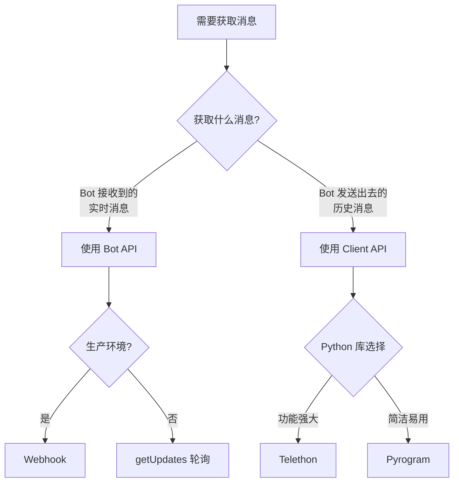

# Telegram Bot 获取群组消息

## 核心问题

如何获取 Telegram Bot 发送到群组的所有历史消息？

> [!warning] 关键认知
> **Bot API 无法获取历史消息**。必须使用 Telegram Client API（MTProto）才能获取完整的聊天历史。

## API 对比

| API 类型 | 方法 | 能力 | 限制 |
|---------|------|------|------|
| **Bot API** | `getUpdates` | 只能获取 Bot 收到的消息 | 无法获取 Bot 发送的历史消息 |
| **Client API** | `iter_messages` | 可获取完整聊天历史 | 需要 API ID 和 Hash |

## Bot API - 获取接收到的消息

> [!note] 使用场景
> Bot API 的 `getUpdates` 专门用于获取 Bot **接收到**的消息，包括：
> - 群组中 @提及 Bot 的消息
> - 回复 Bot 消息的消息
> - 发送给 Bot 的命令（如 `/start`、`/help`）
> - 用户直接发给 Bot 的私聊消息

### getUpdates 方法

#### 基本用法

```python
import requests

BOT_TOKEN = "your_bot_token"

def get_bot_updates(offset=None):
    """获取 Bot 接收到的所有更新"""
    url = f"https://api.telegram.org/bot{BOT_TOKEN}/getUpdates"
    params = {
        'timeout': 30,  # 长轮询超时时间（秒）
        'limit': 100   # 每次最多获取 100 条更新
    }
    if offset:
        params['offset'] = offset

    response = requests.get(url, params=params)
    return response.json()

# 获取更新
updates = get_bot_updates()
for update in updates['result']:
    print(update)
```

#### 完整的轮询示例

```python
import requests
import time

BOT_TOKEN = "your_bot_token"

def get_bot_messages():
    """持续获取 Bot 接收到的消息"""
    url = f"https://api.telegram.org/bot{BOT_TOKEN}/getUpdates"
    offset = None
    all_messages = []

    while True:
        params = {'timeout': 30, 'limit': 100}
        if offset:
            params['offset'] = offset

        response = requests.get(url, params=params)
        data = response.json()

        if data['ok'] and data['result']:
            for update in data['result']:
                message = update.get('message', {})
                if message:
                    all_messages.append({
                        'update_id': update['update_id'],
                        'message_id': message['message_id'],
                        'text': message.get('text'),
                        'from': message.get('from', {}),
                        'chat': message.get('chat', {}),
                        'date': message.get('date')
                    })
                offset = update['update_id'] + 1

        # 如果没有新消息，等待一段时间再继续
        if not data['result']:
            time.sleep(1)

        # 可以在这里添加退出条件
        # if len(all_messages) >= 1000:
        #     break

    return all_messages

# 获取所有接收到的消息
messages = get_bot_messages()
print(f"共获取到 {len(messages)} 条消息")
```

### 使用 python-telegram-bot 库（推荐）

```python
from telegram import Update
from telegram.ext import Updater, CallbackContext

class MessageCollector:
    def __init__(self, bot_token):
        self.bot_token = bot_token
        self.messages = []

    def handle_update(self, update: Update, context: CallbackContext):
        """处理收到的更新"""
        message = update.message
        if message:
            self.messages.append({
                'message_id': message.message_id,
                'text': message.text,
                'from_user': message.from_user.to_dict() if message.from_user else None,
                'chat': message.chat.to_dict(),
                'date': message.date.isoformat(),
                'message_type': message.__class__.__name__
            })
            print(f"收到消息: {message.text}")

    def start_listening(self):
        """开始监听消息"""
        updater = Updater(self.bot_token)
        dispatcher = updater.dispatcher

        # 注册消息处理器
        dispatcher.add_handler(MessageHandler(Filters.text, self.handle_update))

        # 启动 Bot
        updater.start_polling()
        print("Bot 已启动，正在监听消息...")

        # 保持运行
        updater.idle()

        return self.messages

from telegram.ext import MessageHandler, Filters

# 使用示例
collector = MessageCollector("your_bot_token")
messages = collector.start_listening()
```

### 使用 aiogram (异步)

```python
import asyncio
from aiogram import Bot, Dispatcher, types

class AsyncMessageCollector:
    def __init__(self, bot_token):
        self.bot = Bot(token=bot_token)
        self.dp = Dispatcher(self.bot)
        self.messages = []

    async def handle_message(self, message: types.Message):
        """处理收到的消息"""
        self.messages.append({
            'message_id': message.message_id,
            'text': message.text,
            'from_user': message.from_user.id if message.from_user else None,
            'chat_id': message.chat.id,
            'chat_type': message.chat.type,
            'date': message.date.isoformat()
        })
        print(f"收到消息: {message.text}")

    async def start_listening(self):
        """开始监听消息"""
        self.dp.register_message_handler(self.handle_message)

        print("Bot 已启动，正在监听消息...")
        await self.dp.start_polling()

        return self.messages

# 使用示例
async def main():
    collector = AsyncMessageCollector("your_bot_token")
    messages = await collector.start_listening()

asyncio.run(main())
```

### getUpdates 参数详解

| 参数 | 类型 | 描述 |
|------|------|------|
| `offset` | Integer | 更新的标识符，只返回比这个 ID 更大的更新 |
| `limit` | Integer | 限制返回的更新数量（1-100），默认 100 |
| `timeout` | Integer | 长轮询超时时间（秒），0 表示短轮询 |
| `allowed_updates` | Array | 指定接收的更新类型 |

### 只获取特定类型的更新

```python
# 只获取文本消息
params = {
    'timeout': 30,
    'allowed_updates': ['message']
}

# 获取消息和回调查询
params = {
    'timeout': 30,
    'allowed_updates': ['message', 'callback_query']
}

# 获取所有类型的更新
params = {
    'timeout': 30,
    'allowed_updates': [
        'message',
        'edited_message',
        'channel_post',
        'edited_channel_post',
        'inline_query',
        'chosen_inline_result',
        'callback_query'
    ]
}
```

### 使用 Webhook（生产环境推荐）

```python
from flask import Flask, request
import json

app = Flask(__name__)
BOT_TOKEN = "your_bot_token"
messages = []

@app.route('/webhook', methods=['POST'])
def webhook():
    """接收 Telegram 的 Webhook"""
    update = request.json

    # 保存消息
    message = update.get('message', {})
    if message:
        messages.append({
            'message_id': message['message_id'],
            'text': message.get('text'),
            'from': message.get('from', {}),
            'chat': message.get('chat', {}),
            'date': message.get('date')
        })

    return {"status": "ok"}

if __name__ == '__main__':
    # 设置 Webhook
    webhook_url = "https://your-domain.com/webhook"
    requests.post(
        f"https://api.telegram.org/bot{BOT_TOKEN}/setWebhook",
        json={'url': webhook_url}
    )

    app.run(host='0.0.0.0', port=5000)
```

### 消息数据结构示例

```python
{
    "update_id": 123456789,
    "message": {
        "message_id": 42,
        "from": {
            "id": 123456789,
            "is_bot": false,
            "first_name": "John",
            "last_name": "Doe",
            "username": "johndoe",
            "language_code": "en"
        },
        "chat": {
            "id": -1001234567890,
            "title": "My Group",
            "type": "supergroup"
        },
        "date": 1234567890,
        "text": "Hello @mybot!",
        "entities": [
            {
                "type": "mention",
                "offset": 6,
                "length": 7
            }
        ]
    }
}
```

## 解决方案

## 解决方案

### 方案 1：使用 Telethon (Python 推荐)

```python
from telethon import TelegramClient
from telethon.tl.types import InputPeerUser, InputPeerChat, InputPeerChannel

# 配置
api_id = 12345  # 从 my.telegram.org 获取
api_hash = 'your_api_hash'
bot_token = 'your_bot_token'
chat_id = -1001234567890  # 群组 ID

client = TelegramClient('bot_session', api_id, api_hash)

async def get_bot_messages():
    await client.start(bot_token=bot_token)

    bot = await client.get_me()

    all_messages = []

    # 获取群组的所有消息
    async for message in client.iter_messages(chat_id):
        # 过滤出 Bot 发送的消息
        if message.sender_id == bot.id:
            all_messages.append({
                'id': message.id,
                'text': message.text,
                'date': message.date,
                'type': message.__class__.__name__
            })

    print(f"找到 {len(all_messages)} 条 Bot 发送的消息")
    return all_messages

with client:
    client.loop.run_until_complete(get_bot_messages())
```

### 方案 2：使用 Pyrogram (更简洁)

```python
from pyrogram import Client

app = Client(
    "my_bot",
    api_id=12345,
    api_hash="your_api_hash",
    bot_token="your_bot_token"
)

with app:
    # 获取 Bot 自己的信息
    bot = app.get_me()

    # 获取群组消息并过滤
    bot_messages = []
    for message in app.get_chat_history(chat_id):
        if message.from_user and message.from_user.id == bot.id:
            bot_messages.append(message)

    print(f"Bot 发送了 {len(bot_messages)} 条消息")
```

## 项目结构建议

```
telegram-bot-fetcher/
├── config.py          # 配置文件
├── fetcher.py         # 核心逻辑
├── storage.py         # 数据存储
└── main.py           # 入口文件
```

### config.py

```python
API_ID = 12345
API_HASH = "your_hash"
BOT_TOKEN = "bot_token"
TARGET_CHAT_ID = -1001234567890
```

### fetcher.py

```python
from telethon import TelegramClient
from telethon.tl.functions.channels import JoinChannelRequest
import asyncio

class BotMessageFetcher:
    def __init__(self, config):
        self.client = TelegramClient(
            'bot_session',
            config.API_ID,
            config.API_HASH
        )
        self.bot_token = config.BOT_TOKEN
        self.chat_id = config.TARGET_CHAT_ID

    async def fetch_all_bot_messages(self):
        await self.client.start(bot_token=self.bot_token)
        bot = await self.client.get_me()

        messages = []
        async for msg in self.client.iter_messages(self.chat_id):
            if msg.sender_id == bot.id:
                messages.append({
                    'message_id': msg.id,
                    'text': msg.text,
                    'date': msg.date.isoformat(),
                    'reply_to': msg.reply_to_msg_id
                })

        return messages
```

## 两种使用场景对比

### 场景 1：获取 Bot 接收到的消息（使用 Bot API）

**适用场景**：
- 实时接收新的消息
- 处理用户与 Bot 的交互
- 响应命令和提及

**使用方法**：
- **Bot API**: `getUpdates`（轮询）或 `Webhook`（推荐生产环境）
- **优点**：简单、官方支持、无需额外配置
- **缺点**：只能获取**新消息**，无法获取历史消息

### 场景 2：获取 Bot 发送的历史消息（使用 Client API）

**适用场景**：
- 导出聊天记录
- 数据分析和统计
- 恢复丢失的消息

**使用方法**：
- **Client API**: `iter_messages`（Telethon/Pyrogram）
- **优点**：可获取完整历史，包括 Bot 自己发送的消息
- **缺点**：需要 API ID/Hash，相对复杂

### 快速决策指南



## 关键注意事项

### Bot API (getUpdates/Webhook)

> [!important] 前置条件

1. **Bot Token**：从 @BotFather 获取
2. **Webhook URL**（生产环境）：需要公网可访问的 HTTPS 地址
3. **隐私模式**：默认开启，Bot 只能接收 @提及、回复、命令
4. **如果要接收所有消息**：关闭隐私模式（@BotFather > Bot Settings > Group Privacy > Turn off）

### Client API (Telethon/Pyrogram)

> [!important] 前置条件

1. **必须使用 Client API**：Bot API 无法获取历史消息
2. **Bot 必须在群组中**：否则无法访问群组消息
3. **需要 API ID 和 Hash**：从 https://my.telegram.org 获取
4. **权限**：Bot 需要读取群组消息的权限

## 获取 API ID 和 Hash

1. 访问 [my.telegram.org](https://my.telegram.org)
2. 登录 Telegram 账号
3. 进入 API development tools
4. 创建新的 application
5. 获取 `api_id` 和 `api_hash`

## 获取群组 ID

```python
# 方法 1：使用 Telethon
from telethon import TelegramClient

async def get_chat_id(username):
    client = TelegramClient('session', api_id, api_hash)
    await client.start()
    entity = await client.get_entity(username)
    print(f"Chat ID: {entity.id}")
    await client.disconnect()

# 方法 2：使用转发消息
# 在 Telegram 中把群组消息转发给你的 Bot，Bot 就能收到 chat_id
```

## 数据存储建议

可以将获取到的消息保存到不同格式：

### JSON 格式

```python
import json

def save_to_json(messages, filepath):
    with open(filepath, 'w', encoding='utf-8') as f:
        json.dump(messages, f, ensure_ascii=False, indent=2)
```

### 数据库格式 (SQLite)

```python
import sqlite3

def save_to_db(messages, db_path):
    conn = sqlite3.connect(db_path)
    cursor = conn.cursor()
    cursor.execute('''
        CREATE TABLE IF NOT EXISTS messages (
            message_id INTEGER PRIMARY KEY,
            text TEXT,
            date TEXT,
            reply_to INTEGER
        )
    ''')
    cursor.executemany(
        'INSERT OR REPLACE INTO messages VALUES (?, ?, ?, ?)',
        [(m['message_id'], m['text'], m['date'], m['reply_to']) for m in messages]
    )
    conn.commit()
    conn.close()
```

## 相关资源

- [Telethon 官方文档](https://docs.telethon.dev/)
- [Pyrogram 官方文档](https://docs.pyrogram.org/)
- [Telegram API 文档](https://core.telegram.org/api)
- [Telegram Bot API](https://core.telegram.org/bots/api)

## 常见问题

### Q: 什么时候用 Bot API，什么时候用 Client API？

**A**: 根据需求选择：
- **Bot API**：用于实时接收消息、响应用户交互、处理命令和 @提及
- **Client API**：用于导出聊天历史、获取 Bot 自己发送的消息、数据分析

简单来说：**接收新消息用 Bot API，获取历史用 Client API**

### Q: getUpdates 和 Webhook 哪个更好？

**A**: 取决于使用场景：
- **getUpdates（轮询）**：适合开发测试、个人项目、消息量不大的场景
- **Webhook**：适合生产环境、高并发场景、即时性要求高的应用

### Q: 为什么不能用 Bot API 的 getUpdates 获取历史消息？

A: Bot API 的 getUpdates 设计用于获取**新更新**，每次请求后就会"确认"这些更新，服务器不会再发送它们。要获取 Bot 自己发送的**历史消息**，必须使用 Client API 直接访问 Telegram 的数据库。

### Q: Bot 需要什么权限？

A: 取决于使用场景：
- **Bot API**：默认可以接收 @提及、回复、命令。如果要接收所有消息，需关闭隐私模式
- **Client API**：Bot 必须是群组成员，并且需要能够读取消息

### Q: 会影响群组性能吗？

A:
- **Bot API**：Webhook 或 getUpdates 影响很小，只会接收新消息
- **Client API**：大规模获取历史消息可能会对服务器产生负载，建议：
  - 使用 `limit` 参数分批获取（如 `limit=100`）
  - 在低峰期执行
  - 缓存已获取的消息，避免重复请求

### Q: 可以同时使用 Bot API 和 Client API 吗？

**A**: 可以！它们互不冲突：
- Bot API 用于实时接收和处理消息
- Client API 用于定期导出或分析历史数据

示例：
```python
# 同时运行两种监听
import asyncio
from telethon import TelegramClient
from aiogram import Bot, Dispatcher

async def run_both():
    # 启动 Client API 监听（历史数据获取）
    client = TelegramClient('session', api_id, api_hash)
    await client.start(bot_token=bot_token)

    # 启动 Bot API 监听（实时消息）
    bot = Bot(token=bot_token)
    dp = Dispatcher(bot)

    # 两个可以同时运行
    await asyncio.gather(
        client.run_until_disconnected(),
        dp.start_polling()
    )

asyncio.run(run_both())
```

### Q: 如何测试 Bot 是否正确接收消息？

**A**: 测试步骤：
1. 在群组中 @提及你的 Bot
2. 检查 getUpdates 是否收到该消息
3. 回复 Bot 之前发送的消息
4. 检查 getUpdates 是否收到
5. 如果都没收到，检查是否开启了隐私模式

---
**最后更新**: 2026-01-11
