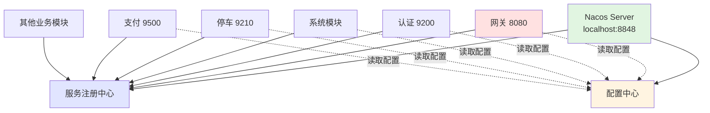

# Nacos 配置快速指南

## 📋 当前配置总结

### 🎯 Nacos 连接地址

**当前激活：**

- **本地地址**：`localhost:8848` 或 `127.0.0.1:8848`
- **环境**：`dev`（开发环境）

**备选地址（已注释）：**

- 生产环境 1：`122.112.213.46:8848`
- 生产环境 2：`192.168.0.252:8848`

### 📊 各模块配置状态

| 模块           | 服务发现       | 配置中心       | 状态    |
| -------------- | -------------- | -------------- | ------- |
| ruoyi-gateway  | localhost:8848 | localhost:8848 | ✅ 本地 |
| ruoyi-auth     | localhost:8848 | localhost:8848 | ✅ 本地 |
| ruoyi-system   | localhost:8848 | localhost:8848 | ✅ 本地 |
| ruoyi-parking  | 127.0.0.1:8848 | 127.0.0.1:8848 | ✅ 本地 |
| ruoyi-payment  | localhost:8848 | localhost:8848 | ✅ 本地 |
| ruoyi-property | 127.0.0.1:8848 | 127.0.0.1:8848 | ✅ 本地 |
| ruoyi-coupon   | localhost:8848 | localhost:8848 | ✅ 本地 |
| ruoyi-mall     | 127.0.0.1:8848 | 127.0.0.1:8848 | ✅ 本地 |
| ruoyi-license  | 127.0.0.1:8848 | 127.0.0.1:8848 | ✅ 本地 |
| ruoyi-gen      | 127.0.0.1:8848 | 127.0.0.1:8848 | ✅ 本地 |
| ruoyi-job      | 127.0.0.1:8848 | 127.0.0.1:8848 | ✅ 本地 |
| ruoyi-file     | 127.0.0.1:8848 | 127.0.0.1:8848 | ✅ 本地 |
| ruoyi-monitor  | 127.0.0.1:8848 | 127.0.0.1:8848 | ✅ 本地 |

**注意：** `localhost` 和 `127.0.0.1` 都指向本地，效果相同。

## 🔍 快速检查

### 检查当前配置

```bash
./update-nacos-config.sh check
```

### 验证 Nacos 是否运行

```bash
# 检查健康状态
curl http://localhost:8848/nacos/v1/console/health/readiness

# 访问控制台
open http://localhost:8848/nacos
# 默认账号/密码: nacos/nacos
```

## 🔄 环境切换

### 方案一：使用管理脚本（推荐）⭐

```bash
# 查看当前配置
./update-nacos-config.sh check

# 切换到本地环境
./update-nacos-config.sh local

# 切换到生产环境
./update-nacos-config.sh prod1

# 使用自定义地址
./update-nacos-config.sh 192.168.1.100:8848

# 恢复备份
./update-nacos-config.sh restore

# 清理备份
./update-nacos-config.sh clean
```

### 方案二：启动参数

```bash
# 不修改配置文件，启动时指定
java -jar services/ruoyi-gateway.jar \
  --spring.cloud.nacos.discovery.server-addr=122.112.213.46:8848 \
  --spring.cloud.nacos.config.server-addr=122.112.213.46:8848
```

### 方案三：手动修改

编辑各模块的 `bootstrap.yml`：

```yaml
spring:
  cloud:
    nacos:
      discovery:
        server-addr: localhost:8848 # 修改这里
      config:
        server-addr: localhost:8848 # 修改这里
```

## 🏗️ 架构图



## 🚀 启动顺序


### 完整启动流程

```bash
# 1. 确认 Nacos 运行
curl http://localhost:8848/nacos/v1/console/health/readiness

# 2. 启动网关（必需）
java -jar services/ruoyi-gateway.jar &

# 3. 启动认证（必需）
java -jar services/ruoyi-auth.jar &

# 4. 启动系统模块（必需）
java -jar services/ruoyi-modules-system.jar &

# 5. 启动业务模块（按需）
java -jar services/ruoyi-modules-parking.jar &
java -jar services/ruoyi-modules-payment.jar &
```

## ⚙️ 配置文件位置

所有模块的 Nacos 配置都在：

```
模块名/src/main/resources/bootstrap.yml
```

例如：

- `ruoyi-gateway/src/main/resources/bootstrap.yml`
- `ruoyi-auth/src/main/resources/bootstrap.yml`
- `ruoyi-modules/ruoyi-parking/src/main/resources/bootstrap.yml`

## 📝 配置文件结构

```yaml
spring:
  application:
    name: ruoyi-gateway # 服务名称
  profiles:
    active: dev # 环境：dev/test/prod
  cloud:
    nacos:
      discovery: # 服务发现
        server-addr: localhost:8848
      config: # 配置中心
        server-addr: localhost:8848
        file-extension: yml
        shared-configs: # 共享配置
          - application-dev.yml
```

## 🎯 环境对照表

| 环境       | Nacos 地址          | 命令                               |
| ---------- | ------------------- | ---------------------------------- |
| 本地开发   | localhost:8848      | `./update-nacos-config.sh local`   |
| 生产环境 1 | 122.112.213.46:8848 | `./update-nacos-config.sh prod1`   |
| 生产环境 2 | 192.168.0.252:8848  | `./update-nacos-config.sh prod2`   |
| 自定义     | 自定义地址:端口     | `./update-nacos-config.sh IP:PORT` |

## 🔧 常见问题

### Q1: 服务启动后无法注册到 Nacos？

**A:** 检查 Nacos 是否运行：

```bash
curl http://localhost:8848/nacos/v1/console/health/readiness
```

### Q2: 连接 Nacos 超时？

**A:** 检查网络和地址：

```bash
# 测试连接
ping 127.0.0.1
telnet localhost 8848

# 检查配置
./update-nacos-config.sh check
```

### Q3: 如何切换到生产环境？

**A:** 使用脚本一键切换：

```bash
./update-nacos-config.sh prod1
./build.sh
```

### Q4: 修改后如何恢复？

**A:** 脚本会自动备份：

```bash
./update-nacos-config.sh restore
```

### Q5: localhost 和 127.0.0.1 有什么区别？

**A:** 都指向本地，效果相同：

- `localhost` - 域名形式，需要 DNS 解析
- `127.0.0.1` - IP 形式，直接连接
- 建议统一使用 `localhost`

## 📚 相关工具

### 管理脚本

| 脚本                     | 功能           |
| ------------------------ | -------------- |
| `update-nacos-config.sh` | Nacos 配置管理 |
| `collect-services.sh`    | JAR 文件收集   |
| `fix-jar-naming.sh`      | JAR 命名统一   |
| `build.sh`               | 项目编译       |

### 使用流程

```bash
# 1. 修改 Nacos 配置
./update-nacos-config.sh prod1

# 2. 重新编译
./build.sh

# 3. 收集服务
./collect-services.sh

# 4. 启动服务
java -jar services/ruoyi-gateway.jar
```

## 🎉 总结

### 当前状态

✅ **所有 13 个模块都配置为连接本地 Nacos（localhost:8848 或 127.0.0.1:8848）**

### 生产环境备选地址

🔄 **已在配置文件中注释，随时可启用：**

- 122.112.213.46:8848
- 192.168.0.252:8848

### 快速操作

```bash
# 查看配置
./update-nacos-config.sh check

# 切换环境
./update-nacos-config.sh prod1

# 重新编译
./build.sh
```

**默认开发环境，生产部署时请使用脚本切换到生产 Nacos 地址！** 🚀

## 🔗 详细文档

- [完整 Nacos 配置指南](NACOS_CONFIG_GUIDE.md) - 详细的配置说明和架构图
- [JAR 收集指南](README_JAR_COLLECTION.md) - 服务打包和部署
- [版本号修复指南](README_VERSION_FIX.md) - JAR 命名统一

---

**所有服务当前连接到：localhost:8848** 📍
