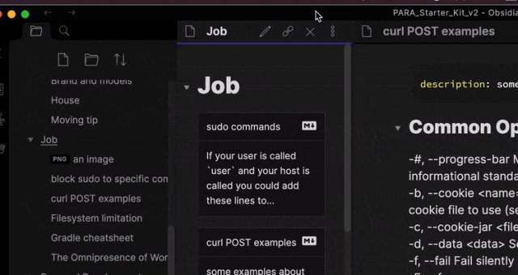
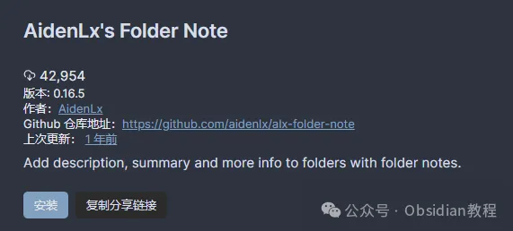

# AidenLx文件夹笔记插件：提升Obsidian文件管理体验！

嗨，大家好。我是何老师。

  

你有没有觉得在Obsidian中管理大量文件夹时有点吃力？

  

有时可能想为每个文件夹添加点描述，整理一下资料，但Obsidian原生的功能却不能满足这种需求。

  

这时，AidenLx文件夹笔记插件就能帮上大忙了！

  

这个插件允许你为每个文件夹创建专属的笔记，记录文件夹内的重要信息、总结和项目进度等等，极大地提升了文件管理的灵活性和信息性。

**什么是AidenLx文件夹笔记插件？**

**  
**

AidenLx文件夹笔记插件是Obsidian软件中的一款功能强大的工具，它允许用户为文件夹添加描述、摘要和其他信息，增强文件夹的功能性和信息展示。

  

这个插件是对原始文件夹笔记插件的重写与改进版本，保留了核心功能并进行了优化。

  

用户可以轻松创建和管理文件夹笔记，实现文件夹与笔记的无缝对接，简化文件管理流程。

**功能亮点**

**  
**

**1. 创建文件夹笔记**

  

你可以轻松为每个文件夹生成一个独立的笔记文件，并且插件支持多种偏好设置和模板，方便你自定义笔记格式。

  

只需点击文件夹，它的笔记就会立刻打开，笔记和文件夹间的操作无缝衔接。

  

更赞的是，当你移动或者重命名文件夹时，笔记会跟随同步更新，让管理变得省心。

  

**2\. 文件夹与笔记一体化操作**

  

文件夹和文件夹笔记之间的联系非常紧密，仿佛它们本就是一体的。

  

比如你点击文件夹，它的笔记就会立即显示；你重命名或移动文件夹，笔记也会同步更新。

  

这种紧密的联系让Obsidian的使用体验更加顺畅。

**3\. 创建文件夹概览（可选）**

  

如果你有很多文件夹，而且想快速浏览其中的内容，你可以启用文件夹概览功能。

  

通过简单的代码块 `folderv`，你可以查看文件夹内所有文件的简要信息卡片，还能通过前置元数据指定标题和描述，支持文件过滤和排序功能，方便你快速整理和回顾文件内容。  

  

**4\. 文件夹焦点模式**

**  
**

当文件夹内容太多时，可以使用“文件夹焦点模式”，只需在文件资源管理器中右键点击文件夹，选择“Toggle Focus”即可。

  

这时你可以只聚焦于当前文件夹，避免干扰。再次点击即可恢复所有文件夹的显示，简单而方便。

  

**5\. 文件资源管理器的图标定制**

  

你还可以为文件夹设置不同的图标，直观地标记出文件夹的类型或用途。这样，在众多文件夹中也能快速找到需要的那个。

**使用前的准备**  

  

要使用AidenLx文件夹笔记插件，你需要确保系统符合以下要求：

  

从v0.13.0版本后，文件夹概览功能是一个可选组件，用户可以在插件设置中手动安装。

  

从v0.11.0版本后，插件依赖于`folder-note-core`模块，因此需要安装这个核心组件才能正常工作。

  

如果你是老用户，插件升级过程中有详细的迁移指南可以参考，确保你的数据无缝过渡。

  

**安装方法**

  

**1\. 在线安装（需要科学上网）**

  

在Obsidian中安装插件非常简单，按照以下步骤操作：

  

\- 打开Obsidian，点击左下角的“设置”图标。

\- 在设置菜单中选择“第三方插件”。

\- 点击“浏览”按钮，搜索“AidenLx”。

\- 找到插件后点击“安装”，安装完成后，切换插件的“启用”开关。

**2\. 离线安装**

  

如果你因为网络原因无法在线安装插件，可以通过以下方式离线安装：

  

### **很多同学无法直接在线安装obsidian插件，这里我已经把obsidian所有热门插件下载好了**  
只需要关注下方公众号，后台回复：**插件** 即可获取

**如何使用AidenLx文件夹笔记插件？**  

  

AidenLx的文件夹笔记插件功能丰富，无论是初学者还是资深用户，都能从中找到适合自己的用法。以下是几个常见的使用场景：

  

**\- 项目文件夹管理：** 为每个项目文件夹创建一个文件夹笔记，记录项目进展、重要资料或任务清单，帮助你更好地跟踪进度。

**\- 文件夹概览：** 使用`folderv`代码块生成文件夹概览，快速查看文件夹中的所有文件，方便整理和查找。

**\- 笔记与文件夹同步管理：** 无论是重命名、移动还是删除文件夹，笔记都会同步跟进，减少手动调整的麻烦。

**  
**

**使用感受**

  

从我个人使用的角度来看，AidenLx文件夹笔记插件的确让Obsidian的文件管理变得更加人性化和高效。

  

特别是文件夹笔记和文件夹的同步管理功能，免去了很多手动操作的繁琐步骤。

  

而文件夹概览的功能也非常实用，可以让你快速预览和管理文件夹中的内容，大大提升了工作效率。

  

**结语**

  

总的来说，AidenLx文件夹笔记插件不仅大幅提升了Obsidian的文件夹管理功能，还通过增强信息展示和交互体验，让用户能够更高效地使用Obsidian。

  

如果你还没试过这个插件，赶紧安装试试看吧！

  

# **Obsidian交流社群来了**

[**我们搞了一个专门分享Obsidian的交流社群：****玩转效率笔记****社群的主要内容包括使用技巧、模板主题和插件等，** 帮助更多人提升效率，实现自我管理的目标。](http://mp.weixin.qq.com/s?__biz=MzkyMDUyMDM2Mg==&mid=2247485997&idx=1&sn=9a528871be62e4c74a1df3807b28f2bd&chksm=c190d9e8f6e750fe9df7a333b666fdd8561fdeb928d1df1f367d2374742efa34727a3f91cbc0&scene=21#wechat_redirect)

  
如果你对Obsidian有热情，这个社群绝对不容错过！
