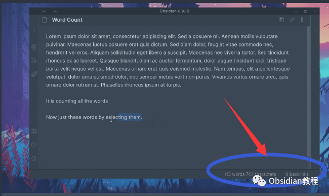
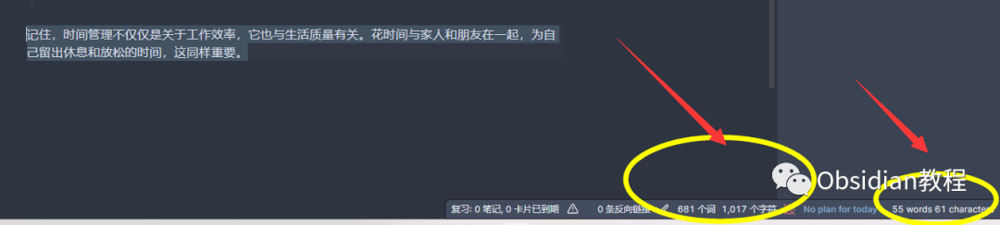

# Better Count Word让Obsidian成为你写作的得力助手

### 点击下方公众号，回复关键字：**Obsidian** ，获取Obsidian资料合集。

  

Obsidian不仅是一个优秀的知识管理工具，而且通过丰富的插件生态，它可以成为一个强大的写作工具。

  

Better Count Word插件就是这个生态的一部分，它不仅能够统计你的写作字数，而且还能为你提供丰富的统计数据，帮助你更好地理解你的写作习惯。

  

1

## 

## 插件介绍

  
Better Count Word插件是Obsidian的内置Word Count插件的升级版。  
不同于原版只能统计整个文档的字数，Better Count Word插件能够针对选中的文本进行字数统计，而且还能存储有关你的库的统计信息。这使得你可以更灵活、更精确地了解你的写作情况。  
  
2

## 

## 功能特点

  
**1.存储库统计信息：** 插件能够存储你库中的统计信息，帮助你了解你的写作量。  
**2.全语言支持：** 插件支持所有语言，无论你写作的语言是什么，都能准确统计。  
**3.丰富的统计数据：** 插件能够展示多种统计数据，包括当前文件的字数、字符数、句子数、脚注和Pandoc引用数，以及库中的总字数、字符数、句子数、脚注、Pandoc引用数和文件数。它还能统计你今天输入的字数、字符数、句子数、脚注和Pandoc引用数。  
**5.高度定制化的状态栏：** 你可以根据需要定制状态栏，显示你想要看到的统计数据。  
3

## 

## 下载与安装

  
首先，确保你已经安装了Obsidian软件。

### **  
**

### **1.在线安装**（需要科学上网） ：****

  
1.在Obsidian的设置中，找到“第三方插件”选项，点击“社区插件”2.在搜索框中输入“Better Count Word”，找到并安装它。3.安装完成后，激活该插件，在成功安装插件后，我们需要对其进行简单的配置，以符合我们的需求。  

**2.离线安装：****  
****因为网络原因很多同学无法直接在线安装obsidian插件，这里我已经把obsidian所有热门插件下载好了**  
只需要关注下方公众号，后台回复：**插件** 即可获取  
4

## 

## 基本使用

  
**1.启用插件：** 安装完插件后，回到“插件”列表，找到Better Count Word插件，并启用它。  
**2.选中文本统计字数：** 在任意Markdown文档中选中一段文本，你会在状态栏看到选中文本的字数。  

**3.查看统计信息：** 在状态栏，你会看到你设置的各种统计数据，包括但不限于字数、字符数和句子数。  
**4.定制状态栏：** 你可以进入插件的设置，定制你想要显示在状态栏的统计数据。  

Better Count Word插件通过简单易用的界面和强大的功能，为Obsidian的用户提供了一个优秀的写作统计工具。  
无论你是写作爱好者，还是专业的写作者，都可以通过这个插件来了解和提升你的写作效率。  
安装Better Count Word插件，让你的Obsidian变成一个强大的写作助手吧！  
  
  
1**扫码购买****《 Obsidian实战教程》****从入门到精通， 链接您的每一个思维瞬间。****  
**  
往 期精彩[1.](http://mp.weixin.qq.com/s?__biz=MzkyMDUyMDM2Mg==&mid=2247484119&idx=1&sn=b1491121e681ce684988d100cf588dd0&chksm=c190d112f6e758048455acc822832f8db8750e60becfe3020bfdda9fba175a1e7a00f159a1d5&scene=21#wechat_redirect)[Obsidian插件:Checklist优雅地管理任务](http://mp.weixin.qq.com/s?__biz=MzkyMDUyMDM2Mg==&mid=2247484172&idx=1&sn=b3ef41c7b7b7fcb754e868e0b3f37d5d&chksm=c190d0c9f6e759df680179ef848c5f8318ad22934bb7516fb68374de5a8e8a2b0dc2829b5aa9&scene=21#wechat_redirect)2.[Obsidian插件:Day Planner，规划你的一天](http://mp.weixin.qq.com/s?__biz=MzkyMDUyMDM2Mg==&mid=2247484148&idx=1&sn=0bbd2cb464c8f051da65642eab1eeab5&chksm=c190d131f6e75827dadf81f1ea4a430828a481d8a0206ac010d4b47001f930fe6ec57cdc2068&scene=21#wechat_redirect)3.[Obsidian插件:Annotator赋予用户在Obsidian环境中直接打开、阅读和注释PDF与EPUB文件的能力](http://mp.weixin.qq.com/s?__biz=MzkyMDUyMDM2Mg==&mid=2247484119&idx=1&sn=b1491121e681ce684988d100cf588dd0&chksm=c190d112f6e758048455acc822832f8db8750e60becfe3020bfdda9fba175a1e7a00f159a1d5&scene=21#wechat_redirect)

点分享

点点赞

点在看
