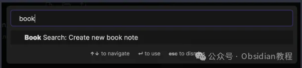
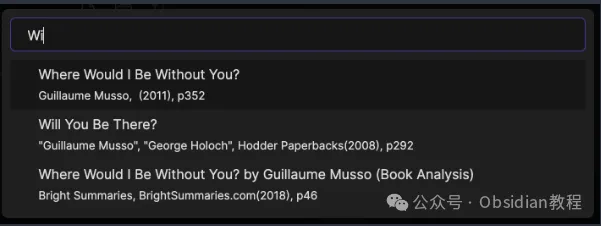
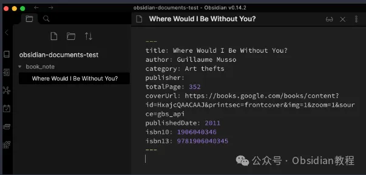
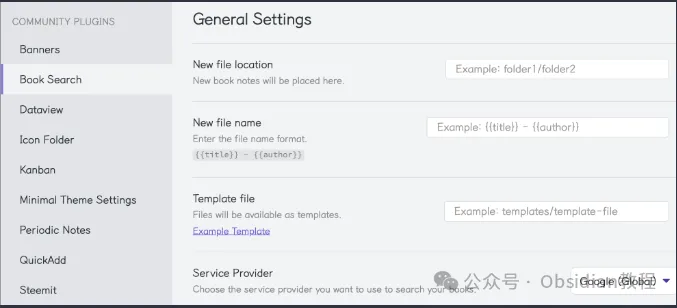
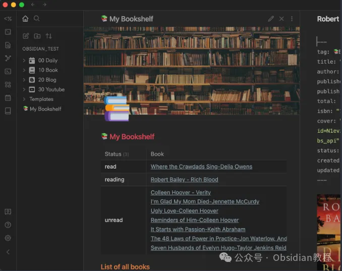

# Book Search插件：快速高效管理书籍信息的利器~

嗨，大家好。我是何老师。

  

在日常的学习和工作中，我们常常需要查找和整理大量书籍信息，而Obsidian 作为一款强大的知识管理工具，能够通过插件来大幅扩展其功能，帮助我们更加高效地管理这些数据。

  

今天要介绍的就是Obsidian的Book Search 插件，它可以让你直接在Obsidian 中搜索书籍信息，并自动生成相应的笔记。这不仅能提高效率，还能让整个书籍管理过程更加系统化。

### 

  

**如何安装 Book Search 插件**

  

**1.在线安装（需要科学上网）**

  

通过 Obsidian 的社区插件浏览器，你可以非常方便地在线安装 Book Search 插件。步骤如下：

  

\- 点击 Obsidian 中的“社区插件”选项。

\- 选择“浏览”按钮，在左上角的搜索框中输入“Book Search”。

\- 找到插件后，点击“安装”，完成后点击“启用”按钮。

**2.离线安装**

  

### **很多同学无法直接在线安装obsidian插件，这里我已经把obsidian所有热门插件下载好了**  
只需要关注下方公众号，后台回复：**插件** 即可获取**使用 Book Search 插件搜索书籍**  

  

插件安装并启用后，点击 Obsidian 左侧工具栏中的 Book Search 图标，或者执行命令“Create new book note”来启动插件。

在搜索框中输入书名、作者、出版社或者 ISBN 号，插件会帮你从网络上查找相关书籍信息。

搜索结果会展示在界面下方，找到你需要的书籍后，点击即可生成一份新的书籍笔记。

Obsidian 会根据你预先设置的模板自动生成笔记，省去了手动输入信息的繁琐步骤。

**Book Search 插件的配置**

  

Book Search 插件提供了一些非常实用的配置选项，可以根据个人需求对新创建的笔记进行自定义设置。主要包括以下几方面：

  

**\- 新文件存放位置：** 你可以指定笔记保存的具体文件夹，默认存放在 Obsidian 根文件夹下。

**\- 文件名格式：** 默认文件名格式是 {{title}} - {{author}}，你可以通过添加变量（如 {{DATE}} 或 {{DATE:YYYYMMDD}}）来调整文件命名。

**\- 模板设置：** 你可以为新笔记指定特定模板，模板中可以包含书籍的详细信息，比如标题、作者、出版社等。

**利用模板自定义笔记**

  

使用模板功能可以大大提升笔记的一致性和美观度。以下是一个简单的 Book Search 插件模板示例：

  *   *   *   *   *   *   *   *   *   *   *   *   *   *   *   *   * 

    
    
    ---tag: 📚Booktitle: "{{title}}"author: [{{author}}]publisher: {{publisher}}publish: {{publishDate}}total: {{totalPage}}isbn: {{isbn10}} {{isbn13}}cover: {{coverUrl}}status: unreadcreated: {{DATE:YYYY-MM-DD HH:mm:ss}}updated: {{DATE:YYYY-MM-DD HH:mm:ss}}---  
    # {{title}}  
    

在这个模板中，`{{title}}`、`{{author}}` 等变量会自动替换为对应书籍的具体信息。这个模板不仅能清晰呈现书籍的基本信息，还能以图文并茂的方式展示书籍封面，非常实用。

**通过数据视图展示书籍信息**  

  

安装 Book Search 插件后，你还可以利用 Obsidian 的 Dataview 插件，以表格形式展示书籍数据。

  

例如，以下是一个简单的数据视图查询代码，帮助你创建自己的书籍列表：

  *   *   *   *   *   * 

    
    
    TABLE WITHOUT ID status as Status, rows.file.link as BookFROM #📚BookWHERE !contains(file.path, "Templates")GROUP BY statusSORT status  
    

这个查询可以帮助你根据书籍状态（例如已读、未读等）来分类整理书籍信息。

  

**模板中的高级应用：内联脚本**

  

Book Search 插件的 0.5.8 版本还支持与 Templater 插件结合，允许你在模板中加入内联脚本，实现更加复杂的数据处理。比如，你可以用以下代码直接打印书籍的完整对象信息：

  *   * 

    
    
    <%=book%>  
    

或者使用更美观的格式化输出：

  *   * 

    
    
    <%=JSON.stringify(book, null, 2)%>  
    

这对于需要进行复杂书籍信息管理的用户来说，是一个非常强大的功能。

  

**结语**

  

通过 Book Search 插件，Obsidian 用户可以高效管理大量书籍数据，尤其是在处理文献回顾、书单整理等任务时，能够节省大量时间和精力。

  

无论是从功能扩展性，还是从实际的易用性来说，Book Search 插件都为用户带来了极大的便利。

  

我的感觉是，这个插件对书籍爱好者特别友好，尤其适合那些需要记录和整理大量书籍信息的人。如果你平时也有类似的需求，那么不妨试试看，通过简单的几步设置，就可以让你的知识管理更加高效。

  

# **Obsidian交流社群来了**

[**我们搞了一个专门分享Obsidian的交流社群：****玩转效率笔记****社群的主要内容包括使用技巧、模板主题和插件等，** 帮助更多人提升效率，实现自我管理的目标。](http://mp.weixin.qq.com/s?__biz=MzkyMDUyMDM2Mg==&mid=2247485997&idx=1&sn=9a528871be62e4c74a1df3807b28f2bd&chksm=c190d9e8f6e750fe9df7a333b666fdd8561fdeb928d1df1f367d2374742efa34727a3f91cbc0&scene=21#wechat_redirect)

  
如果你对Obsidian有热情，这个社群绝对不容错过！
