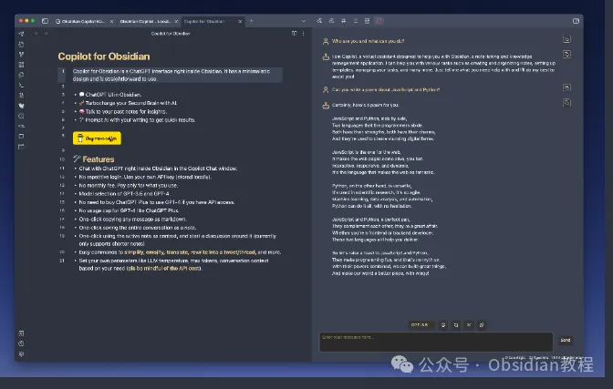
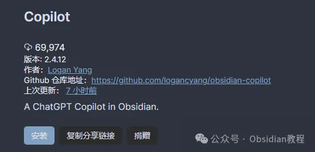
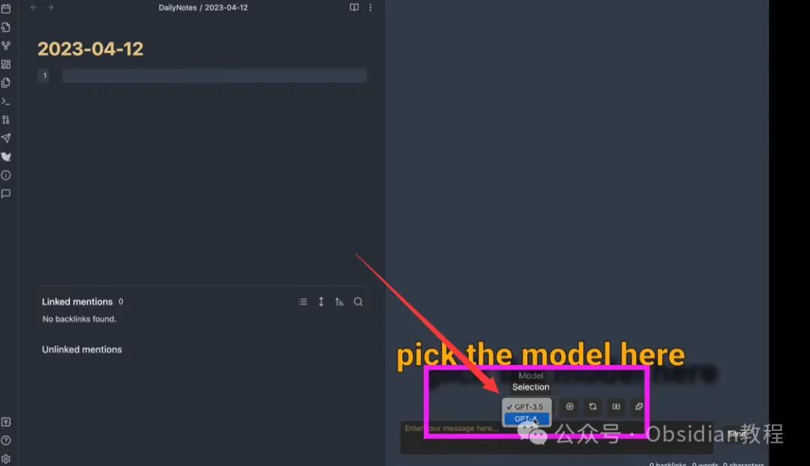
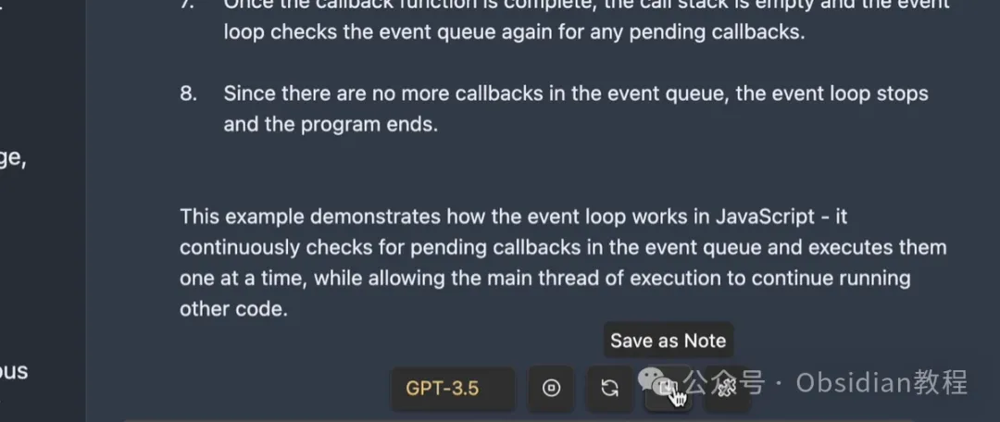
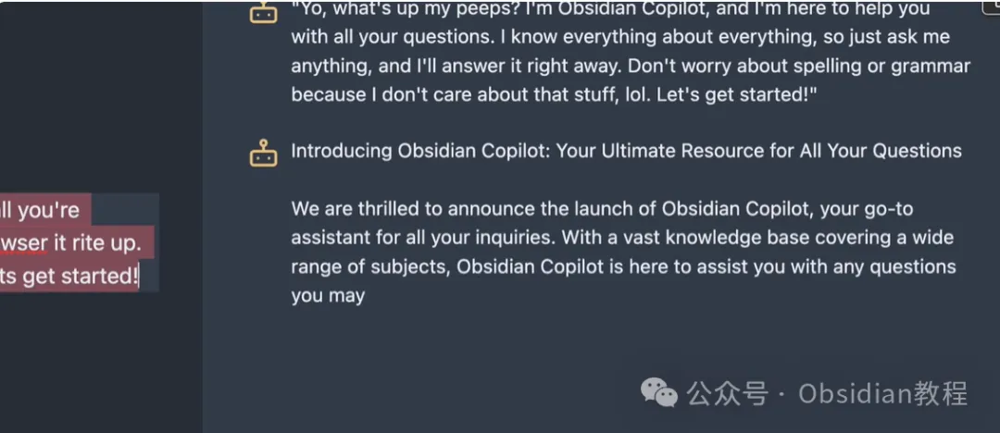
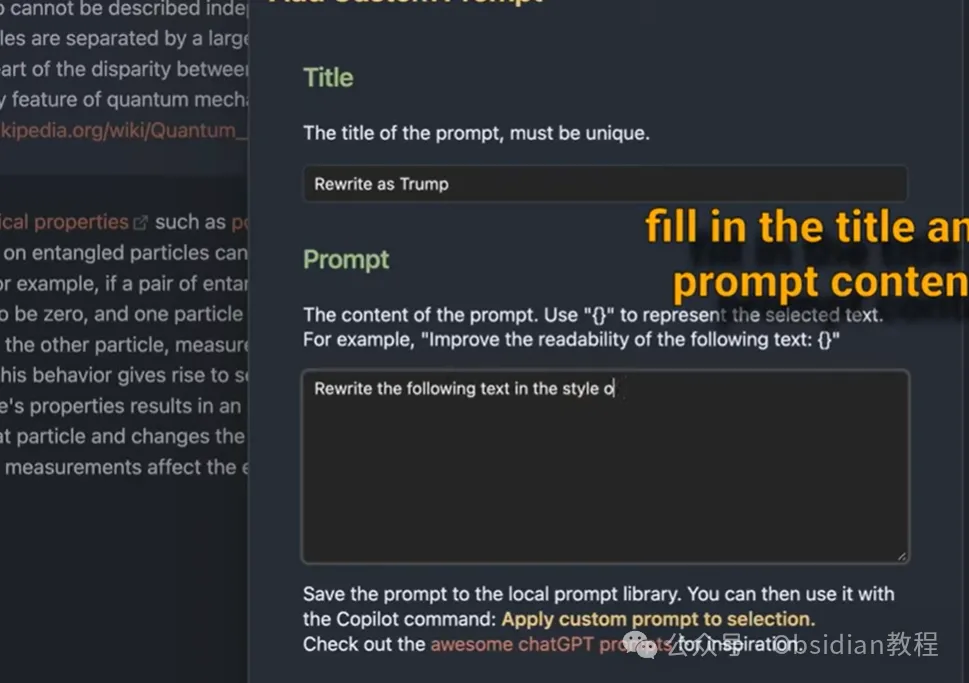

# Copilot插件：为Obsidian用户提供智能AI助手~

嗨，大家好。我是何老师。

  

在你日常使用Obsidian记录笔记时，是否曾希望能够与AI直接对话？如果你曾有过这样的想法，那么Copilot就是你不容错过的好帮手。

这款插件将ChatGPT直接集成到Obsidian里，提供简洁、直观的操作界面，用户可以通过Copilot命令与AI交流，实现从笔记整理到内容创作的智能辅助。

  

Copilot最让人惊艳的是它强调本地优先和隐私保护。它支持本地向量存储和离线聊天模式，即使在没有网络的情况下也能使用本地模型进行交互。这对于一些对数据隐私非常重视的用户来说，简直是福音！

  

**功能特点**

  

Copilot不仅仅是一个简单的AI助手，它的多功能性和灵活性为Obsidian用户提供了丰富的使用场景。以下是它的主要特点：

  

**1\. AI交互**

  

用户可以在Obsidian内通过Copilot的聊天窗口与AI进行交流，轻松完成日常任务，比如简化文本、生成总结、翻译内容等。

**2\. API使用**

  

与许多需要重复登录的插件不同，Copilot允许你使用自己的API密钥，并将其本地存储。这意味着你不用担心月费问题，只需按实际使用情况付费即可。

  

**3\. 模型选择**

  

Copilot支持多个模型的接入，包括OpenAI、Azure等在线模型，也兼容LM Studio和Ollama提供的本地模型。对于不想使用付费API的用户来说，Copilot还支持一些免费的模型，例如OpenRouter.ai和Ollama的免费模型。

  

**4\. 多样功能**

  

除了日常聊天功能，Copilot还能帮助你进行语法修正、推文生成、情感化表述等工作，甚至支持复杂的上下文对话。这让笔记管理变得更加智能和高效。

  

**5\. 自定义提示**

  

在本地环境下持久保存的自定义提示功能极具吸引力，用户可以根据自己的需求创建、编辑和删除自定义提示，极大增强了个性化体验。

**Copilot的安装方法**

  

**1.在线安装**

  

如果你能科学上网，可以通过Obsidian的社区插件浏览器快速安装Copilot：

  

1\. 点击Obsidian设置中的“社区插件”选项，再点击“浏览”按钮。

2\. 在搜索框中输入“Copilot”，找到插件后点击“安装”。

3\. 安装成功后，点击“启用”按钮，即可开始使用。

**2.离线安装**

**  
**

**很多同学无法直接在线安装obsidian插件，这里我已经把obsidian所有热门插件下载好了**  
只需要关注下方公众号，后台回复：**插件** 即可获取**使用教程**  
**1.基本使用**  
安装并启用插件后，在Obsidian左侧工具栏点击聊天图标，右侧会打开一个聊天面板。在聊天窗口中输入内容，你就可以使用Copilot与AI进行对话啦。

除了普通聊天，你还可以一键将对话以Markdown格式复制或保存为笔记，操作非常简单。**2.高级应用 **  
Copilot不仅能进行基础的AI对话，还提供了一些高级功能。比如，“长笔记作为上下文”功能，可以将长笔记作为AI上下文内容，与其进行深度对话。  
另外，在“模式选择”菜单中切换到“QA”模式，针对特定笔记展开详细讨论。**注意事项及常见问题**  
**1.聊天历史：** 默认情况下，Copilot不会自动保存聊天记录。如果需要保存，请记得使用“保存为笔记”功能。  
**2.新聊天：** 开始新聊天时，之前的对话会被清除。如果对之前的聊天内容有需求，务必提前保存。  
**3.API成本：** 尤其是在使用GPT-4和较长的上下文对话时，记得关注API成本，以免产生不必要的费用。  
此外，常见问题还包括模型访问问题、上下文不适用、使用Huggingface作为嵌入提供商时可能出现响应延迟等。如果遇到这些问题，可以查看插件的官方文档或者相关社区讨论。**  
****结语**  
Copilot为Obsidian用户提供了一个功能强大且灵活的AI工具，不仅能增强笔记的功能性，还大大提升了信息整理和处理的效率。  
尤其是其对隐私的关注和离线使用的特性，给那些对数据安全有高需求的用户提供了一个安心之选。  
总的来说，Copilot不仅能帮助你更好地组织笔记，还能通过AI对话为你的日常工作和学习提供极大的便利。  
我的感觉是，如果你已经习惯在Obsidian中管理你的信息，那么使用Copilot无疑会让你的笔记体验更加顺畅和高效。

  

# **Obsidian交流社群来了**

[**我们搞了一个专门分享Obsidian的交流社群：****玩转效率笔记****社群的主要内容包括使用技巧、模板主题和插件等，** 帮助更多人提升效率，实现自我管理的目标。](http://mp.weixin.qq.com/s?__biz=MzkyMDUyMDM2Mg==&mid=2247485997&idx=1&sn=9a528871be62e4c74a1df3807b28f2bd&chksm=c190d9e8f6e750fe9df7a333b666fdd8561fdeb928d1df1f367d2374742efa34727a3f91cbc0&scene=21#wechat_redirect)

  
如果你对Obsidian有热情，这个社群绝对不容错过！  

