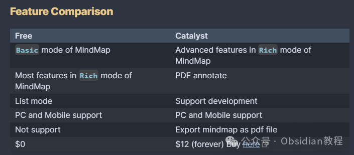
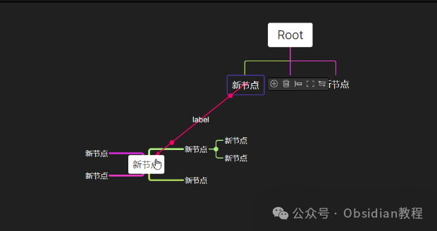
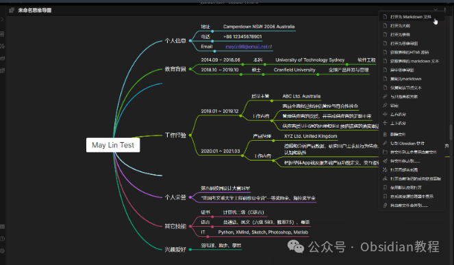
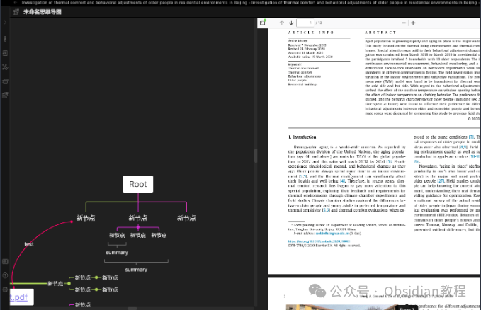

# MarkMind 让 Obsidian 瞬间变身知识管理利器

今天咱们聊聊 Obsidian 里的一个宝藏插件——MarkMind。

  

如果你跟我一样，习惯用思维导图、纲要大纲和 PDF 批注来整理思路、记录笔记，那么这个插件绝对值得你一试。

  

MarkMind 是一个基于 Obsidian API 开发的多功能插件，集思维导图、纲要视图、表格视图以及 PDF 批注功能于一身。

  

这些功能不仅提升了笔记管理的灵活性，还让你在 Obsidian 中的工作流程更加流畅。

  

无论你是学生、研究人员，还是创意工作者，MarkMind 都能帮助你更好地组织和呈现信息。

  

### **MarkMind 的主要功能**

  

MarkMind 主要提供了两种模式：基础模式 和 丰富模式。

  

在基础模式下，你可以创建和使用简单的思维导图，并且能与大纲视图或表格视图配合使用。

  

丰富模式则在基础模式的基础上，加入了更多高级功能，比如添加节点链接、创建边界、总结节点等。这些功能使得丰富模式特别适合需要处理复杂信息结构的用户。

  

#### **思维导图模式**

  

MarkMind 的思维导图功能支持两种模式：基础模式和丰富模式。基础模式主要用于简单的思维导图构建，操作起来轻松简便。

  

如果你曾经使用过类似的插件，比如 obsidian-enhancing-MindMap，那么你会发现上手非常快。而丰富模式则为高级用户准备，支持更多的自定义和复杂功能，让你的思维导图不仅仅是简单的节点连接，更像是一个多维度的信息展示平台。

#### **大纲视图和表格视图**

  
MarkMind 的大纲视图和表格视图为你提供了多样化的笔记展示方式。你可以选择在笔记的“更多选项”中打开大纲视图或表格视图，或者通过 YAML 代码直接设置。**  
****大纲视图**
      
      *   *   *   * 
    
    
    
     ---mindmap-plugin: basicdisplay-mode: outline---

  
``这个模式特别适合那些需要结构化整理思路的场景，你可以通过快捷键快速编辑节点、调整层级、缩放视图等。  
**表格视图**

  *   *   * 

    
    
     mindmap-plugin: basicdisplay-mode: table  
    

  
表格视图则更加适合数据的展示和整理。你可以将思维导图转化为表格模式，通过简单的点击操作完成内容的转换。

###   

### **PDF 批注功能**

  
MarkMind 的另一个强大功能就是 PDF 批注。你可以直接在 Obsidian 中标注、评论 PDF 文档，并将这些批注与思维导图节点关联起来。  
这意味着你可以在阅读文献或处理文档时，轻松地将重要信息整合到你的笔记系统中。  

#### **如何使用 PDF 批注**

  
为了使用 PDF 批注功能，你需要下载并安装相应的 PDFJS 插件。安装完插件后，按照下面的步骤操作：  
1.在 Android、iOS 或 PC 上创建相应的文件夹，并将 pdfjs 文件夹解压到 .obsidian 目录下。2.通过 Obsidian 的命令面板设置 PDFJS 插件路径。3.在你的 MindMap 文档中添加以下 YAML 代码，以便关联 PDF 文件。

  *   * 

    
    
    annotate-target: test/test.PDFannotate-type: pdf

  
4.现在你可以在“更多选项”中找到“注释 PDF”选项，进行批注操作了。

####   

#### **PDF 批注快捷键**

  
为了提高批注效率，MarkMind 提供了一些快捷键，让你能快速高亮文本、删除批注等。  

  * 高亮黄色：CTRL/CMD/ALT + Y
  * 高亮绿色：CTRL/CMD/ALT + G
  * 删除批注：CTRL/CMD/ALT + Delete/Backspace

###   

### **思维导图与批注的关联**

  
在 MarkMind 中，你可以将思维导图节点与 PDF 批注关联起来，有三种方法可以实现这个功能：  

  1. 默认方法（仅支持丰富模式）
     * 在创建 PDF 批注后，点击“PDF 批注”，编辑思维导图节点并按 CTRL/CMD + V 进行关联。
  2. Jumpto 协议
     * 在 MarkMind 设置中，启用“支持协议打开”选项，这样在点击 PDF 批注时，会自动创建一个 PDF 批注参考链接并复制到剪贴板。
  3. Markdown 保存批注
     * 你也可以使用 Markdown 来保存 PDF 批注，并通过 [[${md name}#${block reference}]] 的方式将批注与对应的思维导图节点关联起来。

###   

### **导出与共享**

  
MarkMind 允许你将思维导图导出为图像或 PDF 文件，方便你与他人分享。你可以通过 CTRL + P 打开命令面板，然后选择“导出为 HTML”或“导出为 PDF”命令。  
需要注意的是，PDF 批注功能在 Obsidian 1.4 版本上运行良好，但如果你使用的是 1.5 或更高版本，建议下载 MarkMind 独立软件版本，以确保功能兼容性。  

### **离线安装：**  
很多同学无法直接在线安装obsidian插件，这里我已经把obsidian所有热门插件下载好了  
只需要关注下方公众号，后台回复：**插件** 即可获取

### 

### 

### **  
**

### **总结**

  
对于我这种思维导图重度用户来说，MarkMind 的确是一个神器级别的插件。它不仅扩展了 Obsidian 的功能，还提供了非常灵活的操作方式。  
无论是整理复杂的项目，还是批注研究文献，MarkMind 都能轻松应对。而且，插件的操作逻辑非常符合直觉，即便是新手也能快速上手。  
如果你对思维导图和 PDF 批注有需求，或者只是想提高 Obsidian 的使用效率，MarkMind 绝对值得一试。  

# **Obsidian交流社群来了**

[**我们搞了一个专门分享笔记工具的社群：**](http://mp.weixin.qq.com/s?__biz=MzkyMDUyMDM2Mg==&mid=2247485997&idx=1&sn=9a528871be62e4c74a1df3807b28f2bd&chksm=c190d9e8f6e750fe9df7a333b666fdd8561fdeb928d1df1f367d2374742efa34727a3f91cbc0&scene=21#wechat_redirect)****[**玩转效率笔记**](http://mp.weixin.qq.com/s?__biz=MzkyMDUyMDM2Mg==&mid=2247485997&idx=1&sn=9a528871be62e4c74a1df3807b28f2bd&chksm=c190d9e8f6e750fe9df7a333b666fdd8561fdeb928d1df1f367d2374742efa34727a3f91cbc0&scene=21#wechat_redirect)，社群的主要内容包括**使用技巧、模板主题和插件** 等，帮助更多人提升效率，实现自我管理的目标。  
如果你对Notion、Obsidian有热情、对知识有渴望，这个社群绝对不容错过！
