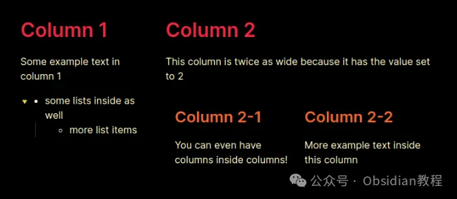
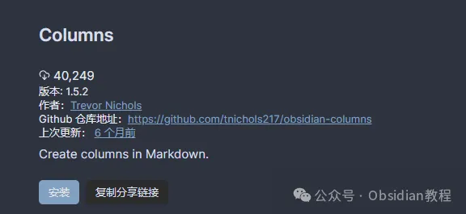

# Obsidian Columns 插件：让你的笔记轻松实现多列布局

嗨，大家好，我是何老师。今天我们来聊聊Obsidian Columns 插件。

**  
**

**Obsidian Columns 插件介绍**

  


Obsidian Columns 是一个非常强大的插件，它为 Obsidian 用户提供了在笔记中创建列的功能。

  


无论是想要将内容分为多列显示，还是进行更复杂的笔记布局设计，这个插件都可以帮助你轻松实现。

  


而且它还支持移动端使用，能够在不同设备间无缝切换，功能十分灵活。

  


接下来，我会详细讲解Obsidian Columns插件的三种使用方式，分别是 Callout 语法、Codeblock 语法和 List 语法。

  


让你可以根据自己的需求，选择最适合的方法。


**Callout 语法**  


  


Callout 语法是最基础的一种使用方式，它利用 Obsidian 原有的 Callout 规范来创建列。

  


这个方法最大的好处是不需要编写代码块，因此对于不熟悉代码的用户特别友好。

  


同时，这种方法与 Obsidian 的实时预览功能完全兼容，意味着你可以随时看到效果。不过，使用 Callout 语法时无法指定列的高度，否则可能会影响性能。

  


**基本使用方法**

  


1\. 创建列集合的基础语法是这样的：****

  *   *   *   * 

    
    
    > [!col]>第一列内容>> 第二列内容  
    

2\. 如果你想嵌套更多列内容，可以使用 col-md 语法：****

  *   *   *   *   *   * 

    
    
    > [!col]>第一列内容>>> [!col-md]>> 第二列内容>>> 第二列的更多内容  
    

3\. 你还可以通过在 col-md 后面添加宽度值来调整列的宽度（宽度只能是 0.5 的倍数，最大值为 10）：

  *   *   *   *   * 

    
    
    > [!col]>第一列内容>>> [!col-md-3]>> 第二列的宽度是第一列的三倍  
    

优点：不需要写代码，兼容实时预览。

缺点：无法调整列的高度。

**  
**

**Codeblock 语法**

  


Codeblock 语法是更高级的一种使用方式，它通过命名代码块来实现列的创建。

  


相比 Callout 语法，Codeblock 语法允许更多的自定义配置，例如可以调整列的高度、文本对齐方式等。

  


如果你需要更灵活、更复杂的布局，Codeblock 语法会是更好的选择。

  


**基本使用方法**

  


1\. 初始化列组，并渲染每个项目为独立的列：

  *   *   *   *   *   *   * 

    
    
    ````col```col-md第一列``````col-md第二列  
    

2\. 可以通过代码块设置高度和对齐方式：

  *   *   *   *   *   *   *   *   * 

    
    
    ````colheight=shortest===```col-md第一列内容``````col-md第二列内容  
    

优点：支持更多自定义设置，适合复杂布局。

缺点：相比 Callout 语法稍微复杂，不兼容实时预览。

**  
**

**List 语法**

  


List 语法是通过创建列表来实现列布局的另一种方式。与前两种语法不同，List 语法不支持实时预览，但它的结构更简单，适合快速创建基础的列布局。

  


你可以通过调整列表的级别和设置列的宽度来控制布局。

  


**基本使用方法**

  


1\. 使用列表创建列：

  *   *   *   *   *   *   * 

    
    
    - 1  # 第一列  第一列的内容- 2  # 第二列  第二列内容较宽  
    

2\. 在列内嵌套更多列：

  *   *   *   *   * 

    
    
    - !!!col  - 1    ## 第二列的子列    子列内容  
    

优点：简单易用，适合快速布局。

缺点：不支持实时预览，功能相对有限。



**插件安装教程**

**  
**

**1\. 在线安装**

  


如果你可以科学上网，那么直接在线安装插件是最简单的方式。

  


步骤如下：

1\. 打开 Obsidian，点击左下角的“设置”图标。

2\. 在设置菜单中，选择“第三方插件”选项。

3\. 点击“浏览”按钮，搜索“Columns”。

4\. 找到插件后，点击“安装”。

5\. 安装完成后，切换插件的“启用”开关。



**2\. 离线安装**

  


### **很多同学无法直接在线安装obsidian插件，这里我已经把obsidian所有热门插件下载好了**  
只需要关注下方公众号，后台回复：**插件** 即可获取**插件设置选项**  
1\. 最小列宽：设置每个列的最小宽度。如果有的列无法满足该宽度，其他列会自动换行。

2\. 默认跨度：如果没有显式指定列宽，插件会自动将所有列设置为默认的跨度值。

**  
**

**未来功能展望**

  


语法高亮：即将推出的功能之一是为编辑器启用 Obsidian Columns 语法的高亮显示，让编辑体验更加直观。

**  
**

**结语**

  


我觉得 Obsidian Columns 插件非常适合那些需要复杂笔记布局的用户。虽然不同语法各有优劣，但根据实际需要选择最适合的语法就行。

  


比如，如果你想要更灵活的自定义，Codeblock 语法无疑是最佳选择。而 Callout 语法则适合那些想要简单布局和实时预览的用户。

  


如果你经常在 Obsidian 中需要分栏显示内容，不妨试试这个插件，肯定会让你的笔记更上一层楼！

  


# **Obsidian交流社群来了**

[**我们搞了一个专门分享Obsidian的交流社群：****玩转效率笔记****社群的主要内容包括使用技巧、模板主题和插件等，** 帮助更多人提升效率，实现自我管理的目标。](http://mp.weixin.qq.com/s?__biz=MzkyMDUyMDM2Mg==&mid=2247485997&idx=1&sn=9a528871be62e4c74a1df3807b28f2bd&chksm=c190d9e8f6e750fe9df7a333b666fdd8561fdeb928d1df1f367d2374742efa34727a3f91cbc0&scene=21#wechat_redirect)


  
如果你对Obsidian有热情，这个社群绝对不容错过！
