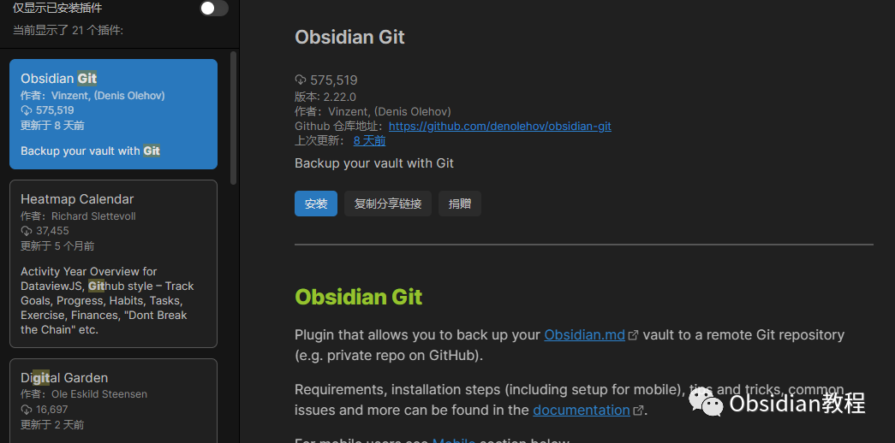
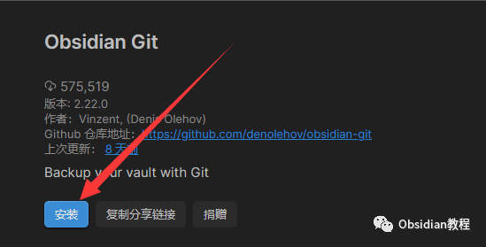

# Obsidian Git 插件：自动备份笔记到Git并提供版本控制

### 

### 点击下方公众号，回复关键字：**Obsidian** ，获取Obsidian资料合集。

### 

  

随着笔记的积累，怎样有效地备份和管理成为了一个挑战。有了Obsidian Git这款插件，你可以轻松将你的Obsidian笔记备份到Git，并享受Git为你带来的高效版本控制。

  

### 

1**什么是Obsidian Git？**   
Obsidian Git 为 Obsidian 用户提供了一个强大而灵活的解决方案，将世界上最强大的版本控制系统集成到了笔记应用中。无论你是团队合作还是个人使用，Obsidian Git 都能为你带来极大的便利。  

### **1\. 功能和特点**

**  
**

  * 自动备份：每当你的笔记发生更改时，Obsidian Git 可以自动将这些更改提交到你的 Git 仓库，确保你的内容始终有备份。
  * 手动备份：如果你不喜欢自动备份，可以随时点击一下按钮，手动将更改推送到 Git 仓库。
  * 历史版本：有时我们可能误删内容或想要查看笔记的早期版本。通过Obsidian Git，你可以轻松回溯并查看你笔记的历史版本。
  * 多设备同步：使用 Git 仓库，你可以在多个设备之间同步你的笔记。例如，你可以在办公室的电脑上编写笔记，然后在家里的电脑上继续编辑。
  * 冲突解决：如果你在多个设备上编辑同一个笔记，Obsidian Git 会帮助你识别和解决这些更改之间的冲突。

###   

### **2\. 使用场景**

**  
**

  * 团队协作：团队成员可以共同编辑和更新同一组笔记，并利用Git的功能跟踪每个成员的更改。
  * 学术研究：研究者可以使用 Obsidian Git 来跟踪他们的研究笔记，确保每一次修改都有记录。
  * 日常笔记：日常用户可以享受到 Git 提供的强大备份功能，保证笔记安全。

###   

### **3\. 使用前提**

  
使用 Obsidian Git 需要一些基础的 Git 知识，如如何设置远程仓库、如何解决合并冲突等。但即使你不是Git专家，通过简单的学习和实践，也可以轻松掌握。

### 

2**如何设置和使用Obsidian Git？**   
安装插件：首先，确保你已经安装了Obsidian。打开Obsidian，进入设置 -> 插件 -> 社区插件，搜索 "Obsidian Git" 并安装。  
**  
****设置Git仓库：**  

  * 如果你还没有Git仓库，需要在GitHub或GitLab上创建一个新的仓库。
  * 安装git在你的计算机上。
  * 使用git clone命令将仓库克隆到你的Obsidian笔记所在的文件夹。

  
**插件配置：**  

  * 打开Obsidian，进入设置 -> 插件选项 -> Obsidian Git。
  * 根据需要配置备份间隔、自动拉取等选项。

  
**使用：**  
每次你做了更改，Obsidian Git会根据你设置的间隔自动备份，或者你可以点击工具栏上的Obsidian Git图标手动备份。  
如果你想查看历史版本或进行其他Git操作，你可以直接在仓库所在的文件夹使用git命令。

### 

3**结论**   
Obsidian Git为Obsidian用户提供了一个强大的版本控制和备份工具。无论你是希望在多设备间同步笔记、查看历史更改，还是只是为了安全备份，Obsidian Git都是一个不可或缺的工具。  
  
  
1**扫码购买****《 Obsidian实战教程》****从入门到精通， 链接您的每一个思维瞬间。****  
**  
往 期精彩[1.Obsidian插件:Mind Map - 将你的笔记转化为思维导图](http://mp.weixin.qq.com/s?__biz=MzkyMDUyMDM2Mg==&mid=2247483845&idx=1&sn=ad8ce1c9212d6c1d261faec1e038d848&chksm=c190d200f6e75b16810f9ce688c67db9b4e4d38e54c740e6799b405a0291e4d3b1bc347943d7&scene=21#wechat_redirect)  
[2.为Obsidian添加Kanban功能：管理任务和项目](http://mp.weixin.qq.com/s?__biz=MzkyMDUyMDM2Mg==&mid=2247483837&idx=1&sn=efbeb3de938067424152467d7bcaf377&chksm=c190d278f6e75b6e891a24ef2e69b5d9e54f5b88cabd99e8758ea9eedf3b9c08020ec3673c71&scene=21#wechat_redirect)  
[3.Obsidian插件-Sliding Panes（Andy Matuschak Mode），让笔记像堆叠的卡片](http://mp.weixin.qq.com/s?__biz=MzkyMDUyMDM2Mg==&mid=2247483829&idx=1&sn=ad4344a210175ec0e40b83dff7afbf10&chksm=c190d270f6e75b664b42a1fe1e599a3565f52817095536d24cb7d124b16f6d1d807f5eed140c&scene=21#wechat_redirect)

点分享

点点赞

点在看

****  

