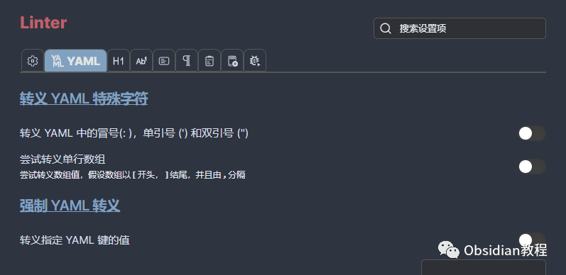
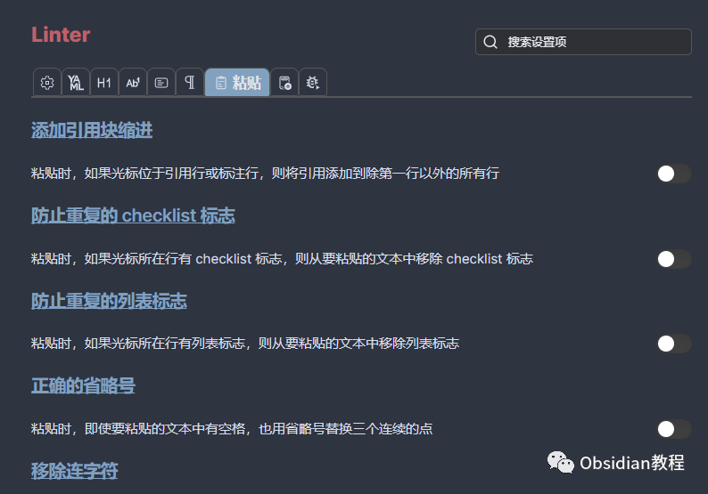
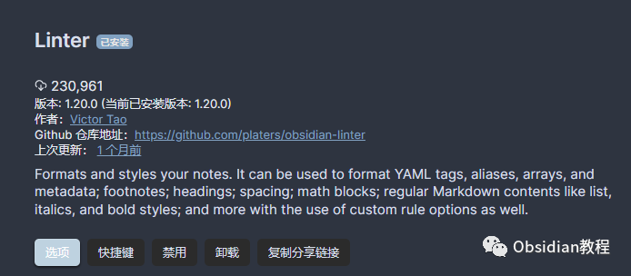
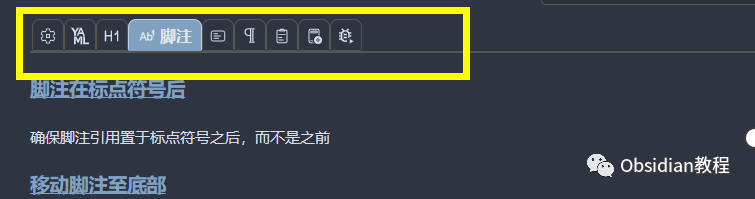
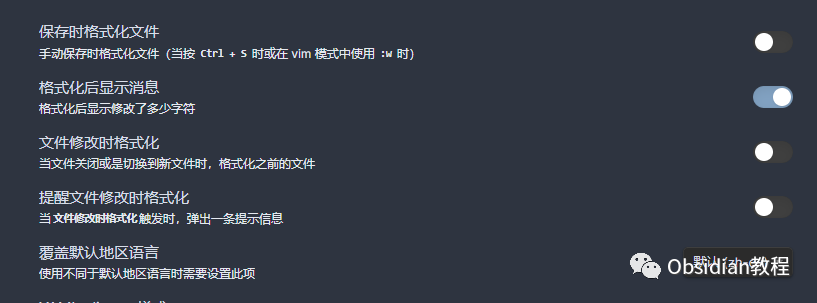

# Obsidian Linter插件：打造统一、美观的笔记环境

### 点击下方公众号，回复关键字：**Obsidian** ，获取Obsidian资料合集。

  

Obsidian作为一款优秀的笔记管理软件，其强大之处不仅仅在于基础功能，更在于其丰富的插件生态。而在这众多插件中，Linter插件无疑是一个亮眼的存在。

  

它可以帮助用户以极高的自由度和扩展性，对笔记进行格式化和样式化，以确保你的笔记整洁、统一且富有美感。下面就让我们一起来深入了解一下这款插件的特点和功能。

  

1

## 

## 功能特点

###   

### **1\. 规则多样，应用广泛**

  

Linter插件提供了多种格式化和样式化规则，覆盖了YAML、Markdown标题、脚注、内容、空格处理等多个方面。

  

这些规则能够独立运行，但同时也需要注意，某些规则之间可能存在交集，可能会影响最终的格式化结果。

  

### **2\. 高度可配置和可扩展**

  

Linter插件的设计核心是配置性和扩展性。用户可以在设置中轻松切换和配置规则，以满足自己的格式化需求。同时，插件还支持通过添加新规则来扩展其功能，实现更多个性化的格式化效果。

  

### **3\. 丰富的文档支持**

  

插件提供了丰富的文档支持，包括所有规则的详细文档和安装使用指南。这为用户提供了强大的参考和支持，使得用户能够更好地理解和使用插件。

  

2

## 

## 下载与安装

###   

### ****

首先，确保你已经安装了Obsidian软件。

### **  
**

### **1.在线安装**（需要科学上网） ：****

  
1.在Obsidian的设置中，找到“第三方插件”选项，点击“社区插件”2.在搜索框中输入“Linter”，找到并安装它。3.安装完成后，激活该插件，在成功安装插件后，我们需要对其进行简单的配置，以符合我们的需求。  

**2.离线安装：****  
****因为网络原因很多同学无法直接在线安装obsidian插件，这里我已经把obsidian所有热门插件下载好了**  
只需要关注下方公众号，后台回复：**插件** 即可获取  
3

## 

## 基本使用

###   

### **1\. 配置规则**

  

在安装并启用插件后，你可以在设置中配置你想要启用的规则，以及每个规则的具体设置。

  

### **2\. 格式化笔记**

  

根据你的配置，Linter插件会自动对你的笔记进行格式化。你也可以手动触发格式化操作，以确保你的笔记始终保持统一和整洁的格式。

  

4

## 

## 注意事项

###   

### **规则冲突**

  

由于某些规则之间可能存在交集，因此在配置规则时需要注意避免可能的规则冲突，以确保得到满意的格式化结果。

  

5

## 

## 结语

  

Obsidian Linter插件为用户提供了强大而灵活的笔记格式化工具，使得管理和美化笔记变得轻而易举。

  

如果你是一个对笔记格式有较高要求的用户，那么Linter插件绝对值得一试。它不仅能帮助你保持笔记的整洁和统一，更能通过丰富的配置和扩展性，让你的笔记变得独一无二。

  
  
  
1**扫码购买****《 Obsidian实战教程》****从入门到精通， 链接您的每一个思维瞬间。****  
**  
往 期精彩[1](http://mp.weixin.qq.com/s?__biz=MzkyMDUyMDM2Mg==&mid=2247484119&idx=1&sn=b1491121e681ce684988d100cf588dd0&chksm=c190d112f6e758048455acc822832f8db8750e60becfe3020bfdda9fba175a1e7a00f159a1d5&scene=21#wechat_redirect).[Better Count Word让Obsidian成为你写作的得力助手](http://mp.weixin.qq.com/s?__biz=MzkyMDUyMDM2Mg==&mid=2247484238&idx=1&sn=0dec0c9d2c26ed37acba69d651363406&chksm=c190d08bf6e7599d0fa9d00909946acacbec9c2606861c4825b21ab3a5ee1e161de8241cbb83&scene=21#wechat_redirect)2.[Obsidian插件:Checklist优雅地管理任务](http://mp.weixin.qq.com/s?__biz=MzkyMDUyMDM2Mg==&mid=2247484172&idx=1&sn=b3ef41c7b7b7fcb754e868e0b3f37d5d&chksm=c190d0c9f6e759df680179ef848c5f8318ad22934bb7516fb68374de5a8e8a2b0dc2829b5aa9&scene=21#wechat_redirect)  
3.[Obsidian插件:Day Planner，规划你的一天](http://mp.weixin.qq.com/s?__biz=MzkyMDUyMDM2Mg==&mid=2247484148&idx=1&sn=0bbd2cb464c8f051da65642eab1eeab5&chksm=c190d131f6e75827dadf81f1ea4a430828a481d8a0206ac010d4b47001f930fe6ec57cdc2068&scene=21#wechat_redirect)  

点分享

点点赞

点在看
