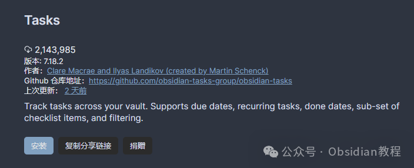

# Obsidian Tasks 插件，超强的任务管理神器！

嗨，我是鬼哥，10 年+的老程序员，同时也是 Obsidian 的忠实用户。

要说 Obsidian 这个软件，真是让人又爱又恨——它的自由度太高了！光是管理笔记就已经让人头大，要是再加上任务管理，简直要变成混乱灾难现场。

还好，有个插件直接解决了这个问题，那就是 **Obsidian Tasks** 。

Obsidian Tasks 不是普通的待办事项工具，它的厉害之处在于 **深度集成 Obsidian** ，可以在整个笔记库里追踪任务，并通过查询直接找到所有待办事项。不管是日常任务、定期重复任务，还是项目管理，它都能轻松搞定。

更重要的是，它不会像一些独立的 To-Do 应用那样让你「出戏」，而是无缝融入到你的 Obsidian 工作流里，完全不会打断思维。

今天，鬼哥就带大家深入了解 Obsidian Tasks，看看它能给 Obsidian 用户带来哪些实实在在的便利。

## **Obsidian Tasks 能做什么？**

Obsidian Tasks 主要的功能点如下：

✅ **全局任务管理** ：支持在整个笔记库（vault）中追踪任务，所有任务数据存储在 Markdown 里，方便可控。  
✅ **查询功能** ：可以用查询语句找到所有未完成任务，并按需求排序、分组。  
✅ **任务状态同步** ：在查询视图中标记任务完成后，源文件的任务状态也会自动更新，避免重复操作。  
✅ **支持日期管理** ：

  * **截止日期（due date）** ：任务的最终期限
  * **计划日期（scheduled date）** ：任务的预计开始时间
  * **完成日期（done date）** ：任务完成的时间  
✅ **支持重复任务** ：例如「每周五开会」「每月 1 号交房租」这样的循环任务，Tasks 也能搞定。  
✅ **与 Obsidian 主题兼容** ：默认支持 Obsidian 的原生主题，无需额外调整。  
✅ **强大的快捷键支持** ：可以用快捷键一键完成任务管理，提高效率。

说白了，Obsidian Tasks 不是要取代你的任务管理工具，而是让你的 **Obsidian 笔记** 变得更智能、更有条理。

## **安装 Obsidian Tasks**

想要体验 Obsidian Tasks，安装方法非常简单：

  1. 打开 Obsidian，进入 **「设置」→「社区插件」→「浏览」**
  2. 搜索 `Tasks`，找到 **Obsidian Tasks**
  3. 点击 **「安装」** ，然后启用插件
  4. 进入 **「插件设置」** ，可以根据需求调整全局筛选器（Global Filter）

  

**离线安装** ：如果你无法在线安装插件，别担心，我已经把热门插件下载好了点击下方公众号，回复关键字：**Obsidian** ，获取Obsidian资料合集。

**⚠️ 推荐设置**

  * 把 **「Tasks: Toggle Done」** 设为 `Ctrl + Enter`（Mac 用户用 `Cmd + Enter`），这样可以快速标记任务完成。
  * 建议 **全局筛选器** 设为 `#task`，这样所有任务都会加上 `#task` 标签，方便管理。

## **如何使用 Obsidian Tasks？**

**1\. 创建任务**

在 Markdown 里直接写任务，格式如下：
    
    
    - [ ] 读完《掌控习惯》  
    - [ ] 复习 Obsidian Tasks 插件教程 📅 2025-03-13  
    - [ ] 购买机票 🔁 每月 1 日 ⏳ 2025-04-01  
    

其中：

  * `[ ]` 表示未完成任务
  * 📅 `2025-03-13` 是任务的 **截止日期**
  * 🔁 `每月 1 日` 是 **重复任务**
  * ⏳ `2025-04-01` 是 **计划开始时间**

**2\. 查询任务**

在 Markdown 里使用 `tasks` 代码块查询任务：
    
    
    not done  
    due before tomorrow  
    limit 100  
    group by filename  
    sort by due reverse  
    sort by description  
    

这段代码的意思是：

  * 只查询 **未完成** 的任务
  * 查找 **截止日期在今天或之前** 的任务
  * 只显示 **最多 100 个任务**
  * 结果 **按文件分组**
  * **按截止日期倒序排序**
  * **按任务描述排序**

🔍 **查询效果** ：

  * 你可以在 Obsidian 里直接看到哪些任务最紧急，不用翻阅所有笔记。
  * 任务状态可以直接在查询结果里更改，源文件会自动同步，非常智能！

**3\. 编辑任务**

使用命令 `Tasks: Create or edit` 可以快速修改任务，而不用手动去 Markdown 里改，省时省力。

## **实战案例：Obsidian Tasks 适用场景**

**1\. 个人日程管理**

假设你是个自由职业者，平时要处理很多任务，比如写文章、跟客户沟通、做项目管理等。用 Obsidian Tasks，你可以把所有任务写在笔记里，然后用查询找出：

  * 今天必须完成的任务
  * 本周的待办事项
  * 重要项目的进度

**2\. 读书笔记管理**

如果你在 Obsidian 里做阅读笔记，可以用 Tasks 插件来记录书单和阅读进度：
    
    
    - [ ] 读《深入理解计算机系统》 📅 2025-03-20  
    - [ ] 看《精通正则表达式》 📅 2025-04-01  
    

然后用查询语句筛选 **未读完的书** ，一目了然。

**3\. 学习计划**

如果你在学习新技能，比如编程、写作，可以用 Tasks 设定学习任务，并用查询查看每日进度：
    
    
    - [ ] 学习 Rust 语言基础 📅 2025-03-15  
    - [ ] 完成 Python 项目实战 🔁 每周一  
    

这样 Obsidian 就变成了你的智能学习助手！

## **与其他任务管理工具对比**

功能对比| Obsidian Tasks| Todoist| Things 3| Notion  
---|---|---|---|---  
**Markdown 兼容**|  ✅| ❌| ❌| ❌  
**Obsidian 集成**|  ✅| ❌| ❌| ❌  
**支持查询和筛选**|  ✅| ✅| ✅| ✅  
**支持重复任务**|  ✅| ✅| ✅| ✅  
**完全本地化**|  ✅| ❌| ✅| ❌  
**免费**|  ✅| ❌（高级功能需订阅）| ❌| ✅  
  
**总结一下** ：

  * 如果你 **依赖 Obsidian 记笔记** ，Tasks 是最好的选择，因为它无缝整合 Markdown 笔记。
  * 如果你更喜欢 **独立的任务管理工具** ，Todoist 或 Things 3 可能更合适。
  * Notion 也能管理任务，但它对 Markdown 兼容性较差，任务管理体验不如 Tasks。

用了 Obsidian Tasks 一段时间，我最大的感受是：**它让 Obsidian 变成了一个真正的生产力工具，而不仅仅是个笔记软件** 。

特别是对于 **喜欢 Markdown 和本地存储** 的人来说，这个插件简直是神器。

如果你也用 Obsidian 记笔记，又希望高效管理任务，那 **Tasks 绝对值得一试！**

###   

### 点击下方公众号，回复关键字：**Obsidian** ，获取Obsidian资料合集。

****  
****

****-END****-****

**ok，今天先说到这，如果你想更深入的了解Obsidian，现在只要购买我们的《Obsidian实操案例课》，便可免费加入「玩转效率笔记」社群，与一群人交流效率提升的经验，实现自我管理的目标。**
