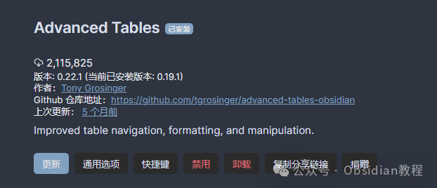
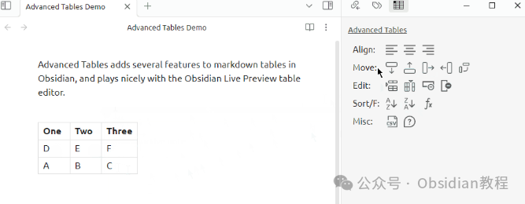
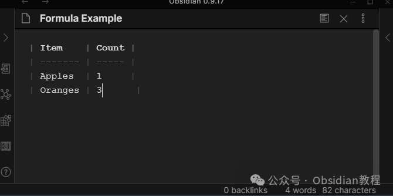

# Obsidian Tasks 插件：Advanced Tables，让你的 Markdown 表格操作丝滑流畅

嗨，我是鬼哥，10 年+老程序员一枚。今天要聊的是 Obsidian 里的表格问题，说实话，Obsidian 自带的 Markdown 表格编辑体验……可以说是相当“硬核”了。

基本上，你得手动输入 `|` 和 `-`，然后调整对齐，格式错了还得自己修复，写个表格仿佛是在玩字符拼图。

别说复杂表格了，就算是简单的表格，有时候改个数据都能让人怀疑人生。这种时候，就该让 **Advanced Tables** 这个插件上场了！

它相当于 Obsidian 里的 Excel，让你的 Markdown 表格操作起来丝滑流畅，直接从“手搓”进化到“自动化”——格式化、对齐、排序、公式、导航……通通不在话下。

  

今天，鬼哥就带大家深入了解一下 **Advanced Tables** ，看看它能让 Obsidian 里的表格有多爽！

## **Advanced Tables 到底能做啥？**

**Advanced Tables** 主要是给 Obsidian 的 Markdown 表格带来**更智能的编辑体验** ，让你不用再手动对齐表格，或者费劲儿调整列宽。简单来说，它让表格编辑变得更像 Excel，而不是一堆难看的 `|` 和 `-` 符号。

它的主要功能包括：

  * **自动格式化** ：输入表格后，插件会自动调整格式，不用手动修正对齐。
  * **Excel 风格的表格导航** ：用 `Tab` 或 `Enter` 在单元格间自由移动，就像在 Excel 里一样顺滑。
  * **支持 Markdown 里的表格公式** ：是的，你可以在 Markdown 里写公式，甚至做简单的计算。
  * **快速调整行列** ：可以随意增加、删除或移动列和行。
  * **支持列对齐** ：可以把列内容设置为左对齐、居中或右对齐，提升可读性。
  * **按列排序** ：比如按日期、数值等排序，让你的数据更有条理。
  * **支持 CSV 导出** ：一键导出 Markdown 表格为 CSV，方便在 Excel 或其他工具里使用。
  * **适配 Obsidian Mobile** ：虽然移动端不能用 `Tab` 和 `Enter` 导航，但可以把快捷命令添加到工具栏里，用按钮来操作表格。

  

是不是感觉很爽？其实，这些功能真正用起来，比描述的还要顺手，接下来鬼哥就带你看看它具体怎么用！

## **如何使用 Advanced Tables**

**1\. 快速创建表格**

**安装了插件后，创建表格的方式就变得超级简单：**

  1. 在 Obsidian 里输入 `|`（竖线符号），然后输入表头名称。
  2. 按 `Tab` 键，就会自动创建下一个表头列，继续输入表头。
  3. 按 `Enter`，进入第一行，继续输入数据。
  4. 再按 `Enter`，自动跳到下一行……就这样，你的表格就诞生了！

比如，你输入：
    
    
    | 名字 | 年龄 | 职业 |  
    |----|----|----|  
    | 张三 | 25 | 程序员 |  
    

插件会**自动帮你格式化** ，确保表格对齐整齐，再也不用手动调 `-` 了！

**2\. 高效的表格导航**

在 Markdown 里，普通的表格编辑基本靠鼠标点，或者用方向键慢慢挪。而 **Advanced Tables** 让你可以像在 Excel 里一样畅快地移动：

快捷键| 作用  
---|---  
`Tab`| 跳到下一个单元格  
`Shift + Tab`| 跳到上一个单元格  
`Enter`| 跳到下一行  
`Ctrl + Shift + D`| 打开表格控制面板  
  
如果你记不住快捷键，可以打开命令面板（`Ctrl + P`），搜索 `Advanced Tables`，里面会有所有命令列表，记得往下翻，还有很多隐藏功能！

## **Markdown 里的表格公式？是的，支持！**

一般来说，Markdown 里的表格只是展示数据，但 **Advanced Tables** 让你可以**像在 Excel 里一样使用公式** ！

比如，你有个销售数据表：
    
    
    | 产品 | 单价 | 数量 | 总价 |  
    |----|----|----|----|  
    | A | 10 | 2 | =B2*C2 |  
    | B | 15 | 3 | =B3*C3 |  
    | C | 8  | 5 | =B4*C4 |  
    

这个 `=B2*C2` 这样的表达式会自动计算，并且在 Obsidian 里显示结果！公式可以用来做加法、减法、乘法、平均值等计算，让 Markdown 表格不再只是静态的数据，而是**动态计算的数据表** 。

## **如何安装 Advanced Tables**

这个插件属于 Obsidian 社区插件，所以安装起来很方便：

  1. 打开 **Obsidian 设置** ，进入 **第三方插件** 。
  2. 关闭 **安全模式** （不然看不到社区插件）。
  3. 点击 **浏览社区插件** ，在搜索栏输入 `Advanced Tables`。
  4. 找到 **Advanced Tables** 插件，点击 **安装** 。
  5. 安装完成后，点击 **启用** ，就可以开始用了！

**离线安装** ：如果你无法在线安装插件，别担心，我已经把热门插件下载好了点击下方公众号，回复关键字：**Obsidian** ，获取Obsidian资料合集。

## **移动端如何使用？**

在 Obsidian 手机版上，`Tab` 和 `Enter` 不能用来跳格子，但是你可以：

  1. 打开 **快捷命令设置** ，把 **“下一单元格”** 和 **“下一行”** 命令加到工具栏。
  2. 也可以打开插件的 **侧边栏控制面板** ，用里面的按钮来调整表格。

这样即使在手机上，也可以比较流畅地编辑表格。

老实说，在用 **Advanced Tables** 之前，我对在 Obsidian 里编辑表格是有心理阴影的。那时候，哪怕是简单的表格，都得手动对齐 `|----|----|`，稍微一改就全乱套，一不小心就成了“表格灾难现场”。

但用了这个插件后，Markdown 表格终于不再是“手动修正对齐的噩梦”了！只要输入 `|` 然后按 `Tab`，就能轻松建表，连公式都支持，数据计算都能搞定，真的可以说是 **Obsidian 里最接近 Excel 的体验** 。

如果你经常需要在 Obsidian 里用表格，那这个插件绝对值得装！省时省力，效率直接拉满！

### 点击下方公众号，回复关键字：**Obsidian** ，获取Obsidian资料合集。

****-END****-****

**ok，今天先说到这，如果你想更深入的了解Obsidian，现在只要购买我们的《Obsidian实操案例课》，便可免费加入「玩转效率笔记」社群，与一群人交流效率提升的经验，实现自我管理的目标。**
