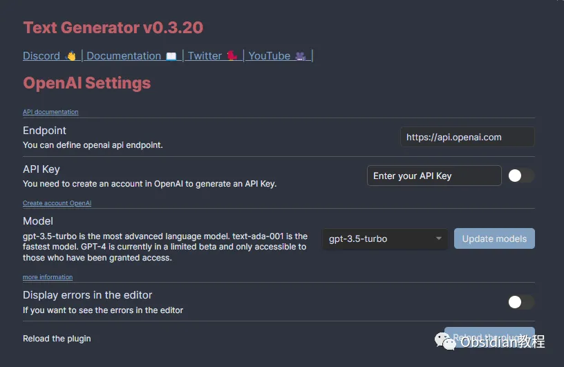
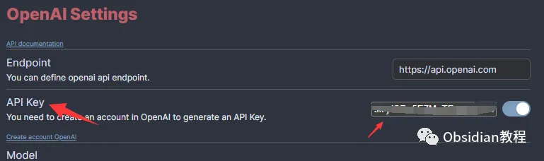
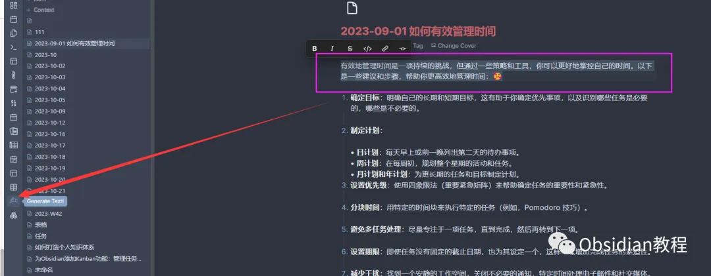
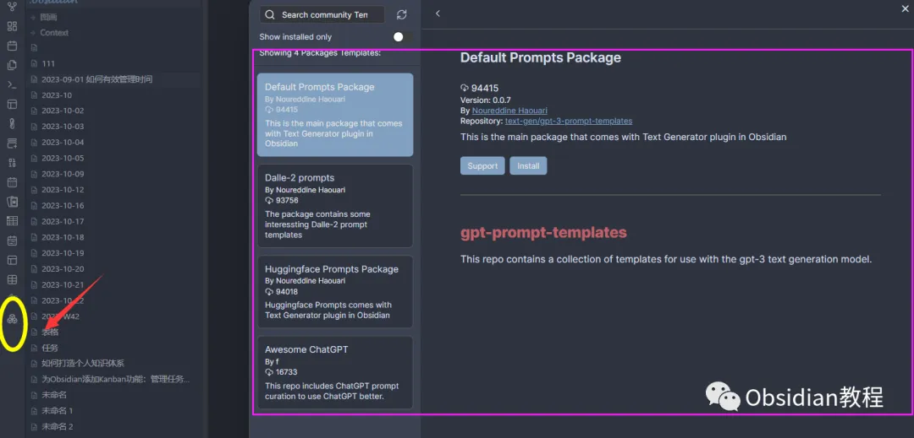

# Obsidian Text Generator：知识管理的完美工具

嗨，大家好，我是何老师。

  

你是否曾想过在 Obsidian 里，除了自己整理知识，还能有个强大的 AI 帮手随时为你提供灵感？

  

如果你还没有用过 Text Generator 插件，那你真的看看这篇文章了！

  

它不仅可以生成文本、摘要，还能帮你简化各种重复性任务，完全是 Obsidian 中的一个亮眼小工具。

**Text Generator 是什么？**

  

Text Generator 是一款开源的 AI 工具，专门为 Obsidian 量身定做，帮助你轻松实现内容生成。

  

不论你是想生成一段有创意的文字，还是为你的笔记整理出一个简明扼要的摘要，Text Generator 都能帮你搞定。

  

这就好比你身边有一个随时在线的“智能专家”，可以帮助你高效地在 Obsidian 中创建和组织知识。

  

**为什么选择 Text Generator？**

  

**1.免费且开源：** 没有什么比免费更吸引人的了，Text Generator 不仅好用，而且是开源软件，你无需担心任何授权费用。

  

**2.与 Obsidian 完美结合：** Obsidian 本身就已经是一个非常强大的个人知识管理工具，而 Text Generator 的加入可以让它更上一层楼。你可以通过它更好地管理、创作和优化你的笔记系统。

  

**3.灵活的提示与上下文结合：** Text Generator 支持 “Considered Context” 功能，你可以根据上下文提供提示，使生成的内容更符合你的需求和笔记风格。

  

**4.模板引擎：** 如果你有一些重复性任务，比如写作摘要或者生成大纲，Text Generator 可以通过模板引擎帮你快速完成这些任务。

  

**5.社区模板：** 不用担心自己没有想法！你可以从社区分享的模板中发现很多有趣的用法，也可以分享你的模板，帮助更多人。

  

**6.多样的配置选项：** Text Generator 支持通过 Frontmatter Configuration 自定义配置，可以结合 OpenAI、HuggingFace 等服务，极大地拓展了功能使用的可能性。

  

**安装和配置**

  

如果你已经迫不及待想要体验 Text Generator 的强大功能，下面是简单的安装步骤。

  

**1.在线安装（需要科学上网）**

  

1\. 打开 Obsidian 设置，找到“第三方插件”选项。

2\. 点击“社区插件”，然后在搜索框中输入“Text Generator”。

3\. 找到插件后，点击安装，并激活插件。

  

**2.离线安装**

  

###  很多同学无法直接在线安装obsidian插件，这里我已经把obsidian所有热门插件下载好了  
只需要关注下方公众号，后台回复：**插件** 即可获取安装完成后，进入 Obsidian 设置中的 Text Generator 插件配置界面。选择你想要使用的 AI 服务，比如 OpenAI 或 HuggingFace。注意，这里需要你输入 API key 来激活 AI 功能。

**如何用 Text Generator 生成文本？**

  

Text Generator 的使用非常简单，下面是快速上手的几个步骤：

  

**1.新建一个笔记：** 在 Obsidian 中，创建一个新文件。

**2.输入提示：** 在笔记中写下你希望生成内容的提示，启动 Text Generator 插件。

**3.查看生成结果：** 几秒钟后，AI 就会为你生成相应的文本，帮你快速完成写作。

**使用模板来简化重复任务**

  

如果你经常需要为笔记生成一些固定格式的内容，比如文章摘要、清单或者大纲，Text Generator 的模板引擎功能简直就是为你量身定做的。

  

通过设置模板，你只需要填写一些必要的内容，插件就能自动帮你完成其他部分，大大节省了重复操作的时间。

  

例如，如果你经常为文章生成摘要，可以创建一个摘要模板。每次写作时，只需输入文章的主题和关键点，Text Generator 就会为你自动生成完美的摘要内容。

**使用建议  
  
**

虽然 Text Generator 强大且功能丰富，但你需要多尝试，不要害怕去实验不同的功能设置。

  

插件的灵活性允许你随时调整，找到最适合自己工作流的使用方式。  

  

**总结**

  

Text Generator 真的是一款不可多得的好工具。它的开源免费特性，灵活的配置选项，加上与 Obsidian 的无缝集成，让我在处理日常工作时更加得心应手。

  

对于喜欢高效工作、管理信息的朋友来说，这个插件简直是福音。如果你还没试过，那可真的得赶紧装上了，开启属于你的 AI 写作之旅！  

# **Obsidian交流社群来了**

[**我们搞了一个专门分享笔记工具的社群：**](http://mp.weixin.qq.com/s?__biz=MzkyMDUyMDM2Mg==&mid=2247485997&idx=1&sn=9a528871be62e4c74a1df3807b28f2bd&chksm=c190d9e8f6e750fe9df7a333b666fdd8561fdeb928d1df1f367d2374742efa34727a3f91cbc0&scene=21#wechat_redirect)****[**玩转效率笔记**](http://mp.weixin.qq.com/s?__biz=MzkyMDUyMDM2Mg==&mid=2247485997&idx=1&sn=9a528871be62e4c74a1df3807b28f2bd&chksm=c190d9e8f6e750fe9df7a333b666fdd8561fdeb928d1df1f367d2374742efa34727a3f91cbc0&scene=21#wechat_redirect)，社群的主要内容包括**使用技巧、模板主题和插件** 等，帮助更多人提升效率，实现自我管理的目标。  
如果你对Notion、Obsidian有热情、对知识有渴望，这个社群绝对不容错过！
