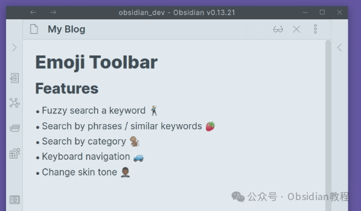

# Obsidian 必备！Emoji Toolbar 插件让你的笔记更生动~

今天咱们聊聊 Obsidian 里的一个小神器——Emoji Toolbar 插件。  
别小看这个小插件，它能让你的笔记瞬间生动起来📚。  
作为一个重度 Obsidian 用户，我觉得给笔记加点 emoji，真的可以大大提升阅读体验和表达效果。  
毕竟，生活已经够无聊了，我们的笔记何必也那么单调呢？  

### **Emoji Toolbar 插件**

####   

#### **介绍**

  
Emoji Toolbar 是一个专为 Obsidian 设计的插件，它可以让你在编辑器中快速搜索并添加表情符号😄。  
你可以通过简单的关键词搜索找到你想要的表情，并插入到你的笔记中。说实话，有时候一个小小的表情就能传达出很多文字无法表达的情感，简直是笔记界的神助攻✨。

#### **使用方法**

  
启用这个插件后，你会在 Obsidian 的热键设置中发现一个新的选项，叫做“Emoji Toolbar: Open emoji picker”🔍。  
你可以根据自己的习惯设置这个快捷键。按下快捷键后，你就可以通过输入关键词来搜索表情符号了。找到你心仪的表情符号后，点击它或者使用箭头键选择后按回车键就能插入到你的笔记中。  

这个插件还支持肤色选择、模糊搜索、选择最近使用的表情等功能👍。  
最棒的是，它还提供了 Twitter 表情符号格式，这在预览和插入模式下都能提升表情符号的支持效果🐦。  

#### **功能亮点**

**  
**

  1. **肤色支持** ：你可以选择不同肤色的表情符号，贴合你的表达需求👩🏾‍🦱👨🏼‍🦰。
  2. **模糊搜索** ：只要输入相关关键词，插件会自动帮你匹配最合适的表情符号🔎。
  3. **最近使用** ：插件会记录你最近使用的表情符号，方便下次快速找到📈。
  4. **Twitter 表情符号格式** ：这一功能可以在 Emoji Toolbar 设置选项中开启或关闭，根据你的需要来调整🔄。

####   

#### **下载与安装**

  
要安装 Emoji Toolbar 插件，首先你需要确保 Obsidian 的安全模式是关闭的🔒。  
接下来按照以下步骤操作：  

  1. 点击 Obsidian 的设置按钮，然后选择第三方插件⚙️。
  2. 确保安全模式已关闭🔕。
  3. 点击社区插件，然后选择浏览🔍。
  4. 搜索 “Emoji Toolbar”🔎。
  5. 找到后点击安装并启用✅。

  
这样，你的 Obsidian 里就有了一个超级方便的 Emoji 工具啦！🎉  

### **离线安装：****  
****很多同学无法直接在线安装obsidian插件，这里我已经把obsidian所有热门插件下载好了**  
只需要关注下方公众号，后台回复：**插件** 即可获取

### 

  

#### **使用心得**

  
使用 Emoji Toolbar 后，我的笔记变得更加有趣和多彩了🌈。  
不仅如此，通过模糊搜索功能，我可以更快地找到想要的表情符号，再也不用在网上一个一个地复制粘贴了⌨️。  
肤色支持这一点也很贴心，让我们可以选择更符合个人风格的表情符号🧑🏽‍🦰。总的来说，这个插件让我的 Obsidian 使用体验更加愉快，也更能表达出我在笔记中想要传达的情感和语气❤️。  
如果你也像我一样是个 Obsidian 重度用户，而且喜欢让你的笔记变得更生动有趣，那么 Emoji Toolbar 绝对是你不容错过的插件。  
赶紧去试试吧，给你的笔记加点料！🚀

> **对obsidian感兴趣的同学，可以链接我微信：hls404 拉你进入“obsidian交流社群”。**

  
**热门推荐**  
**  
**

  * [告别杂乱笔记！Periodic Notes插件让你的Obsidian更高效](http://mp.weixin.qq.com/s?__biz=MzkyMDUyMDM2Mg==&mid=2247485926&idx=1&sn=08f94ccc5bd059ed65cc0d4b03db72dd&chksm=c190da23f6e753357596438122483832b6595111839928e34bd2c24aba53b0ebd949eab46471&scene=21#wechat_redirect)

  * [Obsidian插件Checklist ：告别任务混乱，管理笔记任务更高效！](http://mp.weixin.qq.com/s?__biz=MzkyMDUyMDM2Mg==&mid=2247485918&idx=1&sn=01d5a599debc683af26537c24d89cd13&chksm=c190da1bf6e7530d2f52a94b57e3853be7dc4b607474180870eef6bef32370ccd053b949dd5a&scene=21#wechat_redirect)

  * [Obsidian神级插件：Natural Language Dates ，助你高效管理笔记!](http://mp.weixin.qq.com/s?__biz=MzkyMDUyMDM2Mg==&mid=2247485907&idx=1&sn=ab5a21e4c9b9b0329309b5757615e988&chksm=c190da16f6e753009c66ae6da91b7d7ba7c6310ab8f1cb002c17e85d5382ff422548a3181816&scene=21#wechat_redirect)  

