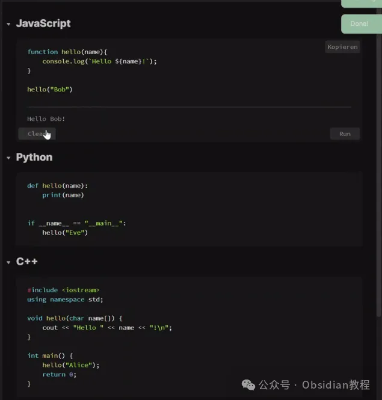
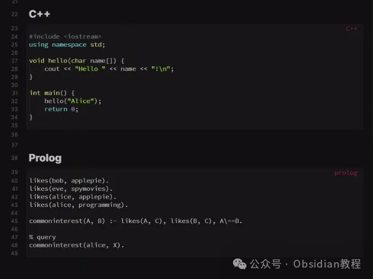
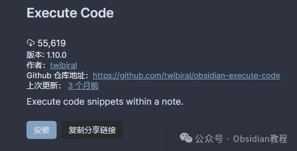
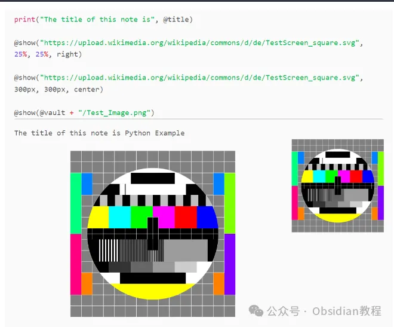
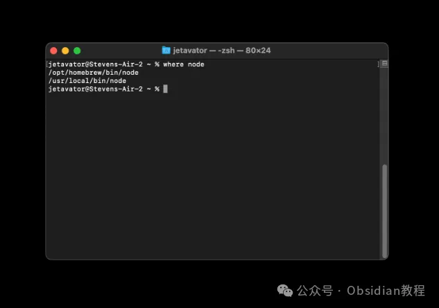

# Obsidian 插件 Execute Code：让代码在笔记中“跑”起来

嗨，大家好，我是何老师。

  

今天要给大家介绍一个能够把Obsidian变成“迷你编程环境”的神器插件——Execute Code。

  

要知道，Obsidian的强大之处不仅在于它是一款优秀的笔记工具，更在于它那庞大的插件生态。各种插件赋予了Obsidian超乎想象的扩展能力。

  

而“Execute Code”则是其中的佼佼者，它让你可以在笔记中直接运行代码，让Obsidian从一款“简单的笔记软件”摇身一变成为一个高效的个人编程环境。

  

## **Execute Code 插件概览  
  
**

Execute Code插件的核心功能就是允许用户在Obsidian笔记中直接运行代码。你可以在笔记中写下代码片段，然后通过点击“运行”按钮来查看执行结果。

  

  

插件的这种特性特别适合那些希望在笔记中嵌入代码进行即时演示、算法测试或数据处理的用户。比如，你可以在笔记中编写一些简单的Python代码进行数学计算，也可以用JavaScript代码创建一些动态效果。

  

### **支持的编程语言：多样化的编程环境  
  
**

Execute Code插件支持多种流行的编程语言，包括但不限于C、C++、Java、JavaScript、Python、Kotlin、Rust、TypeScript等。这个多语言支持让它非常适合用来做一些跨语言的对比实验或项目笔记的集成。例如，如果你在学习某种语言时，可以在笔记中同时放置多种语言的代码片段，看看相同功能在不同语言中是如何实现的。

  

  
其中，对于Python、Rust和Octave，插件还支持嵌入式绘图功能，这就意味着你可以直接在Obsidian笔记中生成并显示图表，而无需切换到其他IDE。这种功能对于数据科学家和喜欢用图表分析数据的用户来说简直就是福音。  
  

### **魔法命令：为代码增添额外能力  
  
**

Execute Code插件中还有一个非常有意思的特性——魔法命令（Magic Commands）。它们允许你在代码片段中使用一些预定义的元命令来实现特定功能。  
  
比如，你可以用@vault_path来获取Obsidian当前文件库的路径，或者用@show(ImagePath)来将指定路径下的图片直接显示在笔记中。尽管目前这些魔法命令仅限于JavaScript和Python，但它们已经能够满足大多数Obsidian用户的需求。

  

想象一下，你可以在编写笔记时即时调用文件路径，或者在运行代码时嵌入图像，这种灵活性将大大提升Obsidian的可操作性。  
  

### **笔记本模式：让代码交互更简单  
  
**

Execute Code还提供了类似Jupyter笔记本的“笔记本模式”（Notebook Mode），当前支持JavaScript和Python两种语言。在这种模式下，一个文件中的所有代码块将在同一环境中运行。

  

换句话说，变量、函数和其他上下文信息可以在不同的代码块中共享。这种方式特别适合用于长篇代码笔记的书写或交互式编程教学，让你可以在同一个笔记中连续操作数据，而不必反复定义变量或重写函数。  
  

这种笔记本模式对于那些喜欢通过笔记学习编程或记录编程过程的用户来说，非常具有吸引力。你可以像使用Jupyter Notebook一样，逐步执行代码并在每个步骤中看到即时的结果，同时又能利用Obsidian的其他笔记功能来进行文字描述和结构化管理。  
  

### **安装与配置：快速上手的入门教程  
  
**

要安装Execute Code插件，可以通过Obsidian的社区插件浏览器进行。搜索“Execute Code”并点击安装，安装完成后启用插件即可。对于那些喜欢使用离线安装包的用户，也可以手动下载并安装插件。  
  

### **很多同学无法直接在线安装obsidian插件，这里我已经把obsidian所有热门插件下载好了**  
只需要关注下方公众号，后台回复：**插件** 即可获取

登录Obsidian后进入设置页面，找到“Execute Code”插件设置选项，可以在这里进行进一步的配置，比如自定义全局代码片段、设置笔记本模式和定义不同语言的执行环境。  
  

### **  
全局代码注入：灵活的代码片段管理  
  
**

Execute Code提供了全局代码片段管理功能，你可以在特定语言的代码块前或后自动插入预定义的代码片段。这意味着如果你需要在每个Python代码块中都导入某些常用的库（如NumPy、Pandas），可以直接在全局代码设置中进行定义。这样，每次你创建一个新的Python代码块时，插件就会自动在顶部插入这些库的导入语句，大大提升了效率。  
  

  
同样地，你也可以在代码块之后插入一些清理环境或保存结果的代码片段。比如，在执行某个数据分析任务时，可以在所有代码块执行结束后自动保存结果文件到特定位置，省去了手动操作的麻烦。  
  

### **  
注意事项：执行代码时的小贴士  
  
**

虽然Execute Code插件功能强大，但在使用过程中还是有几点需要注意：  
  

  1. 安全性问题：不要在笔记中执行你不理解或不信任来源的代码。因为插件会在本地环境中直接运行代码片段，因此执行恶意代码可能会导致系统文件被篡改或其他安全隐患。  
  

  2. Linux上的隔离环境问题：如果你使用的是Linux系统，并且Obsidian是通过Snap、Flatpak或AppImage安装的，可能会遇到插件无法访问某些已安装程序的情况。解决方法是确保Obsidian能够访问系统的程序目录，或者使用系统安装的Obsidian版本。  
  

### **与其他插件的兼容性：打造更强大的笔记工作流  
  
**

Execute Code还能够与Obsidian中的其他插件（如Dataview、Excalidraw等）兼容。比如，你可以通过Dataview插件来动态生成数据，并用Execute Code来对数据进行实时处理。  
  
这样就可以创建一个包含数据输入、处理、分析、可视化以及结果展示的完整笔记模板。在数据科学、项目管理、算法学习等场景中，这种插件联动的能力将使得Obsidian成为一个高度定制化、功能全面的个人知识管理平台。  
  

### **实用场景：从代码测试到数据分析  
  
**

无论你是想在笔记中测试一个算法、编写一个小程序片段，还是在做数据分析时随手可视化数据，Execute Code插件都能满足你的需求。它的多语言支持让你能够在同一个笔记中混合使用多种编程语言，而无需切换到不同的开发环境。在教学、算法研究、甚至编程笔记整理中，它都是一个非常有用的工具。  
  

### **总结  
  
**

Execute Code插件通过让Obsidian支持直接运行代码，彻底打破了传统笔记与代码开发工具之间的壁垒。它不仅提升了Obsidian的可扩展性，还为编程学习和实践提供了新的可能。

  

对于那些想要将Obsidian打造成一个功能更全面的个人知识管理和编程工作环境的用户来说，这无疑是一个不可错过的插件。希望这篇文章能够帮助你更好地了解和使用Execute Code插件，把你的Obsidian使用体验提升到新的高度。  
  

# **Obsidian交流社群来了**

[**我们搞了一个专门分享Obsidian的交流社群：****玩转效率笔记****社群的主要内容包括使用技巧、模板主题和插件等，** 帮助更多人提升效率，实现自我管理的目标。](http://mp.weixin.qq.com/s?__biz=MzkyMDUyMDM2Mg==&mid=2247485997&idx=1&sn=9a528871be62e4c74a1df3807b28f2bd&chksm=c190d9e8f6e750fe9df7a333b666fdd8561fdeb928d1df1f367d2374742efa34727a3f91cbc0&scene=21#wechat_redirect)

  
如果你对Obsidian有热情，这个社群绝对不容错过！
