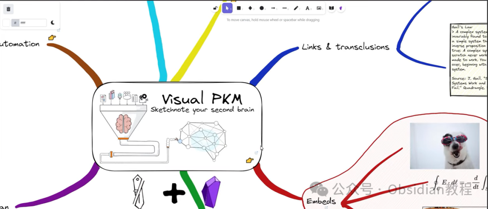
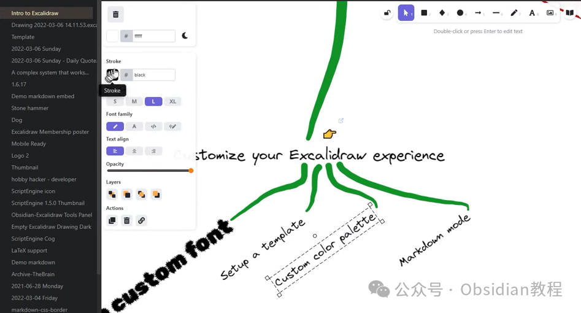
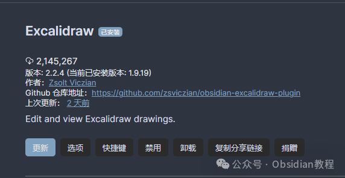
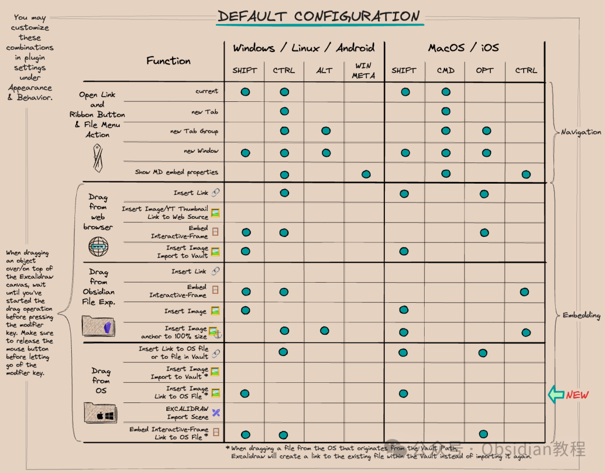

# Obsidian 插件:Excalidraw，在笔记软件里直接画图

  
嗨，我是鬼哥，10年+老程序员一枚。  
今天咱们聊聊 Obsidian 的一款神级插件——Excalidraw。没错，就是那个能让你在笔记软件里直接画图的插件！  
我这几年用 Obsidian 已经用得炉火纯青，各种插件也尝试了不少，但 Excalidraw 绝对是我心中的NO.1。  
为啥呢？因为这玩意不仅能画图，还能把图和笔记结合得天衣无缝，这不就是程序员梦寐以求的生产力工具吗？  


### **一、什么是 Excalidraw？**

  
Excalidraw 是一款功能丰富的草图工具，它的特点是简单易用、功能强大。通过 Obsidian-Excalidraw 插件，你可以在 Obsidian 里创建、编辑和保存 Excalidraw 文件，把它们嵌入到文档中，甚至可以在图中添加链接，实现图文之间的相互跳转。  




  


### **二、为什么要用 Excalidraw？**

  
使用 Excalidraw，你能做的事情真是五花八门。  
比如，你可以在脑图中添加流程图、示意图、关系图，还可以手绘涂鸦，甚至直接插入图片和矢量图。而且，所有这些图都可以和 Obsidian 的笔记系统无缝结合，方便你在写笔记的同时进行可视化的表达和记录。  




### **三、Excalidraw 的下载和安装**

####   


### **1.在线安装**（需要科学上网） ：****

  
在Obsidian中安装插件是一个简单直接的过程：  


  * 打开Obsidian，点击左下角的“设置”图标。
  * 在设置菜单中，选择“第三方插件”选项。
  * 点击“浏览”按钮，搜索“Excalidraw”。
  * 找到插件后，点击“安装”。
  * 安装完成后，切换插件的“启用”开关。

  




### **2.离线安装：****  
****因为网络原因很多同学无法直接在线安装obsidian插件，这里我已经把obsidian所有热门插件下载好了**  
只需要关注下方公众号，后台回复：**插件** 即可获取

  


### **四、如何使用 Excalidraw**

####   


#### **1\. 创建和编辑图形**

  
在 Obsidian 中使用 Excalidraw 创建图形非常简单。只需在任意笔记中输入以下命令即可创建一个新的 Excalidraw 画布：
      
      * 
    
    
    
    ```excalidraw

  
随后，你会看到一个空白的画布，点击它即可开始绘图。  
你可以使用左侧工具栏中的各种工具来创建图形，插入文本和图片，甚至可以绘制自由形状。  


#### **2\. 嵌入图形**

  
绘制完图形后，你可以将它嵌入到任何笔记中。只需将 Excalidraw 文件的路径复制到笔记中即可：
      
      * 
    
    
    
    ![[your-drawing.excalidraw]]

####   


#### **3\. 链接功能**

  
Excalidraw 的一个强大功能是支持双向链接。你可以在图形中添加指向其他笔记或图形的链接，点击这些链接即可跳转到对应的内容。  
具体操作是，选择图形或文本，右键选择“添加链接”，输入目标笔记的路径或URL即可。  


  


### **五、Excalidraw 的优势**

####   


#### **1\. 高效的可视化工具**

  
对于程序员、设计师或任何需要进行可视化表达的人来说，Excalidraw 是一个不可或缺的工具。它不仅能够帮助你快速绘制出各种复杂的图形，还能将这些图形与笔记紧密结合，大大提升工作效率。  


#### **2\. 灵活的编辑和存储**

  
所有 Excalidraw 的文件都存储在 Obsidian 的库中，你可以随时进行编辑和更新。而且，文件格式是纯文本的，这意味着你可以方便地进行版本控制和协作。  


#### **3\. 丰富的插件生态**

  
Obsidian 自身就有一个庞大的插件生态，Excalidraw 可以与其他插件无缝集成，比如 DataView、Kanban 等，这样你可以在笔记中实现更多高级功能。  




### 

### **六、总结**

  


鬼哥我用过不少绘图工具，但能和 Obsidian 结合得这么好的，还真是头一回见。

  


Excalidraw 不光功能强大，而且使用起来也非常顺手。特别是它和 Obsidian 的无缝集成，让我在记录笔记的同时，还能快速绘制各种图形，极大地提升了我的工作效率。

  


总之，作为一款强大的绘图工具，Excalidraw 为 Obsidian 用户提供了丰富的功能和极大的便利。

  


如果你还没有尝试过这款插件，赶紧动手安装试试吧！相信你也会像我一样，爱上这款神器。

  
  
  
1******扫码购买****《 Obsidian实战教程》****从入门到精通， 链接您的每一个思维瞬间。**  


