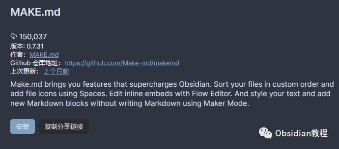
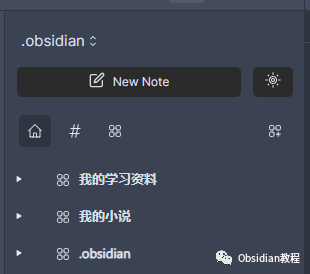
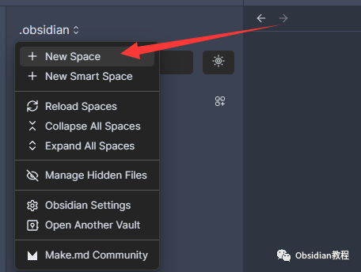
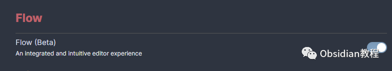

# Obsidian 插件:Make.md赋能创作者的终极体验

点击下方公众号，回复关键字：**Obsidian** ，获取Obsidian资料合集。

  
Obsidian 以其开放性和扩展性赢得了许多知识工作者的心，而 Make.md 插件无疑为这个平台添加了丰富多彩的一笔。它不仅仅是一个插件，更是一个能够整合你的创意，让你的思维自如飞扬的工具。  
接下来，让我们一起深入探索 Make.md 插件的奥秘，看看它如何助你一臂之力，在知识的海洋里畅游无阻。

## 

1安装方法

  

要使用这个插件，我们首先需要在Obsidian中安装它。安装过程非常简单直接：

### **  
**

### **1.在线安装**（需要科学上网） ：****

  
1.在Obsidian的设置中，找到“第三方插件”选项，点击“社区插件”2.在搜索框中输入“Make.md”，找到并安装它。3.安装完成后，激活该插件，在成功安装插件后，我们需要对其进行简单的配置，以符合我们的需求。  

**2.离线安装：****  
****因为网络原因很多同学无法直接在线安装obsidian插件，这里我已经把obsidian所有热门插件下载好了**  
只需要关注下方公众号，后台回复：**插件** 即可获取

### 2🍱 定制你的空间

在 Make.md 的世界里，空间(Spaces)是你创意的起点。它像是一个大画布，等待你在上面绘制知识的图景。你可以为每个项目创建一个空间，把相关的笔记、想法和资源集中在一起。  

比如，你可以为你的新小说项目创建一个空间，把所有的人物设定、剧情梗概和灵感碎片都放在里面。  
创建空间非常简单，只需几个点击，就能拥有属于自己的个性化空间。每个空间都可以自定义名称和图标，让你一眼就能找到想要的内容。  

### 

  

3🧩 探索数据的联系

  

数据是冰冷的，但通过 Make.md 的上下文(Contexts)功能，你可以让数据变得生动有趣。你可以用简单的表格把零散的信息连接起来，也可以用强大的数据库把复杂的数据关系呈现出来。  

比如，你可以创建一个简单的表格，记录你每天的学习进度。而当你需要处理复杂的项目时，可以创建一个数据库，把任务、时间和责任人清晰地展现在你面前。

### 

4🤩 快速编辑的艺术

在 Make.md 里，编辑变得前所未有的简单和快速。Blink（闪烁）功能，它让你能够在“眨眼间”快速打开和编辑你的笔记，无论你身处于哪一个工作区，只要轻轻一点，你的笔记就会呈现在你的眼前，让你能够随时随地，捕捉并记录下你的想法。  

### 5⌛ 保持创作的流畅

创作是一个需要高度专注的过程，而 Flow（流）功能正是为了帮助你保持这种专注。它为你提供了一个简洁、无干扰的编辑环境，让你可以专心于写作和编辑，不受外界干扰。  
它能够让你直接在文本中编辑你的上下文和画布，无需跳转到其他界面。这种直观的体验，让你的思维可以自由流动，不会被中断。  

### 6一些感悟

Make.md 不仅仅是一个插件，它更像是一个多功能的工具箱，为你提供了强大的支持。通过它，你可以更好地组织你的知识，更高效地完成你的工作。它把复杂的功能变得简单易用，让你可以更专注于本质，发掘知识的价值。  
随着你深入使用 Make.md，你会发现，它不仅仅改变了你的Obsidian，更在悄悄改变着你处理知识和信息的方式。在 Make.md 的世界里，每一个想法都值得被珍藏.  
  
  
1**扫码购买****《 Obsidian实战教程》****从入门到精通， 链接您的每一个思维瞬间。****  
**  
往 期精彩[1.Obsidian插件:Note Refactor 在 Obsidian 中轻松地提取选定部分的笔记到新的笔记中。](http://mp.weixin.qq.com/s?__biz=MzkyMDUyMDM2Mg==&mid=2247484435&idx=1&sn=c4ecdb98cdcd329ab4a18c9571818096&chksm=c190d7d6f6e75ec00580be3a0b5014ab489ba49b1905a5299a9bf14c2cbdc75eb2d6d83bea57&scene=21#wechat_redirect)[2.Obsidian插件: Highlightr 为笔记提供简单而美观的高亮显示菜单](http://mp.weixin.qq.com/s?__biz=MzkyMDUyMDM2Mg==&mid=2247484434&idx=1&sn=131c0124e2562249c3ac868fcc2b4542&chksm=c190d7d7f6e75ec1c5897ef21027cb1d33deff1b7ebcb09c5ccf1a195e4e570f69d3079ac5f2&scene=21#wechat_redirect)[3.Obsidian插件: Pandoc 一个强大的文档导出工具](http://mp.weixin.qq.com/s?__biz=MzkyMDUyMDM2Mg==&mid=2247484337&idx=1&sn=0a7344f1a0d9d40e8a559f3ea2058f79&chksm=c190d074f6e759624befeebc9935cb831090a20adb10cdaaefb586df7d2e3ba65ce93339b699&scene=21#wechat_redirect)

点分享

点点赞

点在看
