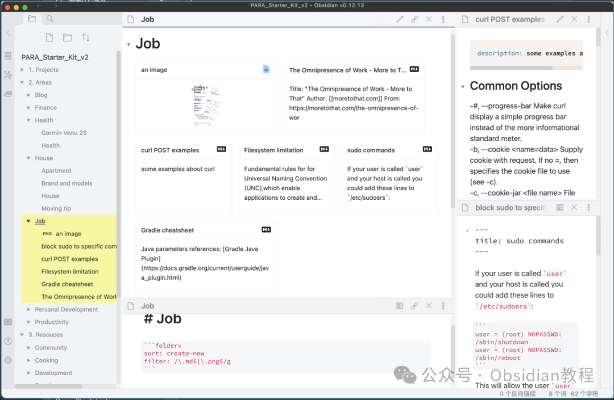
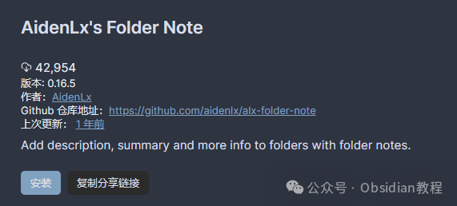

# Obsidian 插件：AidenLx为文件夹添加描述、摘要和更多信息

AidenLx的文件夹笔记插件是Obsidian软件中的一个强大工具，它允许用户为文件夹添加描述、摘要和更多信息，以此来增强文件夹的功能性和信息丰富度。  
这个插件是基于原始的文件夹笔记插件完全重写并改进的，保留了所有核心特性（除了文件夹概览外），并通过增强的文件资源管理器补丁和大量的质量改进，使得文件夹和笔记的工作流程无缝对接，仿佛是原生文件一样。  

### **功能亮点**

  

  * 创建文件夹笔记：用户可以轻松创建文件夹笔记，支持多种偏好设置和模板。
  * 文件夹与笔记一体化操作：
    * 在文件资源管理器中点击文件夹即可打开文件夹笔记。
    * 文件夹名称的更改会同步到文件夹笔记；移动文件夹时，文件夹笔记也会随之移动。
    * 文件夹笔记在文件资源管理器中隐藏。
    * 可以从文件夹笔记中删除文件夹。

  

  * 创建文件夹概览（可选）：使用代码块folderv可以查看文件夹内所有文件的简要卡片，还可以通过前置元数据指定标题和描述，支持文件过滤、排序等功能。
  * 文件夹焦点模式：右键点击文件资源管理器中的文件夹选择“Toggle Focus”可以聚焦当前文件夹，再次选择以恢复。
  * 文件资源管理器中的文件夹图标。

### 

  

### **使用前的准备**

  
从v0.13.0版本开始，文件夹概览（folderv）成为了一个可选组件，用户可以在设置标签的文件夹概览部分进行安装。从v0.11.0版本开始，这个插件需要folder-note-core才能正常工作。对于老用户，有详细的迁移指南可以参考。

###   

### **安装方法**

**  
**

### **1.在线安装**（需要科学上网） ：****

  
在Obsidian中安装插件是一个简单直接的过程：  

  * 打开Obsidian，点击左下角的“设置”图标。
  * 在设置菜单中，选择“第三方插件”选项。
  * 点击“浏览”按钮，搜索“AidenLx”。
  * 找到插件后，点击“安装”。
  * 安装完成后，切换插件的“启用”开关。

  

### **2.离线安装：****  
****因为网络原因很多同学无法直接在线安装obsidian插件，这里我已经把obsidian所有热门插件下载好了**  
只需要关注下方公众号，后台回复：**插件** 即可获取

### 

####   

### **如何使用**

  
AidenLx的文件夹笔记插件提供了丰富的功能，适用于不同的使用场景。从基本的文件夹笔记创建到高级的文件夹概览配置，用户可以根据自己的需求灵活使用这个插件。  
无论你是想要为你的项目文件夹添加详细的描述，还是需要通过文件夹笔记来整理和回顾项目进度，这个插件都能提供相应的支持。  
AidenLx的文件夹笔记插件不仅增强了文件夹的功能，还通过提供更加丰富的信息和更好的组织方式，使得Obsidian的使用体验更加高效和愉悦。  
无论你是Obsidian的新手还是有经验的用户，都可以从这个插件中获得极大的帮助。  
  
  
1******扫码购买****《 Obsidian实战教程》****从入门到精通， 链接您的每一个思维瞬间。**  

