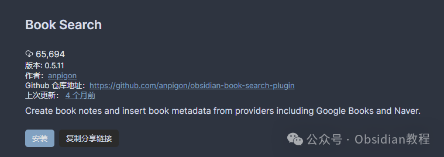
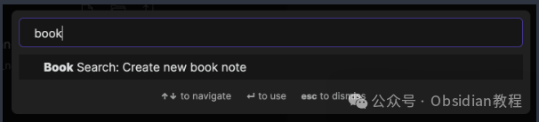
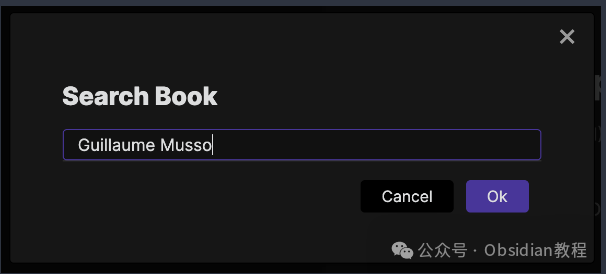
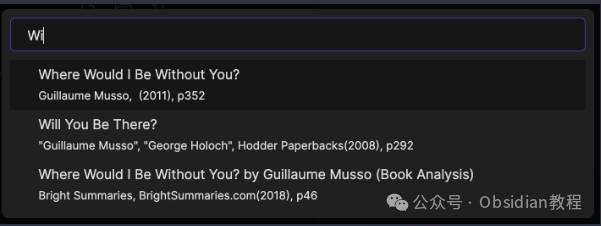
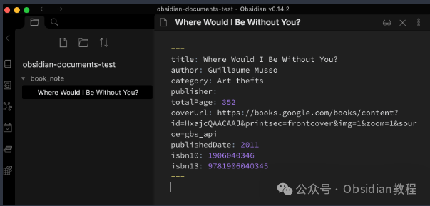
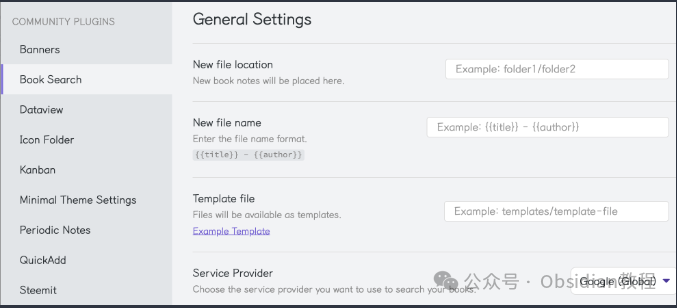
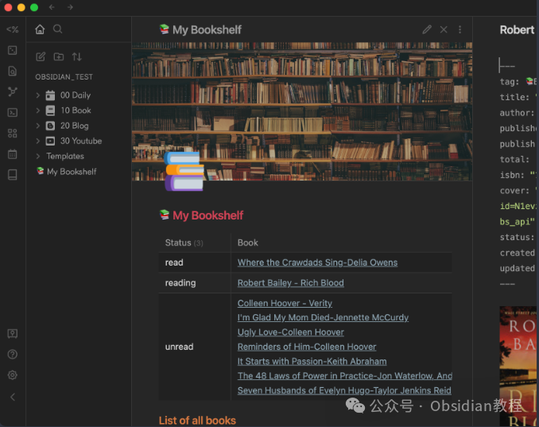

# Obsidian 插件：Book Search用户直接从Obsidian中搜索书籍，并快速创建笔记

Obsidian 不仅是一个强大的知识管理工具，也是一个开放的平台，通过安装插件可以大幅扩展其功能。

  


今天，我们要深入了解的是 Book Search 插件，这是一个非常有用的工具，它允许用户直接从Obsidian中搜索书籍信息，并基于搜索结果快速创建笔记。

  


本教程将详细介绍如何安装、配置和使用 Book Search 插件，以及如何通过高级设置和模板自定义您的笔记。

  


#### 1安装 Book Search 插件

#### 

通过社区插件浏览器：  


###   


### **1.在线安装**（需要科学上网） ：****

### ****  
****

### 点击“社区插件”下的“浏览”按钮，在左上角的搜索框中搜索“ Book Search”，然后点击“安装”按钮。

###   
启用插件：安装成功后，点击“启用”以启用插件。  




**  
****2.离线安装：****  
****因为网络原因很多同学无法直接在线安装obsidian插件，这里我已经把obsidian所有热门插件下载好了**  
只需要关注下方公众号，后台回复：**插件** 即可获取

#### 2使用 Book Search 插件搜索书籍

  * 安装并启用插件后，您可以通过点击左侧工具栏的 Book Search 图标或执行命令“Create new book note”来启动插件。




  * 在弹出的搜索框中输入书名、作者、出版社或ISBN号进行搜索。




  * 搜索结果会展示在下方，您可以浏览并选择想要创建笔记的书籍。




  * 选择一本书后，Obsidian 会自动根据您的模板设置创建一份新的笔记。




#### 3配置插件设置

Book Search 插件提供了几个配置选项，让您可以自定义新创建笔记的存放位置、文件名格式以及使用的模板等。

  


  * **新文件位置** ：您可以指定新笔记的存放文件夹，默认情况下，笔记会被创建在 Obsidian 根文件夹下。

  * **新文件名：** 默认的文件名格式为 {{title}} - {{author}}，您可以通过添加如 {{DATE}} 或 {{DATE:YYYYMMDD}} 来自定义文件名格式。

  * **模板文件：** 您可以设置使用特定的模板文件来创建笔记，模板文件中可以包含特定的变量和格式。




#### **利用模板自定义笔记**

  


Book Search 插件支持使用模板来自定义创建的笔记内容。以下是一个示例模板：
      
      *   *   *   *   *   *   *   *   *   *   *   *   *   *   *   *   * 
    
    
    
    ---tag: 📚Booktitle: "{{title}}"author: [{{author}}]publisher: {{publisher}}publish: {{publishDate}}total: {{totalPage}}isbn: {{isbn10}} {{isbn13}}cover: {{coverUrl}}status: unreadcreated: {{DATE:YYYY-MM-DD HH:mm:ss}}updated: {{DATE:YYYY-MM-DD HH:mm:ss}}---  
      
    # {{title}}

  
您可以在模板中使用各种变量，如 {{title}}、{{author}} 等，来插入书籍的具体信息。



演示中使用的数据视图查询  


  *   *   *   *   *   *   *   *   *   *   *   *   *   *   *   *   *   *   *   *   *   *   *   *   * 

    
    
    # 📚 My Bookshelf  
    ```dataviewTABLE WITHOUT ID  status as Status,  rows.file.link as BookFROM  #📚BookWHERE !contains(file.path, "Templates")GROUP BY statusSORT status```  
    ## List of all books  
    ```dataviewTABLE WITHOUT ID  status as Status,  "" as Cover,  link(file.link, title) as Title,  author as Author,  join(list(publisher, publish)) as PublisherFROM #📚BookWHERE !contains(file.path, "Templates")SORT status DESC, file.ctime ASC```

#### 4高级应用：内联脚本

Book Search 插件0.5.8版本新增了对 Templater 插件的支持，允许在模板中使用内联脚本，以便进行更复杂的数据处理和展示。例如，要在模板中打印出整个书籍对象，可以使用以下 Templater 语法：
      
      * 
    
    
    
    <%=book%>

或者，为了更美观地格式化输出，可以使用：
    
    
      
    
      
        * 
    
    
    
    <%=JSON.stringify(book, null, 2)%>

#### 

5结语

通过使用 Book Search 插件，Obsidian 用户可以极大地提高处理书籍信息的效率，无论是进行文献回顾、整理书单还是简单地想要保存一些阅读材料的笔记.  
本教程希望能帮助您充分利用这个插件，使您的知识管理工作更加顺畅和高效。  
  
  
1******扫码购买****《 Obsidian实战教程》****从入门到精通， 链接您的每一个思维瞬间。**  


