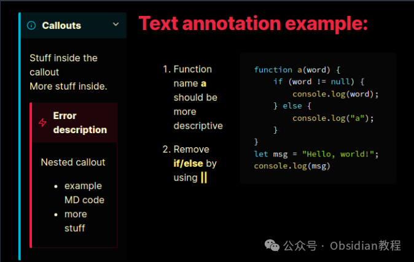
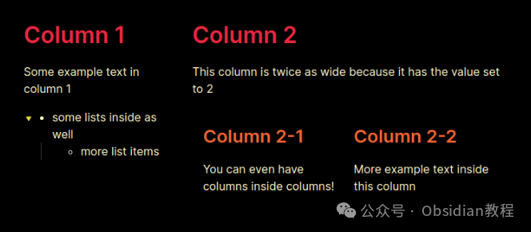
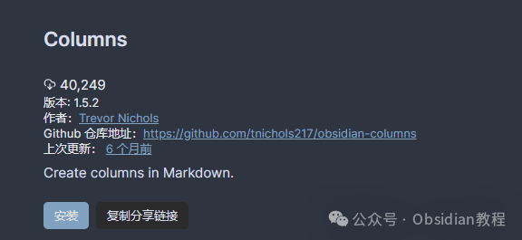

# Obsidian 插件：Columns，支持移动端，让您在 Obsidian 笔记中创建列

Obsidian 插件 "Obsidian Columns" 的使用和配置，这是一个非常强大的插件，可以让您在 Obsidian 笔记中创建列。  
此插件支持移动端，并具有列包装功能（可以在设置中启用）。  
它主要通过三种方式使用：Callout 语法、Codeblock 语法和 List 语法。每种方法都有其独特之处，适用于不同的使用场景。  
我们将逐一详细介绍这些方法的使用方式，设置选项，以及如何根据您的需求选择最适合的方式。  




### **Callout 语法**

  
Callout 语法是一种利用 Obsidian Callout 规范来实现列创建的方法，这种方法不使用 JavaScript，因此与实时预览非常兼容，不需要通过代码块。它的一个限制是不能限制列的高度，而不影响性能。  


#### **基本使用**

**  
**

  * 使用 col callout 创建列集合：


      
      *   *   *   * 
    
    
    
     > [!col]> 第一列内容>> 第二列内容

  


  * 使用 col-md 在 col callout 内部嵌套，以分组项至特定的列中：


  *   *   *   *   *   *   * 

    
    
    > [!col]> 第一列内容>>> [!col-md]>> 第二列的内容>> >> 第二列的更多内容

  * 调整 col-md 列宽，通过在 col-md 名称后添加宽度值（宽度属性仅支持0.5的倍数，最大值为10）：


      
      *   *   *   *   * 
    
    
    
    > [!col]> 第一列内容>>> [!col-md-3]>> 第二列现在的宽度是第一列的三倍

  


### **Codeblock 语法**

  
Codeblock 语法使用 Obsidian 的命名代码块来创建列，这种方法允许更多的设置配置，并且使用层级更深的反引号来嵌套列。  


#### **基本使用**

  
初始化列组，所有项目将作为独立列渲染：
      
      *   *   *   *   *   *   *   *   * 
    
    
    
    gCopy code````col```col-md第一列```  
    ```col-md第二列```

  


代码块设置，可以定义列的高度、文本对齐方式等：
      
      *   *   *   *   *   *   *   *   *   * 
    
    
    
    ```colheight=shortest===```col-md第一列内容```  
    ```col-md第二列内容```

  


### **List 语法**

###   


### List 语法通过创建列表来实现列的创建，但不支持实时预览。这种方法比较简单，适用于快速布局。

####   


#### 示例
      
      *   *   *   *   *   *   *   *   *   *   *   *   *   *   * 
    
    
    
      - 1    # 第一列    第一列的示例文本    - 列表内的条目      - 更多列表项  - 2    # 第二列    由于设置的值为2，这列是第一列的两倍宽    - !!!col      - 1        ## 第二列的第一子列        甚至可以在列中嵌套列！      - 1        ## 第二列的第二子列        此列内的更多示例文本

  




### **1.在线安装**（需要科学上网） ：****

  
在Obsidian中安装插件是一个简单直接的过程：  


  * 打开Obsidian，点击左下角的“设置”图标。
  * 在设置菜单中，选择“第三方插件”选项。
  * 点击“浏览”按钮，搜索“Columns”。
  * 找到插件后，点击“安装”。
  * 安装完成后，切换插件的“启用”开关。

  




### **2.离线安装：****  
****因为网络原因很多同学无法直接在线安装obsidian插件，这里我已经把obsidian所有热门插件下载好了**  
只需要关注下方公众号，后台回复：**插件** 即可获取

### 

### **插件设置**

  


  * 最小列宽：确保列具有一定的宽度。如果不是所有列都满足这个宽度，额外的列将换行到下面。
  * 默认跨度：如果未显式指定列的跨度值，则每个列代码块中的列将设置为此值，并且当前不能更改。


###   


### **即将推出的功能**

  


  * 为编辑器启用语法高亮。

  
通过上述详细解释，我希望你能够对 "Obsidian Columns" 插件有一个全面的了解，包括它的基本使用方法、不同语法的特点和设置选项。  
这个插件为 Obsidian 用户提供了极大的灵活性和创造力，无论是整理内容、设计笔记布局，还是创建复杂的文档结构，都将是一个非常有用的工具。  
  
  
1******扫码购买****《 Obsidian实战教程》****从入门到精通， 链接您的每一个思维瞬间。**  


