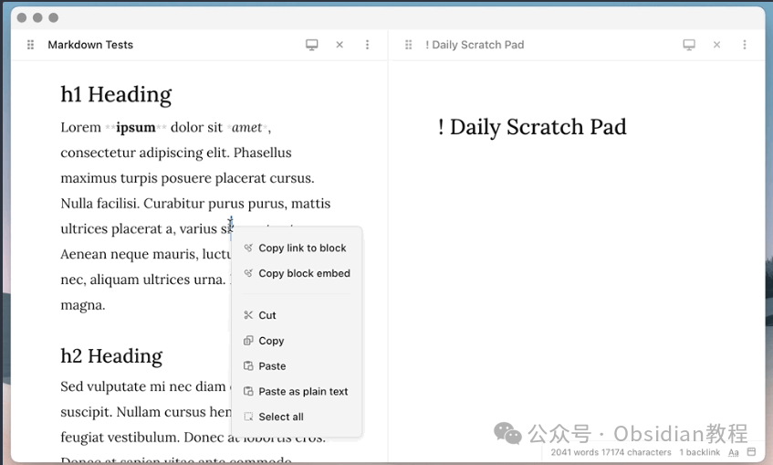
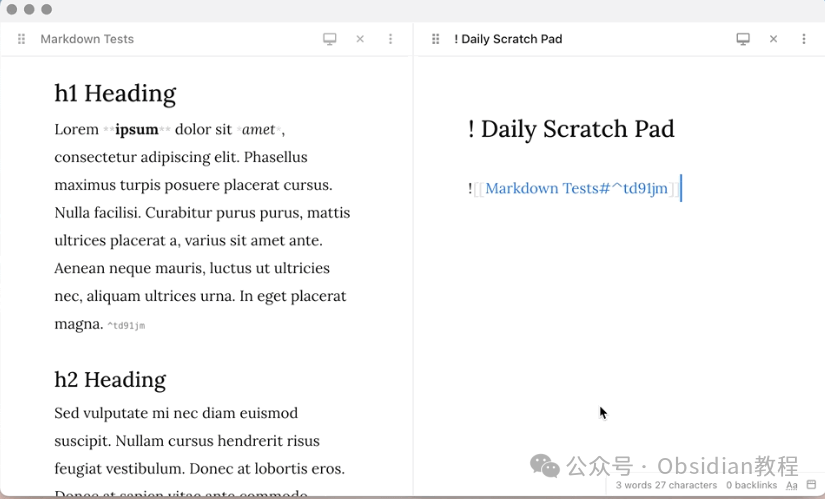

# Obsidian 插件：Copy Block Link让笔记的引用和导航变得更轻松高效

  

  
嗨，我是鬼哥，10年+老程序员一枚。  
今天咱们来聊聊一个Obsidian插件——Copy Block Link。这个插件可真是省了我不少事儿，能从Obsidian的右键菜单里直接获取块和标题的链接，让笔记的引用和导航变得更加轻松高效。  
废话不多说，咱们一起来看看这个插件到底有啥能耐，怎么安装使用，以及它能解决哪些问题和带来哪些好处。  

### **介绍**

  
Obsidian作为一个强大的笔记工具，除了基本的双链功能，最吸引人的还是它那无敌的扩展性。通过安装各种插件，我们可以让Obsidian变成一个超级笔记管理系统。  
Copy Block Link这个插件就是其中之一，它允许我们从右键菜单中获取到块和标题的链接，这在整理和引用笔记时简直就是神器。  

### **下载和安装**

### **  
**

### **1.在线安装**（需要科学上网） ：****

  
在Obsidian中安装插件是一个简单直接的过程：  

  * 打开Obsidian，点击左下角的“设置”图标。
  * 在设置菜单中，选择“第三方插件”选项。
  * 点击“浏览”按钮，搜索“Copy Block Link”。
  * 找到插件后，点击“安装”。
  * 安装完成后，切换插件的“启用”开关。

  

### **2.离线安装：****  
****因为网络原因很多同学无法直接在线安装obsidian插件，这里我已经把obsidian所有热门插件下载好了**  
只需要关注下方公众号，后台回复：**插件** 即可获取

  
安装完成后，记得返回“Installed Plugins”列表，找到“Copy Block Link”并启用它。这样我们就可以愉快地使用这个插件了。  

### **使用方法**

  
启用插件后，右键点击笔记中的任何一个块或标题，你会发现右键菜单中多了一个“Copy Block Link”选项。  
点击它，链接就会被复制到剪贴板上，接下来你就可以在其他笔记中粘贴这个链接进行引用了。  

#### **  
**

#### **示例**

  
假设你有一篇笔记，其中有一个块内容如下：
      
      *   *   * 
    
    
    
    # 今天的任务- 完成Obsidian插件教程- 学习新技术

  
你只需要右键点击“今天的任务”这个标题，选择“Copy Block Link”，然后在另一篇笔记中粘贴这个链接，就可以实现快速跳转。  
  

### ****

### **插件带来的好处**

**  
**

  1. 节省时间：无需繁琐的手动操作，大大节省时间。
  2. 提升笔记关联性：快速链接不同笔记内容，提升笔记之间的关联性和可读性。
  3. 简化操作流程：右键菜单直接获取链接，操作简单直观。

###   

### **插件的局限性**

  
当然，虽然这个插件非常实用，但也有一些局限性，比如只能在 Obsidian 环境下使用，对其他笔记软件无效。  
此外，如果笔记内容过于复杂，链接管理也可能会变得繁琐。但总体来说，这些局限性并不会影响插件的整体使用体验。  
在实际使用中，鬼哥觉得这个插件真的是 Obsidian 用户的必备工具之一。特别是对于那些需要频繁引用和链接笔记内容的用户来说，这个插件绝对是个神器。  
简单的右键操作就能完成过去需要好几步的操作，省时省力，非常推荐大家试试。  
**结尾**  
总结一下，Obsidian Copy Block Link 插件通过简化块和标题链接的获取过程，大大提升了 Obsidian 用户的笔记效率。安装和使用都非常简单，功能实用，值得推荐。  
如果你还没用过这个插件，赶紧去试试吧！相信鬼哥，你会爱上它的。  
  
  
1******扫码购买****《 Obsidian实战教程》****从入门到精通， 链接您的每一个思维瞬间。**  

