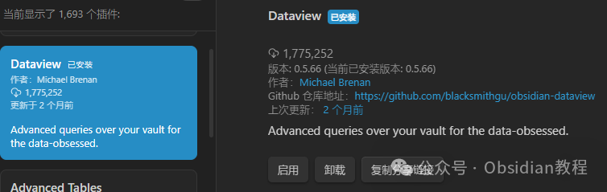
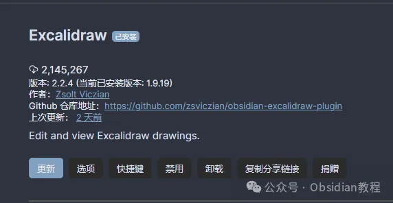

# Obsidian 插件：Dataview让你的笔记变成数据库，效率提升100倍！

嗨，我是鬼哥，10年+老程序员一枚。

今天给大家聊聊 Obsidian 的 Dataview 插件，这可是 Obsidian 里的一个神器，能把你的笔记本变成一个强大的数据库。

咱们先别急着安装，先聊聊它到底有啥用，怎么能给你带来惊喜。

**Dataview 是啥？**

简单来说，Dataview 是一个 Obsidian 的插件，能让你像查询数据库一样查询你的笔记。它提供了一种基于 JavaScript 的 API 和管道查询语言，能用来过滤、排序和提取 Markdown 页面中的数据。



你可以把它想象成一个超级搜索引擎，但比普通搜索更强大，能进行复杂的数据操作。

**它能干啥？**

  1. 查询和过滤：比如你想找出所有标记了“待办事项”的笔记，Dataview 能帮你一秒钟搞定。
  2. 排序：你可以按日期、标签或其他自定义字段排序笔记。
  3. 提取数据：如果你需要从一堆笔记里提取特定的信息，比如某些关键字或数据，Dataview 也能帮你做到。
  4. 动态视图：它能创建实时更新的动态视图，比如任务列表、阅读清单等，真正实现笔记的“活”用。

  


**安装 Dataview**

聊了这么多，你是不是也觉得这插件很牛？接下来，咱们就来安装它。安装步骤很简单，跟着鬼哥的步骤走：

### **1.在线安装**（需要科学上网） ：****

  
在Obsidian中安装插件是一个简单直接的过程：  


  1. 打开Obsidian，点击左下角的“设置”图标。
  2. 在设置菜单中，选择“第三方插件”选项。
  3. 点击“浏览”按钮，搜索“Excalidraw”。
  4. 找到插件后，点击“安装”。
  5. 安装完成后，切换插件的“启用”开关。




### **2.离线安装：****  
****因为网络原因很多同学无法直接在线安装obsidian插件，这里我已经把obsidian所有热门插件下载好了**  


只需要关注下方公众号，后台回复：**插件** 即可获取

  


搞定了！Dataview 插件已经装好并启用了，接下来就是怎么玩的问题

**Dataview 的使用方法**

### 安装好插件后，怎么用呢？别急，鬼哥这就带你进入实战环节。

### **基本查询**

先来个最简单的例子。假设你有很多笔记，每个笔记都包含一个日期，你想把这些笔记按日期列出来。
      
      *   *   *   * 
    
    
    
    ```dataviewtable datefrom "笔记文件夹"sort date asc

上面的代码块会生成一个表格，列出你“笔记文件夹”里的所有笔记，并按日期升序排序。

**复杂查询**

如果你想要更复杂的查询，比如筛选出某个标签下的笔记，可以这样写：
      
      *   *   *   * 
    
    
    
    ```dataviewlistfrom "笔记文件夹"where contains(tags, "重要")

这个查询会列出所有包含“重要”标签的笔记，是不是很方便？

#### **动态视图**

来点更高级的，咱们做个动态的任务列表。假设你的笔记里有许多任务项，你希望自动生成一个任务清单：
      
      *   *   * 
    
    
    
    ```dataviewtask from "任务文件夹"where !completed

这个查询会列出“任务文件夹”中所有未完成的任务，并动态更新。

**Dataview 带来的好处**

  1. 提升效率：通过自动化处理笔记，你可以节省大量时间，不再需要手动搜索和整理。
  2. 数据可视化：把杂乱的笔记数据转化为结构化的信息，方便查看和分析。
  3. 增强组织性：按需提取、排序和过滤信息，让你的笔记系统更有条理。


### **它能解决什么问题？**

  1. 信息过载：面对大量笔记，Dataview 能帮你快速找到需要的内容。
  2. 任务管理：自动生成和更新任务列表，让你的任务管理更加高效。
  3. 数据分析：提取并分析笔记中的数据，比如统计阅读量、跟踪项目进度等。


### **使用感受**

### 鬼哥用了这么久 Dataview，总的来说，这插件简直就是 Obsidian 的一大杀器。它让原本静态的笔记变得动态化、数据化，真的很适合那些喜欢折腾数据的朋友。

### 虽然刚开始上手可能会有点难度，但一旦熟悉了，你会发现它能大大提升你的工作效率，让你的笔记系统更加智能和高效。

鬼哥建议大家多动手试试，玩着玩着你就会发现，这个插件真的能带来不少惊喜。如果你对数据管理和自动化有兴趣，Dataview 绝对是你不能错过的神器。

希望大家玩得开心，有什么问题记得找鬼哥聊聊！

  
  
  
1******扫码购买****《 Obsidian实战教程》****从入门到精通， 链接您的每一个思维瞬间。**  


