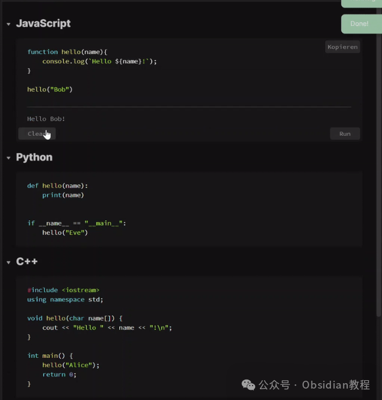
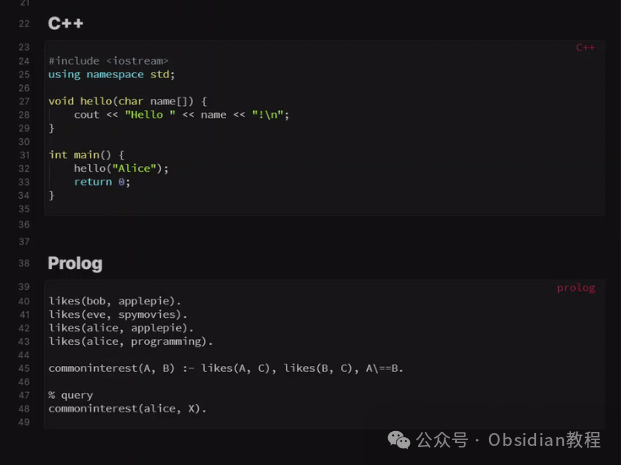
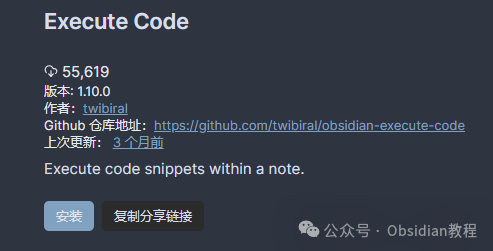
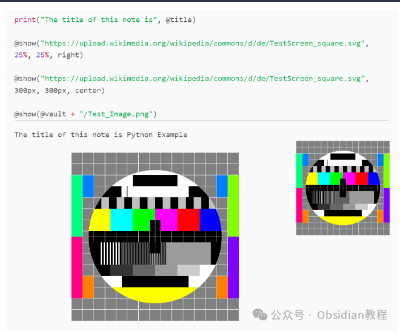
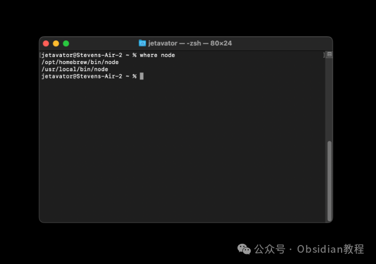

# Obsidian 插件：Execute Code笔记中直接运行代码

随着个人知识管理软件的兴起，Obsidian 出现了，它不仅是一个强大的笔记应用程序，还因其高度可扩展的插件生态系统而广受欢迎。  
其中一个插件——"Execute Code"（执行代码），尤其引人注目，因为它为Obsidian用户提供了在笔记中直接运行代码片段的能力。  
本文将详细介绍这一插件的功能、安装过程、使用方式以及与其兼容的其他工具。

### 

1插件概览

"Execute Code"插件允许用户在Obsidian笔记中的代码块里直接执行代码。这意味着你可以编写代码，并通过点击代码块旁边的"运行"按钮来执行它。  
执行完毕后，代码的执行结果会显示出来。如果代码片段需要用户输入，插件会自动创建一个交互式输入元素。  

### 2支持的编程语言

插件支持多种流行的编程语言，包括但不限于C, C++, Dart, Golang, Groovy, Kotlin, Java, JavaScript, TypeScript, Python, Rust, Ruby等。  
其中，Python、Rust和Octave支持嵌入式绘图功能。所有语言都支持"魔法"命令，这些命令可以帮助你访问Obsidian中的路径或在笔记中显示图像。  

### **魔法命令**

  
"魔法"命令是一些元命令，可以在代码块中使用，由插件在源代码执行前处理。  
例如，你可以使用@vault_path来插入vault的路径，或者使用@show(ImagePath)来在笔记中显示一张图片。目前，这些魔法命令仅支持JavaScript和Python。

### 

3安装步骤

#### 通过社区插件浏览器：  

###   

### **1.在线安装**（需要科学上网） ：****

### ****  
****

### 点击“社区插件”下的“浏览”按钮，在左上角的搜索框中搜索“ Execute Code”，然后点击“安装”按钮。

###   
启用插件：安装成功后，点击“启用”以启用插件。  

**  
****2.离线安装：****  
****因为网络原因很多同学无法直接在线安装obsidian插件，这里我已经把obsidian所有热门插件下载好了**  
只需要关注下方公众号，后台回复：**插件** 即可获取

  

### **全局代码注入和代码块重用**

  
插件支持在同一语言的每个代码块之前或之后执行代码块。这意味着你可以定义一些全局代码片段，这些片段将被自动插入到每个相应语言的代码块顶部。这对于定义常用函数或导入常用的包和库非常有用。  

### **代码块参数和标签**

  
你可以为代码块指定附加参数，如{key='value'}，或者为代码块添加标签，以便在其他代码块中显式导入它们。这为代码的组织和重用提供了极大的灵活性。

###   

### **预/后代码块**

###   

### 通过指定{pre}或{post}参数，你可以创建在所有同语言代码块之前或之后执行的代码块。这为代码执行提供了额外的控制，使得在执行特定代码之前准备环境或之后清理环境成为可能。

### 

### **笔记本模式**

###   

### 某些语言（当前为JS和Python）支持笔记本模式，类似于Jupyter笔记本。在这种模式下，一个文件中的所有代码块将在同一环境中执行，变量和函数在代码块之间是共享的。

###   

### 注意事项

  

  * 不要执行你不理解或不信任来源的代码，这可能会造成不可修复的损害。
  * 在Linux上，使用Snap/Flatpak/AppImage安装的Obsidian运行在隔离环境中，可能无法访问已安装的程序。

###   

### **与其他工具和插件的兼容性**

  
"Execute Code"插件与多种工具和插件兼容，扩展了其应用场景。例如，Obsidian Tools Python包提供了一系列与你的vault互动的工具。

### 

4结论

"Execute Code"插件极大地扩展了Obsidian的功能，使其不仅仅是一个笔记应用程序，而是一个强大的个人知识管理和代码执行环境。  
无论你是一个编程初学者还是一个经验丰富的开发者，这个插件都能为你的Obsidian使用体验增添独特的价值。  
通过本文的详细介绍，希望你能充分利用这个插件，提升你的编程和知识管理能力。  
  
  
1******扫码购买****《 Obsidian实战教程》****从入门到精通， 链接您的每一个思维瞬间。**  

