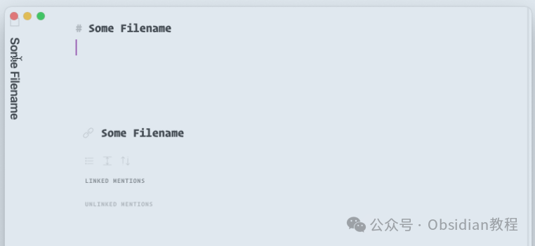
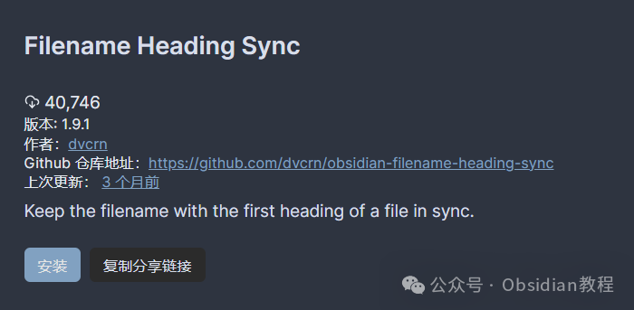
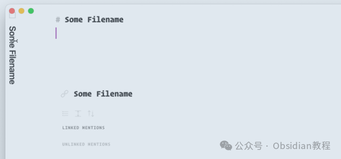

# Obsidian 插件：Filename Heading Sync让文件名和文件的第一个标题保持同步

  

嗨，我是鬼哥，10年+老程序员一枚。

  

鬼哥今天要分享一个超好用的插件——Obsidian Filename Heading Sync。这款插件的名字看起来很直白，其实它的功能也相当直接，就是让文件名和文件的第一个标题保持同步。

  

你可能会问，为什么要这么麻烦？文件名和标题不同步也没什么大不了的吧？

  

但实际情况是，当你的笔记数量多了之后，你会发现文件名和标题不同步真的很容易让人头大。尤其是用Obsidian这种需要靠文件名来管理的笔记系统，文件名和标题不一致真的很容易让你在找文件的时候抓狂。

  

所以，Obsidian Filename Heading Sync这个插件，就是为了解决这个头疼问题而生的。

  

### **1.在线安装**（需要科学上网） ：****

  
在Obsidian中安装插件是一个简单直接的过程：  

  * 打开Obsidian，点击左下角的“设置”图标。
  * 在设置菜单中，选择“第三方插件”选项。
  * 点击“浏览”按钮，搜索“Filename Heading Sync”。
  * 找到插件后，点击“安装”。
  * 安装完成后，切换插件的“启用”开关。

  

### **2.离线安装：****  
****因为网络原因很多同学无法直接在线安装obsidian插件，这里我已经把obsidian所有热门插件下载好了**  
只需要关注下方公众号，后台回复：**插件** 即可获取

  

## **插件特色**

###   

### **自动同步文件名和标题**

  

这个插件的核心功能就是自动同步文件名和文件的第一个标题。具体来说，它可以做到以下几点：

  

  1. 重命名当前文件时更新标题：当你重命名一个文件时，这个插件会自动更新文件中的第一个标题，让它和新的文件名一致。

  2. 打开没有标题的文件时插入标题：如果你打开一个文件，这个文件还没有标题，那么插件会自动插入一个标题，内容和文件名一致。

  3. 打开标题和文件名不一致的文件时更新标题：如果你打开一个文件，发现它的第一个标题和文件名不一致，插件会自动更新标题。

  4. 更新文件标题时重命名文件：如果你更新了文件的第一个标题，插件会自动把文件名也更新成相同的内容。

###   

### **手动同步命令**

  

如果你不喜欢自动同步功能，可以在设置中禁用“文件保存钩子（File Save Hook）”和“文件打开钩子（File Open Hook）”，只使用手动同步命令。

###   

### **处理冲突**

  

有时候插件之间会有冲突，比如这个插件可能会和其他一些在文件打开时生效的插件冲突。遇到这种情况，你可以尝试以下方法：

  

  1. 添加正则表达式规则：比如，你的文件名总是以“myfile.foo.md”结尾，你可以在插件设置中添加一个正则表达式规则来排除这些文件：.*\\.foo\\.md

  2. 禁用文件打开钩子：如果冲突插件在文件打开时生效，可以在本插件的设置中禁用“文件打开钩子”。你还可以完全禁用自动同步，方法是禁用“文件保存钩子”。

###   

### **与Templater的冲突**

  

如果你也使用了Templater插件，可以在设置中禁用文件打开钩子，两个插件就能和谐共处了。

  

在我实际使用过程中，这个插件还是非常稳定的。每次重命名文件或者更新标题，它都能快速同步，极大地提高了我的工作效率。

  

而且手动同步命令的设计也很贴心，让你可以根据自己的需求选择自动或手动模式。

  

希望你们也能从中受益，告别文件名和标题不一致的烦恼.

  
  
  
1******扫码购买****《 Obsidian实战教程》****从入门到精通， 链接您的每一个思维瞬间。**  

