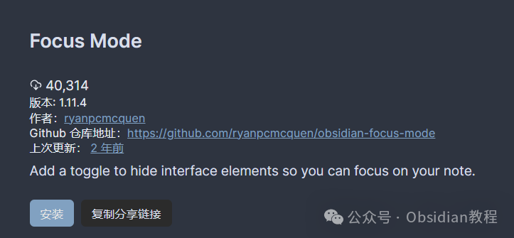
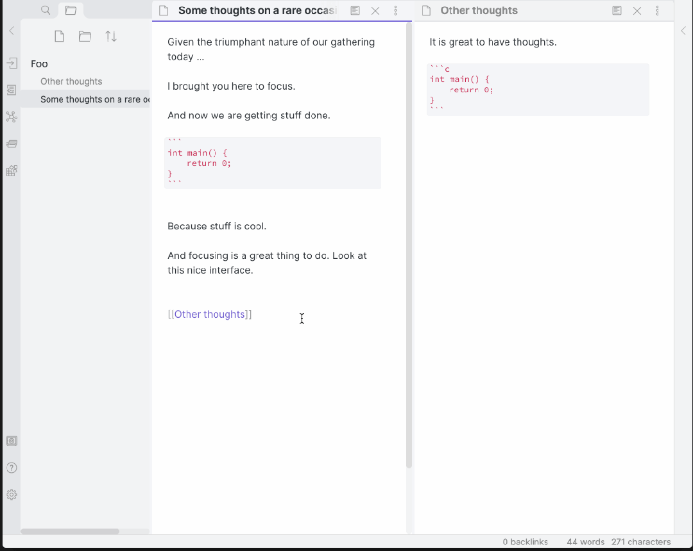
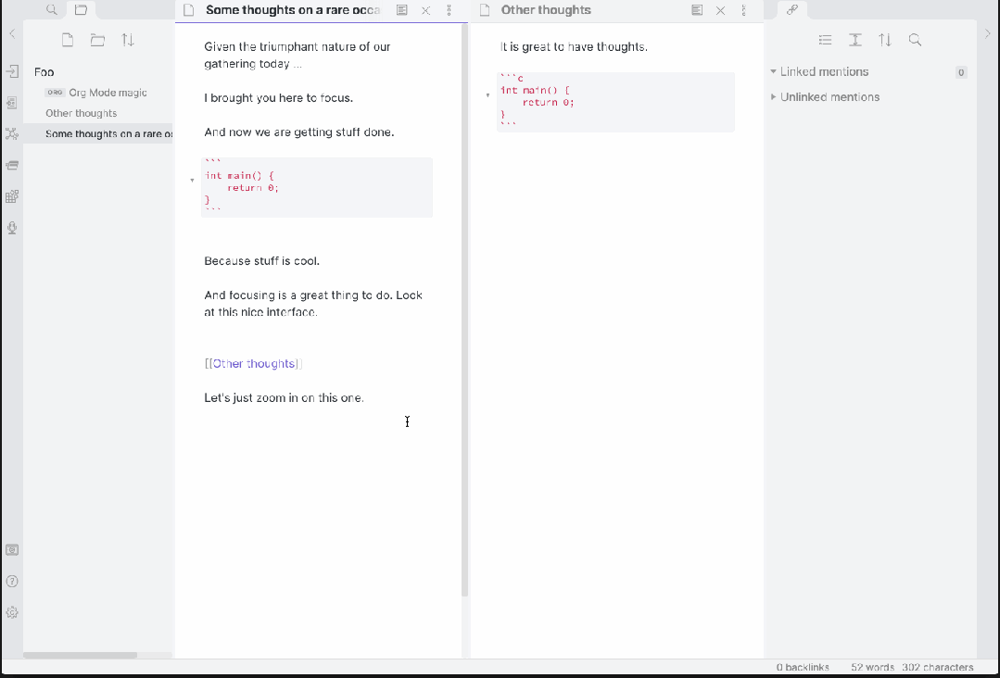

# Obsidian 插件：Focus Mode,专注于当前的任务，提高工作效率

  
嗨，我是鬼哥，10年+老程序员一枚。  
大家在使用 Obsidian 做笔记、整理资料的时候，是否会因为各种干扰而分心？尤其是在深度写作或者学习时，注意力很容易被多余的窗口和内容分散。  
Focus Mode 插件就是为了解决这个问题，让你专注于当前的任务，提高工作效率。  
鬼哥给大家详细介绍一下这个插件的功能、安装方法和使用体验。  

### **Focus Mode 插件介绍**

  
Focus Mode 是一个让你在 Obsidian 中专注于当前任务的插件。它通过隐藏不必要的界面元素，让你只关注正在编辑的内容。特别是在写作或者深度学习时，这个功能非常实用。  
最近更新的 Super Focus Mode 甚至可以进一步集中注意力，只显示当前活动的面板，让你完全沉浸在工作中。  

### **安装与使用**

###   

### **1.在线安装**（需要科学上网） ：****

  
在Obsidian中安装插件是一个简单直接的过程：  

  * 打开Obsidian，点击左下角的“设置”图标。
  * 在设置菜单中，选择“第三方插件”选项。
  * 点击“浏览”按钮，搜索“ Super Focus Mode”。
  * 找到插件后，点击“安装”。
  * 安装完成后，切换插件的“启用”开关。

  

### **2.离线安装：****  
****因为网络原因很多同学无法直接在线安装obsidian插件，这里我已经把obsidian所有热门插件下载好了**  
只需要关注下方公众号，后台回复：**插件** 即可获取

  

#### **Focus Mode 功能演示**

  
Focus Mode 插件提供了两种模式：  

  1. 普通 Focus Mode：通过普通的左键点击激活，隐藏不必要的界面元素，帮助你专注于当前任务。

  
  
2.超级 Focus Mode：使用 Shift + 左键点击激活，只显示当前活动的面板，其他面板全部隐藏，进一步减少干扰。  

###   

### **快捷键设置**

  
Focus Mode 插件提供了以下快捷键，帮助你快速切换模式：  

  * Cmd/Ctrl + Alt + Z：切换普通 Focus Mode
  * Cmd/Ctrl + Alt + Shift + Z：切换超级 Focus Mode（仅显示活动面板）

###   

### **插件外观自定义**

  
Focus Mode 插件会根据当前状态在 document.body 添加相应的类。focus-mode 类在普通和超级 Focus 模式下都存在，而 super-focus-mode 类只在超级 Focus 模式下存在。  
如果你想自定义插件的外观，可以在你的 vault 中添加以下 CSS 代码片段，这将移除非活动行的透明度：
      
      *   *   *   *   * 
    
    
    
    .focus-mode .cm-s-obsidian .cm-line:not(.cm-active),.focus-mode .cm-s-obsidian div:not(.CodeMirror-activeline) > .CodeMirror-line {    opacity: 1 !important;    filter: saturate(1) !important;}

  

### 

鬼哥用了一段时间 Focus Mode 插件，感受非常不错。在普通模式下，界面简洁了很多，注意力很容易集中。  
而超级模式更是厉害，只保留当前的活动面板，完全消除了其他内容的干扰。对于深度写作或者需要高集中力的任务来说，超级模式真的非常棒。  
在日常工作中，有时需要参考多个笔记或者进行复杂的笔记管理，这时候普通模式已经足够使用。而当需要完全专注于某一个任务时，超级模式就派上了用场。使用快捷键快速切换模式，让整个流程非常顺畅，不会打断思路。  
如果你也是 Obsidian 的重度用户，不妨试试这个插件，鬼哥强烈推荐！  
  
  
1******扫码购买****《 Obsidian实战教程》****从入门到精通， 链接您的每一个思维瞬间。**  

