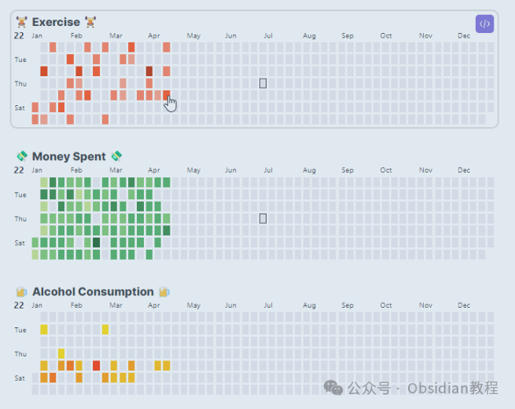
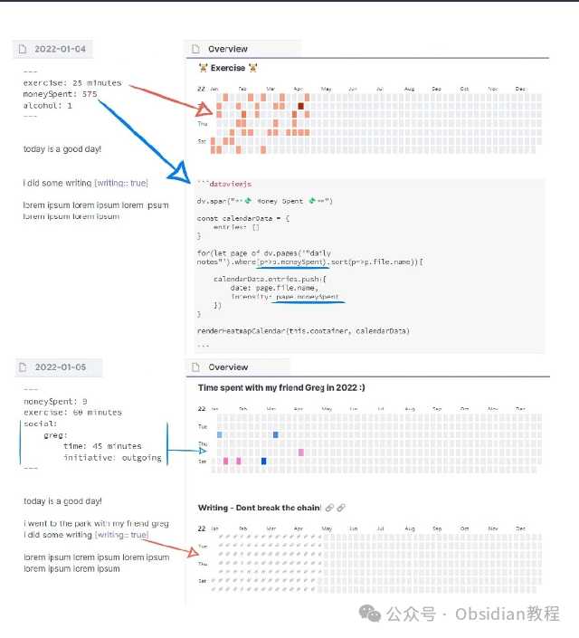
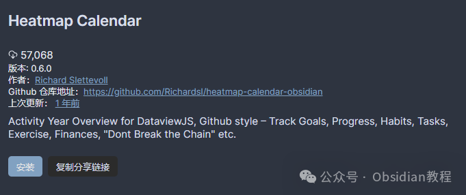

# Obsidian 插件：Heatmap Calendar以热图形式可视化地展示各种数据

Obsidian，一款高度灵活的个人知识管理软件，通过其强大的插件生态系统，提供了无数定制化的数据追踪与展示方案。

  

本文将深入介绍Obsidian中的一个特别插件——Heatmap Calendar（热图日历），它能够像GitHub活动日历一样，以热图的形式可视化地展示各种数据。

### 

1什么是Heatmap Calendar插件？

  
Heatmap Calendar插件允许Obsidian用户以热图的形式在日历上追踪并展示各类数据，比如运动、财务、个人爱好、不良习惯、社交活动或项目进度等。这种数据的可视化帮助用户直观地理解自己的活动模式，进而优化日常习惯或工作进度。  

### **主要特点与用途**

  

  * 数据可视化：类似于GitHub活动热图，提供一种直观的方式来展示用户的活动数据。
  * 灵活性：既可以单独使用，也可以与DataviewJS插件联用，甚至支持与其他插件结合，通过全局renderHeatmapCalendar()函数实现。
  * 主题适配：在浅色模式下显示黑色图标，在深色模式下显示白色图标。

###   

### **如何使用？**

  

  * 数据注释：首先，需要在你的日常笔记中注释你想要追踪的数据（具体可参考Dataview插件的文档）。
  * 创建DataviewJS块：在你希望展示热图日历的位置，创建一个DataviewJS代码块。
  * 数据收集与展示：使用DataviewJS收集并整理你想要展示的数据，然后通过renderHeatmapCalendar()函数传递给Heatmap Calendar插件，生成热图日历。

###   

### 示例代码
      
      *   *   *   *   *   *   *   *   *   *   *   *   *   *   *   *   *   *   *   *   *   *   *   * 
    
    
    
    dv.span("** 😊 Title  😥**") // 可选的标题，支持emojiconst calendarData = {    year: 2022, // 可选，默认为当前年份    colors: {   // 可选，默认为绿色        // 自定义颜色，第一个颜色将被视为默认颜色    },    showCurrentDayBorder: true, // 可选，默认为显示    defaultEntryIntensity: 4,   // 可选，默认强度为4    intensityScaleStart: 10,    // 可选，默认为传递给entries.intensity的最小值    intensityScaleEnd: 100,     // 可选，默认为传递给entries.intensity的最大值    entries: [],                // 必填，通过下面的DataviewJS循环填充}  
    // DataviewJS循环，用于填充数据for (let page of dv.pages('"daily notes"').where(p => p.exercise)) {    calendarData.entries.push({        date: page.file.name,     // 必填，日期格式YYYY-MM-DD        intensity: page.exercise, // 必填，追踪的数据，将自动映射颜色强度        content: "🏋️",           // 可选，在日期单元格中添加文本        color: "orange",          // 可选，从*calendarData.colors*引用颜色。如果未提供颜色，则使用colors[0]    })}  
    renderHeatmapCalendar(this.container, calendarData)

###   

### **配色与强度**

  

  * 默认配色：如果不提供任何颜色，日历将默认使用绿色，类似于GitHub。
  * 自定义颜色：可以向calendarData.colors添加自定义颜色，以便于不同数据类型使用不同颜色展示。
  * 强度概念：颜色的强度表示使用哪种强度的颜色，比如从浅绿到深绿，将根据传递给“intensity”的最高值和最低值分布颜色强度。

###   

### **样式定制与开发**

  

  * 样式定制：可以使用Obsidian的CSS片段进行自定义样式。
  * 开发流程：对于开发者，提供了npm run dev命令，以便于实时转译TypeScript至JavaScript，并自动将JS/CSS/manifest文件复制到示例库中。

### **新特性**

  
从2022年3月至2023年4月，Heatmap Calendar插件经历了多次更新，新增了如全局颜色定义、暗黑模式支持、悬浮预览等功能，不断增强其可用性和灵活性。

### 

2安装Heatmap Calendar插件

#### 

通过社区插件浏览器：  

###   

### **1.在线安装**（需要科学上网） ：****

### ****  
****

### 点击“社区插件”下的“浏览”按钮，在左上角的搜索框中搜索 “Heatmap Calendar”，然后点击“安装”按钮。

###   
启用插件：安装成功后，点击“启用”以启用插件。  

**  
****2.离线安装：****  
****因为网络原因很多同学无法直接在线安装obsidian插件，这里我已经把obsidian所有热门插件下载好了**  
只需要关注下方公众号，后台回复：**插件** 即可获取

###   

### **配置Heatmap Calendar插件**

  

安装并启用插件后，你可能需要根据自己的需求进行一些配置：  

  * 进入插件设置：在Obsidian的设置中找到Heatmap Calendar插件的配置选项。
  * 自定义颜色方案：你可以在这里定义全局颜色方案，以后在任何地方都可以通过颜色名称来引用它。

  

通过上述步骤，你可以顺利地安装和配置Heatmap Calendar插件，并能够开始利用它来可视化各种数据了。  
这个插件不仅可以独立使用，还能与DataviewJS等其他插件联动，提供更加丰富和灵活的数据展示方式。无论是追踪个人习惯、项目进度还是任何其他类型的数据，Heatmap Calendar都能以直观美观的方式帮助你实现目标。  
希望这篇教程能帮助你充分利用这一强大的工具，为你的Obsidian使用体验增添更多价值.  
  
  
  
1******扫码购买****《 Obsidian实战教程》****从入门到精通， 链接您的每一个思维瞬间。**  

  

