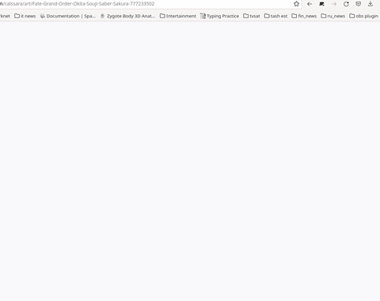
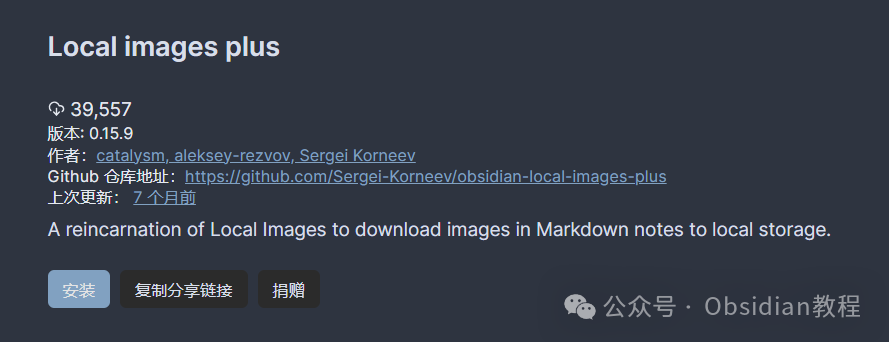
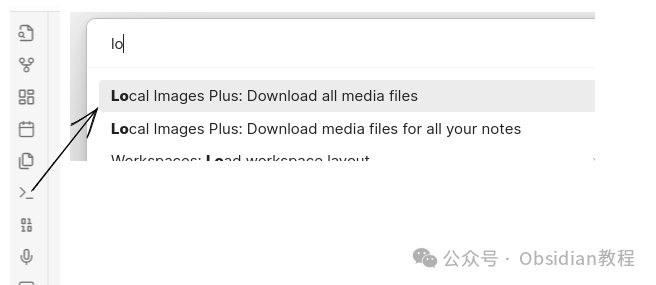

# Obsidian 插件：Local Images轻松地管理和本地化各种媒体文件

  

嗨，我是鬼哥，10年+老程序员一枚。作为一个老码农，每天和各种软件和插件打交道早已成为家常便饭。

  

今天给大家带来的是一款相当实用的Obsidian插件——Obsidian Local Images Plus。

  

这个插件对于那些喜欢在笔记中插入各种图片和文件的小伙伴来说，绝对是福音。

  

### **Local Images Plus 插件介绍**

  

Obsidian Local Images Plus是一款专门为Obsidian设计的插件，能够帮助我们轻松地管理和本地化各种媒体文件。

  

不论是从网页复制粘贴的内容，还是从Word或Open Office文档中提取的图片，这款插件都能搞定。对于喜欢整理和管理笔记的朋友来说，这款插件简直就是一位得力助手。

### **插件主要功能**

**  
**

  1. 从复制粘贴的网页内容中下载媒体文件：有时候，我们会从网页上复制一些带有图片的内容到笔记中，这时Obsidian Local Images Plus就会自动帮我们下载这些图片并保存到本地。
  2. 本地化Word/Open Office文档中的媒体文件：如果你习惯在Word或Open Office中写作并想把内容转移到Obsidian中，这个功能就显得尤为重要。

  3. 将附件保存在以笔记命名的文件夹中：方便日后查找和管理。

  4. 从网络中下载嵌入Markdown标签的文件：比如在Markdown中插入一张网络图片，插件会自动下载并保存在本地。

  5. 将Base64编码的图片保存到本地：一些网页内容中的图片是Base64编码格式的，这款插件也能帮你转换并保存。

  6. 将PNG图片转换为JPEG格式，并可以选择不同的质量：节省存储空间。

  7. 使用MD5算法进行附件去重：避免重复存储相同的文件。

  8. 移除无用的附件：清理笔记中的冗余文件。

### 

  

### **安装与使用**

###   

### **1.在线安装**（需要科学上网） ：****

  
在Obsidian中安装插件是一个简单直接的过程：  

  * 打开Obsidian，点击左下角的“设置”图标。
  * 在设置菜单中，选择“第三方插件”选项。
  * 点击“浏览”按钮，搜索“Local Images”。
  * 找到插件后，点击“安装”。
  * 安装完成后，切换插件的“启用”开关。

  

### **2.离线安装：****  
****因为网络原因很多同学无法直接在线安装obsidian插件，这里我已经把obsidian所有热门插件下载好了**  
只需要关注下方公众号，后台回复：**插件** 即可获取

  

### **使用方法**

  

安装好插件后，使用起来也是非常方便的。无论你是从网页复制内容还是从Word/Open Office文档粘贴内容，插件都会自动帮你处理这些内容中的附件。

#### 处理附件

  

插件提供了几种本地化附件的方式：

  

  1. 本地化当前笔记的附件（插件文件夹）：将当前笔记的附件保存到插件设置中预配置的文件夹。

  2. 本地化当前笔记的附件（Obsidian文件夹）：将当前笔记的附件保存到Obsidian设置中预配置的文件夹。

  3. 本地化所有笔记的附件（插件文件夹）：将所有笔记中的附件保存到插件设置中预配置的文件夹。

#### 

  

#### **插入文件**

  

你还可以插入任何文件，例如：
      
      *   * 
    
    
    
    

  
这些文件会被复制或下载到你的附件文件夹中。

####   

#### **清理无用附件**

  
从版本0.15.6开始，插件还允许你通过以下命令移除无用的附件：  

  * 移除所有无用的附件（插件文件夹）
  * 移除所有无用的附件（Obsidian文件夹）

  
第一个命令会在插件文件夹中查找无用的附件，而第二个命令则会查找所有笔记中未使用的附件。  
**注意：** 这款插件虽然功能强大，但也有一些已知的兼容性问题。例如，和Paste Image Rename以及Pretty BibTex插件可能会有冲突。如果你同时使用这些插件，建议你在安装前做个备份，以防出现问题。  
鬼哥用了这款插件一段时间，感觉确实方便了不少。特别是对于需要频繁从各种来源粘贴内容的用户来说，Obsidian Local Images Plus可以说是大大提升了工作效率。  
不过需要注意的是，插件操作时可能会对笔记进行批量修改，建议大家定期备份自己的文件。  
这款插件确实是Obsidian的好帮手，感兴趣的小伙伴赶紧去试一下！  
  
  
1******扫码购买****《 Obsidian实战教程》****从入门到精通， 链接您的每一个思维瞬间。**  

