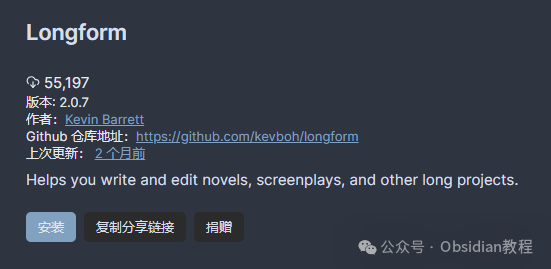
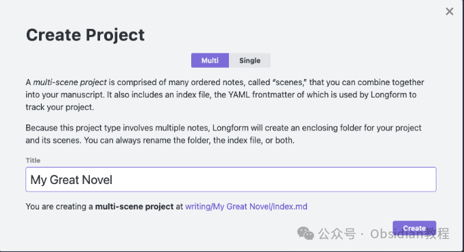
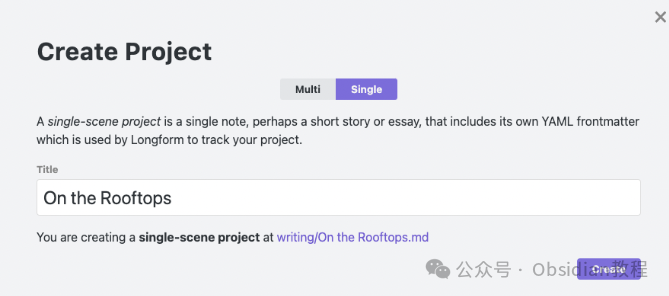

# Obsidian 插件：Longform专为撰写和编辑大型项目设计的工具

  
Longform是专门为撰写和编辑长篇小说、剧本以及其他大型项目设计的工具。它通过允许用户将一系列笔记或场景组织成有序的手稿来实现这一功能。无论是长篇作品还是较短的文本，Longform都能提供有效的支持和管理。  
  
本文将涵盖Longform的主要特性，安装方法，创建小说和短篇故事的步骤，以及如何利用Longform提高写作效率和组织性。

###  1**Longform的主要特性**  

  * **专门的侧边栏：** Longform在Obsidian的侧边栏中提供了一个专门的区域，用于收集并展示你的项目。
  * **可重排序、可嵌套的场景列表：** 这使得组织和规划你的手稿变得更加灵活和直观。
  * **场景/草稿/项目字数统计：** 方便你掌握写作进度和项目规模。
  * **日常写作目标设置：** 提供多种选项，以适应不同的写作风格和习惯。
  * **基于工作流的编译工具：** 可以从你的项目中创建手稿。
  * **对单场景项目的支持：** 确保即使是较短的作品也能使用相同的工作流程和工具。
  * **丰富的命令、模态窗口和菜单项：** 帮助你高效管理你的工作。

  

### 2安装Longform

#### 

通过社区插件浏览器：  

###   

### **1.在线安装**（需要科学上网） ：****

### ****  
****

### 点击“社区插件”下的“浏览”按钮，在左上角的搜索框中搜索 “Longform”，然后点击“安装”按钮。

###   
启用插件：安装成功后，点击“启用”以启用插件。  

**  
****2.离线安装：****  
****因为网络原因很多同学无法直接在线安装obsidian插件，这里我已经把obsidian所有热门插件下载好了**  
只需要关注下方公众号，后台回复：**插件** 即可获取

  

### 

### 3**如何开始使用Longform**

Longform通过搜索你的库中包含一个名为longform的前言条目的任何笔记来工作。以下是使用Longform创建小说和短篇故事的具体步骤。  

#### **创建一部小说**

**  
**

  * 在你的库中找到或创建一个文件夹，右击它并选择“创建Longform项目”。
  * 在弹出的“创建项目”模态窗口中，选择多场景项目类型，输入你的小说标题。
  * 点击“创建”，Longform将创建一个索引文件，并自动选中该项目。
  * 通过点击“新场景”占位符并输入场景名称来添加你的第一个场景。
  * 你现在可以开始写作了。如果需要，你可以通过拖动场景或使用缩进/取消缩进命令来为你的小说添加结构。

#### **创建一个短篇故事**

  

  * 和创建小说相同，右击包含文件夹并选择“创建Longform项目”。
  * 在“创建项目”模态窗口中选择单场景项目类型，并输入短篇故事的标题。
  * 点击“创建”，Longform将自动打开一个只有一个场景的笔记。在该笔记中编写你的故事。

### 

###   

### **编译和项目草稿**

**  
**

  * Longform支持为给定项目创建多个草稿，实质上是同一标题下的不同Longform项目。
  * 使用“编译”功能时，可以创建自定义工作流将你的项目转换为手稿。

  

### 4场景专有样式

Longform允许通过添加.longform-leaf类来自定义CSS片段，仅对Longform项目的笔记应用样式，使你的写作环境与众不同。  

### **故障排除**

**  
**

  * Longform旨在永不更改笔记内容，唯一重写的是项目的索引文件。
  * 如果遇到前言条目格式错误或无效，导致与Longform的同步出现问题，重新启动Obsidian或使用"不保存重载"命令可以强制Longform重新计算项目。

  
Longform通过提供这些功能和灵活性，极大地促进了长篇作品的写作和管理。无论你是小说家、剧本作家还是需要管理任何长篇项目的人，Longform都是一个强大的工具，可以帮助你更好地组织你的思维和内容。  
  
  
1******扫码购买****《 Obsidian实战教程》****从入门到精通， 链接您的每一个思维瞬间。**  

  

