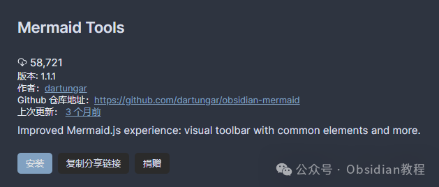
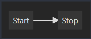
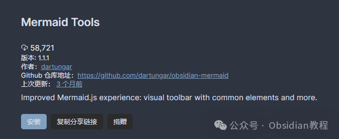
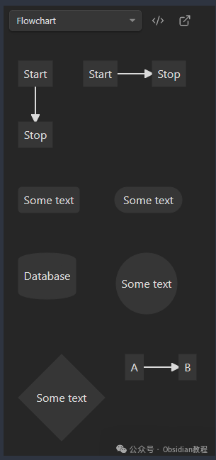
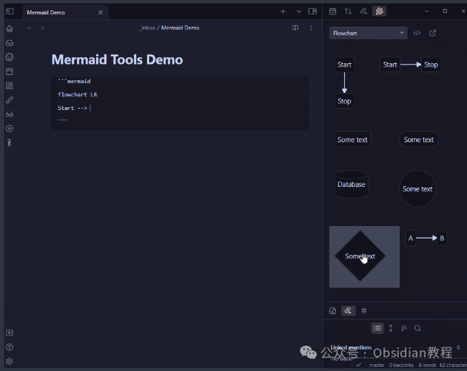
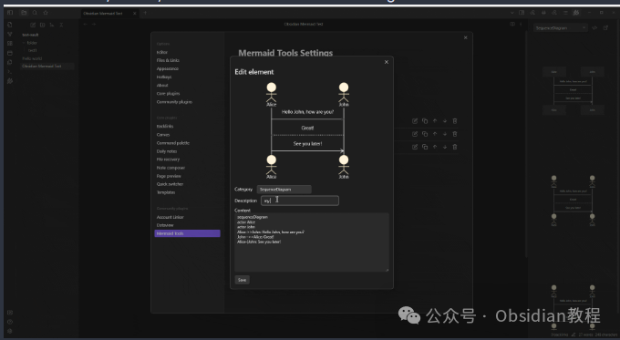

# Obsidian 插件：Mermaid Tools创建复杂的图表和可视化图形

Mermaid是一种非常流行的工具，它允许用户通过简单的文本描述来创建复杂的图表和可视化图形。

  

这种能力在知识管理和信息整理方面非常有用，特别是当你使用Obsidian这样的强大工具时。

  

  

### 1**关于Mermaid**   
  

### Mermaid.js是一个令人惊叹的库，可以让你使用文本描述来生成图表和可视化图形。

###   

### 例如，简单的代码Start ---> Stop会被渲染成一个从“开始”指向“停止”的流程图。

### 

###   

### Obsidian作为一个知识管理软件，原生支持Mermaid.js，你只需将Mermaid代码块放入你的笔记中，就能轻松创建出美观且富有信息量的图表。

###   

### 值得注意的是，Mermaid的渲染功能是Obsidian的特性之一，而非通过任何插件实现的。这意味着，如果在图表渲染过程中遇到任何问题，应当向Obsidian的官方论坛报告，而非插件开发者。

#### 

2安装Mermaid Tools

通过社区插件浏览器：  

###   

### **1.在线安装**（需要科学上网） ：****

### ****  
****

### 点击“社区插件”下的“浏览”按钮，在左上角的搜索框中搜索“ Mermaid Tools”，然后点击“安装”按钮。

###   
启用插件：安装成功后，点击“启用”以启用插件。  
**  
****2.离线安装：****  
****因为网络原因很多同学无法直接在线安装obsidian插件，这里我已经把obsidian所有热门插件下载好了**  
只需要关注下方公众号，后台回复：**插件** 即可获取

  

### 3**Mermaid工具插件**   
  

尽管Mermaid的渲染是Obsidian的内置功能，但Mermaid工具插件为使用Mermaid提供了更加便捷的方式。这个插件添加了一个包含常见Mermaid.js元素的工具栏，这样你就不需要记住它们了。  
你可以通过点击Ribbon图标或使用Mermaid: Open Toolbar View命令来打开工具栏。在工具栏中点击任何一个元素，就能将它粘贴到编辑器中，极大地简化了创建图表的过程。  
4**小演示**  
插件还包括了一个小演示，演示了如何使用工具栏快速创建Mermaid图表。这对于初学者来说是一个很好的入门教程，可以帮助你快速掌握如何利用这个强大的工具来丰富你的笔记和文档。  
  
  
5**创建和管理元素** 在设置选项卡中，你可以创建、删除、编辑和重新排序元素。这为个性化和定制你的Mermaid图表提供了更多的灵活性。通过简单的用户界面，你可以轻松地管理你的元素，确保你的图表完全符合你的需求。  
  
Mermaid工具插件的开发团队已经实现了一些关键的功能，如在设置中添加/编辑元素和重新排序元素，并且计划进行进一步的用户体验改进。这显示了开发团队对提供高质量工具的承诺，以及不断改进和扩展插件功能的意愿。  
6**总结** Obsidian中的Mermaid工具插件是一个非常实用的扩展，它为那些希望在他们的笔记和文档中快速创建和管理复杂图表的用户提供了极大的便利。通过简化图表的创建过程，这个插件让用户能够更加专注于内容的创造，而不是花费大量时间去学习和记念复杂的Mermaid语法。  
随着开发团队继续改进插件，我们期待看到更多功能的加入，为Obsidian用户提供更加丰富的可视化选项。  
对于那些对Mermaid感兴趣或希望提高他们在Obsidian中创建和管理图表能力的用户来说，Mermaid工具插件无疑是一个值得探索的工具。  
它不仅可以帮助你提高工作效率，还可以让你的笔记看起来更加专业和有吸引力。如果你还没有尝试这个插件，我强烈建议你安装它，看看它如何能够改变你的Obsidian使用体验。  
  
  
1******扫码购买****《 Obsidian实战教程》****从入门到精通， 链接您的每一个思维瞬间。**  
  
  

