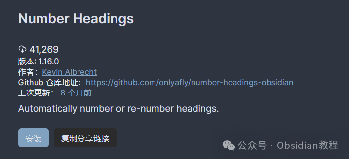
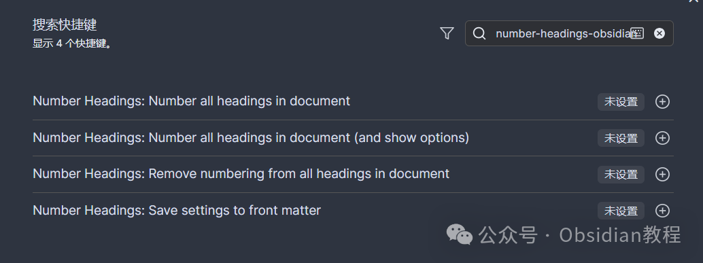

# Obsidian 插件：Number Headings给标题自动编号,让你的文档结构更清晰

  

嗨，我是鬼哥，10年+老程序员一枚。

  

作为一款笔记软件，Obsidian 有时候写写写就容易乱套，这时候有个能给标题自动编号的工具，简直是福音。

  

Number Headings这插件能帮你给文档里的标题自动编号，支持大纲式编号，譬如 "1.1.2" 这种格式，简直是强迫症福音啊！

  

说实话，自从用了这插件，整理笔记头绪更清晰，效率蹭蹭涨。

  

下面鬼哥就详细介绍一下这款插件，从安装到使用，一步步教你玩转它。  

##   

## **插件介绍**

  

Number Headings 插件能自动给你的文档标题添加编号，支持多种编号格式，还能灵活设置跳过某些标题。

  

这对那些笔记内容多、结构复杂的用户来说，简直就是神助攻。有了这个插件，你再也不用手动一个一个地给标题加数字了，不仅省时，还避免了重复和错误。

**  
**

## **下载和安装**

###   

### **1.在线安装**（需要科学上网） ：****

  
在Obsidian中安装插件是一个简单直接的过程：  

  * 打开Obsidian，点击左下角的“设置”图标。
  * 在设置菜单中，选择“第三方插件”选项。
  * 点击“浏览”按钮，搜索“Number Headings”。
  * 找到插件后，点击“安装”。
  * 安装完成后，切换插件的“启用”开关。

  

### **2.离线安装：****  
****因为网络原因很多同学无法直接在线安装obsidian插件，这里我已经把obsidian所有热门插件下载好了**  
只需要关注下方公众号，后台回复：**插件** 即可获取

  

## **插件使用方法**

  

安装好插件后，怎么用呢？其实很简单：

  

  1. 打开命令面板（Mac 用户按 CMD + P，其他平台按相应的快捷键）。

  2. 输入以下命令之一：

  

     * 给文档所有标题编号并显示选项。

     * 仅给文档所有标题编号。

     * 删除文档所有标题编号。
     * 保存设置到前置数据。

  
  
这些命令默认没有分配快捷键，你可以在 Obsidian 的设置中为它们分配快捷键，方便快速操作。

  

### **插件设置**

  

在插件的设置页面，你可以详细配置各种选项，比如：

  

  * 是否自动给新文档编号。

  * 跳过哪些特定的标题。

  * 使用何种编号格式（如罗马数字、圆括号分隔等）。

  

### **插件优势**

**  
**

  1. 自动化程度高：一键编号，再也不用手动添加。
  2. 灵活配置：支持多种编号格式和自定义设置。
  3. 兼容性强：无论是普通笔记还是复杂的大纲都能完美适配。

###   

### **局限**

  

  1. 学习成本：需要一定的时间来熟悉各种配置选项。
  2. 依赖插件更新：功能的完善和 bug 的修复需要依赖作者的持续更新。

  
我个人是非常喜欢这个插件的，尤其是在整理大型项目笔记时，这个插件简直救了我的命。

  

有一次我在整理一个涉及多个子项目的文档，没有编号之前，整个文档看起来乱七八糟，找个东西得翻半天。有了 Number Headings，整个文档一目了然，导航也方便多了。

  

这个插件不仅仅是给标题加数字这么简单，它还能灵活地根据你的需要调整编号格式和跳过某些标题，非常智能化。

  

比如你可以设置从某个特定数字开始编号，或者使用罗马数字，甚至可以在不同的文档中应用不同的设置。

  
  
  
1******扫码购买****《 Obsidian实战教程》****从入门到精通， 链接您的每一个思维瞬间。**  

