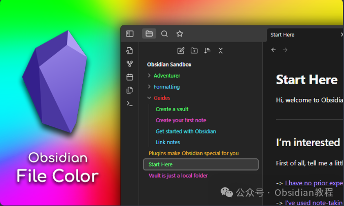
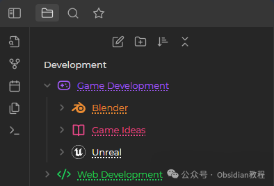
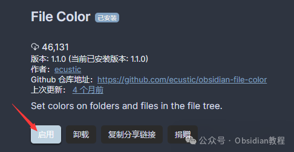
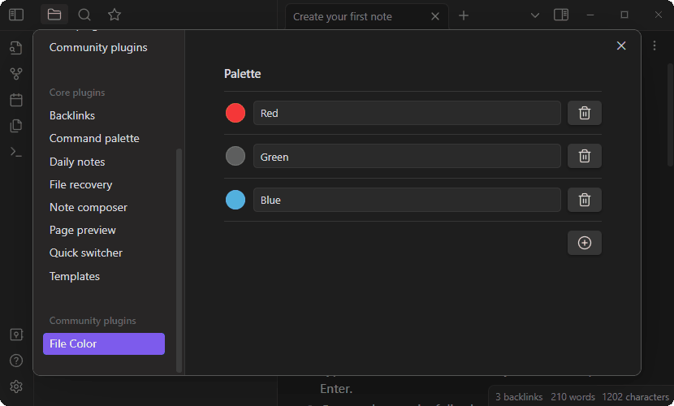

# Obsidian 插件：Obsidian File Color比如为文件和文件夹设置颜色

  

在使用Obsidian（一款功能强大的知识管理和笔记软件）的过程中，我们总是希望能增加一些个性化的元素，比如为文件和文件夹设置颜色，不仅可以美化界面，还能提高信息检索的效率。

  

今天，我们就来详细介绍一个能够实现这一功能的插件——File Color及其使用方法。

### **1\. 插件简介**

  

Obsidian File Color插件允许用户为文件浏览器中的文件和文件夹选择颜色，通过色彩编码的方式，让用户能够更快地定位到特定的文件或文件夹，尤其是在文档数量庞大的库中。这种视觉上的区分，大大增强了Obsidian的用户体验。

  

### **2\. 安装插件**

  

在开始使用File Color插件之前，你需要确保已经安装了Obsidian。随后，按照以下步骤安装File Color插件：

  

### **1.在线安装**（需要科学上网） ：****

  
在Obsidian中安装插件是一个简单直接的过程：  

  * 打开Obsidian，点击左下角的“设置”图标。
  * 在设置菜单中，选择“第三方插件”选项。
  * 点击“浏览”按钮，搜索“File Color”。
  * 找到插件后，点击“安装”。
  * 安装完成后，切换插件的“启用”开关。

  

### **2.离线安装：****  
****因为网络原因很多同学无法直接在线安装obsidian插件，这里我已经把obsidian所有热门插件下载好了**  
只需要关注下方公众号，后台回复：**插件** 即可获取

### 

  1.   

### **3\. 使用方法**

####   

#### **设置颜色**

  

为文件或文件夹设置颜色的步骤如下：

  

  * 在文件浏览器中右键点击你想设置颜色的文件或文件夹。

  * 选择“设置颜色（Set color）”选项。

  * 这会打开一个模态框，在其中你可以选择插件调色板中定义的所有颜色。

  * 选择你喜欢的颜色后，该颜色就会应用到所选文件或文件夹上。

#### 

  

#### **更改调色板**

  

增加新颜色到调色板的步骤如下：

  

  * 打开插件设置。

  * 点击"+"按钮添加新颜色。

  * 使用颜色选择器选择颜色，并为颜色输入一个名称。

  * 设置完毕后，新颜色会出现在“设置颜色”模态框中。

  * 你可以根据需要添加任意多的颜色。

### 

###   

### **4\. 选项**

**  
**

  * 级联颜色（Cascade Colors）：如果启用，对文件夹设置的颜色会级联到其子文件。你可以通过对子文件单独设置颜色来覆盖父文件夹的颜色。
  * 背景颜色（Background Colors）：如果启用，将会对背景而非文字进行着色。

###   

### **注意：** 对于Folder Note插件，虽然文件下的下划线不会被着色，但你可以通过添加CSS片段来使下划线使用File Color插件定义的颜色。

###   

### **6\. 个性化CSS片段**

  

对于希望下划线也能反映文件颜色的用户，可以使用以下CSS片段：
      
      *   *   *   * 
    
    
    
    .nav-folder.alx-folder-with-note>.nav-folder-title>.nav-folder-title-content {  text-decoration-style: dotted;  text-decoration-color: inherit;}

  

这段CSS将使得带有笔记的文件夹标题下的下划线变为点状，并且颜色会继承File Color插件所设置的颜色。  

### 

Obsidian File Color插件为用户提供了一个简单而有效的方法，通过颜色编码来组织和区分文件与文件夹。  
结合个性化的颜色方案，你可以让你的Obsidian库变得更加直观和高效。在日常的知识管理和笔记记录过程中，善用这样的工具，无疑可以提升你的工作和学习效率。  
  
  
1******扫码购买****《 Obsidian实战教程》****从入门到精通， 链接您的每一个思维瞬间。**  

  

