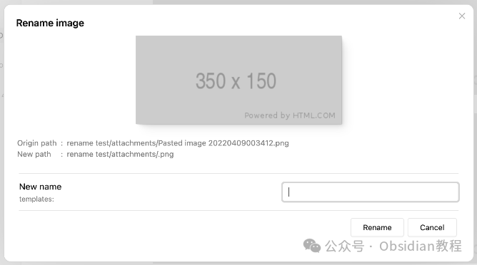
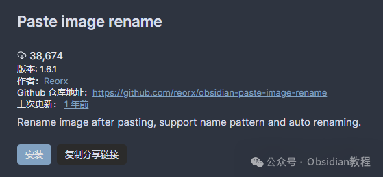
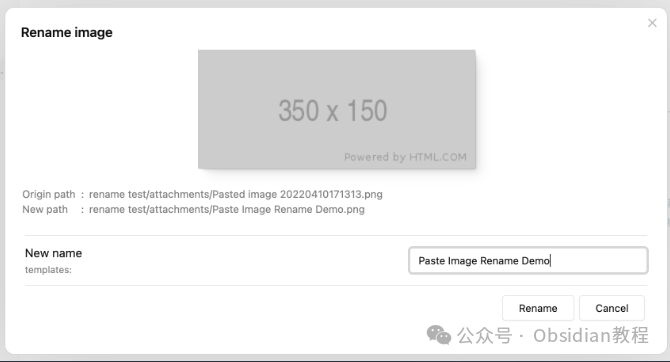
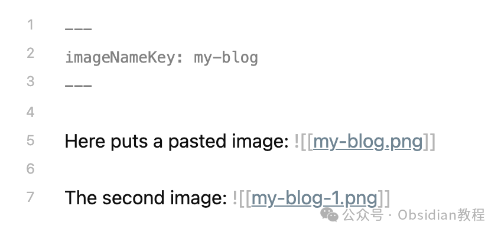

# Obsidian 插件：Paste Image Rename管理Obsidian中的附件，使笔记仓库更加有序。

在Obsidian中，对于希望将笔记和附件（如图片）保持整洁有序的用户来说，"Paste Image Rename"插件无疑是一个极为实用的工具。  
这个插件灵感来源于Zettlr，但不仅仅是复刻了Zettlr粘贴图片时的重命名提示功能，还加入了高度自定义的图片命名生成规则，以及自动重命名等特性，大大简化了管理和组织附件的流程。  
以下是关于这个插件的详细教程，适用于初学者和高级用户。  

### **插件概述**

  
"Paste Image Rename"插件从1.4.0版本开始，不再局限于处理粘贴的图片，而是扩展为一个通用的附件重命名工具，可以管理加入仓库的所有附件类型。  
借助这个插件，用户可以自定义附件命名规则，实现自动重命名，从而避免手动管理文件名的繁琐。  

### **安装与使用**

###   

### **1.在线安装**（需要科学上网） ：****

  
在Obsidian中安装插件是一个简单直接的过程：  

  * 打开Obsidian，点击左下角的“设置”图标。
  * 在设置菜单中，选择“第三方插件”选项。
  * 点击“浏览”按钮，搜索“Paste Image Rename”。
  * 找到插件后，点击“安装”。
  * 安装完成后，切换插件的“启用”开关。

  

### **2.离线安装：****  
****因为网络原因很多同学无法直接在线安装obsidian插件，这里我已经把obsidian所有热门插件下载好了**  
只需要关注下方公众号，后台回复：**插件** 即可获取

  
**基本使用：**  
安装插件后，将图片粘贴到任意文档中，会弹出重命名提示框。  
在此输入新名称并点击“重命名”或按Enter键，图片名称将会更新，内部链接也会同步更换为新名称。

### **功能详解**

**  
**

  * 设置图片名称模式：通过在设置中调整“Image name pattern”，可以自定义新图片的命名规则。默认设置为{{fileName}}，即新名称将生成为当前活动文件的名称。

  

  * 使用frontmatter设置imageNameKey：当需要将同一文档中的多张图片命名为相同格式时，可以在文档的frontmatter中设置imageNameKey值。例如：

    
    
      
    

粘贴图片后，“New name”将自动生成为“my-blog”。

  *   *   * 

    
    
    ---imageNameKey: my-blog---

  * 重名处理：当存在同名文件时，插件会自动添加前缀/后缀来避免命名冲突。例如，“my-blog-1.png”、“my-blog-2.png”等。

  

  * 批量重命名：从1.3.0版本开始，新增了“Batch rename embedded files in the current file”命令，允许用户批量重命名当前文件中嵌入的附件。

  

  * 处理所有附件：从1.4.0版本开始，插件能够处理所有添加到仓库的附件，无论是粘贴还是拖拽进来的。需要在设置中启用“Handle all attachments”。

###   

用户可以充分利用"Paste Image Rename"插件来管理Obsidian中的附件，使笔记仓库更加有序。无论是对于日常笔记的整理，还是对于复杂文档的管理，这个插件都提供了强大的支持和便利性。

  
  
  
1******扫码购买****《 Obsidian实战教程》****从入门到精通， 链接您的每一个思维瞬间。**  

