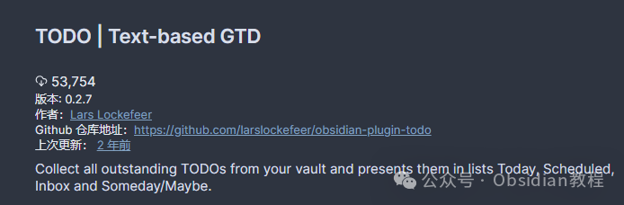
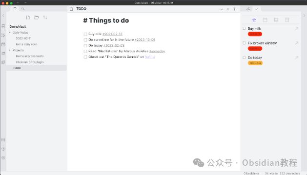
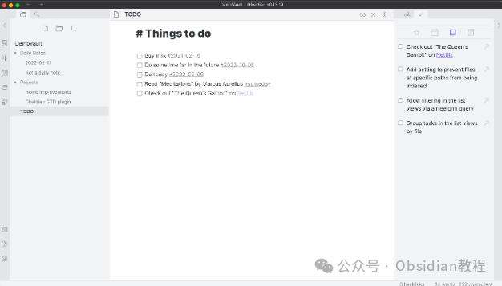
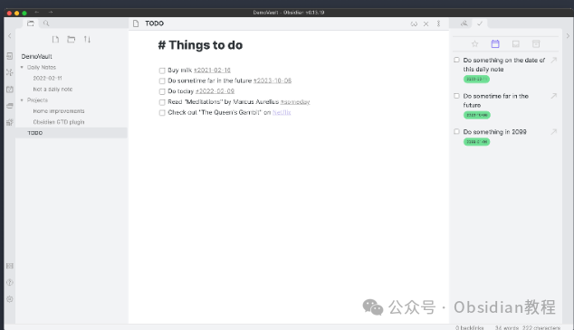

# Obsidian 插件：TODO在Obsidian中实施基于文本的GTD方法

基于文本的GTD（Getting Things Done，尽管事情）方法在Obsidian中通过各种插件得到了良好的支持，其中TODO Plugin是一个非常受欢迎的工具。  
本文将深入探讨此插件的安装、特点、设置、使用方法及其与其他Obsidian插件的集成方式，为您提供一个全面的使用指南。

### 

1安装TODO Plugin

### **1.在线安装**（需要科学上网） ：****

  
在Obsidian中安装插件是一个简单直接的过程：  

  * 打开Obsidian，点击左下角的“设置”图标。
  * 在设置菜单中，选择“第三方插件”选项。
  * 点击“浏览”按钮，搜索“TODO Plugin”。
  * 找到插件后，点击“安装”。
  * 安装完成后，切换插件的“启用”开关。

  

### **2.离线安装：****  
****因为网络原因很多同学无法直接在线安装obsidian插件，这里我已经把obsidian所有热门插件下载好了**  
只需要关注下方公众号，后台回复：**插件** 即可获取

### 

2TODO Plugin的特点

TODO Plugin是为那些想在Obsidian中实施基于文本的GTD方法的用户设计的。以下是它的一些关键特点：  

  * 聚合所有待办事项：插件会在您的库中搜寻所有未完成的待办事项，并将它们在一个视图中列出。
  * 按类型分隔待办事项：可以将待办事项分为“今天”、“预定”、“收件箱”和“某天/也许”几种类型。
  * 为待办事项设定具体日期：通过添加标签，您可以为待办事项安排具体的日期。
  * 标记为某天/也许：通过添加标签#someday，可以将待办事项标记为未来可能会做的事。
  * 直接在列表视图完成待办事项。
  * 快速跳转到待办事项所在文件：从列表视图中，可以快速跳转到包含该待办事项的文件。

  

此外，TODO Plugin与日常笔记插件集成，使得没有特定到期日期的待办事项会继承日常笔记的日期作为到期日期。  

### **设置选项**

  
TODO Plugin提供了一些设置选项，让用户可以根据自己的需要定制插件的行为：  

  * 日期标签格式：允许用户自定义添加到任务中的到期日期的格式。默认为#%date%。
  * 日期格式：自定义日期格式。此插件使用luxon库来处理日期和时间，您可以参考luxon的文档来了解支持的格式。默认格式为yyyy-MM-dd。
  * 在新叶片中打开文件：启用此选项后，从插件中打开的文件将在新叶片中打开，而不是替换当前打开的文件。

### **使用方法**

  
安装并配置好TODO Plugin后，您就可以开始整合您的待办事项管理了：  

  * 创建待办事项：在任何笔记中输入待办事项，并根据需要添加相应的标签（如#today、#someday或具体日期）。
  * 查看和管理待办事项：打开TODO Plugin的视图，浏览和管理所有列出的待办事项。您可以标记任务完成、调整任务类型或计划日期，并快速跳转到任务所在的笔记。
  * 优化日常工作流：利用日常笔记插件与TODO Plugin的集成，为那些未指定日期的任务自动分配日期，使得任务管理更加自动化和高效。

TODO Plugin的开发者还计划在未来的版本中添加更多功能，包括：  

  * 从列表视图中跳转到正确的文件行。
  * 从列表视图中（重新）安排待办事项。
  * 持久化缓存，仅在重新打开Obsidian时重新索引自上次关闭以来更改的文件。
  * 通过标签/自由形式搜索过滤项目列表视图。
  * 改进UI和主题支持。

  
这些即将到来的功能将使TODO Plugin成为Obsidian中更加强大和灵活的待办事项管理工具。

### 

3结语

TODO Plugin通过其综合特性和易用性，在Obsidian用户中赢得了广泛的好评。无论您是想要管理日常任务，还是需要一个更强大的项目管理解决方案，TODO Plugin都能为您的Obsidian工作流带来显著的提升。  
随着未来的更新和改进，这个插件无疑会成为Obsidian生态中不可或缺的一部分。  
  
  
1******扫码购买****《 Obsidian实战教程》****从入门到精通， 链接您的每一个思维瞬间。**  

