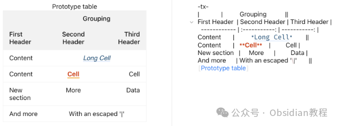
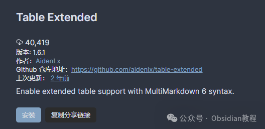

# Obsidian 插件：Table Extended为Obsidian带来了MultiMarkdown表格语法

###   

### **介绍**

  
Obsidian的内建表格语法仅能定义表格的基本元素。当用户尝试应用跨列或多重标题的复杂表格时，他们唯一的选择就是回退到难以阅读和编辑的原始HTML代码。  
"Table Extended" 插件为Obsidian带来了MultiMarkdown表格语法，这不仅保留了内部链接和嵌入的完整性，还提供了以下功能：  

  * 列跨度
  * 行跨度
  * 块级元素，如列表、代码等
  * 多个表头
  * 表格标题
  * 省略表格头部

### 

### ****

### **已知问题**

**  
**

  * 该插件尚不兼容 "Advanced Tables"，因为其自动格式化会破坏mmd6表格语法。
  * 使用 -tx- 标记的表格有时可能会忽略转义字符，例如，\|无法在表格中转义 |，只有 \\\| 能够起作用。
  * 扩展的原生语法有时可能不起作用，控制台输出："failed to get Markdown text, escaping..."

###   

### **如何使用**

  
"Table Extended" 的最新版本采用了新语法来指示扩展表格，优先考虑使用围栏式的tx代码块，这样可以更好地支持回链和前链。使用 -tx- 前缀表示表格：
      
      *   *   *   *   *   *   *   * 
    
    
    
    -tx-|             |          Grouping           || First Header  | Second Header | Third Header |  ------------ | :-----------: | -----------: | Content       |          *Long Cell*        || Content       |   **Cell**    |         Cell | New section   |     More      |         Data | And more      | With an escaped '\|'       || 

  

此格式的表格将被渲染为具有复杂结构的视觉表格，支持跨列、跨行等高级功能。  
**请注意，以下功能不受支持：**  

  * 多个表头
  * 表格标题
  * 省略表格头部

  
当在设置选项中启用此功能时，Obsidian的常规表格允许使用扩展语法：
      
      *   *   *   *   *   * 
    
    
    
    First Header  | Second Header | Third Header | ------------ | :-----------: | -----------: |Content       |          *Long Cell*        ||Content       |   **Cell**    |         Cell |New section   |     More      |         Data |And more      | With an escaped '\|'       ||

  

### **多行和多行标题**

  

  * 多行：在行尾添加反斜杠（\）可以将内容与下一行合并。
  * 多行标题：允许在标题下方添加额外的行来分组和描述。

### **  
**

### **无标题表格**

  
可以省略表格的标题行，直接开始数据行，适用于不需要列标题的场景。

###   

### **安装方法**

**  
**

### **1.在线安装**（需要科学上网） ：****

  
在Obsidian中安装插件是一个简单直接的过程：  

  * 打开Obsidian，点击左下角的“设置”图标。
  * 在设置菜单中，选择“第三方插件”选项。
  * 点击“浏览”按钮，搜索“Table Extended”。
  * 找到插件后，点击“安装”。
  * 安装完成后，切换插件的“启用”开关。

  

### **2.离线安装：****  
****因为网络原因很多同学无法直接在线安装obsidian插件，这里我已经把obsidian所有热门插件下载好了**  
只需要关注下方公众号，后台回复：**插件** 即可获取

### 

  1. 

###   

### **幕后原理**

  
由于当前Obsidian API的限制，内建的markdown解析器不可配置。因此，该插件包括了一个独立的Markdown解析器markdown-it及其插件markdown-it-multimd-table，并将表格部分和带有语言标签tx的代码块内的文本传递给markdown-it进行解析。  
然而，内部链接和嵌入被提取并传递给Obsidian，保证了Obsidian核心功能的完整性。  
  
  
1******扫码购买****《 Obsidian实战教程》****从入门到精通， 链接您的每一个思维瞬间。**  

