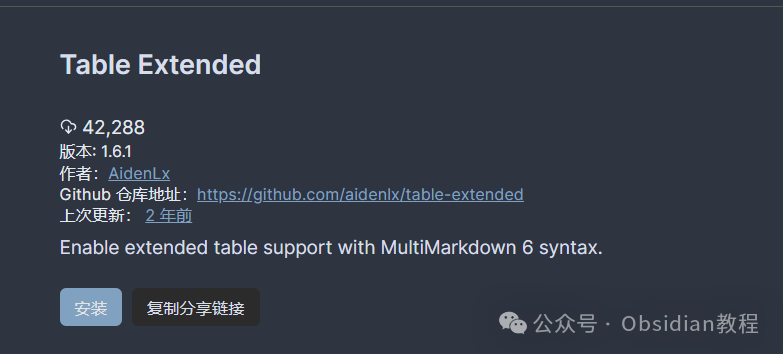
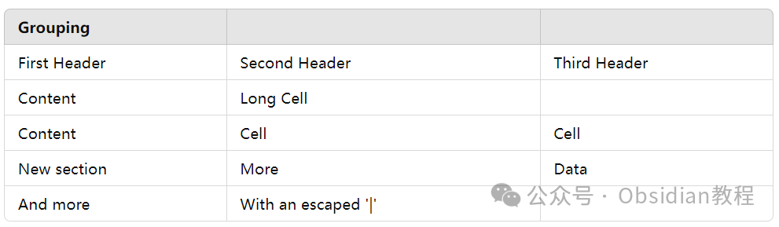
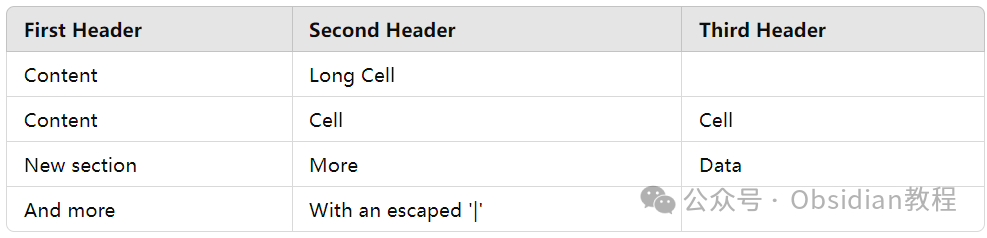
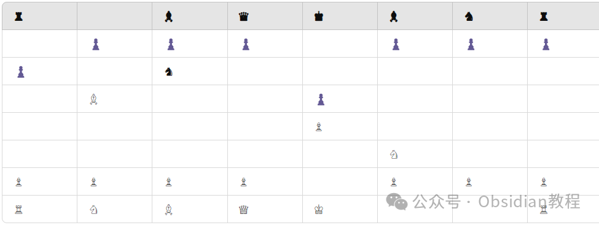

# Obsidian 插件：Table Extended轻松实现跨列、跨行的单元格，嵌入列表、代码等块级元素

嗨，我是鬼哥，10年+老程序员一枚。今天给大家介绍一下 Obsidian 的一个非常强大的插件——Table Extended。  

  

相信很多使用 Obsidian 的小伙伴们都遇到过这样的问题：**内置的表格语法功能太基础，想要实现复杂的表格效果，不得不转向难以阅读和编辑的 HTML 代码。**

  

那么，Table Extended 就是为了解决这些痛点而生的。

  

这个插件把 MultiMarkdown 表格语法引入到了 Obsidian 中，让我们可以轻松实现跨列、跨行的单元格，甚至是嵌入列表、代码等块级元素。

  

接下来，让鬼哥带你详细了解一下这款插件的功能和使用方法。

  

## **插件简介**

  

Obsidian 的内置表格语法只能定义最基础的表格功能。当用户想要应用复杂表格，比如跨列、跨行的单元格或者多个表头时，只能回到原始的 HTML 代码，这对于阅读和编辑来说都是一种挑战。

  

Table Extended 插件通过引入 MultiMarkdown 表格语法解决了这个问题，它提供了以下功能，并且保留了内部链接和嵌入的完整性：

  

  * 单元格跨列

  * 单元格跨行

  * 块级元素（如列表、代码）

  * 多个表头

  * 表格标题

  * 省略表格头

##   

## ****

### **安装与使用**

###   

### **1.在线安装**（需要科学上网） ：****

  
在Obsidian中安装插件是一个简单直接的过程：  

  * 打开Obsidian，点击左下角的“设置”图标。
  * 在设置菜单中，选择“第三方插件”选项。
  * 点击“浏览”按钮，搜索“Table Extended”。
  * 找到插件后，点击“安装”。
  * 安装完成后，切换插件的“启用”开关。

  

### **2.离线安装：****  
****因为网络原因很多同学无法直接在线安装obsidian插件，这里我已经把obsidian所有热门插件下载好了**  
只需要关注下方公众号，后台回复：**插件** 即可获取

  

## **使用方法**

  

最新版本使用了一种新的语法来表示扩展表格，取代了围栏 tx 代码块，这样可以更好地支持反向链接和前向链接。在表格前面使用 -tx- 前缀即可：
      
      *   *   *   *   *   *   *   * 
    
    
    
    -tx-|             |          Grouping           || First Header  | Second Header | Third Header |  ------------ | :-----------: | -----------: | Content       |          *Long Cell*        || Content       |   **Cell**    |         Cell | New section   |     More      |         Data | And more      | With an escaped '\|'       ||

  

渲染结果如下：

**实验性扩展语法**  
  
注意：以下功能不支持：  

  * 多个表头
  * 表格标题
  * 省略表格头

  
当在设置标签中启用该选项时，可以在 Obsidian 的常规表格中使用扩展语法：
      
      *   *   *   *   *   * 
    
    
    
    First Header  | Second Header | Third Header | ------------ | :-----------: | -----------: |Content       |          *Long Cell*        ||Content       |   **Cell**    |         Cell |New section   |     More      |         Data |And more      | With an escaped '\|'       ||

  

渲染结果如下：

## **无表头**  

  
可以省略表格头。
      
      *   *   *   *   *   *   *   *   * 
    
    
    
    |--|--|--|--|--|--|--|--||♜|  |♝|♛|♚|♝|♞|♜||  |♟|♟|♟|  |♟|♟|♟||♟|  |♞|  |  |  |  |  ||  |♗|  |  |♟|  |  |  ||  |  |  |  |♙|  |  |  ||  |  |  |  |  |♘|  |  ||♙|♙|♙|♙|  |♙|♙|♙||♖|♘|♗|♕|♔|  |  |♖|

  

渲染结果如下：

**兼容性**  
  
所需的 API 功能仅适用于 Obsidian v0.12.0 及以上版本。

##   

## **背后的原理**

  
由于当前 Obsidian API 的限制，内置的 Markdown 解析器是不可配置的。因此，这个插件包含了一个独立的 Markdown 解析器 markdown-it 以及插件 markdown-it-multimd-table，表格部分和带有 tx 语言标签的代码块内容会传递给 markdown-it。而内部链接和嵌入则会提取并传递给 Obsidian，这样核心功能不会受到影响。  
需要注意的是，这个插件可能会与官方 MultiMarkdown 编译器和 Obsidian 的解析器表现不同。如果对合理输入有意外结果，请提交问题。  
使用 Table Extended 插件之后，鬼哥觉得在 Obsidian 里做笔记、整理表格简直方便了不止一星半点。再也不用为复杂的表格布局而头疼，Markdown 和 HTML 的结合也显得自然许多。小伙伴们如果有类似需求，不妨试试这个插件，相信会有很大收获！  
  
  
1******扫码购买****《 Obsidian实战教程》****从入门到精通， 链接您的每一个思维瞬间。**  

  

